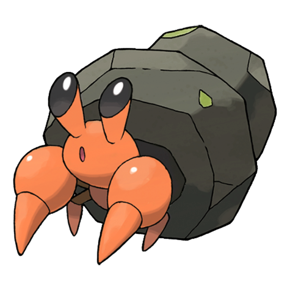
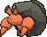
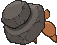
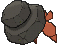

# #557 Dwebble (Rock Inn Pokémon)

| Official Artwork | Shiny Artwork |
|------------------|---------------|
|  |  |

**Rising Ruby:** It makes a hole in a suitable rock. If that rock breaks, the Pokémon remains agitated until it locates a replacement.

**Sinking Sapphire:** When it finds a stone of a suitable size, it secretes a liquid from its mouth to open up a hole to crawl into.

---

## Media

### Default Sprites

| Front | Shiny | Back | Shiny |
|-------|-------|------|-------|
|  |  |  |  |

### Cries

Latest (Gen VI+):

<audio controls>
<source src='../../assets/cries/dwebble/latest.ogg' type='audio/ogg'>
  Your browser does not support the audio element.
</audio>

Legacy:

<audio controls>
<source src='../../assets/cries/dwebble/legacy.ogg' type='audio/ogg'>
  Your browser does not support the audio element.
</audio>

---

## Pokédex Data

| National № | Type(s) | Height | Weight | Abilities | Local № |
|------------|---------|--------|--------|-----------|---------|
| #557 | {: width="48"} {: width="48"} | 0.3 m / 1.0 ft | 14.5 kg / 32.0 lbs | 1. Sturdy 2. Shell Armor | N/A |

---

## Base Stats
|   | HP | Attack | Defense | Sp. Atk | Sp. Def | Speed |
|---|----|--------|---------|---------|---------|-------|
| **Base** | 50 | 65 | 85 | 35 | 35 | 55 |
| **Min** | 210 | 121 | 157 | 67 | 67 | 103 |
| **Max** | 304 | 251 | 295 | 185 | 185 | 229 |

The ranges shown above are for a level 100 Pokémon. Maximum values are based on a beneficial nature, 252 EVs, 31 IVs; minimum values are based on a hindering nature, 0 EVs, 0 IVs.

---

## Forms & Evolutions

!!! warning "WARNING"

    Information on evolutions may not be 100% accurate; differences between evolution methods across generations are not accounted for.

### Forms

Dwebble has no alternate forms.

### Evolution Line

1. [Dwebble](dwebble.md/)
    1. Level Up: [Crustle](crustle.md/)

---

## Training

| EV Yield | Catch Rate | Base Friendship | Base Exp. | Growth Rate | Held Items |
|----------|------------|-----------------|-----------|-------------|------------|
| 1 Def | 190 | 50 | 65 | Medium | Hard Stone (5%) |

---

## Breeding

| Egg Groups | Egg Cycles | Gender | Dimorphic | Color | Shape |
|------------|------------|--------|-----------|-------|-------|
| 1. Bug 2. Mineral | 20 | 50.0% Male 50.0% Female | False | Red | Armor |

---

## Moves

!!! warning "WARNING"

    Specific move information may be incorrect. However, the general movepool should be accurate; this includes changes made in Sacred Gold and Storm Silver.

### Level Up Moves

| Lv. | Move | Type | Cat. | Power | Acc. | PP |
| --- | --- | --- | --- | --- | --- | --- |
| 1 | Fury Cutter | {: width="48"} | {: width="36"} | 40 | 95 | 20 |
| 4 | Rock Blast | {: width="48"} | {: width="36"} | 25 | 90 | 10 |
| 7 | Withdraw | {: width="48"} | {: width="36"} | — | — | 40 |
| 10 | Sand Attack | {: width="48"} | {: width="36"} | — | 100 | 15 |
| 13 | Feint Attack | {: width="48"} | {: width="36"} | 60 | — | 20 |
| 16 | Smack Down | {: width="48"} | {: width="36"} | 50 | 100 | 15 |
| 19 | Rock Polish | {: width="48"} | {: width="36"} | — | — | 20 |
| 22 | Bug Bite | {: width="48"} | {: width="36"} | 60 | 100 | 20 |
| 25 | Stealth Rock | {: width="48"} | {: width="36"} | — | — | 20 |
| 28 | Rock Slide | {: width="48"} | {: width="36"} | 75 | 90 | 10 |
| 31 | Night Slash | {: width="48"} | {: width="36"} | 70 | 100 | 15 |
| 31 | Slash | {: width="48"} | {: width="36"} | 70 | 100 | 20 |
| 34 | X Scissor | {: width="48"} | {: width="36"} | 80 | 100 | 15 |
| 37 | Shell Smash | {: width="48"} | {: width="36"} | — | — | 15 |
| 40 | Stone Edge | {: width="48"} | {: width="36"} | 100 | 80 | 5 |
| 43 | Flail | {: width="48"} | {: width="36"} | — | 100 | 15 |
| 46 | Rock Wrecker | {: width="48"} | {: width="36"} | 150 | 90 | 5 |

### TM Moves

| TM | Move | Type | Cat. | Power | Acc. | PP |
| --- | --- | --- | --- | --- | --- | --- |
| HM01 | Cut | {: width="48"} | {: width="36"} | 70 | 100 | 15 |
| HM04 | Strength | {: width="48"} | {: width="36"} | 100 | 100 | 10 |
| HM06 | Rock Smash | {: width="48"} | {: width="36"} | 65 | 100 | 15 |
| TM01 | Hone Claws | {: width="48"} | {: width="36"} | — | — | 15 |
| TM06 | Toxic | {: width="48"} | {: width="36"} | — | 90 | 10 |
| TM10 | Hidden Power | {: width="48"} | {: width="36"} | 60 | 100 | 15 |
| TM100 | Confide | {: width="48"} | {: width="36"} | — | — | 20 |
| TM17 | Protect | {: width="48"} | {: width="36"} | — | — | 10 |
| TM21 | Frustration | {: width="48"} | {: width="36"} | — | 100 | 20 |
| TM22 | Solar Beam | {: width="48"} | {: width="36"} | 120 | 100 | 10 |
| TM23 | Smack Down | {: width="48"} | {: width="36"} | 50 | 100 | 15 |
| TM26 | Earthquake | {: width="48"} | {: width="36"} | 100 | 100 | 10 |
| TM27 | Return | {: width="48"} | {: width="36"} | — | 100 | 20 |
| TM28 | Dig | {: width="48"} | {: width="36"} | 80 | 100 | 10 |
| TM32 | Double Team | {: width="48"} | {: width="36"} | — | — | 15 |
| TM37 | Sandstorm | {: width="48"} | {: width="36"} | — | — | 10 |
| TM39 | Rock Tomb | {: width="48"} | {: width="36"} | 60 | 95 | 15 |
| TM40 | Aerial Ace | {: width="48"} | {: width="36"} | 60 | — | 20 |
| TM42 | Facade | {: width="48"} | {: width="36"} | 70 | 100 | 20 |
| TM44 | Rest | {: width="48"} | {: width="36"} | — | — | 5 |
| TM45 | Attract | {: width="48"} | {: width="36"} | — | 100 | 15 |
| TM48 | Round | {: width="48"} | {: width="36"} | 60 | 100 | 15 |
| TM65 | Shadow Claw | {: width="48"} | {: width="36"} | 70 | 100 | 15 |
| TM69 | Rock Polish | {: width="48"} | {: width="36"} | — | — | 20 |
| TM71 | Stone Edge | {: width="48"} | {: width="36"} | 100 | 80 | 5 |
| TM75 | Swords Dance | {: width="48"} | {: width="36"} | — | — | 20 |
| TM76 | Struggle Bug | {: width="48"} | {: width="36"} | 50 | 100 | 20 |
| TM78 | Bulldoze | {: width="48"} | {: width="36"} | 60 | 100 | 20 |
| TM80 | Rock Slide | {: width="48"} | {: width="36"} | 75 | 90 | 10 |
| TM81 | X Scissor | {: width="48"} | {: width="36"} | 80 | 100 | 15 |
| TM84 | Poison Jab | {: width="48"} | {: width="36"} | 80 | 100 | 20 |
| TM87 | Swagger | {: width="48"} | {: width="36"} | — | 85 | 15 |
| TM88 | Sleep Talk | {: width="48"} | {: width="36"} | — | — | 10 |
| TM90 | Substitute | {: width="48"} | {: width="36"} | — | — | 10 |
| TM94 | Secret Power | {: width="48"} | {: width="36"} | 70 | 100 | 20 |
| TM96 | Nature Power | {: width="48"} | {: width="36"} | — | — | 20 |

### Egg Moves

| Move | Type | Cat. | Power | Acc. | PP |
| --- | --- | --- | --- | --- | --- |
| Block | {: width="48"} | {: width="36"} | — | — | 5 |
| Counter | {: width="48"} | {: width="36"} | — | 100 | 20 |
| Curse | {: width="48"} | {: width="36"} | — | — | 10 |
| Endure | {: width="48"} | {: width="36"} | — | — | 10 |
| Iron Defense | {: width="48"} | {: width="36"} | — | — | 15 |
| Night Slash | {: width="48"} | {: width="36"} | 70 | 100 | 15 |
| Rototiller | {: width="48"} | {: width="36"} | — | — | 10 |
| Sand Tomb | {: width="48"} | {: width="36"} | 35 | 85 | 15 |
| Spikes | {: width="48"} | {: width="36"} | — | — | 20 |
| Wide Guard | {: width="48"} | {: width="36"} | — | — | 10 |

### Tutor Moves

| Move | Type | Cat. | Power | Acc. | PP |
| --- | --- | --- | --- | --- | --- |
| Block | {: width="48"} | {: width="36"} | — | — | 5 |
| Bug Bite | {: width="48"} | {: width="36"} | 60 | 100 | 20 |
| Iron Defense | {: width="48"} | {: width="36"} | — | — | 15 |
| Knock Off | {: width="48"} | {: width="36"} | 65 | 100 | 20 |
| Snore | {: width="48"} | {: width="36"} | 50 | 100 | 15 |
| Stealth Rock | {: width="48"} | {: width="36"} | — | — | 20 |

