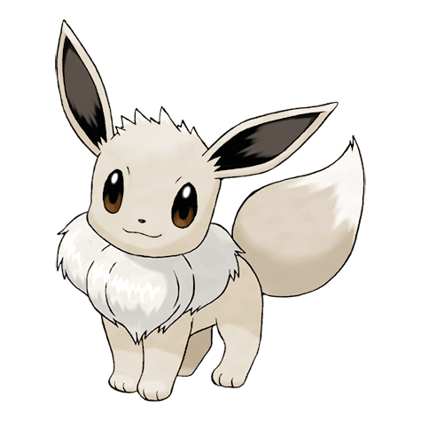

# #133 Eevee (Evolution Pokémon)

| Official Artwork | Shiny Artwork |
|------------------|---------------|
|  |  |

Eevee has an unstable genetic makeup that suddenly mutates due to the environment in which it lives. Radiation from various stones causes this Pokémon to evolve.

---

## Media

### Default Sprites

| Front | Shiny | Back | Shiny |
|-------|-------|------|-------|
|  |  |  |  |

### Cries

Latest (Gen VI+):

<audio controls>
<source src='../../assets/cries/eevee/latest.ogg' type='audio/ogg'>
  Your browser does not support the audio element.
</audio>

Legacy:

<audio controls>
<source src='../../assets/cries/eevee/legacy.ogg' type='audio/ogg'>
  Your browser does not support the audio element.
</audio>

---

## Pokédex Data

| National № | Type(s) | Height | Weight | Abilities | Local № |
|------------|---------|--------|--------|-----------|---------|
| #133 | {: width="48"} | 0.3 m / 1.0 ft | 6.5 kg / 14.3 lbs | 1. Run Away 2. Adaptability | N/A |

---

## Base Stats
|   | HP | Attack | Defense | Sp. Atk | Sp. Def | Speed |
|---|----|--------|---------|---------|---------|-------|
| **Base** | 55 | 55 | 50 | 45 | 65 | 55 |
| **Min** | 220 | 103 | 94 | 85 | 121 | 103 |
| **Max** | 314 | 229 | 218 | 207 | 251 | 229 |

The ranges shown above are for a level 100 Pokémon. Maximum values are based on a beneficial nature, 252 EVs, 31 IVs; minimum values are based on a hindering nature, 0 EVs, 0 IVs.

---

## Forms & Evolutions

!!! warning "WARNING"

    Information on evolutions may not be 100% accurate; differences between evolution methods across generations are not accounted for.

### Forms

Eevee has no alternate forms.

### Evolution Line

1. [Eevee](eevee.md/)
    1. Use Item: [Vaporeon](vaporeon.md/)

    2. Use Item: [Jolteon](jolteon.md/)

    3. Use Item: [Flareon](flareon.md/)

    4. Level Up: [Espeon](espeon.md/)

    5. Level Up: [Umbreon](umbreon.md/)

    6. Use Item: [Leafeon](leafeon.md/)

    7. Use Item: [Glaceon](glaceon.md/)

    8. Level Up: [Sylveon](sylveon.md/)

---

## Training

| EV Yield | Catch Rate | Base Friendship | Base Exp. | Growth Rate | Held Items |
|----------|------------|-----------------|-----------|-------------|------------|
| 1 Sp.-Def | 45 | 140 | 65 | Medium | N/A |

---

## Breeding

| Egg Groups | Egg Cycles | Gender | Dimorphic | Color | Shape |
|------------|------------|--------|-----------|-------|-------|
| 1. Ground | 35 | 87.5% Male 12.5% Female | True | Brown | Quadruped |

---

## Moves

!!! warning "WARNING"

    Specific move information may be incorrect. However, the general movepool should be accurate; this includes changes made in Sacred Gold and Storm Silver.

### Level Up Moves

| Lv. | Move | Type | Cat. | Power | Acc. | PP |
| --- | --- | --- | --- | --- | --- | --- |
| 1 | Growl | {: width="48"} | {: width="36"} | — | 100 | 40 |
| 1 | Helping Hand | {: width="48"} | {: width="36"} | — | — | 20 |
| 1 | Tackle | {: width="48"} | {: width="36"} | 40 | 100 | 35 |
| 1 | Tail Whip | {: width="48"} | {: width="36"} | — | 100 | 30 |
| 5 | Sand Attack | {: width="48"} | {: width="36"} | — | 100 | 15 |
| 9 | Baby Doll Eyes | {: width="48"} | {: width="36"} | — | 100 | 30 |
| 10 | Swift | {: width="48"} | {: width="36"} | 60 | — | 20 |
| 13 | Quick Attack | {: width="48"} | {: width="36"} | 40 | 100 | 30 |
| 17 | Bite | {: width="48"} | {: width="36"} | 60 | 100 | 25 |
| 20 | Refresh | {: width="48"} | {: width="36"} | — | — | 20 |
| 23 | Covet | {: width="48"} | {: width="36"} | 60 | 100 | 25 |
| 25 | Take Down | {: width="48"} | {: width="36"} | 90 | 85 | 20 |
| 29 | Charm | {: width="48"} | {: width="36"} | — | 100 | 20 |
| 33 | Baton Pass | {: width="48"} | {: width="36"} | — | — | 40 |
| 37 | Double Edge | {: width="48"} | {: width="36"} | 120 | 100 | 15 |
| 41 | Last Resort | {: width="48"} | {: width="36"} | 140 | 100 | 5 |
| 45 | Trump Card | {: width="48"} | {: width="36"} | — | — | 5 |

### TM Moves

| TM | Move | Type | Cat. | Power | Acc. | PP |
| --- | --- | --- | --- | --- | --- | --- |
| TM06 | Toxic | {: width="48"} | {: width="36"} | — | 90 | 10 |
| TM10 | Hidden Power | {: width="48"} | {: width="36"} | 60 | 100 | 15 |
| TM100 | Confide | {: width="48"} | {: width="36"} | — | — | 20 |
| TM11 | Sunny Day | {: width="48"} | {: width="36"} | — | — | 5 |
| TM17 | Protect | {: width="48"} | {: width="36"} | — | — | 10 |
| TM18 | Rain Dance | {: width="48"} | {: width="36"} | — | — | 5 |
| TM21 | Frustration | {: width="48"} | {: width="36"} | — | 100 | 20 |
| TM27 | Return | {: width="48"} | {: width="36"} | — | 100 | 20 |
| TM28 | Dig | {: width="48"} | {: width="36"} | 80 | 100 | 10 |
| TM30 | Shadow Ball | {: width="48"} | {: width="36"} | 80 | 100 | 15 |
| TM32 | Double Team | {: width="48"} | {: width="36"} | — | — | 15 |
| TM42 | Facade | {: width="48"} | {: width="36"} | 70 | 100 | 20 |
| TM44 | Rest | {: width="48"} | {: width="36"} | — | — | 5 |
| TM45 | Attract | {: width="48"} | {: width="36"} | — | 100 | 15 |
| TM48 | Round | {: width="48"} | {: width="36"} | 60 | 100 | 15 |
| TM49 | Echoed Voice | {: width="48"} | {: width="36"} | 40 | 100 | 15 |
| TM67 | Retaliate | {: width="48"} | {: width="36"} | 70 | 100 | 5 |
| TM87 | Swagger | {: width="48"} | {: width="36"} | — | 85 | 15 |
| TM88 | Sleep Talk | {: width="48"} | {: width="36"} | — | — | 10 |
| TM90 | Substitute | {: width="48"} | {: width="36"} | — | — | 10 |
| TM94 | Secret Power | {: width="48"} | {: width="36"} | 70 | 100 | 20 |

### Egg Moves

| Move | Type | Cat. | Power | Acc. | PP |
| --- | --- | --- | --- | --- | --- |
| Captivate | {: width="48"} | {: width="36"} | — | 100 | 20 |
| Charm | {: width="48"} | {: width="36"} | — | 100 | 20 |
| Covet | {: width="48"} | {: width="36"} | 60 | 100 | 25 |
| Curse | {: width="48"} | {: width="36"} | — | — | 10 |
| Detect | {: width="48"} | {: width="36"} | — | — | 5 |
| Endure | {: width="48"} | {: width="36"} | — | — | 10 |
| Fake Tears | {: width="48"} | {: width="36"} | — | 100 | 20 |
| Flail | {: width="48"} | {: width="36"} | — | 100 | 15 |
| Natural Gift | {: width="48"} | {: width="36"} | — | 100 | 15 |
| Stored Power | {: width="48"} | {: width="36"} | 20 | 100 | 10 |
| Synchronoise | {: width="48"} | {: width="36"} | 120 | 100 | 10 |
| Tickle | {: width="48"} | {: width="36"} | — | 100 | 20 |
| Wish | {: width="48"} | {: width="36"} | — | — | 10 |
| Yawn | {: width="48"} | {: width="36"} | — | — | 10 |

### Tutor Moves

| Move | Type | Cat. | Power | Acc. | PP |
| --- | --- | --- | --- | --- | --- |
| Covet | {: width="48"} | {: width="36"} | 60 | 100 | 25 |
| Heal Bell | {: width="48"} | {: width="36"} | — | — | 5 |
| Helping Hand | {: width="48"} | {: width="36"} | — | — | 20 |
| Hyper Voice | {: width="48"} | {: width="36"} | 90 | 100 | 10 |
| Iron Tail | {: width="48"} | {: width="36"} | 100 | 75 | 15 |
| Last Resort | {: width="48"} | {: width="36"} | 140 | 100 | 5 |
| Snore | {: width="48"} | {: width="36"} | 50 | 100 | 15 |

