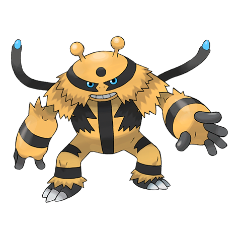
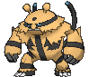
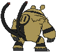
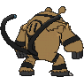

# #466 Electivire (Thunderbolt Pokémon)

| Official Artwork | Shiny Artwork |
|------------------|---------------|
|  |  |

**Rising Ruby:** As its electric charge amplifies, blue sparks begin to crackle between its horns.

**Sinking Sapphire:** It pushes the tips of its two tails against the foe, then lets loose with over 20,000 volts of power.

---

## Media

### Default Sprites

| Front | Shiny | Back | Shiny |
|-------|-------|------|-------|
|  |  |  |  |

### Cries

Latest (Gen VI+):

<audio controls>
<source src='../../assets/cries/electivire/latest.ogg' type='audio/ogg'>
  Your browser does not support the audio element.
</audio>

Legacy:

<audio controls>
<source src='../../assets/cries/electivire/legacy.ogg' type='audio/ogg'>
  Your browser does not support the audio element.
</audio>

---

## Pokédex Data

| National № | Type(s) | Height | Weight | Abilities | Local № |
|------------|---------|--------|--------|-----------|---------|
| #466 | {: width="48"} {: width="48"} | 1.8 m / 5.9 ft | 138.6 kg / 305.6 lbs | 1. Motor Drive 2. Vital Spirit | N/A |

---

## Base Stats
|   | HP | Attack | Defense | Sp. Atk | Sp. Def | Speed |
|---|----|--------|---------|---------|---------|-------|
| **Base** | 75 | 123 | 67 | 95 | 85 | 95 |
| **Min** | 260 | 225 | 125 | 175 | 157 | 175 |
| **Max** | 354 | 379 | 256 | 317 | 295 | 317 |

The ranges shown above are for a level 100 Pokémon. Maximum values are based on a beneficial nature, 252 EVs, 31 IVs; minimum values are based on a hindering nature, 0 EVs, 0 IVs.

---

## Forms & Evolutions

!!! warning "WARNING"

    Information on evolutions may not be 100% accurate; differences between evolution methods across generations are not accounted for.

### Forms

Electivire has no alternate forms.

### Evolution Line

1. [Elekid](elekid.md/)
    1. Level Up: [Electabuzz](electabuzz.md/)
        1. Trade: [Electivire](electivire.md/)

---

## Training

| EV Yield | Catch Rate | Base Friendship | Base Exp. | Growth Rate | Held Items |
|----------|------------|-----------------|-----------|-------------|------------|
| 3 Atk | 30 | 50 | 270 | Medium | Electirizer (5%) |

---

## Breeding

| Egg Groups | Egg Cycles | Gender | Dimorphic | Color | Shape |
|------------|------------|--------|-----------|-------|-------|
| 1. Humanshape | 25 | 75.0% Male 25.0% Female | False | Yellow | Upright |

---

## Moves

!!! warning "WARNING"

    Specific move information may be incorrect. However, the general movepool should be accurate; this includes changes made in Sacred Gold and Storm Silver.

### Level Up Moves

| Lv. | Move | Type | Cat. | Power | Acc. | PP |
| --- | --- | --- | --- | --- | --- | --- |
| 1 | Electric Terrain | {: width="48"} | {: width="36"} | — | — | 10 |
| 1 | Fire Punch | {: width="48"} | {: width="36"} | 75 | 100 | 15 |
| 1 | Hammer Arm | {: width="48"} | {: width="36"} | 100 | 90 | 10 |
| 1 | Ice Punch | {: width="48"} | {: width="36"} | 75 | 100 | 15 |
| 1 | Ion Deluge | {: width="48"} | {: width="36"} | — | — | 25 |
| 1 | Leer | {: width="48"} | {: width="36"} | — | 100 | 30 |
| 1 | Quick Attack | {: width="48"} | {: width="36"} | 40 | 100 | 30 |
| 1 | Volt Tackle | {: width="48"} | {: width="36"} | 120 | 100 | 15 |
| 5 | Thunder Shock | {: width="48"} | {: width="36"} | 40 | 100 | 30 |
| 8 | Low Kick | {: width="48"} | {: width="36"} | — | 100 | 20 |
| 11 | Swift | {: width="48"} | {: width="36"} | 60 | — | 20 |
| 14 | Shock Wave | {: width="48"} | {: width="36"} | 60 | — | 20 |
| 17 | Thunder Wave | {: width="48"} | {: width="36"} | — | 90 | 20 |
| 20 | Electro Ball | {: width="48"} | {: width="36"} | — | 100 | 10 |
| 23 | Light Screen | {: width="48"} | {: width="36"} | — | — | 30 |
| 26 | Brick Break | {: width="48"} | {: width="36"} | 75 | 100 | 15 |
| 29 | Thunder Punch | {: width="48"} | {: width="36"} | 75 | 100 | 15 |
| 33 | Discharge | {: width="48"} | {: width="36"} | 80 | 100 | 15 |
| 37 | Screech | {: width="48"} | {: width="36"} | — | 85 | 40 |
| 41 | Thunderbolt | {: width="48"} | {: width="36"} | 90 | 100 | 15 |
| 45 | Cross Chop | {: width="48"} | {: width="36"} | 100 | 80 | 5 |
| 49 | Wild Charge | {: width="48"} | {: width="36"} | 90 | 100 | 15 |
| 53 | Thunder | {: width="48"} | {: width="36"} | 110 | 70 | 10 |
| 57 | Giga Impact | {: width="48"} | {: width="36"} | 150 | 90 | 5 |
| 61 | Electric Terrain | {: width="48"} | {: width="36"} | — | — | 10 |
| 65 | Volt Tackle | {: width="48"} | {: width="36"} | 120 | 100 | 15 |

### TM Moves

| TM | Move | Type | Cat. | Power | Acc. | PP |
| --- | --- | --- | --- | --- | --- | --- |
| HM04 | Strength | {: width="48"} | {: width="36"} | 100 | 100 | 10 |
| HM06 | Rock Smash | {: width="48"} | {: width="36"} | 65 | 100 | 15 |
| TM06 | Toxic | {: width="48"} | {: width="36"} | — | 90 | 10 |
| TM10 | Hidden Power | {: width="48"} | {: width="36"} | 60 | 100 | 15 |
| TM100 | Confide | {: width="48"} | {: width="36"} | — | — | 20 |
| TM12 | Taunt | {: width="48"} | {: width="36"} | — | 100 | 20 |
| TM15 | Hyper Beam | {: width="48"} | {: width="36"} | 150 | 90 | 5 |
| TM16 | Light Screen | {: width="48"} | {: width="36"} | — | — | 30 |
| TM17 | Protect | {: width="48"} | {: width="36"} | — | — | 10 |
| TM18 | Rain Dance | {: width="48"} | {: width="36"} | — | — | 5 |
| TM21 | Frustration | {: width="48"} | {: width="36"} | — | 100 | 20 |
| TM24 | Thunderbolt | {: width="48"} | {: width="36"} | 90 | 100 | 15 |
| TM25 | Thunder | {: width="48"} | {: width="36"} | 110 | 70 | 10 |
| TM26 | Earthquake | {: width="48"} | {: width="36"} | 100 | 100 | 10 |
| TM27 | Return | {: width="48"} | {: width="36"} | — | 100 | 20 |
| TM28 | Dig | {: width="48"} | {: width="36"} | 80 | 100 | 10 |
| TM29 | Psychic | {: width="48"} | {: width="36"} | 90 | 100 | 10 |
| TM31 | Brick Break | {: width="48"} | {: width="36"} | 75 | 100 | 15 |
| TM32 | Double Team | {: width="48"} | {: width="36"} | — | — | 15 |
| TM35 | Flamethrower | {: width="48"} | {: width="36"} | 90 | 100 | 15 |
| TM39 | Rock Tomb | {: width="48"} | {: width="36"} | 60 | 95 | 15 |
| TM41 | Torment | {: width="48"} | {: width="36"} | — | 100 | 15 |
| TM42 | Facade | {: width="48"} | {: width="36"} | 70 | 100 | 20 |
| TM44 | Rest | {: width="48"} | {: width="36"} | — | — | 5 |
| TM45 | Attract | {: width="48"} | {: width="36"} | — | 100 | 15 |
| TM46 | Thief | {: width="48"} | {: width="36"} | 60 | 100 | 25 |
| TM47 | Low Sweep | {: width="48"} | {: width="36"} | 65 | 100 | 20 |
| TM48 | Round | {: width="48"} | {: width="36"} | 60 | 100 | 15 |
| TM52 | Focus Blast | {: width="48"} | {: width="36"} | 120 | 70 | 5 |
| TM56 | Fling | {: width="48"} | {: width="36"} | — | 100 | 10 |
| TM57 | Charge Beam | {: width="48"} | {: width="36"} | 50 | 90 | 10 |
| TM68 | Giga Impact | {: width="48"} | {: width="36"} | 150 | 90 | 5 |
| TM70 | Flash | {: width="48"} | {: width="36"} | — | 100 | 20 |
| TM72 | Volt Switch | {: width="48"} | {: width="36"} | 70 | 100 | 20 |
| TM73 | Thunder Wave | {: width="48"} | {: width="36"} | — | 90 | 20 |
| TM78 | Bulldoze | {: width="48"} | {: width="36"} | 60 | 100 | 20 |
| TM80 | Rock Slide | {: width="48"} | {: width="36"} | 75 | 90 | 10 |
| TM87 | Swagger | {: width="48"} | {: width="36"} | — | 85 | 15 |
| TM88 | Sleep Talk | {: width="48"} | {: width="36"} | — | — | 10 |
| TM90 | Substitute | {: width="48"} | {: width="36"} | — | — | 10 |
| TM93 | Wild Charge | {: width="48"} | {: width="36"} | 90 | 100 | 15 |
| TM94 | Secret Power | {: width="48"} | {: width="36"} | 70 | 100 | 20 |
| TM98 | Power Up Punch | {: width="48"} | {: width="36"} | 40 | 100 | 20 |

### Egg Moves

Electivire cannot learn any moves by breeding.
### Tutor Moves

| Move | Type | Cat. | Power | Acc. | PP |
| --- | --- | --- | --- | --- | --- |
| Covet | {: width="48"} | {: width="36"} | 60 | 100 | 25 |
| Dual Chop | {: width="48"} | {: width="36"} | 40 | 90 | 15 |
| Electroweb | {: width="48"} | {: width="36"} | 55 | 95 | 15 |
| Fire Punch | {: width="48"} | {: width="36"} | 75 | 100 | 15 |
| Focus Punch | {: width="48"} | {: width="36"} | 150 | 100 | 20 |
| Helping Hand | {: width="48"} | {: width="36"} | — | — | 20 |
| Ice Punch | {: width="48"} | {: width="36"} | 75 | 100 | 15 |
| Iron Tail | {: width="48"} | {: width="36"} | 100 | 75 | 15 |
| Low Kick | {: width="48"} | {: width="36"} | — | 100 | 20 |
| Magnet Rise | {: width="48"} | {: width="36"} | — | — | 10 |
| Shock Wave | {: width="48"} | {: width="36"} | 60 | — | 20 |
| Signal Beam | {: width="48"} | {: width="36"} | 75 | 100 | 15 |
| Snore | {: width="48"} | {: width="36"} | 50 | 100 | 15 |
| Thunder Punch | {: width="48"} | {: width="36"} | 75 | 100 | 15 |

