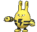
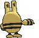

# #239 Elekid (Electric Pokémon)

| Official Artwork | Shiny Artwork |
|------------------|---------------|
|  |  |

Elekid stores electricity in its body. If it touches metal and accidentally discharges all its built-up electricity, this Pokémon begins swinging its arms in circles to recharge itself.

---

## Media

### Default Sprites

| Front | Shiny | Back | Shiny |
|-------|-------|------|-------|
|  |  |  |  |

### Cries

Latest (Gen VI+):

<audio controls>
<source src='../../assets/cries/elekid/latest.ogg' type='audio/ogg'>
  Your browser does not support the audio element.
</audio>

Legacy:

<audio controls>
<source src='../../assets/cries/elekid/legacy.ogg' type='audio/ogg'>
  Your browser does not support the audio element.
</audio>

---

## Pokédex Data

| National № | Type(s) | Height | Weight | Abilities | Local № |
|------------|---------|--------|--------|-----------|---------|
| #239 | {: width="48"} | 0.6 m / 2.0 ft | 23.5 kg / 51.8 lbs | 1. Static 2. Vital Spirit | N/A |

---

## Base Stats
|   | HP | Attack | Defense | Sp. Atk | Sp. Def | Speed |
|---|----|--------|---------|---------|---------|-------|
| **Base** | 45 | 63 | 37 | 65 | 55 | 95 |
| **Min** | 200 | 117 | 71 | 121 | 103 | 175 |
| **Max** | 294 | 247 | 190 | 251 | 229 | 317 |

The ranges shown above are for a level 100 Pokémon. Maximum values are based on a beneficial nature, 252 EVs, 31 IVs; minimum values are based on a hindering nature, 0 EVs, 0 IVs.

---

## Forms & Evolutions

!!! warning "WARNING"

    Information on evolutions may not be 100% accurate; differences between evolution methods across generations are not accounted for.

### Forms

Elekid has no alternate forms.

### Evolution Line

1. [Elekid](elekid.md/)
    1. Level Up: [Electabuzz](electabuzz.md/)
        1. Trade: [Electivire](electivire.md/)

---

## Training

| EV Yield | Catch Rate | Base Friendship | Base Exp. | Growth Rate | Held Items |
|----------|------------|-----------------|-----------|-------------|------------|
| 1 Spd | 45 | 50 | 72 | Medium | Electirizer (5%) |

---

## Breeding

| Egg Groups | Egg Cycles | Gender | Dimorphic | Color | Shape |
|------------|------------|--------|-----------|-------|-------|
| 1. No-Eggs | 25 | 75.0% Male 25.0% Female | False | Yellow | Humanoid |

---

## Moves

!!! warning "WARNING"

    Specific move information may be incorrect. However, the general movepool should be accurate; this includes changes made in Sacred Gold and Storm Silver.

### Level Up Moves

| Lv. | Move | Type | Cat. | Power | Acc. | PP |
| --- | --- | --- | --- | --- | --- | --- |
| 1 | Leer | {: width="48"} | {: width="36"} | — | 100 | 30 |
| 1 | Quick Attack | {: width="48"} | {: width="36"} | 40 | 100 | 30 |
| 5 | Thunder Shock | {: width="48"} | {: width="36"} | 40 | 100 | 30 |
| 8 | Low Kick | {: width="48"} | {: width="36"} | — | 100 | 20 |
| 11 | Swift | {: width="48"} | {: width="36"} | 60 | — | 20 |
| 14 | Shock Wave | {: width="48"} | {: width="36"} | 60 | — | 20 |
| 17 | Thunder Wave | {: width="48"} | {: width="36"} | — | 90 | 20 |
| 20 | Electro Ball | {: width="48"} | {: width="36"} | — | 100 | 10 |
| 23 | Light Screen | {: width="48"} | {: width="36"} | — | — | 30 |
| 26 | Brick Break | {: width="48"} | {: width="36"} | 75 | 100 | 15 |
| 29 | Thunder Punch | {: width="48"} | {: width="36"} | 75 | 100 | 15 |
| 32 | Discharge | {: width="48"} | {: width="36"} | 80 | 100 | 15 |
| 35 | Screech | {: width="48"} | {: width="36"} | — | 85 | 40 |
| 38 | Thunderbolt | {: width="48"} | {: width="36"} | 90 | 100 | 15 |
| 41 | Cross Chop | {: width="48"} | {: width="36"} | 100 | 80 | 5 |
| 44 | Wild Charge | {: width="48"} | {: width="36"} | 90 | 100 | 15 |
| 47 | Thunder | {: width="48"} | {: width="36"} | 110 | 70 | 10 |

### TM Moves

| TM | Move | Type | Cat. | Power | Acc. | PP |
| --- | --- | --- | --- | --- | --- | --- |
| HM06 | Rock Smash | {: width="48"} | {: width="36"} | 65 | 100 | 15 |
| TM06 | Toxic | {: width="48"} | {: width="36"} | — | 90 | 10 |
| TM10 | Hidden Power | {: width="48"} | {: width="36"} | 60 | 100 | 15 |
| TM100 | Confide | {: width="48"} | {: width="36"} | — | — | 20 |
| TM16 | Light Screen | {: width="48"} | {: width="36"} | — | — | 30 |
| TM17 | Protect | {: width="48"} | {: width="36"} | — | — | 10 |
| TM18 | Rain Dance | {: width="48"} | {: width="36"} | — | — | 5 |
| TM21 | Frustration | {: width="48"} | {: width="36"} | — | 100 | 20 |
| TM24 | Thunderbolt | {: width="48"} | {: width="36"} | 90 | 100 | 15 |
| TM25 | Thunder | {: width="48"} | {: width="36"} | 110 | 70 | 10 |
| TM27 | Return | {: width="48"} | {: width="36"} | — | 100 | 20 |
| TM29 | Psychic | {: width="48"} | {: width="36"} | 90 | 100 | 10 |
| TM31 | Brick Break | {: width="48"} | {: width="36"} | 75 | 100 | 15 |
| TM32 | Double Team | {: width="48"} | {: width="36"} | — | — | 15 |
| TM42 | Facade | {: width="48"} | {: width="36"} | 70 | 100 | 20 |
| TM44 | Rest | {: width="48"} | {: width="36"} | — | — | 5 |
| TM45 | Attract | {: width="48"} | {: width="36"} | — | 100 | 15 |
| TM46 | Thief | {: width="48"} | {: width="36"} | 60 | 100 | 25 |
| TM48 | Round | {: width="48"} | {: width="36"} | 60 | 100 | 15 |
| TM56 | Fling | {: width="48"} | {: width="36"} | — | 100 | 10 |
| TM57 | Charge Beam | {: width="48"} | {: width="36"} | 50 | 90 | 10 |
| TM70 | Flash | {: width="48"} | {: width="36"} | — | 100 | 20 |
| TM72 | Volt Switch | {: width="48"} | {: width="36"} | 70 | 100 | 20 |
| TM73 | Thunder Wave | {: width="48"} | {: width="36"} | — | 90 | 20 |
| TM87 | Swagger | {: width="48"} | {: width="36"} | — | 85 | 15 |
| TM88 | Sleep Talk | {: width="48"} | {: width="36"} | — | — | 10 |
| TM90 | Substitute | {: width="48"} | {: width="36"} | — | — | 10 |
| TM93 | Wild Charge | {: width="48"} | {: width="36"} | 90 | 100 | 15 |
| TM94 | Secret Power | {: width="48"} | {: width="36"} | 70 | 100 | 20 |
| TM98 | Power Up Punch | {: width="48"} | {: width="36"} | 40 | 100 | 20 |

### Egg Moves

| Move | Type | Cat. | Power | Acc. | PP |
| --- | --- | --- | --- | --- | --- |
| Barrier | {: width="48"} | {: width="36"} | — | — | 20 |
| Cross Chop | {: width="48"} | {: width="36"} | 100 | 80 | 5 |
| Dynamic Punch | {: width="48"} | {: width="36"} | 100 | 50 | 5 |
| Feint | {: width="48"} | {: width="36"} | 30 | 100 | 10 |
| Fire Punch | {: width="48"} | {: width="36"} | 75 | 100 | 15 |
| Focus Punch | {: width="48"} | {: width="36"} | 150 | 100 | 20 |
| Hammer Arm | {: width="48"} | {: width="36"} | 100 | 90 | 10 |
| Ice Punch | {: width="48"} | {: width="36"} | 75 | 100 | 15 |
| Karate Chop | {: width="48"} | {: width="36"} | 50 | 100 | 25 |
| Meditate | {: width="48"} | {: width="36"} | — | — | 40 |
| Rolling Kick | {: width="48"} | {: width="36"} | 60 | 85 | 15 |

### Tutor Moves

| Move | Type | Cat. | Power | Acc. | PP |
| --- | --- | --- | --- | --- | --- |
| Covet | {: width="48"} | {: width="36"} | 60 | 100 | 25 |
| Dual Chop | {: width="48"} | {: width="36"} | 40 | 90 | 15 |
| Electroweb | {: width="48"} | {: width="36"} | 55 | 95 | 15 |
| Fire Punch | {: width="48"} | {: width="36"} | 75 | 100 | 15 |
| Focus Punch | {: width="48"} | {: width="36"} | 150 | 100 | 20 |
| Helping Hand | {: width="48"} | {: width="36"} | — | — | 20 |
| Ice Punch | {: width="48"} | {: width="36"} | 75 | 100 | 15 |
| Low Kick | {: width="48"} | {: width="36"} | — | 100 | 20 |
| Magnet Rise | {: width="48"} | {: width="36"} | — | — | 10 |
| Shock Wave | {: width="48"} | {: width="36"} | 60 | — | 20 |
| Signal Beam | {: width="48"} | {: width="36"} | 75 | 100 | 15 |
| Snore | {: width="48"} | {: width="36"} | 50 | 100 | 15 |
| Thunder Punch | {: width="48"} | {: width="36"} | 75 | 100 | 15 |
| Uproar | {: width="48"} | {: width="36"} | 90 | 100 | 10 |

