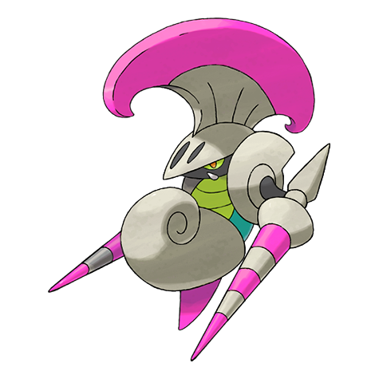
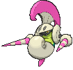
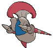
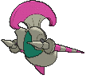

# #589 Escavalier (Cavalry Pokémon)

| Official Artwork | Shiny Artwork |
|------------------|---------------|
|  |  |

**Rising Ruby:** Wearing the shell covering they stole from Shelmet, they defend themselves and attack with two lances.

**Sinking Sapphire:** These Pokémon evolve by wearing the shell covering of a Shelmet. The steel armor protects their whole body.

---

## Media

### Default Sprites

| Front | Shiny | Back | Shiny |
|-------|-------|------|-------|
|  |  |  |  |

### Cries

Latest (Gen VI+):

<audio controls>
<source src='../../assets/cries/escavalier/latest.ogg' type='audio/ogg'>
  Your browser does not support the audio element.
</audio>

Legacy:

<audio controls>
<source src='../../assets/cries/escavalier/legacy.ogg' type='audio/ogg'>
  Your browser does not support the audio element.
</audio>

---

## Pokédex Data

| National № | Type(s) | Height | Weight | Abilities | Local № |
|------------|---------|--------|--------|-----------|---------|
| #589 | {: width="48"} {: width="48"} | 1.0 m / 3.3 ft | 33.0 kg / 72.8 lbs | 1. Swarm 2. Shell Armor | N/A |

---

## Base Stats
|   | HP | Attack | Defense | Sp. Atk | Sp. Def | Speed |
|---|----|--------|---------|---------|---------|-------|
| **Base** | 70 | 135 | 105 | 60 | 105 | 20 |
| **Min** | 250 | 247 | 193 | 112 | 193 | 40 |
| **Max** | 344 | 405 | 339 | 240 | 339 | 152 |

The ranges shown above are for a level 100 Pokémon. Maximum values are based on a beneficial nature, 252 EVs, 31 IVs; minimum values are based on a hindering nature, 0 EVs, 0 IVs.

---

## Forms & Evolutions

!!! warning "WARNING"

    Information on evolutions may not be 100% accurate; differences between evolution methods across generations are not accounted for.

### Forms

Escavalier has no alternate forms.

### Evolution Line

1. [Karrablast](karrablast.md/)
    1. Trade: [Escavalier](escavalier.md/)

---

## Training

| EV Yield | Catch Rate | Base Friendship | Base Exp. | Growth Rate | Held Items |
|----------|------------|-----------------|-----------|-------------|------------|
| 2 Atk | 75 | 50 | 173 | Medium | N/A |

---

## Breeding

| Egg Groups | Egg Cycles | Gender | Dimorphic | Color | Shape |
|------------|------------|--------|-----------|-------|-------|
| 1. Bug | 15 | 50.0% Male 50.0% Female | False | Gray | Arms |

---

## Moves

!!! warning "WARNING"

    Specific move information may be incorrect. However, the general movepool should be accurate; this includes changes made in Sacred Gold and Storm Silver.

### Level Up Moves

| Lv. | Move | Type | Cat. | Power | Acc. | PP |
| --- | --- | --- | --- | --- | --- | --- |
| 1 | Double Edge | {: width="48"} | {: width="36"} | 120 | 100 | 15 |
| 1 | Drill Peck | {: width="48"} | {: width="36"} | 80 | 100 | 20 |
| 1 | Fell Stinger | {: width="48"} | {: width="36"} | 50 | 100 | 25 |
| 1 | Needle Arm | {: width="48"} | {: width="36"} | 80 | 100 | 15 |
| 1 | Peck | {: width="48"} | {: width="36"} | 35 | 100 | 35 |
| 5 | Leer | {: width="48"} | {: width="36"} | — | 100 | 30 |
| 8 | Quick Guard | {: width="48"} | {: width="36"} | — | — | 15 |
| 11 | Twineedle | {: width="48"} | {: width="36"} | 25 | 100 | 20 |
| 14 | Fury Attack | {: width="48"} | {: width="36"} | 15 | 85 | 20 |
| 17 | Bug Bite | {: width="48"} | {: width="36"} | 60 | 100 | 20 |
| 20 | Headbutt | {: width="48"} | {: width="36"} | 70 | 100 | 15 |
| 23 | Knock Off | {: width="48"} | {: width="36"} | 65 | 100 | 20 |
| 26 | Bug Buzz | {: width="48"} | {: width="36"} | 90 | 100 | 10 |
| 29 | Slash | {: width="48"} | {: width="36"} | 70 | 100 | 20 |
| 32 | X Scissor | {: width="48"} | {: width="36"} | 80 | 100 | 15 |
| 35 | Drill Run | {: width="48"} | {: width="36"} | 80 | 95 | 10 |
| 38 | Iron Head | {: width="48"} | {: width="36"} | 80 | 100 | 15 |
| 41 | Iron Defense | {: width="48"} | {: width="36"} | — | — | 15 |
| 44 | Reversal | {: width="48"} | {: width="36"} | — | 100 | 15 |
| 47 | Swords Dance | {: width="48"} | {: width="36"} | — | — | 20 |
| 50 | Giga Impact | {: width="48"} | {: width="36"} | 150 | 90 | 5 |
| 53 | Megahorn | {: width="48"} | {: width="36"} | 120 | 85 | 10 |
| 56 | Fell Stinger | {: width="48"} | {: width="36"} | 50 | 100 | 25 |

### TM Moves

| TM | Move | Type | Cat. | Power | Acc. | PP |
| --- | --- | --- | --- | --- | --- | --- |
| HM01 | Cut | {: width="48"} | {: width="36"} | 70 | 100 | 15 |
| HM06 | Rock Smash | {: width="48"} | {: width="36"} | 65 | 100 | 15 |
| TM06 | Toxic | {: width="48"} | {: width="36"} | — | 90 | 10 |
| TM10 | Hidden Power | {: width="48"} | {: width="36"} | 60 | 100 | 15 |
| TM100 | Confide | {: width="48"} | {: width="36"} | — | — | 20 |
| TM15 | Hyper Beam | {: width="48"} | {: width="36"} | 150 | 90 | 5 |
| TM17 | Protect | {: width="48"} | {: width="36"} | — | — | 10 |
| TM18 | Rain Dance | {: width="48"} | {: width="36"} | — | — | 5 |
| TM21 | Frustration | {: width="48"} | {: width="36"} | — | 100 | 20 |
| TM27 | Return | {: width="48"} | {: width="36"} | — | 100 | 20 |
| TM32 | Double Team | {: width="48"} | {: width="36"} | — | — | 15 |
| TM40 | Aerial Ace | {: width="48"} | {: width="36"} | 60 | — | 20 |
| TM42 | Facade | {: width="48"} | {: width="36"} | 70 | 100 | 20 |
| TM44 | Rest | {: width="48"} | {: width="36"} | — | — | 5 |
| TM45 | Attract | {: width="48"} | {: width="36"} | — | 100 | 15 |
| TM48 | Round | {: width="48"} | {: width="36"} | 60 | 100 | 15 |
| TM52 | Focus Blast | {: width="48"} | {: width="36"} | 120 | 70 | 5 |
| TM53 | Energy Ball | {: width="48"} | {: width="36"} | 90 | 100 | 10 |
| TM54 | False Swipe | {: width="48"} | {: width="36"} | 40 | 100 | 40 |
| TM68 | Giga Impact | {: width="48"} | {: width="36"} | 150 | 90 | 5 |
| TM75 | Swords Dance | {: width="48"} | {: width="36"} | — | — | 20 |
| TM76 | Struggle Bug | {: width="48"} | {: width="36"} | 50 | 100 | 20 |
| TM81 | X Scissor | {: width="48"} | {: width="36"} | 80 | 100 | 15 |
| TM83 | Infestation | {: width="48"} | {: width="36"} | 20 | 100 | 20 |
| TM84 | Poison Jab | {: width="48"} | {: width="36"} | 80 | 100 | 20 |
| TM87 | Swagger | {: width="48"} | {: width="36"} | — | 85 | 15 |
| TM88 | Sleep Talk | {: width="48"} | {: width="36"} | — | — | 10 |
| TM90 | Substitute | {: width="48"} | {: width="36"} | — | — | 10 |
| TM94 | Secret Power | {: width="48"} | {: width="36"} | 70 | 100 | 20 |

### Egg Moves

Escavalier cannot learn any moves by breeding.
### Tutor Moves

| Move | Type | Cat. | Power | Acc. | PP |
| --- | --- | --- | --- | --- | --- |
| Bug Bite | {: width="48"} | {: width="36"} | 60 | 100 | 20 |
| Drill Run | {: width="48"} | {: width="36"} | 80 | 95 | 10 |
| Giga Drain | {: width="48"} | {: width="36"} | 75 | 100 | 10 |
| Iron Defense | {: width="48"} | {: width="36"} | — | — | 15 |
| Iron Head | {: width="48"} | {: width="36"} | 80 | 100 | 15 |
| Knock Off | {: width="48"} | {: width="36"} | 65 | 100 | 20 |
| Signal Beam | {: width="48"} | {: width="36"} | 75 | 100 | 15 |
| Snore | {: width="48"} | {: width="36"} | 50 | 100 | 15 |

