# #670 Floette (Single Bloom Pokémon)

| Official Artwork | Shiny Artwork |
|------------------|---------------|
|  | 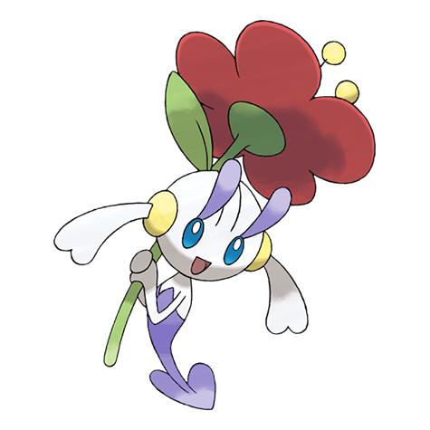 |

**Rising Ruby:** It flutters around fields of flowers and cares for flowers that are starting to wilt. It draws out the hidden power of flowers to battle.

**Sinking Sapphire:** When the flowers of a well-tended flower bed bloom, it appears and celebrates with an elegant dance.

---

## Media

### Default Sprites

| Front | Shiny | Back | Shiny |
|-------|-------|------|-------|
|  | 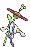 |  | 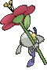 |

### Floette Yellow Sprites

| Front | Shiny | Back | Shiny |
|-------|-------|------|-------|
| 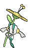 | 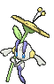 | 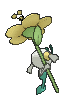 | 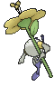 |

### Floette Orange Sprites

| Front | Shiny | Back | Shiny |
|-------|-------|------|-------|
| 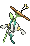 | 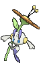 | 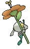 | 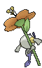 |

### Floette Blue Sprites

| Front | Shiny | Back | Shiny |
|-------|-------|------|-------|
| 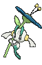 | 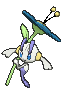 | 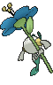 | 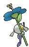 |

### Floette White Sprites

| Front | Shiny | Back | Shiny |
|-------|-------|------|-------|
|  | 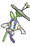 | 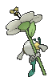 | 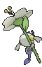 |

### Cries

Latest (Gen VI+):

<audio controls>
<source src='../../assets/cries/floette/latest.ogg' type='audio/ogg'>
  Your browser does not support the audio element.
</audio>

Legacy:

<audio controls>
<source src='../../assets/cries/floette/legacy.ogg' type='audio/ogg'>
  Your browser does not support the audio element.
</audio>

---

## Pokédex Data

| National № | Type(s) | Height | Weight | Abilities | Local № |
|------------|---------|--------|--------|-----------|---------|
| #670 | {: width="48"} | 0.2 m / 0.7 ft | 0.9 kg / 2.0 lbs | 1. Flower Veil 2. Symbiosis | N/A |

---

## Base Stats
|   | HP | Attack | Defense | Sp. Atk | Sp. Def | Speed |
|---|----|--------|---------|---------|---------|-------|
| **Base** | 54 | 45 | 47 | 75 | 98 | 52 |
| **Min** | 218 | 85 | 89 | 139 | 180 | 98 |
| **Max** | 312 | 207 | 212 | 273 | 324 | 223 |

The ranges shown above are for a level 100 Pokémon. Maximum values are based on a beneficial nature, 252 EVs, 31 IVs; minimum values are based on a hindering nature, 0 EVs, 0 IVs.

---

## Forms & Evolutions

!!! warning "WARNING"

    Information on evolutions may not be 100% accurate; differences between evolution methods across generations are not accounted for.

### Forms

5. [Floette](floette.md/)

6. [Floette Eternal](floette-eternal.md/)

### Evolution Line

1. [Flabebe](flabebe.md/)
    1. Level Up: [Floette](floette.md/)
        1. Use Item: [Florges](florges.md/)

---

## Training

| EV Yield | Catch Rate | Base Friendship | Base Exp. | Growth Rate | Held Items |
|----------|------------|-----------------|-----------|-------------|------------|
| 2 Sp.-Def | 120 | 70 | 130 | Medium | N/A |

---

## Breeding

| Egg Groups | Egg Cycles | Gender | Dimorphic | Color | Shape |
|------------|------------|--------|-----------|-------|-------|
| 1. Fairy | 20 | 0.0% Male 100.0% Female | False | White | Arms |

---

## Moves

!!! warning "WARNING"

    Specific move information may be incorrect. However, the general movepool should be accurate; this includes changes made in Sacred Gold and Storm Silver.

### Level Up Moves

| Lv. | Move | Type | Cat. | Power | Acc. | PP |
| --- | --- | --- | --- | --- | --- | --- |
| 1 | Tackle | {: width="48"} | {: width="36"} | 40 | 100 | 35 |
| 1 | Vine Whip | {: width="48"} | {: width="36"} | 45 | 100 | 25 |
| 5 | Fairy Wind | {: width="48"} | {: width="36"} | 50 | 100 | 25 |
| 8 | Razor Leaf | {: width="48"} | {: width="36"} | 55 | 95 | 25 |
| 11 | Wish | {: width="48"} | {: width="36"} | — | — | 10 |
| 14 | Magical Leaf | {: width="48"} | {: width="36"} | 60 | — | 20 |
| 17 | Nature Power | {: width="48"} | {: width="36"} | — | — | 20 |
| 21 | Lucky Chant | {: width="48"} | {: width="36"} | — | — | 30 |
| 25 | Dazzling Gleam | {: width="48"} | {: width="36"} | 80 | 100 | 10 |
| 29 | Grass Knot | {: width="48"} | {: width="36"} | — | 100 | 20 |
| 33 | Grassy Terrain | {: width="48"} | {: width="36"} | — | — | 10 |
| 37 | Petal Blizzard | {: width="48"} | {: width="36"} | 90 | 100 | 15 |
| 41 | Moonblast | {: width="48"} | {: width="36"} | 95 | 100 | 15 |
| 45 | Aromatherapy | {: width="48"} | {: width="36"} | — | — | 5 |
| 49 | Petal Dance | {: width="48"} | {: width="36"} | 120 | 100 | 10 |
| 53 | Misty Terrain | {: width="48"} | {: width="36"} | — | — | 10 |
| 57 | Solar Beam | {: width="48"} | {: width="36"} | 120 | 100 | 10 |

### TM Moves

| TM | Move | Type | Cat. | Power | Acc. | PP |
| --- | --- | --- | --- | --- | --- | --- |
| TM04 | Calm Mind | {: width="48"} | {: width="36"} | — | — | 20 |
| TM06 | Toxic | {: width="48"} | {: width="36"} | — | 90 | 10 |
| TM10 | Hidden Power | {: width="48"} | {: width="36"} | 60 | 100 | 15 |
| TM100 | Confide | {: width="48"} | {: width="36"} | — | — | 20 |
| TM11 | Sunny Day | {: width="48"} | {: width="36"} | — | — | 5 |
| TM17 | Protect | {: width="48"} | {: width="36"} | — | — | 10 |
| TM18 | Rain Dance | {: width="48"} | {: width="36"} | — | — | 5 |
| TM20 | Safeguard | {: width="48"} | {: width="36"} | — | — | 25 |
| TM21 | Frustration | {: width="48"} | {: width="36"} | — | 100 | 20 |
| TM22 | Solar Beam | {: width="48"} | {: width="36"} | 120 | 100 | 10 |
| TM27 | Return | {: width="48"} | {: width="36"} | — | 100 | 20 |
| TM29 | Psychic | {: width="48"} | {: width="36"} | 90 | 100 | 10 |
| TM32 | Double Team | {: width="48"} | {: width="36"} | — | — | 15 |
| TM42 | Facade | {: width="48"} | {: width="36"} | 70 | 100 | 20 |
| TM44 | Rest | {: width="48"} | {: width="36"} | — | — | 5 |
| TM45 | Attract | {: width="48"} | {: width="36"} | — | 100 | 15 |
| TM48 | Round | {: width="48"} | {: width="36"} | 60 | 100 | 15 |
| TM49 | Echoed Voice | {: width="48"} | {: width="36"} | 40 | 100 | 15 |
| TM53 | Energy Ball | {: width="48"} | {: width="36"} | 90 | 100 | 10 |
| TM70 | Flash | {: width="48"} | {: width="36"} | — | 100 | 20 |
| TM86 | Grass Knot | {: width="48"} | {: width="36"} | — | 100 | 20 |
| TM87 | Swagger | {: width="48"} | {: width="36"} | — | 85 | 15 |
| TM88 | Sleep Talk | {: width="48"} | {: width="36"} | — | — | 10 |
| TM90 | Substitute | {: width="48"} | {: width="36"} | — | — | 10 |
| TM94 | Secret Power | {: width="48"} | {: width="36"} | 70 | 100 | 20 |
| TM96 | Nature Power | {: width="48"} | {: width="36"} | — | — | 20 |
| TM99 | Dazzling Gleam | {: width="48"} | {: width="36"} | 80 | 100 | 10 |

### Egg Moves

Floette cannot learn any moves by breeding.
### Tutor Moves

| Move | Type | Cat. | Power | Acc. | PP |
| --- | --- | --- | --- | --- | --- |
| After You | {: width="48"} | {: width="36"} | — | — | 15 |
| Covet | {: width="48"} | {: width="36"} | 60 | 100 | 25 |
| Endeavor | {: width="48"} | {: width="36"} | — | 100 | 5 |
| Giga Drain | {: width="48"} | {: width="36"} | 75 | 100 | 10 |
| Heal Bell | {: width="48"} | {: width="36"} | — | — | 5 |
| Helping Hand | {: width="48"} | {: width="36"} | — | — | 20 |
| Magic Coat | {: width="48"} | {: width="36"} | — | — | 15 |
| Seed Bomb | {: width="48"} | {: width="36"} | 80 | 100 | 15 |
| Snore | {: width="48"} | {: width="36"} | 50 | 100 | 15 |
| Synthesis | {: width="48"} | {: width="36"} | — | — | 5 |
| Worry Seed | {: width="48"} | {: width="36"} | — | 100 | 10 |

