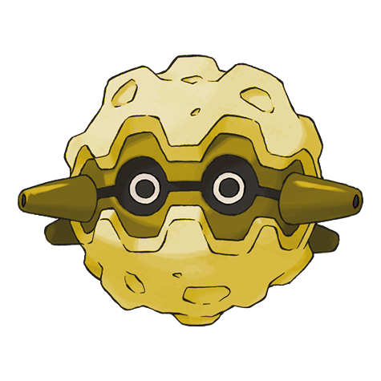
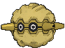
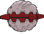
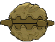

# #205 Forretress (Bagworm Pokémon)

| Official Artwork | Shiny Artwork |
|------------------|---------------|
|  |  |

Forretress conceals itself inside its hardened steel shell. The shell is opened when the Pokémon is catching prey, but it does so at such a quick pace that the shell’s inside cannot be seen.

---

## Media

### Default Sprites

| Front | Shiny | Back | Shiny |
|-------|-------|------|-------|
|  |  |  |  |

### Cries

Latest (Gen VI+):

<audio controls>
<source src='../../assets/cries/forretress/latest.ogg' type='audio/ogg'>
  Your browser does not support the audio element.
</audio>

Legacy:

<audio controls>
<source src='../../assets/cries/forretress/legacy.ogg' type='audio/ogg'>
  Your browser does not support the audio element.
</audio>

---

## Pokédex Data

| National № | Type(s) | Height | Weight | Abilities | Local № |
|------------|---------|--------|--------|-----------|---------|
| #205 | {: width="48"} {: width="48"} | 1.2 m / 3.9 ft | 125.8 kg / 277.3 lbs | 1. Sturdy 2. Overcoat | N/A |

---

## Base Stats
|   | HP | Attack | Defense | Sp. Atk | Sp. Def | Speed |
|---|----|--------|---------|---------|---------|-------|
| **Base** | 75 | 90 | 140 | 60 | 60 | 40 |
| **Min** | 260 | 166 | 256 | 112 | 112 | 76 |
| **Max** | 354 | 306 | 416 | 240 | 240 | 196 |

The ranges shown above are for a level 100 Pokémon. Maximum values are based on a beneficial nature, 252 EVs, 31 IVs; minimum values are based on a hindering nature, 0 EVs, 0 IVs.

---

## Forms & Evolutions

!!! warning "WARNING"

    Information on evolutions may not be 100% accurate; differences between evolution methods across generations are not accounted for.

### Forms

Forretress has no alternate forms.

### Evolution Line

1. [Pineco](pineco.md/)
    1. Level Up: [Forretress](forretress.md/)

---

## Training

| EV Yield | Catch Rate | Base Friendship | Base Exp. | Growth Rate | Held Items |
|----------|------------|-----------------|-----------|-------------|------------|
| 2 Def | 75 | 70 | 163 | Medium | N/A |

---

## Breeding

| Egg Groups | Egg Cycles | Gender | Dimorphic | Color | Shape |
|------------|------------|--------|-----------|-------|-------|
| 1. Bug | 20 | 50.0% Male 50.0% Female | False | Purple | Ball |

---

## Moves

!!! warning "WARNING"

    Specific move information may be incorrect. However, the general movepool should be accurate; this includes changes made in Sacred Gold and Storm Silver.

### Level Up Moves

| Lv. | Move | Type | Cat. | Power | Acc. | PP |
| --- | --- | --- | --- | --- | --- | --- |
| 1 | Heavy Slam | {: width="48"} | {: width="36"} | — | 100 | 10 |
| 1 | Protect | {: width="48"} | {: width="36"} | — | — | 10 |
| 1 | Tackle | {: width="48"} | {: width="36"} | 40 | 100 | 35 |
| 1 | Toxic Spikes | {: width="48"} | {: width="36"} | — | — | 20 |
| 1 | Zap Cannon | {: width="48"} | {: width="36"} | 120 | 50 | 5 |
| 6 | Self Destruct | {: width="48"} | {: width="36"} | 200 | 100 | 5 |
| 9 | Bug Bite | {: width="48"} | {: width="36"} | 60 | 100 | 20 |
| 12 | Take Down | {: width="48"} | {: width="36"} | 90 | 85 | 20 |
| 15 | Rapid Spin | {: width="48"} | {: width="36"} | 50 | 100 | 40 |
| 18 | Bide | {: width="48"} | {: width="36"} | — | — | 10 |
| 21 | Revenge | {: width="48"} | {: width="36"} | 60 | 100 | 10 |
| 24 | Natural Gift | {: width="48"} | {: width="36"} | — | 100 | 15 |
| 27 | Spikes | {: width="48"} | {: width="36"} | — | — | 20 |
| 30 | Payback | {: width="48"} | {: width="36"} | 50 | 100 | 10 |
| 31 | Mirror Shot | {: width="48"} | {: width="36"} | 65 | 85 | 10 |
| 32 | Autotomize | {: width="48"} | {: width="36"} | — | — | 15 |
| 34 | Gyro Ball | {: width="48"} | {: width="36"} | — | 100 | 5 |
| 38 | Drill Run | {: width="48"} | {: width="36"} | 80 | 95 | 10 |
| 42 | Explosion | {: width="48"} | {: width="36"} | 250 | 100 | 5 |
| 46 | Pin Missile | {: width="48"} | {: width="36"} | 25 | 95 | 20 |
| 50 | Iron Defense | {: width="48"} | {: width="36"} | — | — | 15 |
| 54 | Double Edge | {: width="48"} | {: width="36"} | 120 | 100 | 15 |
| 58 | Magnet Rise | {: width="48"} | {: width="36"} | — | — | 10 |
| 62 | Zap Cannon | {: width="48"} | {: width="36"} | 120 | 50 | 5 |
| 66 | Heavy Slam | {: width="48"} | {: width="36"} | — | 100 | 10 |

### TM Moves

| TM | Move | Type | Cat. | Power | Acc. | PP |
| --- | --- | --- | --- | --- | --- | --- |
| HM04 | Strength | {: width="48"} | {: width="36"} | 100 | 100 | 10 |
| HM06 | Rock Smash | {: width="48"} | {: width="36"} | 65 | 100 | 15 |
| TM06 | Toxic | {: width="48"} | {: width="36"} | — | 90 | 10 |
| TM09 | Venoshock | {: width="48"} | {: width="36"} | 65 | 100 | 10 |
| TM10 | Hidden Power | {: width="48"} | {: width="36"} | 60 | 100 | 15 |
| TM100 | Confide | {: width="48"} | {: width="36"} | — | — | 20 |
| TM11 | Sunny Day | {: width="48"} | {: width="36"} | — | — | 5 |
| TM15 | Hyper Beam | {: width="48"} | {: width="36"} | 150 | 90 | 5 |
| TM16 | Light Screen | {: width="48"} | {: width="36"} | — | — | 30 |
| TM17 | Protect | {: width="48"} | {: width="36"} | — | — | 10 |
| TM21 | Frustration | {: width="48"} | {: width="36"} | — | 100 | 20 |
| TM22 | Solar Beam | {: width="48"} | {: width="36"} | 120 | 100 | 10 |
| TM26 | Earthquake | {: width="48"} | {: width="36"} | 100 | 100 | 10 |
| TM27 | Return | {: width="48"} | {: width="36"} | — | 100 | 20 |
| TM28 | Dig | {: width="48"} | {: width="36"} | 80 | 100 | 10 |
| TM32 | Double Team | {: width="48"} | {: width="36"} | — | — | 15 |
| TM33 | Reflect | {: width="48"} | {: width="36"} | — | — | 20 |
| TM37 | Sandstorm | {: width="48"} | {: width="36"} | — | — | 10 |
| TM39 | Rock Tomb | {: width="48"} | {: width="36"} | 60 | 95 | 15 |
| TM42 | Facade | {: width="48"} | {: width="36"} | 70 | 100 | 20 |
| TM44 | Rest | {: width="48"} | {: width="36"} | — | — | 5 |
| TM45 | Attract | {: width="48"} | {: width="36"} | — | 100 | 15 |
| TM48 | Round | {: width="48"} | {: width="36"} | 60 | 100 | 15 |
| TM64 | Explosion | {: width="48"} | {: width="36"} | 250 | 100 | 5 |
| TM66 | Payback | {: width="48"} | {: width="36"} | 50 | 100 | 10 |
| TM68 | Giga Impact | {: width="48"} | {: width="36"} | 150 | 90 | 5 |
| TM69 | Rock Polish | {: width="48"} | {: width="36"} | — | — | 20 |
| TM72 | Volt Switch | {: width="48"} | {: width="36"} | 70 | 100 | 20 |
| TM74 | Gyro Ball | {: width="48"} | {: width="36"} | — | 100 | 5 |
| TM76 | Struggle Bug | {: width="48"} | {: width="36"} | 50 | 100 | 20 |
| TM78 | Bulldoze | {: width="48"} | {: width="36"} | 60 | 100 | 20 |
| TM80 | Rock Slide | {: width="48"} | {: width="36"} | 75 | 90 | 10 |
| TM87 | Swagger | {: width="48"} | {: width="36"} | — | 85 | 15 |
| TM88 | Sleep Talk | {: width="48"} | {: width="36"} | — | — | 10 |
| TM90 | Substitute | {: width="48"} | {: width="36"} | — | — | 10 |
| TM91 | Flash Cannon | {: width="48"} | {: width="36"} | 80 | 100 | 10 |
| TM94 | Secret Power | {: width="48"} | {: width="36"} | 70 | 100 | 20 |

### Egg Moves

Forretress cannot learn any moves by breeding.
### Tutor Moves

| Move | Type | Cat. | Power | Acc. | PP |
| --- | --- | --- | --- | --- | --- |
| Block | {: width="48"} | {: width="36"} | — | — | 5 |
| Bug Bite | {: width="48"} | {: width="36"} | 60 | 100 | 20 |
| Drill Run | {: width="48"} | {: width="36"} | 80 | 95 | 10 |
| Giga Drain | {: width="48"} | {: width="36"} | 75 | 100 | 10 |
| Gravity | {: width="48"} | {: width="36"} | — | — | 5 |
| Iron Defense | {: width="48"} | {: width="36"} | — | — | 15 |
| Magnet Rise | {: width="48"} | {: width="36"} | — | — | 10 |
| Pain Split | {: width="48"} | {: width="36"} | — | — | 20 |
| Signal Beam | {: width="48"} | {: width="36"} | 75 | 100 | 15 |
| Snore | {: width="48"} | {: width="36"} | 50 | 100 | 15 |
| Stealth Rock | {: width="48"} | {: width="36"} | — | — | 20 |

