# #676 Furfrou (Poodle Pokémon)

| Official Artwork | Shiny Artwork |
|------------------|---------------|
|  | 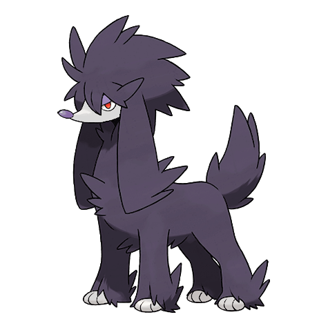 |

**Rising Ruby:** Trimming its fluffy fur not only makes it more elegant but also increases the swiftness of its movements.

**Sinking Sapphire:** Historically, in the Kalos region, these Pokémon were the designated guardians of the king.

---

## Media

### Default Sprites

| Front | Shiny | Back | Shiny |
|-------|-------|------|-------|
|  | 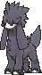 | 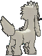 | 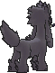 |

### Furfrou Heart Sprites

| Front | Shiny | Back | Shiny |
|-------|-------|------|-------|
| 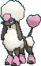 | 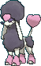 | 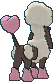 | 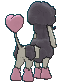 |

### Furfrou Star Sprites

| Front | Shiny | Back | Shiny |
|-------|-------|------|-------|
| 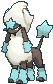 | 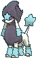 | 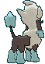 | 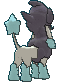 |

### Furfrou Diamond Sprites

| Front | Shiny | Back | Shiny |
|-------|-------|------|-------|
| 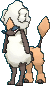 | 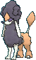 | 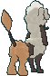 | 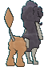 |

### Furfrou Debutante Sprites

| Front | Shiny | Back | Shiny |
|-------|-------|------|-------|
| 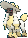 | 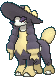 | 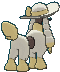 | 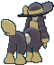 |

### Furfrou Matron Sprites

| Front | Shiny | Back | Shiny |
|-------|-------|------|-------|
| 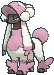 | 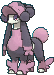 | 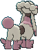 | 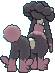 |

### Furfrou Dandy Sprites

| Front | Shiny | Back | Shiny |
|-------|-------|------|-------|
| 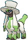 | 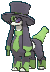 | 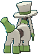 | 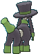 |

### Furfrou Kabuki Sprites

| Front | Shiny | Back | Shiny |
|-------|-------|------|-------|
| 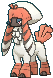 | 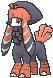 | 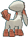 | 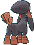 |

### Furfrou Pharaoh Sprites

| Front | Shiny | Back | Shiny |
|-------|-------|------|-------|
| 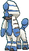 | 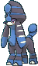 | 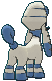 | 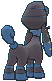 |

### Cries

Latest (Gen VI+):

<audio controls>
<source src='../../assets/cries/furfrou/latest.ogg' type='audio/ogg'>
  Your browser does not support the audio element.
</audio>

Legacy:

<audio controls>
<source src='../../assets/cries/furfrou/legacy.ogg' type='audio/ogg'>
  Your browser does not support the audio element.
</audio>

---

## Pokédex Data

| National № | Type(s) | Height | Weight | Abilities | Local № |
|------------|---------|--------|--------|-----------|---------|
| #676 | {: width="48"} | 1.2 m / 3.9 ft | 28.0 kg / 61.7 lbs | 1. Fur Coat | N/A |

---

## Base Stats
|   | HP | Attack | Defense | Sp. Atk | Sp. Def | Speed |
|---|----|--------|---------|---------|---------|-------|
| **Base** | 75 | 80 | 60 | 65 | 90 | 102 |
| **Min** | 260 | 148 | 112 | 121 | 166 | 188 |
| **Max** | 354 | 284 | 240 | 251 | 306 | 333 |

The ranges shown above are for a level 100 Pokémon. Maximum values are based on a beneficial nature, 252 EVs, 31 IVs; minimum values are based on a hindering nature, 0 EVs, 0 IVs.

---

## Forms & Evolutions

!!! warning "WARNING"

    Information on evolutions may not be 100% accurate; differences between evolution methods across generations are not accounted for.

### Forms

Furfrou has no alternate forms.

### Evolution Line

1. [Furfrou](furfrou.md/)

---

## Training

| EV Yield | Catch Rate | Base Friendship | Base Exp. | Growth Rate | Held Items |
|----------|------------|-----------------|-----------|-------------|------------|
| 1 Spd | 160 | 70 | 165 | Medium | N/A |

---

## Breeding

| Egg Groups | Egg Cycles | Gender | Dimorphic | Color | Shape |
|------------|------------|--------|-----------|-------|-------|
| 1. Ground | 20 | 50.0% Male 50.0% Female | False | White | Quadruped |

---

## Moves

!!! warning "WARNING"

    Specific move information may be incorrect. However, the general movepool should be accurate; this includes changes made in Sacred Gold and Storm Silver.

### Level Up Moves

| Lv. | Move | Type | Cat. | Power | Acc. | PP |
| --- | --- | --- | --- | --- | --- | --- |
| 1 | Frustration | {: width="48"} | {: width="36"} | — | 100 | 20 |
| 1 | Growl | {: width="48"} | {: width="36"} | — | 100 | 40 |
| 1 | Return | {: width="48"} | {: width="36"} | — | 100 | 20 |
| 1 | Tackle | {: width="48"} | {: width="36"} | 40 | 100 | 35 |
| 4 | Sand Attack | {: width="48"} | {: width="36"} | — | 100 | 15 |
| 8 | Baby Doll Eyes | {: width="48"} | {: width="36"} | — | 100 | 30 |
| 12 | Headbutt | {: width="48"} | {: width="36"} | 70 | 100 | 15 |
| 16 | Tail Whip | {: width="48"} | {: width="36"} | — | 100 | 30 |
| 20 | Bite | {: width="48"} | {: width="36"} | 60 | 100 | 25 |
| 24 | Retaliate | {: width="48"} | {: width="36"} | 70 | 100 | 5 |
| 28 | Odor Sleuth | {: width="48"} | {: width="36"} | — | — | 40 |
| 32 | Take Down | {: width="48"} | {: width="36"} | 90 | 85 | 20 |
| 36 | Zen Headbutt | {: width="48"} | {: width="36"} | 80 | 90 | 15 |
| 40 | Sucker Punch | {: width="48"} | {: width="36"} | 70 | 100 | 5 |
| 44 | Iron Tail | {: width="48"} | {: width="36"} | 100 | 75 | 15 |
| 48 | Charm | {: width="48"} | {: width="36"} | — | 100 | 20 |
| 52 | Cotton Guard | {: width="48"} | {: width="36"} | — | — | 10 |

### TM Moves

| TM | Move | Type | Cat. | Power | Acc. | PP |
| --- | --- | --- | --- | --- | --- | --- |
| HM03 | Surf | {: width="48"} | {: width="36"} | 90 | 100 | 15 |
| HM06 | Rock Smash | {: width="48"} | {: width="36"} | 65 | 100 | 15 |
| TM05 | Roar | {: width="48"} | {: width="36"} | — | — | 20 |
| TM06 | Toxic | {: width="48"} | {: width="36"} | — | 90 | 10 |
| TM10 | Hidden Power | {: width="48"} | {: width="36"} | 60 | 100 | 15 |
| TM100 | Confide | {: width="48"} | {: width="36"} | — | — | 20 |
| TM11 | Sunny Day | {: width="48"} | {: width="36"} | — | — | 5 |
| TM17 | Protect | {: width="48"} | {: width="36"} | — | — | 10 |
| TM18 | Rain Dance | {: width="48"} | {: width="36"} | — | — | 5 |
| TM21 | Frustration | {: width="48"} | {: width="36"} | — | 100 | 20 |
| TM27 | Return | {: width="48"} | {: width="36"} | — | 100 | 20 |
| TM28 | Dig | {: width="48"} | {: width="36"} | 80 | 100 | 10 |
| TM32 | Double Team | {: width="48"} | {: width="36"} | — | — | 15 |
| TM42 | Facade | {: width="48"} | {: width="36"} | 70 | 100 | 20 |
| TM44 | Rest | {: width="48"} | {: width="36"} | — | — | 5 |
| TM45 | Attract | {: width="48"} | {: width="36"} | — | 100 | 15 |
| TM48 | Round | {: width="48"} | {: width="36"} | 60 | 100 | 15 |
| TM49 | Echoed Voice | {: width="48"} | {: width="36"} | 40 | 100 | 15 |
| TM57 | Charge Beam | {: width="48"} | {: width="36"} | 50 | 90 | 10 |
| TM67 | Retaliate | {: width="48"} | {: width="36"} | 70 | 100 | 5 |
| TM68 | Giga Impact | {: width="48"} | {: width="36"} | 150 | 90 | 5 |
| TM70 | Flash | {: width="48"} | {: width="36"} | — | 100 | 20 |
| TM73 | Thunder Wave | {: width="48"} | {: width="36"} | — | 90 | 20 |
| TM86 | Grass Knot | {: width="48"} | {: width="36"} | — | 100 | 20 |
| TM87 | Swagger | {: width="48"} | {: width="36"} | — | 85 | 15 |
| TM88 | Sleep Talk | {: width="48"} | {: width="36"} | — | — | 10 |
| TM89 | U Turn | {: width="48"} | {: width="36"} | 70 | 100 | 20 |
| TM90 | Substitute | {: width="48"} | {: width="36"} | — | — | 10 |
| TM93 | Wild Charge | {: width="48"} | {: width="36"} | 90 | 100 | 15 |
| TM94 | Secret Power | {: width="48"} | {: width="36"} | 70 | 100 | 20 |
| TM95 | Snarl | {: width="48"} | {: width="36"} | 55 | 95 | 15 |
| TM97 | Dark Pulse | {: width="48"} | {: width="36"} | 80 | 100 | 15 |

### Egg Moves

| Move | Type | Cat. | Power | Acc. | PP |
| --- | --- | --- | --- | --- | --- |
| Captivate | {: width="48"} | {: width="36"} | — | 100 | 20 |
| Mimic | {: width="48"} | {: width="36"} | — | — | 10 |
| Refresh | {: width="48"} | {: width="36"} | — | — | 20 |
| Role Play | {: width="48"} | {: width="36"} | — | — | 10 |
| Work Up | {: width="48"} | {: width="36"} | — | — | 30 |

### Tutor Moves

| Move | Type | Cat. | Power | Acc. | PP |
| --- | --- | --- | --- | --- | --- |
| Endeavor | {: width="48"} | {: width="36"} | — | 100 | 5 |
| Helping Hand | {: width="48"} | {: width="36"} | — | — | 20 |
| Hyper Voice | {: width="48"} | {: width="36"} | 90 | 100 | 10 |
| Iron Tail | {: width="48"} | {: width="36"} | 100 | 75 | 15 |
| Last Resort | {: width="48"} | {: width="36"} | 140 | 100 | 5 |
| Role Play | {: width="48"} | {: width="36"} | — | — | 10 |
| Snore | {: width="48"} | {: width="36"} | 50 | 100 | 15 |
| Uproar | {: width="48"} | {: width="36"} | 90 | 100 | 10 |
| Zen Headbutt | {: width="48"} | {: width="36"} | 80 | 90 | 15 |

