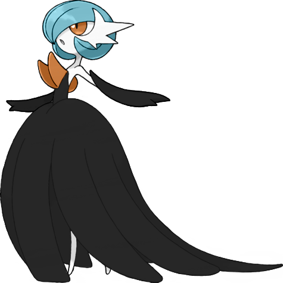
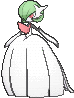
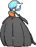
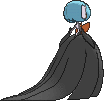

# Gardevoir Mega (Embrace Pokémon)

| Official Artwork | Shiny Artwork |
|------------------|---------------|
|  |  |

**Rising Ruby:** Gardevoir has the ability to read the future. If it senses impending danger to its Trainer, this Pokémon is said to unleash its psychokinetic energy at full power.

**Sinking Sapphire:** Gardevoir has the psychokinetic power to distort the dimensions and create a small black hole. This Pokémon will try to protect its Trainer even at the risk of its own life.

---

## Media

### Default Sprites

| Front | Shiny | Back | Shiny |
|-------|-------|------|-------|
|  |  |  |  |

### Cries

Latest (Gen VI+):

<audio controls>
<source src='../../assets/cries/gardevoir-mega/latest.ogg' type='audio/ogg'>
  Your browser does not support the audio element.
</audio>

Legacy:

<audio controls>
<source src='../../assets/cries/gardevoir-mega/legacy.ogg' type='audio/ogg'>
  Your browser does not support the audio element.
</audio>

---

## Pokédex Data

| National № | Type(s) | Height | Weight | Abilities | Local № |
|------------|---------|--------|--------|-----------|---------|
| #10051 | {: width="48"} {: width="48"} | 1.6 m / 5.2 ft | 48.4 kg / 106.7 lbs | 1. Pixilate | N/A |

---

## Base Stats
|   | HP | Attack | Defense | Sp. Atk | Sp. Def | Speed |
|---|----|--------|---------|---------|---------|-------|
| **Base** | 68 | 85 | 65 | 165 | 135 | 100 |
| **Min** | 246 | 157 | 121 | 301 | 247 | 184 |
| **Max** | 340 | 295 | 251 | 471 | 405 | 328 |

The ranges shown above are for a level 100 Pokémon. Maximum values are based on a beneficial nature, 252 EVs, 31 IVs; minimum values are based on a hindering nature, 0 EVs, 0 IVs.

---

## Forms & Evolutions

!!! warning "WARNING"

    Information on evolutions may not be 100% accurate; differences between evolution methods across generations are not accounted for.

### Forms

1. [Gardevoir](gardevoir.md/)

2. [Gardevoir Mega](gardevoir-mega.md/)

### Evolution Line

1. [Ralts](ralts.md/)
    1. Level Up: [Kirlia](kirlia.md/)
        1. Level Up: [Gardevoir](gardevoir.md/)

        2. Use Item: [Gallade](gallade.md/)

---

## Training

| EV Yield | Catch Rate | Base Friendship | Base Exp. | Growth Rate | Held Items |
|----------|------------|-----------------|-----------|-------------|------------|
| 3 Sp.-Atk | 45 | 35 | 278 | Slow | N/A |

---

## Breeding

| Egg Groups | Egg Cycles | Gender | Dimorphic | Color | Shape |
|------------|------------|--------|-----------|-------|-------|
| 1. Humanshape 2. Indeterminate | 20 | 50.0% Male 50.0% Female | False | White | Humanoid |

---

## Moves

!!! warning "WARNING"

    Specific move information may be incorrect. However, the general movepool should be accurate; this includes changes made in Sacred Gold and Storm Silver.

### Level Up Moves

| Lv. | Move | Type | Cat. | Power | Acc. | PP |
| --- | --- | --- | --- | --- | --- | --- |
| 1 | Confusion | {: width="48"} | {: width="36"} | 50 | 100 | 25 |
| 1 | Double Team | {: width="48"} | {: width="36"} | — | — | 15 |
| 1 | Growl | {: width="48"} | {: width="36"} | — | 100 | 40 |
| 1 | Healing Wish | {: width="48"} | {: width="36"} | — | — | 10 |
| 1 | Misty Terrain | {: width="48"} | {: width="36"} | — | — | 10 |
| 1 | Moonblast | {: width="48"} | {: width="36"} | 95 | 100 | 15 |
| 1 | Stored Power | {: width="48"} | {: width="36"} | 20 | 100 | 10 |
| 1 | Teleport | {: width="48"} | {: width="36"} | — | — | 20 |
| 4 | Confusion | {: width="48"} | {: width="36"} | 50 | 100 | 25 |
| 6 | Double Team | {: width="48"} | {: width="36"} | — | — | 15 |
| 9 | Teleport | {: width="48"} | {: width="36"} | — | — | 20 |
| 11 | Disarming Voice | {: width="48"} | {: width="36"} | 60 | — | 20 |
| 14 | Wish | {: width="48"} | {: width="36"} | — | — | 10 |
| 17 | Magical Leaf | {: width="48"} | {: width="36"} | 60 | — | 20 |
| 19 | Heal Pulse | {: width="48"} | {: width="36"} | — | — | 10 |
| 23 | Draining Kiss | {: width="48"} | {: width="36"} | 75 | 100 | 10 |
| 26 | Calm Mind | {: width="48"} | {: width="36"} | — | — | 20 |
| 31 | Psychic | {: width="48"} | {: width="36"} | 90 | 100 | 10 |
| 35 | Imprison | {: width="48"} | {: width="36"} | — | — | 10 |
| 40 | Future Sight | {: width="48"} | {: width="36"} | 120 | 100 | 10 |
| 44 | Captivate | {: width="48"} | {: width="36"} | — | 100 | 20 |
| 49 | Hypnosis | {: width="48"} | {: width="36"} | — | 60 | 20 |
| 53 | Dream Eater | {: width="48"} | {: width="36"} | 100 | 100 | 15 |
| 58 | Stored Power | {: width="48"} | {: width="36"} | 20 | 100 | 10 |
| 62 | Moonblast | {: width="48"} | {: width="36"} | 95 | 100 | 15 |

### TM Moves

| TM | Move | Type | Cat. | Power | Acc. | PP |
| --- | --- | --- | --- | --- | --- | --- |
| TM03 | Psyshock | {: width="48"} | {: width="36"} | 80 | 100 | 10 |
| TM04 | Calm Mind | {: width="48"} | {: width="36"} | — | — | 20 |
| TM06 | Toxic | {: width="48"} | {: width="36"} | — | 90 | 10 |
| TM10 | Hidden Power | {: width="48"} | {: width="36"} | 60 | 100 | 15 |
| TM100 | Confide | {: width="48"} | {: width="36"} | — | — | 20 |
| TM11 | Sunny Day | {: width="48"} | {: width="36"} | — | — | 5 |
| TM12 | Taunt | {: width="48"} | {: width="36"} | — | 100 | 20 |
| TM15 | Hyper Beam | {: width="48"} | {: width="36"} | 150 | 90 | 5 |
| TM16 | Light Screen | {: width="48"} | {: width="36"} | — | — | 30 |
| TM17 | Protect | {: width="48"} | {: width="36"} | — | — | 10 |
| TM18 | Rain Dance | {: width="48"} | {: width="36"} | — | — | 5 |
| TM20 | Safeguard | {: width="48"} | {: width="36"} | — | — | 25 |
| TM21 | Frustration | {: width="48"} | {: width="36"} | — | 100 | 20 |
| TM24 | Thunderbolt | {: width="48"} | {: width="36"} | 90 | 100 | 15 |
| TM27 | Return | {: width="48"} | {: width="36"} | — | 100 | 20 |
| TM29 | Psychic | {: width="48"} | {: width="36"} | 90 | 100 | 10 |
| TM30 | Shadow Ball | {: width="48"} | {: width="36"} | 80 | 100 | 15 |
| TM32 | Double Team | {: width="48"} | {: width="36"} | — | — | 15 |
| TM33 | Reflect | {: width="48"} | {: width="36"} | — | — | 20 |
| TM41 | Torment | {: width="48"} | {: width="36"} | — | 100 | 15 |
| TM42 | Facade | {: width="48"} | {: width="36"} | 70 | 100 | 20 |
| TM44 | Rest | {: width="48"} | {: width="36"} | — | — | 5 |
| TM45 | Attract | {: width="48"} | {: width="36"} | — | 100 | 15 |
| TM46 | Thief | {: width="48"} | {: width="36"} | 60 | 100 | 25 |
| TM48 | Round | {: width="48"} | {: width="36"} | 60 | 100 | 15 |
| TM49 | Echoed Voice | {: width="48"} | {: width="36"} | 40 | 100 | 15 |
| TM52 | Focus Blast | {: width="48"} | {: width="36"} | 120 | 70 | 5 |
| TM53 | Energy Ball | {: width="48"} | {: width="36"} | 90 | 100 | 10 |
| TM56 | Fling | {: width="48"} | {: width="36"} | — | 100 | 10 |
| TM57 | Charge Beam | {: width="48"} | {: width="36"} | 50 | 90 | 10 |
| TM61 | Will O Wisp | {: width="48"} | {: width="36"} | — | 85 | 15 |
| TM68 | Giga Impact | {: width="48"} | {: width="36"} | 150 | 90 | 5 |
| TM70 | Flash | {: width="48"} | {: width="36"} | — | 100 | 20 |
| TM73 | Thunder Wave | {: width="48"} | {: width="36"} | — | 90 | 20 |
| TM77 | Psych Up | {: width="48"} | {: width="36"} | — | — | 10 |
| TM85 | Dream Eater | {: width="48"} | {: width="36"} | 100 | 100 | 15 |
| TM86 | Grass Knot | {: width="48"} | {: width="36"} | — | 100 | 20 |
| TM87 | Swagger | {: width="48"} | {: width="36"} | — | 85 | 15 |
| TM88 | Sleep Talk | {: width="48"} | {: width="36"} | — | — | 10 |
| TM90 | Substitute | {: width="48"} | {: width="36"} | — | — | 10 |
| TM92 | Trick Room | {: width="48"} | {: width="36"} | — | — | 5 |
| TM94 | Secret Power | {: width="48"} | {: width="36"} | 70 | 100 | 20 |
| TM99 | Dazzling Gleam | {: width="48"} | {: width="36"} | 80 | 100 | 10 |

### Egg Moves

Gardevoir Mega cannot learn any moves by breeding.
### Tutor Moves

| Move | Type | Cat. | Power | Acc. | PP |
| --- | --- | --- | --- | --- | --- |
| Fire Punch | {: width="48"} | {: width="36"} | 75 | 100 | 15 |
| Heal Bell | {: width="48"} | {: width="36"} | — | — | 5 |
| Helping Hand | {: width="48"} | {: width="36"} | — | — | 20 |
| Hyper Voice | {: width="48"} | {: width="36"} | 90 | 100 | 10 |
| Ice Punch | {: width="48"} | {: width="36"} | 75 | 100 | 15 |
| Icy Wind | {: width="48"} | {: width="36"} | 55 | 95 | 15 |
| Magic Coat | {: width="48"} | {: width="36"} | — | — | 15 |
| Magic Room | {: width="48"} | {: width="36"} | — | — | 10 |
| Pain Split | {: width="48"} | {: width="36"} | — | — | 20 |
| Recycle | {: width="48"} | {: width="36"} | — | — | 10 |
| Shock Wave | {: width="48"} | {: width="36"} | 60 | — | 20 |
| Signal Beam | {: width="48"} | {: width="36"} | 75 | 100 | 15 |
| Skill Swap | {: width="48"} | {: width="36"} | — | — | 10 |
| Snatch | {: width="48"} | {: width="36"} | — | — | 10 |
| Snore | {: width="48"} | {: width="36"} | 50 | 100 | 15 |
| Thunder Punch | {: width="48"} | {: width="36"} | 75 | 100 | 15 |
| Trick | {: width="48"} | {: width="36"} | — | 100 | 10 |
| Wonder Room | {: width="48"} | {: width="36"} | — | — | 10 |
| Zen Headbutt | {: width="48"} | {: width="36"} | 80 | 90 | 15 |

