# #649 Genesect (Paleozoic Pokémon)

| Official Artwork | Shiny Artwork |
|------------------|---------------|
|  | 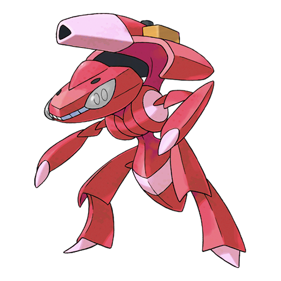 |

**Rising Ruby:** This ancient bug Pokémon was altered by Team Plasma. They upgraded the cannon on its back.

**Sinking Sapphire:** This Pokémon existed 300 million years ago. Team Plasma altered it and attached a cannon to its back.

---

## Media

### Default Sprites

| Front | Shiny | Back | Shiny |
|-------|-------|------|-------|
|  | 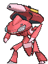 | 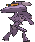 | 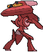 |

### Genesect Douse Sprites

| Front | Shiny | Back | Shiny |
|-------|-------|------|-------|
| 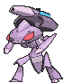 | 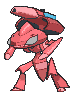 | 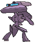 | 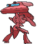 |

### Genesect Shock Sprites

| Front | Shiny | Back | Shiny |
|-------|-------|------|-------|
| 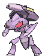 |  | 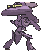 |  |

### Genesect Burn Sprites

| Front | Shiny | Back | Shiny |
|-------|-------|------|-------|
| 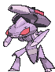 |  | 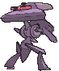 | 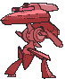 |

### Genesect Chill Sprites

| Front | Shiny | Back | Shiny |
|-------|-------|------|-------|
| 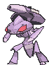 | 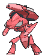 | 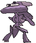 | 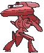 |

### Cries

Latest (Gen VI+):

<audio controls>
<source src='../../assets/cries/genesect/latest.ogg' type='audio/ogg'>
  Your browser does not support the audio element.
</audio>

Legacy:

<audio controls>
<source src='../../assets/cries/genesect/legacy.ogg' type='audio/ogg'>
  Your browser does not support the audio element.
</audio>

---

## Pokédex Data

| National № | Type(s) | Height | Weight | Abilities | Local № |
|------------|---------|--------|--------|-----------|---------|
| #649 | {: width="48"} {: width="48"} | 1.5 m / 4.9 ft | 82.5 kg / 181.9 lbs | 1. Download | N/A |

---

## Base Stats
|   | HP | Attack | Defense | Sp. Atk | Sp. Def | Speed |
|---|----|--------|---------|---------|---------|-------|
| **Base** | 71 | 120 | 95 | 120 | 95 | 99 |
| **Min** | 252 | 220 | 175 | 220 | 175 | 182 |
| **Max** | 346 | 372 | 317 | 372 | 317 | 326 |

The ranges shown above are for a level 100 Pokémon. Maximum values are based on a beneficial nature, 252 EVs, 31 IVs; minimum values are based on a hindering nature, 0 EVs, 0 IVs.

---

## Forms & Evolutions

!!! warning "WARNING"

    Information on evolutions may not be 100% accurate; differences between evolution methods across generations are not accounted for.

### Forms

Genesect has no alternate forms.

### Evolution Line

1. [Genesect](genesect.md/)

---

## Training

| EV Yield | Catch Rate | Base Friendship | Base Exp. | Growth Rate | Held Items |
|----------|------------|-----------------|-----------|-------------|------------|
| 1 Atk 1 Sp.-Atk 1 Spd | 3 | 0 | 300 | Slow | N/A |

---

## Breeding

| Egg Groups | Egg Cycles | Gender | Dimorphic | Color | Shape |
|------------|------------|--------|-----------|-------|-------|
| 1. No-Eggs | 120 | Genderless | False | Purple | Humanoid |

---

## Moves

!!! warning "WARNING"

    Specific move information may be incorrect. However, the general movepool should be accurate; this includes changes made in Sacred Gold and Storm Silver.

### Level Up Moves

| Lv. | Move | Type | Cat. | Power | Acc. | PP |
| --- | --- | --- | --- | --- | --- | --- |
| 1 | Fell Stinger | {: width="48"} | {: width="36"} | 50 | 100 | 25 |
| 1 | Magnet Rise | {: width="48"} | {: width="36"} | — | — | 10 |
| 1 | Metal Claw | {: width="48"} | {: width="36"} | 50 | 95 | 35 |
| 1 | Quick Attack | {: width="48"} | {: width="36"} | 40 | 100 | 30 |
| 1 | Screech | {: width="48"} | {: width="36"} | — | 85 | 40 |
| 1 | Techno Blast | {: width="48"} | {: width="36"} | 120 | 100 | 5 |
| 5 | Fury Cutter | {: width="48"} | {: width="36"} | 40 | 95 | 20 |
| 10 | Lock On | {: width="48"} | {: width="36"} | — | — | 5 |
| 15 | Flame Charge | {: width="48"} | {: width="36"} | 50 | 100 | 20 |
| 20 | Magnet Bomb | {: width="48"} | {: width="36"} | 60 | — | 20 |
| 25 | Slash | {: width="48"} | {: width="36"} | 70 | 100 | 20 |
| 30 | Metal Sound | {: width="48"} | {: width="36"} | — | 85 | 40 |
| 35 | Signal Beam | {: width="48"} | {: width="36"} | 75 | 100 | 15 |
| 40 | Tri Attack | {: width="48"} | {: width="36"} | 80 | 100 | 10 |
| 45 | X Scissor | {: width="48"} | {: width="36"} | 80 | 100 | 15 |
| 50 | Bug Buzz | {: width="48"} | {: width="36"} | 90 | 100 | 10 |
| 55 | Simple Beam | {: width="48"} | {: width="36"} | — | 100 | 15 |
| 60 | Zap Cannon | {: width="48"} | {: width="36"} | 120 | 50 | 5 |
| 65 | Hyper Beam | {: width="48"} | {: width="36"} | 150 | 90 | 5 |
| 70 | Self Destruct | {: width="48"} | {: width="36"} | 200 | 100 | 5 |

### TM Moves

| TM | Move | Type | Cat. | Power | Acc. | PP |
| --- | --- | --- | --- | --- | --- | --- |
| HM02 | Fly | {: width="48"} | {: width="36"} | 100 | 100 | 10 |
| TM01 | Hone Claws | {: width="48"} | {: width="36"} | — | — | 15 |
| TM06 | Toxic | {: width="48"} | {: width="36"} | — | 90 | 10 |
| TM10 | Hidden Power | {: width="48"} | {: width="36"} | 60 | 100 | 15 |
| TM100 | Confide | {: width="48"} | {: width="36"} | — | — | 20 |
| TM13 | Ice Beam | {: width="48"} | {: width="36"} | 90 | 100 | 10 |
| TM14 | Blizzard | {: width="48"} | {: width="36"} | 110 | 70 | 5 |
| TM15 | Hyper Beam | {: width="48"} | {: width="36"} | 150 | 90 | 5 |
| TM16 | Light Screen | {: width="48"} | {: width="36"} | — | — | 30 |
| TM17 | Protect | {: width="48"} | {: width="36"} | — | — | 10 |
| TM21 | Frustration | {: width="48"} | {: width="36"} | — | 100 | 20 |
| TM22 | Solar Beam | {: width="48"} | {: width="36"} | 120 | 100 | 10 |
| TM24 | Thunderbolt | {: width="48"} | {: width="36"} | 90 | 100 | 15 |
| TM25 | Thunder | {: width="48"} | {: width="36"} | 110 | 70 | 10 |
| TM27 | Return | {: width="48"} | {: width="36"} | — | 100 | 20 |
| TM29 | Psychic | {: width="48"} | {: width="36"} | 90 | 100 | 10 |
| TM32 | Double Team | {: width="48"} | {: width="36"} | — | — | 15 |
| TM33 | Reflect | {: width="48"} | {: width="36"} | — | — | 20 |
| TM35 | Flamethrower | {: width="48"} | {: width="36"} | 90 | 100 | 15 |
| TM40 | Aerial Ace | {: width="48"} | {: width="36"} | 60 | — | 20 |
| TM42 | Facade | {: width="48"} | {: width="36"} | 70 | 100 | 20 |
| TM43 | Flame Charge | {: width="48"} | {: width="36"} | 50 | 100 | 20 |
| TM44 | Rest | {: width="48"} | {: width="36"} | — | — | 5 |
| TM48 | Round | {: width="48"} | {: width="36"} | 60 | 100 | 15 |
| TM53 | Energy Ball | {: width="48"} | {: width="36"} | 90 | 100 | 10 |
| TM57 | Charge Beam | {: width="48"} | {: width="36"} | 50 | 90 | 10 |
| TM64 | Explosion | {: width="48"} | {: width="36"} | 250 | 100 | 5 |
| TM65 | Shadow Claw | {: width="48"} | {: width="36"} | 70 | 100 | 15 |
| TM68 | Giga Impact | {: width="48"} | {: width="36"} | 150 | 90 | 5 |
| TM69 | Rock Polish | {: width="48"} | {: width="36"} | — | — | 20 |
| TM70 | Flash | {: width="48"} | {: width="36"} | — | 100 | 20 |
| TM73 | Thunder Wave | {: width="48"} | {: width="36"} | — | 90 | 20 |
| TM76 | Struggle Bug | {: width="48"} | {: width="36"} | 50 | 100 | 20 |
| TM81 | X Scissor | {: width="48"} | {: width="36"} | 80 | 100 | 15 |
| TM83 | Infestation | {: width="48"} | {: width="36"} | 20 | 100 | 20 |
| TM87 | Swagger | {: width="48"} | {: width="36"} | — | 85 | 15 |
| TM88 | Sleep Talk | {: width="48"} | {: width="36"} | — | — | 10 |
| TM89 | U Turn | {: width="48"} | {: width="36"} | 70 | 100 | 20 |
| TM90 | Substitute | {: width="48"} | {: width="36"} | — | — | 10 |
| TM91 | Flash Cannon | {: width="48"} | {: width="36"} | 80 | 100 | 10 |
| TM94 | Secret Power | {: width="48"} | {: width="36"} | 70 | 100 | 20 |
| TM97 | Dark Pulse | {: width="48"} | {: width="36"} | 80 | 100 | 15 |

### Egg Moves

Genesect cannot learn any moves by breeding.
### Tutor Moves

| Move | Type | Cat. | Power | Acc. | PP |
| --- | --- | --- | --- | --- | --- |
| Bug Bite | {: width="48"} | {: width="36"} | 60 | 100 | 20 |
| Electroweb | {: width="48"} | {: width="36"} | 55 | 95 | 15 |
| Giga Drain | {: width="48"} | {: width="36"} | 75 | 100 | 10 |
| Gravity | {: width="48"} | {: width="36"} | — | — | 5 |
| Gunk Shot | {: width="48"} | {: width="36"} | 120 | 80 | 5 |
| Iron Defense | {: width="48"} | {: width="36"} | — | — | 15 |
| Iron Head | {: width="48"} | {: width="36"} | 80 | 100 | 15 |
| Last Resort | {: width="48"} | {: width="36"} | 140 | 100 | 5 |
| Magic Coat | {: width="48"} | {: width="36"} | — | — | 15 |
| Magnet Rise | {: width="48"} | {: width="36"} | — | — | 10 |
| Recycle | {: width="48"} | {: width="36"} | — | — | 10 |
| Shock Wave | {: width="48"} | {: width="36"} | 60 | — | 20 |
| Signal Beam | {: width="48"} | {: width="36"} | 75 | 100 | 15 |
| Snore | {: width="48"} | {: width="36"} | 50 | 100 | 15 |
| Zen Headbutt | {: width="48"} | {: width="36"} | 80 | 90 | 15 |

