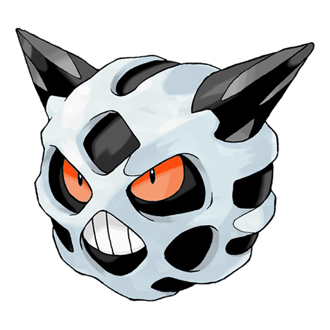

# #362 Glalie (Face Pokémon)

| Official Artwork | Shiny Artwork |
|------------------|---------------|
|  |  |

**Rising Ruby:** Glalie has a body made of rock, which it hardens with an armor of ice. This Pokémon has the ability to freeze moisture in the atmosphere into any shape it desires.

**Sinking Sapphire:** Glalie has the ability to freely control ice. For example, it can instantly freeze its prey solid. After immobilizing its prey in ice, this Pokémon enjoys eating it in leisurely fashion.

---

## Media

### Default Sprites

| Front | Shiny | Back | Shiny |
|-------|-------|------|-------|
|  |  |  |  |

### Cries

Latest (Gen VI+):

<audio controls>
<source src='../../assets/cries/glalie/latest.ogg' type='audio/ogg'>
  Your browser does not support the audio element.
</audio>

Legacy:

<audio controls>
<source src='../../assets/cries/glalie/legacy.ogg' type='audio/ogg'>
  Your browser does not support the audio element.
</audio>

---

## Pokédex Data

| National № | Type(s) | Height | Weight | Abilities | Local № |
|------------|---------|--------|--------|-----------|---------|
| #362 | {: width="48"} | 1.5 m / 4.9 ft | 256.5 kg / 565.5 lbs | 1. Inner Focus 2. Ice Body | N/A |

---

## Base Stats
|   | HP | Attack | Defense | Sp. Atk | Sp. Def | Speed |
|---|----|--------|---------|---------|---------|-------|
| **Base** | 80 | 80 | 80 | 80 | 80 | 80 |
| **Min** | 270 | 148 | 148 | 148 | 148 | 148 |
| **Max** | 364 | 284 | 284 | 284 | 284 | 284 |

The ranges shown above are for a level 100 Pokémon. Maximum values are based on a beneficial nature, 252 EVs, 31 IVs; minimum values are based on a hindering nature, 0 EVs, 0 IVs.

---

## Forms & Evolutions

!!! warning "WARNING"

    Information on evolutions may not be 100% accurate; differences between evolution methods across generations are not accounted for.

### Forms

1. [Glalie](glalie.md/)

2. [Glalie Mega](glalie-mega.md/)

### Evolution Line

1. [Snorunt](snorunt.md/)
    1. Level Up: [Glalie](glalie.md/)

    2. Use Item: [Froslass](froslass.md/)

---

## Training

| EV Yield | Catch Rate | Base Friendship | Base Exp. | Growth Rate | Held Items |
|----------|------------|-----------------|-----------|-------------|------------|
| 2 HP | 75 | 50 | 168 | Mediu |

---

## Breeding

| Egg Groups | Egg Cycles | Gender | Dimorphic | Color | Shape |
|------------|------------|--------|-----------|-------|-------|
| 1. Fairy 2. Mineral | 20 | 50.0% Male 50.0% Female | False | Gray | Ball |

---

## Moves

!!! warning "WARNING"

    Specific move information may be incorrect. However, the general movepool should be accurate; this includes changes made in Sacred Gold and Storm Silver.

### Level Up Moves

| Lv. | Move | Type | Cat. | Power | Acc. | PP |
| --- | --- | --- | --- | --- | --- | --- |
| 1 | Double Edge | {: width="48"} | {: width="36"} | 120 | 100 | 15 |
| 1 | Head Smash | {: width="48"} | {: width="36"} | 150 | 80 | 5 |
| 1 | Leer | {: width="48"} | {: width="36"} | — | 100 | 30 |
| 1 | Powder Snow | {: width="48"} | {: width="36"} | 40 | 100 | 25 |
| 1 | Sheer Cold | {: width="48"} | {: width="36"} | — | 30 | 5 |
| 5 | Double Team | {: width="48"} | {: width="36"} | — | — | 15 |
| 10 | Ice Shard | {: width="48"} | {: width="36"} | 40 | 100 | 30 |
| 14 | Icy Wind | {: width="48"} | {: width="36"} | 55 | 95 | 15 |
| 19 | Bite | {: width="48"} | {: width="36"} | 60 | 100 | 25 |
| 23 | Ice Fang | {: width="48"} | {: width="36"} | 65 | 95 | 15 |
| 28 | Headbutt | {: width="48"} | {: width="36"} | 70 | 100 | 15 |
| 32 | Protect | {: width="48"} | {: width="36"} | — | — | 10 |
| 37 | Freeze Dry | {: width="48"} | {: width="36"} | 70 | 100 | 20 |
| 38 | Frost Breath | {: width="48"} | {: width="36"} | 60 | 90 | 10 |
| 44 | Crunch | {: width="48"} | {: width="36"} | 80 | 100 | 15 |
| 50 | Blizzard | {: width="48"} | {: width="36"} | 110 | 70 | 5 |
| 56 | Hail | {: width="48"} | {: width="36"} | — | — | 10 |
| 62 | Sheer Cold | {: width="48"} | {: width="36"} | — | 30 | 5 |
| 68 | Double Edge | {: width="48"} | {: width="36"} | 120 | 100 | 15 |
| 74 | Head Smash | {: width="48"} | {: width="36"} | 150 | 80 | 5 |

### TM Moves

| TM | Move | Type | Cat. | Power | Acc. | PP |
| --- | --- | --- | --- | --- | --- | --- |
| TM06 | Toxic | {: width="48"} | {: width="36"} | — | 90 | 10 |
| TM07 | Hail | {: width="48"} | {: width="36"} | — | — | 10 |
| TM10 | Hidden Power | {: width="48"} | {: width="36"} | 60 | 100 | 15 |
| TM100 | Confide | {: width="48"} | {: width="36"} | — | — | 20 |
| TM12 | Taunt | {: width="48"} | {: width="36"} | — | 100 | 20 |
| TM13 | Ice Beam | {: width="48"} | {: width="36"} | 90 | 100 | 10 |
| TM14 | Blizzard | {: width="48"} | {: width="36"} | 110 | 70 | 5 |
| TM15 | Hyper Beam | {: width="48"} | {: width="36"} | 150 | 90 | 5 |
| TM16 | Light Screen | {: width="48"} | {: width="36"} | — | — | 30 |
| TM17 | Protect | {: width="48"} | {: width="36"} | — | — | 10 |
| TM18 | Rain Dance | {: width="48"} | {: width="36"} | — | — | 5 |
| TM20 | Safeguard | {: width="48"} | {: width="36"} | — | — | 25 |
| TM21 | Frustration | {: width="48"} | {: width="36"} | — | 100 | 20 |
| TM26 | Earthquake | {: width="48"} | {: width="36"} | 100 | 100 | 10 |
| TM27 | Return | {: width="48"} | {: width="36"} | — | 100 | 20 |
| TM30 | Shadow Ball | {: width="48"} | {: width="36"} | 80 | 100 | 15 |
| TM32 | Double Team | {: width="48"} | {: width="36"} | — | — | 15 |
| TM41 | Torment | {: width="48"} | {: width="36"} | — | 100 | 15 |
| TM42 | Facade | {: width="48"} | {: width="36"} | 70 | 100 | 20 |
| TM44 | Rest | {: width="48"} | {: width="36"} | — | — | 5 |
| TM45 | Attract | {: width="48"} | {: width="36"} | — | 100 | 15 |
| TM48 | Round | {: width="48"} | {: width="36"} | 60 | 100 | 15 |
| TM64 | Explosion | {: width="48"} | {: width="36"} | 250 | 100 | 5 |
| TM66 | Payback | {: width="48"} | {: width="36"} | 50 | 100 | 10 |
| TM68 | Giga Impact | {: width="48"} | {: width="36"} | 150 | 90 | 5 |
| TM70 | Flash | {: width="48"} | {: width="36"} | — | 100 | 20 |
| TM74 | Gyro Ball | {: width="48"} | {: width="36"} | — | 100 | 5 |
| TM78 | Bulldoze | {: width="48"} | {: width="36"} | 60 | 100 | 20 |
| TM79 | Frost Breath | {: width="48"} | {: width="36"} | 60 | 90 | 10 |
| TM87 | Swagger | {: width="48"} | {: width="36"} | — | 85 | 15 |
| TM88 | Sleep Talk | {: width="48"} | {: width="36"} | — | — | 10 |
| TM90 | Substitute | {: width="48"} | {: width="36"} | — | — | 10 |
| TM94 | Secret Power | {: width="48"} | {: width="36"} | 70 | 100 | 20 |
| TM97 | Dark Pulse | {: width="48"} | {: width="36"} | 80 | 100 | 15 |

### Egg Moves

Glalie cannot learn any moves by breeding.
### Tutor Moves

| Move | Type | Cat. | Power | Acc. | PP |
| --- | --- | --- | --- | --- | --- |
| Block | {: width="48"} | {: width="36"} | — | — | 5 |
| Icy Wind | {: width="48"} | {: width="36"} | 55 | 95 | 15 |
| Iron Head | {: width="48"} | {: width="36"} | 80 | 100 | 15 |
| Signal Beam | {: width="48"} | {: width="36"} | 75 | 100 | 15 |
| Snore | {: width="48"} | {: width="36"} | 50 | 100 | 15 |
| Spite | {: width="48"} | {: width="36"} | — | 100 | 10 |
| Super Fang | {: width="48"} | {: width="36"} | — | 90 | 10 |
| Water Pulse | {: width="48"} | {: width="36"} | 60 | 100 | 20 |

