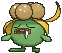
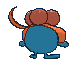
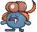
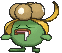
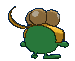

# #044 Gloom (Weed Pokémon)

| Official Artwork | Shiny Artwork |
|------------------|---------------|
|  |  |

**Rising Ruby:** Gloom releases a foul fragrance from the pistil of its flower. When faced with danger, the stench worsens. If this Pokémon is feeling calm and secure, it does not release its usual stinky aroma.

**Sinking Sapphire:** From its mouth Gloom drips honey that smells absolutely horrible. Apparently, it loves the horrid stench. It sniffs the noxious fumes and then drools even more of its honey.

---

## Media

### Default Sprites

| Front | Shiny | Back | Shiny |
|-------|-------|------|-------|
|  |  |  |  |

### Female Sprites

| Front | Shiny | Back | Shiny |
|-------|-------|------|-------|
|  |  |  |  |

### Cries

Latest (Gen VI+):

<audio controls>
<source src='../../assets/cries/gloom/latest.ogg' type='audio/ogg'>
  Your browser does not support the audio element.
</audio>

Legacy:

<audio controls>
<source src='../../assets/cries/gloom/legacy.ogg' type='audio/ogg'>
  Your browser does not support the audio element.
</audio>

---

## Pokédex Data

| National № | Type(s) | Height | Weight | Abilities | Local № |
|------------|---------|--------|--------|-----------|---------|
| #44 | {: width="48"} {: width="48"} | 0.8 m / 2.6 ft | 8.6 kg / 19.0 lbs | 1. Chlorophyll 2. Stench | N/A |

---

## Base Stats
|   | HP | Attack | Defense | Sp. Atk | Sp. Def | Speed |
|---|----|--------|---------|---------|---------|-------|
| **Base** | 60 | 65 | 70 | 85 | 75 | 40 |
| **Min** | 230 | 121 | 130 | 157 | 139 | 76 |
| **Max** | 324 | 251 | 262 | 295 | 273 | 196 |

The ranges shown above are for a level 100 Pokémon. Maximum values are based on a beneficial nature, 252 EVs, 31 IVs; minimum values are based on a hindering nature, 0 EVs, 0 IVs.

---

## Forms & Evolutions

!!! warning "WARNING"

    Information on evolutions may not be 100% accurate; differences between evolution methods across generations are not accounted for.

### Forms

Gloom has no alternate forms.

### Evolution Line

1. [Oddish](oddish.md/)
    1. Level Up: [Gloom](gloom.md/)
        1. Use Item: [Vileplume](vileplume.md/)

        2. Use Item: [Bellossom](bellossom.md/)

---

## Training

| EV Yield | Catch Rate | Base Friendship | Base Exp. | Growth Rate | Held Items |
|----------|------------|-----------------|-----------|-------------|------------|
| 2 Sp.-Atk | 120 | 50 | 138 | Medium Slow | Absorb Bulb (5%) |

---

## Breeding

| Egg Groups | Egg Cycles | Gender | Dimorphic | Color | Shape |
|------------|------------|--------|-----------|-------|-------|
| 1. Plant | 20 | 50.0% Male 50.0% Female | True | Blue | Humanoid |

---

## Moves

!!! warning "WARNING"

    Specific move information may be incorrect. However, the general movepool should be accurate; this includes changes made in Sacred Gold and Storm Silver.

### Level Up Moves

| Lv. | Move | Type | Cat. | Power | Acc. | PP |
| --- | --- | --- | --- | --- | --- | --- |
| 1 | Absorb | {: width="48"} | {: width="36"} | 20 | 100 | 25 |
| 3 | Sweet Scent | {: width="48"} | {: width="36"} | — | 100 | 20 |
| 6 | Lucky Chant | {: width="48"} | {: width="36"} | — | — | 30 |
| 9 | Acid | {: width="48"} | {: width="36"} | 40 | 100 | 30 |
| 12 | Mega Drain | {: width="48"} | {: width="36"} | 40 | 100 | 15 |
| 15 | Poison Powder | {: width="48"} | {: width="36"} | — | 75 | 35 |
| 15 | Sleep Powder | {: width="48"} | {: width="36"} | — | 75 | 15 |
| 15 | Stun Spore | {: width="48"} | {: width="36"} | — | 75 | 30 |
| 18 | Venoshock | {: width="48"} | {: width="36"} | 65 | 100 | 10 |
| 21 | Petal Blizzard | {: width="48"} | {: width="36"} | 90 | 100 | 15 |
| 22 | Giga Drain | {: width="48"} | {: width="36"} | 75 | 100 | 10 |
| 26 | Moonlight | {: width="48"} | {: width="36"} | — | — | 5 |
| 30 | Sludge Bomb | {: width="48"} | {: width="36"} | 90 | 100 | 10 |
| 34 | Toxic | {: width="48"} | {: width="36"} | — | 90 | 10 |
| 38 | Natural Gift | {: width="48"} | {: width="36"} | — | 100 | 15 |
| 42 | Moonblast | {: width="48"} | {: width="36"} | 95 | 100 | 15 |
| 46 | Grassy Terrain | {: width="48"} | {: width="36"} | — | — | 10 |
| 50 | Petal Dance | {: width="48"} | {: width="36"} | 120 | 100 | 10 |

### TM Moves

| TM | Move | Type | Cat. | Power | Acc. | PP |
| --- | --- | --- | --- | --- | --- | --- |
| HM01 | Cut | {: width="48"} | {: width="36"} | 70 | 100 | 15 |
| TM06 | Toxic | {: width="48"} | {: width="36"} | — | 90 | 10 |
| TM09 | Venoshock | {: width="48"} | {: width="36"} | 65 | 100 | 10 |
| TM10 | Hidden Power | {: width="48"} | {: width="36"} | 60 | 100 | 15 |
| TM100 | Confide | {: width="48"} | {: width="36"} | — | — | 20 |
| TM11 | Sunny Day | {: width="48"} | {: width="36"} | — | — | 5 |
| TM17 | Protect | {: width="48"} | {: width="36"} | — | — | 10 |
| TM21 | Frustration | {: width="48"} | {: width="36"} | — | 100 | 20 |
| TM22 | Solar Beam | {: width="48"} | {: width="36"} | 120 | 100 | 10 |
| TM27 | Return | {: width="48"} | {: width="36"} | — | 100 | 20 |
| TM32 | Double Team | {: width="48"} | {: width="36"} | — | — | 15 |
| TM36 | Sludge Bomb | {: width="48"} | {: width="36"} | 90 | 100 | 10 |
| TM42 | Facade | {: width="48"} | {: width="36"} | 70 | 100 | 20 |
| TM44 | Rest | {: width="48"} | {: width="36"} | — | — | 5 |
| TM45 | Attract | {: width="48"} | {: width="36"} | — | 100 | 15 |
| TM48 | Round | {: width="48"} | {: width="36"} | 60 | 100 | 15 |
| TM53 | Energy Ball | {: width="48"} | {: width="36"} | 90 | 100 | 10 |
| TM56 | Fling | {: width="48"} | {: width="36"} | — | 100 | 10 |
| TM70 | Flash | {: width="48"} | {: width="36"} | — | 100 | 20 |
| TM75 | Swords Dance | {: width="48"} | {: width="36"} | — | — | 20 |
| TM83 | Infestation | {: width="48"} | {: width="36"} | 20 | 100 | 20 |
| TM86 | Grass Knot | {: width="48"} | {: width="36"} | — | 100 | 20 |
| TM87 | Swagger | {: width="48"} | {: width="36"} | — | 85 | 15 |
| TM88 | Sleep Talk | {: width="48"} | {: width="36"} | — | — | 10 |
| TM90 | Substitute | {: width="48"} | {: width="36"} | — | — | 10 |
| TM94 | Secret Power | {: width="48"} | {: width="36"} | 70 | 100 | 20 |
| TM96 | Nature Power | {: width="48"} | {: width="36"} | — | — | 20 |
| TM99 | Dazzling Gleam | {: width="48"} | {: width="36"} | 80 | 100 | 10 |

### Egg Moves

Gloom cannot learn any moves by breeding.
### Tutor Moves

| Move | Type | Cat. | Power | Acc. | PP |
| --- | --- | --- | --- | --- | --- |
| After You | {: width="48"} | {: width="36"} | — | — | 15 |
| Drain Punch | {: width="48"} | {: width="36"} | 75 | 100 | 10 |
| Gastro Acid | {: width="48"} | {: width="36"} | — | 100 | 10 |
| Giga Drain | {: width="48"} | {: width="36"} | 75 | 100 | 10 |
| Seed Bomb | {: width="48"} | {: width="36"} | 80 | 100 | 15 |
| Snore | {: width="48"} | {: width="36"} | 50 | 100 | 15 |
| Synthesis | {: width="48"} | {: width="36"} | — | — | 5 |
| Worry Seed | {: width="48"} | {: width="36"} | — | 100 | 10 |

