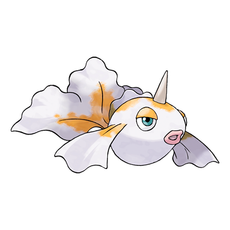
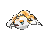
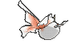
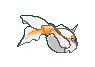
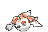
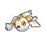
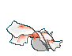
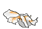

# #118 Goldeen (Goldfish Pokémon)

| Official Artwork | Shiny Artwork |
|------------------|---------------|
|  |  |

**Rising Ruby:** Goldeen is a very beautiful Pokémon with fins that billow elegantly in water. However, don’t let your guard down around this Pokémon—it could ram you powerfully with its horn.

**Sinking Sapphire:** Goldeen loves swimming wild and free in rivers and ponds. If one of these Pokémon is placed in an aquarium, it will shatter even the thickest glass with one ram of its horn and make its escape.

---

## Media

### Default Sprites

| Front | Shiny | Back | Shiny |
|-------|-------|------|-------|
|  |  |  |  |

### Female Sprites

| Front | Shiny | Back | Shiny |
|-------|-------|------|-------|
|  |  |  |  |

### Cries

Latest (Gen VI+):

<audio controls>
<source src='../../assets/cries/goldeen/latest.ogg' type='audio/ogg'>
  Your browser does not support the audio element.
</audio>

Legacy:

<audio controls>
<source src='../../assets/cries/goldeen/legacy.ogg' type='audio/ogg'>
  Your browser does not support the audio element.
</audio>

---

## Pokédex Data

| National № | Type(s) | Height | Weight | Abilities | Local № |
|------------|---------|--------|--------|-----------|---------|
| #118 | {: width="48"} | 0.6 m / 2.0 ft | 15.0 kg / 33.1 lbs | 1. Swift Swim 2. Water Veil | #78 |

---

## Base Stats
|   | HP | Attack | Defense | Sp. Atk | Sp. Def | Speed |
|---|----|--------|---------|---------|---------|-------|
| **Base** | 45 | 67 | 60 | 35 | 50 | 63 |
| **Min** | 200 | 125 | 112 | 67 | 94 | 117 |
| **Max** | 294 | 256 | 240 | 185 | 218 | 247 |

The ranges shown above are for a level 100 Pokémon. Maximum values are based on a beneficial nature, 252 EVs, 31 IVs; minimum values are based on a hindering nature, 0 EVs, 0 IVs.

---

## Forms & Evolutions

!!! warning "WARNING"

    Information on evolutions may not be 100% accurate; differences between evolution methods across generations are not accounted for.

### Forms

Goldeen has no alternate forms.

### Evolution Line

1. [Goldeen](goldeen.md/)
    1. Level Up: [Seaking](seaking.md/)

---

## Training

| EV Yield | Catch Rate | Base Friendship | Base Exp. | Growth Rate | Held Items |
|----------|------------|-----------------|-----------|-------------|------------|
| 1 Atk | 225 | 50 | 64 | Medium | Mystic Water (5%) |

---

## Breeding

| Egg Groups | Egg Cycles | Gender | Dimorphic | Color | Shape |
|------------|------------|--------|-----------|-------|-------|
| 1. Water2 | 20 | 50.0% Male 50.0% Female | True | Red | Fish |

---

## Moves

!!! warning "WARNING"

    Specific move information may be incorrect. However, the general movepool should be accurate; this includes changes made in Sacred Gold and Storm Silver.

### Level Up Moves

| Lv. | Move | Type | Cat. | Power | Acc. | PP |
| --- | --- | --- | --- | --- | --- | --- |
| 1 | Peck | {: width="48"} | {: width="36"} | 35 | 100 | 35 |
| 1 | Tail Whip | {: width="48"} | {: width="36"} | — | 100 | 30 |
| 1 | Water Sport | {: width="48"} | {: width="36"} | — | — | 15 |
| 5 | Supersonic | {: width="48"} | {: width="36"} | — | 55 | 20 |
| 8 | Horn Attack | {: width="48"} | {: width="36"} | 65 | 100 | 25 |
| 11 | Flail | {: width="48"} | {: width="36"} | — | 100 | 15 |
| 14 | Water Pulse | {: width="48"} | {: width="36"} | 60 | 100 | 20 |
| 17 | Aqua Ring | {: width="48"} | {: width="36"} | — | — | 20 |
| 20 | Waterfall | {: width="48"} | {: width="36"} | 80 | 100 | 15 |
| 23 | Fury Attack | {: width="48"} | {: width="36"} | 15 | 85 | 20 |
| 26 | Knock Off | {: width="48"} | {: width="36"} | 65 | 100 | 20 |
| 29 | Agility | {: width="48"} | {: width="36"} | — | — | 30 |
| 32 | Aqua Tail | {: width="48"} | {: width="36"} | 90 | 90 | 10 |
| 35 | Drill Run | {: width="48"} | {: width="36"} | 80 | 95 | 10 |
| 38 | Soak | {: width="48"} | {: width="36"} | — | 100 | 20 |
| 41 | Skull Bash | {: width="48"} | {: width="36"} | 130 | 100 | 10 |
| 44 | Bounce | {: width="48"} | {: width="36"} | 85 | 85 | 5 |
| 47 | Horn Drill | {: width="48"} | {: width="36"} | — | 30 | 5 |
| 50 | Megahorn | {: width="48"} | {: width="36"} | 120 | 85 | 10 |

### TM Moves

| TM | Move | Type | Cat. | Power | Acc. | PP |
| --- | --- | --- | --- | --- | --- | --- |
| HM03 | Surf | {: width="48"} | {: width="36"} | 90 | 100 | 15 |
| HM05 | Waterfall | {: width="48"} | {: width="36"} | 80 | 100 | 15 |
| HM07 | Dive | {: width="48"} | {: width="36"} | 80 | 100 | 10 |
| TM06 | Toxic | {: width="48"} | {: width="36"} | — | 90 | 10 |
| TM07 | Hail | {: width="48"} | {: width="36"} | — | — | 10 |
| TM10 | Hidden Power | {: width="48"} | {: width="36"} | 60 | 100 | 15 |
| TM100 | Confide | {: width="48"} | {: width="36"} | — | — | 20 |
| TM13 | Ice Beam | {: width="48"} | {: width="36"} | 90 | 100 | 10 |
| TM14 | Blizzard | {: width="48"} | {: width="36"} | 110 | 70 | 5 |
| TM17 | Protect | {: width="48"} | {: width="36"} | — | — | 10 |
| TM18 | Rain Dance | {: width="48"} | {: width="36"} | — | — | 5 |
| TM21 | Frustration | {: width="48"} | {: width="36"} | — | 100 | 20 |
| TM27 | Return | {: width="48"} | {: width="36"} | — | 100 | 20 |
| TM32 | Double Team | {: width="48"} | {: width="36"} | — | — | 15 |
| TM42 | Facade | {: width="48"} | {: width="36"} | 70 | 100 | 20 |
| TM44 | Rest | {: width="48"} | {: width="36"} | — | — | 5 |
| TM45 | Attract | {: width="48"} | {: width="36"} | — | 100 | 15 |
| TM48 | Round | {: width="48"} | {: width="36"} | 60 | 100 | 15 |
| TM55 | Scald | {: width="48"} | {: width="36"} | 80 | 100 | 15 |
| TM84 | Poison Jab | {: width="48"} | {: width="36"} | 80 | 100 | 20 |
| TM87 | Swagger | {: width="48"} | {: width="36"} | — | 85 | 15 |
| TM88 | Sleep Talk | {: width="48"} | {: width="36"} | — | — | 10 |
| TM90 | Substitute | {: width="48"} | {: width="36"} | — | — | 10 |
| TM94 | Secret Power | {: width="48"} | {: width="36"} | 70 | 100 | 20 |

### Egg Moves

| Move | Type | Cat. | Power | Acc. | PP |
| --- | --- | --- | --- | --- | --- |
| Aqua Tail | {: width="48"} | {: width="36"} | 90 | 90 | 10 |
| Body Slam | {: width="48"} | {: width="36"} | 85 | 100 | 15 |
| Haze | {: width="48"} | {: width="36"} | — | — | 30 |
| Hydro Pump | {: width="48"} | {: width="36"} | 110 | 80 | 5 |
| Mud Shot | {: width="48"} | {: width="36"} | 55 | 95 | 15 |
| Mud Slap | {: width="48"} | {: width="36"} | 20 | 100 | 10 |
| Mud Sport | {: width="48"} | {: width="36"} | — | — | 15 |
| Psybeam | {: width="48"} | {: width="36"} | 65 | 100 | 20 |
| Signal Beam | {: width="48"} | {: width="36"} | 75 | 100 | 15 |
| Skull Bash | {: width="48"} | {: width="36"} | 130 | 100 | 10 |
| Sleep Talk | {: width="48"} | {: width="36"} | — | — | 10 |

### Tutor Moves

| Move | Type | Cat. | Power | Acc. | PP |
| --- | --- | --- | --- | --- | --- |
| Aqua Tail | {: width="48"} | {: width="36"} | 90 | 90 | 10 |
| Bounce | {: width="48"} | {: width="36"} | 85 | 85 | 5 |
| Drill Run | {: width="48"} | {: width="36"} | 80 | 95 | 10 |
| Icy Wind | {: width="48"} | {: width="36"} | 55 | 95 | 15 |
| Knock Off | {: width="48"} | {: width="36"} | 65 | 100 | 20 |
| Signal Beam | {: width="48"} | {: width="36"} | 75 | 100 | 15 |
| Snore | {: width="48"} | {: width="36"} | 50 | 100 | 15 |
| Water Pulse | {: width="48"} | {: width="36"} | 60 | 100 | 20 |

