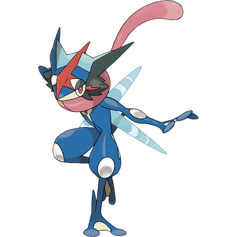

# Greninja Ash (Ninja Pokémon)

| Official Artwork | Shiny Artwork |
|------------------|---------------|
|  |  |

**Rising Ruby:** It creates throwing stars out of compressed water. When it spins them and throws them at high speed, these stars can split metal in two.

**Sinking Sapphire:** It appears and vanishes with a ninja’s grace. It toys with its enemies using swift movements, while slicing them with throwing stars of sharpest water.

---

## Media

### Default Sprites

| Front | Shiny | Back | Shiny |
|-------|-------|------|-------|
|  |  |  |  |

### Cries

Latest (Gen VI+):

<audio controls>
<source src='../../assets/cries/greninja-ash/latest.ogg' type='audio/ogg'>
  Your browser does not support the audio element.
</audio>

Legacy:

<audio controls>
<source src='../../assets/cries/greninja-ash/legacy.ogg' type='audio/ogg'>
  Your browser does not support the audio element.
</audio>

---

## Pokédex Data

| National № | Type(s) | Height | Weight | Abilities | Local № |
|------------|---------|--------|--------|-----------|---------|
| #10117 | {: width="48"} {: width="48"} | 1.5 m / 4.9 ft | 40.0 kg / 88.2 lbs | 1. Battle Bond | N/A |

---

## Base Stats
|   | HP | Attack | Defense | Sp. Atk | Sp. Def | Speed |
|---|----|--------|---------|---------|---------|-------|
| **Base** | 72 | 145 | 67 | 153 | 71 | 132 |
| **Min** | 254 | 265 | 125 | 279 | 132 | 242 |
| **Max** | 348 | 427 | 256 | 445 | 265 | 399 |

The ranges shown above are for a level 100 Pokémon. Maximum values are based on a beneficial nature, 252 EVs, 31 IVs; minimum values are based on a hindering nature, 0 EVs, 0 IVs.

---

## Forms & Evolutions

!!! warning "WARNING"

    Information on evolutions may not be 100% accurate; differences between evolution methods across generations are not accounted for.

### Forms

1. [Greninja](greninja.md/)

3. [Greninja Ash](greninja-ash.md/)

### Evolution Line

1. [Froakie](froakie.md/)
    1. Level Up: [Frogadier](frogadier.md/)
        1. Level Up: [Greninja](greninja.md/)

---

## Training

| EV Yield | Catch Rate | Base Friendship | Base Exp. | Growth Rate | Held Items |
|----------|------------|-----------------|-----------|-------------|------------|
| 3 Spd | 45 | 70 | 288 | Medium Slow | N/A |

---

## Breeding

| Egg Groups | Egg Cycles | Gender | Dimorphic | Color | Shape |
|------------|------------|--------|-----------|-------|-------|
| 1. Water1 | 20 | 87.5% Male 12.5% Female | False | Blue | Humanoid |

---

## Moves

!!! warning "WARNING"

    Specific move information may be incorrect. However, the general movepool should be accurate; this includes changes made in Sacred Gold and Storm Silver.

### Level Up Moves

| Lv. | Move | Type | Cat. | Power | Acc. | PP |
| --- | --- | --- | --- | --- | --- | --- |
| 0 | Water Shuriken | {: width="48"} | {: width="36"} | 15 | 100 | 20 |
| 1 | Growl | {: width="48"} | {: width="36"} | — | 100 | 40 |
| 1 | Haze | {: width="48"} | {: width="36"} | — | — | 30 |
| 1 | Night Slash | {: width="48"} | {: width="36"} | 70 | 100 | 15 |
| 1 | Pound | {: width="48"} | {: width="36"} | 50 | 100 | 35 |
| 1 | Quick Attack | {: width="48"} | {: width="36"} | 40 | 100 | 30 |
| 1 | Role Play | {: width="48"} | {: width="36"} | — | — | 10 |
| 1 | Water Gun | {: width="48"} | {: width="36"} | 40 | 100 | 25 |
| 10 | Lick | {: width="48"} | {: width="36"} | 30 | 100 | 30 |
| 14 | Water Pulse | {: width="48"} | {: width="36"} | 60 | 100 | 20 |
| 19 | Smokescreen | {: width="48"} | {: width="36"} | — | 100 | 20 |
| 23 | Shadow Sneak | {: width="48"} | {: width="36"} | 40 | 100 | 30 |
| 28 | Spikes | {: width="48"} | {: width="36"} | — | — | 20 |
| 33 | Aerial Ace | {: width="48"} | {: width="36"} | 60 | — | 20 |
| 42 | Substitute | {: width="48"} | {: width="36"} | — | — | 10 |
| 49 | Extrasensory | {: width="48"} | {: width="36"} | 80 | 100 | 20 |
| 56 | Double Team | {: width="48"} | {: width="36"} | — | — | 15 |
| 68 | Hydro Pump | {: width="48"} | {: width="36"} | 110 | 80 | 5 |

### TM Moves

| TM | Move | Type | Cat. | Power | Acc. | PP |
| --- | --- | --- | --- | --- | --- | --- |
| TM01 | Take Down | {: width="48"} | {: width="36"} | 90 | 85 | 20 |
| TM05 | Mud Slap | {: width="48"} | {: width="36"} | 20 | 100 | 10 |
| TM07 | Protect | {: width="48"} | {: width="36"} | — | — | 10 |
| TM102 | Gunk Shot | {: width="48"} | {: width="36"} | 120 | 80 | 5 |
| TM103 | Substitute | {: width="48"} | {: width="36"} | — | — | 10 |
| TM11 | Water Pulse | {: width="48"} | {: width="36"} | 60 | 100 | 20 |
| TM110 | Liquidation | {: width="48"} | {: width="36"} | 85 | 100 | 10 |
| TM12 | Low Kick | {: width="48"} | {: width="36"} | — | 100 | 20 |
| TM123 | Surf | {: width="48"} | {: width="36"} | 90 | 100 | 15 |
| TM130 | Helping Hand | {: width="48"} | {: width="36"} | — | — | 20 |
| TM135 | Ice Beam | {: width="48"} | {: width="36"} | 90 | 100 | 10 |
| TM142 | Hydro Pump | {: width="48"} | {: width="36"} | 110 | 80 | 5 |
| TM143 | Blizzard | {: width="48"} | {: width="36"} | 110 | 70 | 5 |
| TM145 | Water Pledge | {: width="48"} | {: width="36"} | 85 | 100 | 10 |
| TM152 | Giga Impact | {: width="48"} | {: width="36"} | 150 | 90 | 5 |
| TM154 | Hydro Cannon | {: width="48"} | {: width="36"} | 150 | 90 | 5 |
| TM163 | Hyper Beam | {: width="48"} | {: width="36"} | 150 | 90 | 5 |
| TM171 | Tera Blast | {: width="48"} | {: width="36"} | 80 | 100 | 10 |
| TM18 | Thief | {: width="48"} | {: width="36"} | 60 | 100 | 25 |
| TM20 | Trailblaze | {: width="48"} | {: width="36"} | 50 | 100 | 20 |
| TM22 | Chilling Water | {: width="48"} | {: width="36"} | 50 | 100 | 20 |
| TM25 | Facade | {: width="48"} | {: width="36"} | 70 | 100 | 20 |
| TM27 | Aerial Ace | {: width="48"} | {: width="36"} | 60 | — | 20 |
| TM32 | Swift | {: width="48"} | {: width="36"} | 60 | — | 20 |
| TM34 | Icy Wind | {: width="48"} | {: width="36"} | 55 | 95 | 15 |
| TM35 | Mud Shot | {: width="48"} | {: width="36"} | 55 | 95 | 15 |
| TM36 | Rock Tomb | {: width="48"} | {: width="36"} | 60 | 95 | 15 |
| TM39 | Low Sweep | {: width="48"} | {: width="36"} | 65 | 100 | 20 |
| TM43 | Fling | {: width="48"} | {: width="36"} | — | 100 | 10 |
| TM47 | Endure | {: width="48"} | {: width="36"} | — | — | 10 |
| TM50 | Rain Dance | {: width="48"} | {: width="36"} | — | — | 5 |
| TM52 | Snowscape | {: width="48"} | {: width="36"} | — | — | 10 |
| TM55 | Dig | {: width="48"} | {: width="36"} | 80 | 100 | 10 |
| TM57 | False Swipe | {: width="48"} | {: width="36"} | 40 | 100 | 40 |
| TM58 | Brick Break | {: width="48"} | {: width="36"} | 75 | 100 | 15 |
| TM60 | U Turn | {: width="48"} | {: width="36"} | 70 | 100 | 20 |
| TM69 | Ice Punch | {: width="48"} | {: width="36"} | 75 | 100 | 15 |
| TM70 | Sleep Talk | {: width="48"} | {: width="36"} | — | — | 10 |
| TM77 | Waterfall | {: width="48"} | {: width="36"} | 80 | 100 | 15 |
| TM81 | Grass Knot | {: width="48"} | {: width="36"} | — | 100 | 20 |
| TM85 | Rest | {: width="48"} | {: width="36"} | — | — | 5 |
| TM86 | Rock Slide | {: width="48"} | {: width="36"} | 75 | 90 | 10 |
| TM87 | Taunt | {: width="48"} | {: width="36"} | — | 100 | 20 |
| TM88 | Swords Dance | {: width="48"} | {: width="36"} | — | — | 20 |
| TM90 | Spikes | {: width="48"} | {: width="36"} | — | — | 20 |
| TM91 | Toxic Spikes | {: width="48"} | {: width="36"} | — | — | 20 |
| TM94 | Dark Pulse | {: width="48"} | {: width="36"} | 80 | 100 | 15 |

### Egg Moves

Greninja Ash cannot learn any moves by breeding.
### Tutor Moves

Greninja Ash cannot learn any moves from tutors.
