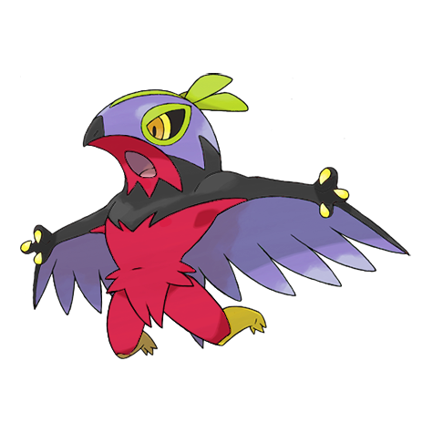
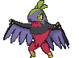
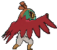
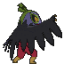

# #701 Hawlucha (Wrestling Pokémon)

| Official Artwork | Shiny Artwork |
|------------------|---------------|
|  |  |

**Rising Ruby:** Although its body is small, its proficient fighting skills enable it to keep up with big bruisers like Machamp and Hariyama.

**Sinking Sapphire:** With its wings, it controls its position in the air. It likes to attack from above, a maneuver that is difficult to defend against.

---

## Media

### Default Sprites

| Front | Shiny | Back | Shiny |
|-------|-------|------|-------|
|  |  |  |  |

### Cries

Latest (Gen VI+):

<audio controls>
<source src='../../assets/cries/hawlucha/latest.ogg' type='audio/ogg'>
  Your browser does not support the audio element.
</audio>

Legacy:

<audio controls>
<source src='../../assets/cries/hawlucha/legacy.ogg' type='audio/ogg'>
  Your browser does not support the audio element.
</audio>

---

## Pokédex Data

| National № | Type(s) | Height | Weight | Abilities | Local № |
|------------|---------|--------|--------|-----------|---------|
| #701 | {: width="48"} {: width="48"} | 0.8 m / 2.6 ft | 21.5 kg / 47.4 lbs | 1. Limber 2. Unburden | N/A |

---

## Base Stats
|   | HP | Attack | Defense | Sp. Atk | Sp. Def | Speed |
|---|----|--------|---------|---------|---------|-------|
| **Base** | 78 | 92 | 75 | 74 | 63 | 118 |
| **Min** | 266 | 170 | 139 | 137 | 117 | 216 |
| **Max** | 360 | 311 | 273 | 271 | 247 | 368 |

The ranges shown above are for a level 100 Pokémon. Maximum values are based on a beneficial nature, 252 EVs, 31 IVs; minimum values are based on a hindering nature, 0 EVs, 0 IVs.

---

## Forms & Evolutions

!!! warning "WARNING"

    Information on evolutions may not be 100% accurate; differences between evolution methods across generations are not accounted for.

### Forms

Hawlucha has no alternate forms.

### Evolution Line

1. [Hawlucha](hawlucha.md/)

---

## Training

| EV Yield | Catch Rate | Base Friendship | Base Exp. | Growth Rate | Held Items |
|----------|------------|-----------------|-----------|-------------|------------|
| 2 Atk | 100 | 50 | 175 | Medium | Kings Rock (5%) |

---

## Breeding

| Egg Groups | Egg Cycles | Gender | Dimorphic | Color | Shape |
|------------|------------|--------|-----------|-------|-------|
| 1. Flying 2. Humanshape | 20 | 50.0% Male 50.0% Female | False | Green | Humanoid |

---

## Moves

!!! warning "WARNING"

    Specific move information may be incorrect. However, the general movepool should be accurate; this includes changes made in Sacred Gold and Storm Silver.

### Level Up Moves

| Lv. | Move | Type | Cat. | Power | Acc. | PP |
| --- | --- | --- | --- | --- | --- | --- |
| 1 | Fire Punch | {: width="48"} | {: width="36"} | 75 | 100 | 15 |
| 1 | Hone Claws | {: width="48"} | {: width="36"} | — | — | 15 |
| 1 | Swords Dance | {: width="48"} | {: width="36"} | — | — | 20 |
| 1 | Tackle | {: width="48"} | {: width="36"} | 40 | 100 | 35 |
| 1 | Thunder Punch | {: width="48"} | {: width="36"} | 75 | 100 | 15 |
| 6 | Karate Chop | {: width="48"} | {: width="36"} | 50 | 100 | 25 |
| 9 | Wing Attack | {: width="48"} | {: width="36"} | 60 | 100 | 35 |
| 12 | Roost | {: width="48"} | {: width="36"} | — | — | 5 |
| 15 | Aerial Ace | {: width="48"} | {: width="36"} | 60 | — | 20 |
| 18 | Encore | {: width="48"} | {: width="36"} | — | 100 | 5 |
| 21 | Fling | {: width="48"} | {: width="36"} | — | 100 | 10 |
| 24 | Flying Press | {: width="48"} | {: width="36"} | 100 | 95 | 10 |
| 27 | Bounce | {: width="48"} | {: width="36"} | 85 | 85 | 5 |
| 30 | Endeavor | {: width="48"} | {: width="36"} | — | 100 | 5 |
| 33 | Drain Punch | {: width="48"} | {: width="36"} | 75 | 100 | 10 |
| 36 | Acrobatics | {: width="48"} | {: width="36"} | 55 | 100 | 15 |
| 39 | Zen Headbutt | {: width="48"} | {: width="36"} | 80 | 90 | 15 |
| 42 | High Jump Kick | {: width="48"} | {: width="36"} | 130 | 90 | 10 |
| 45 | Feather Dance | {: width="48"} | {: width="36"} | — | 100 | 15 |
| 48 | Iron Head | {: width="48"} | {: width="36"} | 80 | 100 | 15 |
| 51 | Dual Chop | {: width="48"} | {: width="36"} | 40 | 90 | 15 |
| 54 | Sky Drop | {: width="48"} | {: width="36"} | 60 | 100 | 10 |
| 57 | Sky Attack | {: width="48"} | {: width="36"} | 140 | 90 | 5 |

### TM Moves

| TM | Move | Type | Cat. | Power | Acc. | PP |
| --- | --- | --- | --- | --- | --- | --- |
| HM01 | Cut | {: width="48"} | {: width="36"} | 70 | 100 | 15 |
| HM02 | Fly | {: width="48"} | {: width="36"} | 100 | 100 | 10 |
| HM04 | Strength | {: width="48"} | {: width="36"} | 100 | 100 | 10 |
| HM06 | Rock Smash | {: width="48"} | {: width="36"} | 65 | 100 | 15 |
| TM01 | Hone Claws | {: width="48"} | {: width="36"} | — | — | 15 |
| TM06 | Toxic | {: width="48"} | {: width="36"} | — | 90 | 10 |
| TM08 | Bulk Up | {: width="48"} | {: width="36"} | — | — | 20 |
| TM10 | Hidden Power | {: width="48"} | {: width="36"} | 60 | 100 | 15 |
| TM100 | Confide | {: width="48"} | {: width="36"} | — | — | 20 |
| TM11 | Sunny Day | {: width="48"} | {: width="36"} | — | — | 5 |
| TM12 | Taunt | {: width="48"} | {: width="36"} | — | 100 | 20 |
| TM17 | Protect | {: width="48"} | {: width="36"} | — | — | 10 |
| TM18 | Rain Dance | {: width="48"} | {: width="36"} | — | — | 5 |
| TM19 | Roost | {: width="48"} | {: width="36"} | — | — | 5 |
| TM21 | Frustration | {: width="48"} | {: width="36"} | — | 100 | 20 |
| TM27 | Return | {: width="48"} | {: width="36"} | — | 100 | 20 |
| TM28 | Dig | {: width="48"} | {: width="36"} | 80 | 100 | 10 |
| TM31 | Brick Break | {: width="48"} | {: width="36"} | 75 | 100 | 15 |
| TM32 | Double Team | {: width="48"} | {: width="36"} | — | — | 15 |
| TM39 | Rock Tomb | {: width="48"} | {: width="36"} | 60 | 95 | 15 |
| TM40 | Aerial Ace | {: width="48"} | {: width="36"} | 60 | — | 20 |
| TM41 | Torment | {: width="48"} | {: width="36"} | — | 100 | 15 |
| TM42 | Facade | {: width="48"} | {: width="36"} | 70 | 100 | 20 |
| TM44 | Rest | {: width="48"} | {: width="36"} | — | — | 5 |
| TM45 | Attract | {: width="48"} | {: width="36"} | — | 100 | 15 |
| TM47 | Low Sweep | {: width="48"} | {: width="36"} | 65 | 100 | 20 |
| TM48 | Round | {: width="48"} | {: width="36"} | 60 | 100 | 15 |
| TM51 | Steel Wing | {: width="48"} | {: width="36"} | 70 | 90 | 25 |
| TM52 | Focus Blast | {: width="48"} | {: width="36"} | 120 | 70 | 5 |
| TM54 | False Swipe | {: width="48"} | {: width="36"} | 40 | 100 | 40 |
| TM56 | Fling | {: width="48"} | {: width="36"} | — | 100 | 10 |
| TM58 | Sky Drop | {: width="48"} | {: width="36"} | 60 | 100 | 10 |
| TM62 | Acrobatics | {: width="48"} | {: width="36"} | 55 | 100 | 15 |
| TM66 | Payback | {: width="48"} | {: width="36"} | 50 | 100 | 10 |
| TM67 | Retaliate | {: width="48"} | {: width="36"} | 70 | 100 | 5 |
| TM68 | Giga Impact | {: width="48"} | {: width="36"} | 150 | 90 | 5 |
| TM71 | Stone Edge | {: width="48"} | {: width="36"} | 100 | 80 | 5 |
| TM75 | Swords Dance | {: width="48"} | {: width="36"} | — | — | 20 |
| TM80 | Rock Slide | {: width="48"} | {: width="36"} | 75 | 90 | 10 |
| TM81 | X Scissor | {: width="48"} | {: width="36"} | 80 | 100 | 15 |
| TM84 | Poison Jab | {: width="48"} | {: width="36"} | 80 | 100 | 20 |
| TM86 | Grass Knot | {: width="48"} | {: width="36"} | — | 100 | 20 |
| TM87 | Swagger | {: width="48"} | {: width="36"} | — | 85 | 15 |
| TM88 | Sleep Talk | {: width="48"} | {: width="36"} | — | — | 10 |
| TM89 | U Turn | {: width="48"} | {: width="36"} | 70 | 100 | 20 |
| TM90 | Substitute | {: width="48"} | {: width="36"} | — | — | 10 |
| TM94 | Secret Power | {: width="48"} | {: width="36"} | 70 | 100 | 20 |
| TM98 | Power Up Punch | {: width="48"} | {: width="36"} | 40 | 100 | 20 |

### Egg Moves

| Move | Type | Cat. | Power | Acc. | PP |
| --- | --- | --- | --- | --- | --- |
| Agility | {: width="48"} | {: width="36"} | — | — | 30 |
| Ally Switch | {: width="48"} | {: width="36"} | — | — | 15 |
| Baton Pass | {: width="48"} | {: width="36"} | — | — | 40 |
| Entrainment | {: width="48"} | {: width="36"} | — | 100 | 15 |
| Me First | {: width="48"} | {: width="36"} | — | — | 20 |
| Mud Sport | {: width="48"} | {: width="36"} | — | — | 15 |
| Quick Guard | {: width="48"} | {: width="36"} | — | — | 15 |

### Tutor Moves

| Move | Type | Cat. | Power | Acc. | PP |
| --- | --- | --- | --- | --- | --- |
| Bounce | {: width="48"} | {: width="36"} | 85 | 85 | 5 |
| Drain Punch | {: width="48"} | {: width="36"} | 75 | 100 | 10 |
| Dual Chop | {: width="48"} | {: width="36"} | 40 | 90 | 15 |
| Endeavor | {: width="48"} | {: width="36"} | — | 100 | 5 |
| Fire Punch | {: width="48"} | {: width="36"} | 75 | 100 | 15 |
| Focus Punch | {: width="48"} | {: width="36"} | 150 | 100 | 20 |
| Helping Hand | {: width="48"} | {: width="36"} | — | — | 20 |
| Iron Head | {: width="48"} | {: width="36"} | 80 | 100 | 15 |
| Last Resort | {: width="48"} | {: width="36"} | 140 | 100 | 5 |
| Low Kick | {: width="48"} | {: width="36"} | — | 100 | 20 |
| Sky Attack | {: width="48"} | {: width="36"} | 140 | 90 | 5 |
| Snore | {: width="48"} | {: width="36"} | 50 | 100 | 15 |
| Superpower | {: width="48"} | {: width="36"} | 120 | 100 | 5 |
| Tailwind | {: width="48"} | {: width="36"} | — | — | 15 |
| Thunder Punch | {: width="48"} | {: width="36"} | 75 | 100 | 15 |
| Zen Headbutt | {: width="48"} | {: width="36"} | 80 | 90 | 15 |

