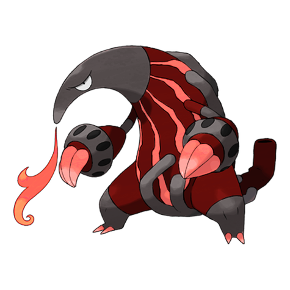
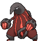
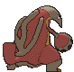
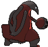

# #631 Heatmor (Anteater Pokémon)

| Official Artwork | Shiny Artwork |
|------------------|---------------|
|  |  |

**Rising Ruby:** Using their very hot, flame-covered tongues, they burn through Durant’s steel bodies and consume their insides.

**Sinking Sapphire:** It draws in air through its tail, transforms it into fire, and uses it like a tongue. It melts Durant and eats them.

---

## Media

### Default Sprites

| Front | Shiny | Back | Shiny |
|-------|-------|------|-------|
|  |  |  |  |

### Cries

Latest (Gen VI+):

<audio controls>
<source src='../../assets/cries/heatmor/latest.ogg' type='audio/ogg'>
  Your browser does not support the audio element.
</audio>

Legacy:

<audio controls>
<source src='../../assets/cries/heatmor/legacy.ogg' type='audio/ogg'>
  Your browser does not support the audio element.
</audio>

---

## Pokédex Data

| National № | Type(s) | Height | Weight | Abilities | Local № |
|------------|---------|--------|--------|-----------|---------|
| #631 | {: width="48"} | 1.4 m / 4.6 ft | 58.0 kg / 127.9 lbs | 1. Gluttony 2. Flash Fire | N/A |

---

## Base Stats
|   | HP | Attack | Defense | Sp. Atk | Sp. Def | Speed |
|---|----|--------|---------|---------|---------|-------|
| **Base** | 85 | 97 | 66 | 105 | 66 | 65 |
| **Min** | 280 | 179 | 123 | 193 | 123 | 121 |
| **Max** | 374 | 322 | 254 | 339 | 254 | 251 |

The ranges shown above are for a level 100 Pokémon. Maximum values are based on a beneficial nature, 252 EVs, 31 IVs; minimum values are based on a hindering nature, 0 EVs, 0 IVs.

---

## Forms & Evolutions

!!! warning "WARNING"

    Information on evolutions may not be 100% accurate; differences between evolution methods across generations are not accounted for.

### Forms

Heatmor has no alternate forms.

### Evolution Line

1. [Heatmor](heatmor.md/)

---

## Training

| EV Yield | Catch Rate | Base Friendship | Base Exp. | Growth Rate | Held Items |
|----------|------------|-----------------|-----------|-------------|------------|
| 2 Sp.-Atk | 90 | 50 | 169 | Mediu |

---

## Breeding

| Egg Groups | Egg Cycles | Gender | Dimorphic | Color | Shape |
|------------|------------|--------|-----------|-------|-------|
| 1. Ground | 20 | 50.0% Male 50.0% Female | False | Red | Upright |

---

## Moves

!!! warning "WARNING"

    Specific move information may be incorrect. However, the general movepool should be accurate; this includes changes made in Sacred Gold and Storm Silver.

### Level Up Moves

| Lv. | Move | Type | Cat. | Power | Acc. | PP |
| --- | --- | --- | --- | --- | --- | --- |
| 1 | Hone Claws | {: width="48"} | {: width="36"} | — | — | 15 |
| 1 | Incinerate | {: width="48"} | {: width="36"} | 60 | 100 | 15 |
| 1 | Inferno | {: width="48"} | {: width="36"} | 100 | 50 | 5 |
| 1 | Lick | {: width="48"} | {: width="36"} | 30 | 100 | 30 |
| 1 | Tackle | {: width="48"} | {: width="36"} | 40 | 100 | 35 |
| 5 | Odor Sleuth | {: width="48"} | {: width="36"} | — | — | 40 |
| 9 | Bind | {: width="48"} | {: width="36"} | 15 | 85 | 20 |
| 13 | Fire Spin | {: width="48"} | {: width="36"} | 35 | 85 | 15 |
| 17 | Fury Swipes | {: width="48"} | {: width="36"} | 18 | 80 | 15 |
| 21 | Snatch | {: width="48"} | {: width="36"} | — | — | 10 |
| 25 | Flame Burst | {: width="48"} | {: width="36"} | 70 | 100 | 15 |
| 29 | Bug Bite | {: width="48"} | {: width="36"} | 60 | 100 | 20 |
| 33 | Slash | {: width="48"} | {: width="36"} | 70 | 100 | 20 |
| 37 | Knock Off | {: width="48"} | {: width="36"} | 65 | 100 | 20 |
| 41 | Flamethrower | {: width="48"} | {: width="36"} | 90 | 100 | 15 |
| 45 | Giga Drain | {: width="48"} | {: width="36"} | 75 | 100 | 10 |
| 49 | Amnesia | {: width="48"} | {: width="36"} | — | — | 20 |
| 53 | Spit Up | {: width="48"} | {: width="36"} | — | 100 | 10 |
| 53 | Stockpile | {: width="48"} | {: width="36"} | — | — | 20 |
| 53 | Swallow | {: width="48"} | {: width="36"} | — | — | 10 |
| 57 | Heat Wave | {: width="48"} | {: width="36"} | 95 | 90 | 10 |
| 61 | Inferno | {: width="48"} | {: width="36"} | 100 | 50 | 5 |

### TM Moves

| TM | Move | Type | Cat. | Power | Acc. | PP |
| --- | --- | --- | --- | --- | --- | --- |
| HM01 | Cut | {: width="48"} | {: width="36"} | 70 | 100 | 15 |
| HM06 | Rock Smash | {: width="48"} | {: width="36"} | 65 | 100 | 15 |
| TM01 | Hone Claws | {: width="48"} | {: width="36"} | — | — | 15 |
| TM06 | Toxic | {: width="48"} | {: width="36"} | — | 90 | 10 |
| TM10 | Hidden Power | {: width="48"} | {: width="36"} | 60 | 100 | 15 |
| TM100 | Confide | {: width="48"} | {: width="36"} | — | — | 20 |
| TM11 | Sunny Day | {: width="48"} | {: width="36"} | — | — | 5 |
| TM12 | Taunt | {: width="48"} | {: width="36"} | — | 100 | 20 |
| TM17 | Protect | {: width="48"} | {: width="36"} | — | — | 10 |
| TM18 | Rain Dance | {: width="48"} | {: width="36"} | — | — | 5 |
| TM21 | Frustration | {: width="48"} | {: width="36"} | — | 100 | 20 |
| TM22 | Solar Beam | {: width="48"} | {: width="36"} | 120 | 100 | 10 |
| TM27 | Return | {: width="48"} | {: width="36"} | — | 100 | 20 |
| TM28 | Dig | {: width="48"} | {: width="36"} | 80 | 100 | 10 |
| TM32 | Double Team | {: width="48"} | {: width="36"} | — | — | 15 |
| TM35 | Flamethrower | {: width="48"} | {: width="36"} | 90 | 100 | 15 |
| TM38 | Fire Blast | {: width="48"} | {: width="36"} | 110 | 85 | 5 |
| TM39 | Rock Tomb | {: width="48"} | {: width="36"} | 60 | 95 | 15 |
| TM40 | Aerial Ace | {: width="48"} | {: width="36"} | 60 | — | 20 |
| TM42 | Facade | {: width="48"} | {: width="36"} | 70 | 100 | 20 |
| TM44 | Rest | {: width="48"} | {: width="36"} | — | — | 5 |
| TM45 | Attract | {: width="48"} | {: width="36"} | — | 100 | 15 |
| TM46 | Thief | {: width="48"} | {: width="36"} | 60 | 100 | 25 |
| TM48 | Round | {: width="48"} | {: width="36"} | 60 | 100 | 15 |
| TM52 | Focus Blast | {: width="48"} | {: width="36"} | 120 | 70 | 5 |
| TM56 | Fling | {: width="48"} | {: width="36"} | — | 100 | 10 |
| TM59 | Incinerate | {: width="48"} | {: width="36"} | 60 | 100 | 15 |
| TM61 | Will O Wisp | {: width="48"} | {: width="36"} | — | 85 | 15 |
| TM65 | Shadow Claw | {: width="48"} | {: width="36"} | 70 | 100 | 15 |
| TM68 | Giga Impact | {: width="48"} | {: width="36"} | 150 | 90 | 5 |
| TM87 | Swagger | {: width="48"} | {: width="36"} | — | 85 | 15 |
| TM88 | Sleep Talk | {: width="48"} | {: width="36"} | — | — | 10 |
| TM90 | Substitute | {: width="48"} | {: width="36"} | — | — | 10 |
| TM94 | Secret Power | {: width="48"} | {: width="36"} | 70 | 100 | 20 |
| TM98 | Power Up Punch | {: width="48"} | {: width="36"} | 40 | 100 | 20 |

### Egg Moves

| Move | Type | Cat. | Power | Acc. | PP |
| --- | --- | --- | --- | --- | --- |
| Belch | {: width="48"} | {: width="36"} | 120 | 90 | 10 |
| Body Slam | {: width="48"} | {: width="36"} | 85 | 100 | 15 |
| Curse | {: width="48"} | {: width="36"} | — | — | 10 |
| Feint Attack | {: width="48"} | {: width="36"} | 60 | — | 20 |
| Heat Wave | {: width="48"} | {: width="36"} | 95 | 90 | 10 |
| Night Slash | {: width="48"} | {: width="36"} | 70 | 100 | 15 |
| Pursuit | {: width="48"} | {: width="36"} | 40 | 100 | 20 |
| Sleep Talk | {: width="48"} | {: width="36"} | — | — | 10 |
| Sucker Punch | {: width="48"} | {: width="36"} | 70 | 100 | 5 |
| Tickle | {: width="48"} | {: width="36"} | — | 100 | 20 |
| Wrap | {: width="48"} | {: width="36"} | 15 | 90 | 20 |

### Tutor Moves

| Move | Type | Cat. | Power | Acc. | PP |
| --- | --- | --- | --- | --- | --- |
| Bind | {: width="48"} | {: width="36"} | 15 | 85 | 20 |
| Bug Bite | {: width="48"} | {: width="36"} | 60 | 100 | 20 |
| Fire Punch | {: width="48"} | {: width="36"} | 75 | 100 | 15 |
| Focus Punch | {: width="48"} | {: width="36"} | 150 | 100 | 20 |
| Gastro Acid | {: width="48"} | {: width="36"} | — | 100 | 10 |
| Giga Drain | {: width="48"} | {: width="36"} | 75 | 100 | 10 |
| Heat Wave | {: width="48"} | {: width="36"} | 95 | 90 | 10 |
| Knock Off | {: width="48"} | {: width="36"} | 65 | 100 | 20 |
| Low Kick | {: width="48"} | {: width="36"} | — | 100 | 20 |
| Recycle | {: width="48"} | {: width="36"} | — | — | 10 |
| Snatch | {: width="48"} | {: width="36"} | — | — | 10 |
| Snore | {: width="48"} | {: width="36"} | 50 | 100 | 15 |
| Superpower | {: width="48"} | {: width="36"} | 120 | 100 | 5 |
| Thunder Punch | {: width="48"} | {: width="36"} | 75 | 100 | 15 |

