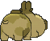
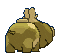

# #449 Hippopotas (Hippo Pokémon)

| Official Artwork | Shiny Artwork |
|------------------|---------------|
|  |  |

**Rising Ruby:** It lives in arid places. Instead of perspiration, it expels grainy sand from its body.

**Sinking Sapphire:** It enshrouds itself with sand to protect itself from germs. It does not enjoy getting wet.

---

## Media

### Default Sprites

| Front | Shiny | Back | Shiny |
|-------|-------|------|-------|
|  |  |  |  |

### Female Sprites

| Front | Shiny | Back | Shiny |
|-------|-------|------|-------|
|  |  |  |  |

### Cries

Latest (Gen VI+):

<audio controls>
<source src='../../assets/cries/hippopotas/latest.ogg' type='audio/ogg'>
  Your browser does not support the audio element.
</audio>

Legacy:

<audio controls>
<source src='../../assets/cries/hippopotas/legacy.ogg' type='audio/ogg'>
  Your browser does not support the audio element.
</audio>

---

## Pokédex Data

| National № | Type(s) | Height | Weight | Abilities | Local № |
|------------|---------|--------|--------|-----------|---------|
| #449 | {: width="48"} | 0.8 m / 2.6 ft | 49.5 kg / 109.1 lbs | 1. Sand Stream 2. Sand Force | #122 |

---

## Base Stats
|   | HP | Attack | Defense | Sp. Atk | Sp. Def | Speed |
|---|----|--------|---------|---------|---------|-------|
| **Base** | 68 | 72 | 78 | 38 | 42 | 32 |
| **Min** | 246 | 134 | 144 | 72 | 80 | 62 |
| **Max** | 340 | 267 | 280 | 192 | 201 | 179 |

The ranges shown above are for a level 100 Pokémon. Maximum values are based on a beneficial nature, 252 EVs, 31 IVs; minimum values are based on a hindering nature, 0 EVs, 0 IVs.

---

## Forms & Evolutions

!!! warning "WARNING"

    Information on evolutions may not be 100% accurate; differences between evolution methods across generations are not accounted for.

### Forms

Hippopotas has no alternate forms.

### Evolution Line

1. [Hippopotas](hippopotas.md/)
    1. Level Up: [Hippowdon](hippowdon.md/)

---

## Training

| EV Yield | Catch Rate | Base Friendship | Base Exp. | Growth Rate | Held Items |
|----------|------------|-----------------|-----------|-------------|------------|
| 1 Def | 140 | 50 | 66 | Slow | Armor Fossil (50%) |

---

## Breeding

| Egg Groups | Egg Cycles | Gender | Dimorphic | Color | Shape |
|------------|------------|--------|-----------|-------|-------|
| 1. Ground | 30 | 50.0% Male 50.0% Female | True | Brown | Quadruped |

---

## Moves

!!! warning "WARNING"

    Specific move information may be incorrect. However, the general movepool should be accurate; this includes changes made in Sacred Gold and Storm Silver.

### Level Up Moves

| Lv. | Move | Type | Cat. | Power | Acc. | PP |
| --- | --- | --- | --- | --- | --- | --- |
| 1 | Sand Attack | {: width="48"} | {: width="36"} | — | 100 | 15 |
| 1 | Tackle | {: width="48"} | {: width="36"} | 40 | 100 | 35 |
| 7 | Bite | {: width="48"} | {: width="36"} | 60 | 100 | 25 |
| 10 | Yawn | {: width="48"} | {: width="36"} | — | — | 10 |
| 13 | Take Down | {: width="48"} | {: width="36"} | 90 | 85 | 20 |
| 16 | Dig | {: width="48"} | {: width="36"} | 80 | 100 | 10 |
| 19 | Curse | {: width="48"} | {: width="36"} | — | — | 10 |
| 22 | Sand Tomb | {: width="48"} | {: width="36"} | 35 | 85 | 15 |
| 25 | Slack Off | {: width="48"} | {: width="36"} | — | — | 5 |
| 28 | Bulldoze | {: width="48"} | {: width="36"} | 60 | 100 | 20 |
| 31 | Crunch | {: width="48"} | {: width="36"} | 80 | 100 | 15 |
| 34 | Rock Slide | {: width="48"} | {: width="36"} | 75 | 90 | 10 |
| 37 | Earthquake | {: width="48"} | {: width="36"} | 100 | 100 | 10 |
| 40 | Double Edge | {: width="48"} | {: width="36"} | 120 | 100 | 15 |
| 43 | Fissure | {: width="48"} | {: width="36"} | — | 30 | 5 |
| 46 | Superpower | {: width="48"} | {: width="36"} | 120 | 100 | 5 |

### TM Moves

| TM | Move | Type | Cat. | Power | Acc. | PP |
| --- | --- | --- | --- | --- | --- | --- |
| HM04 | Strength | {: width="48"} | {: width="36"} | 100 | 100 | 10 |
| HM06 | Rock Smash | {: width="48"} | {: width="36"} | 65 | 100 | 15 |
| TM05 | Roar | {: width="48"} | {: width="36"} | — | — | 20 |
| TM06 | Toxic | {: width="48"} | {: width="36"} | — | 90 | 10 |
| TM10 | Hidden Power | {: width="48"} | {: width="36"} | 60 | 100 | 15 |
| TM100 | Confide | {: width="48"} | {: width="36"} | — | — | 20 |
| TM11 | Sunny Day | {: width="48"} | {: width="36"} | — | — | 5 |
| TM17 | Protect | {: width="48"} | {: width="36"} | — | — | 10 |
| TM21 | Frustration | {: width="48"} | {: width="36"} | — | 100 | 20 |
| TM26 | Earthquake | {: width="48"} | {: width="36"} | 100 | 100 | 10 |
| TM27 | Return | {: width="48"} | {: width="36"} | — | 100 | 20 |
| TM28 | Dig | {: width="48"} | {: width="36"} | 80 | 100 | 10 |
| TM32 | Double Team | {: width="48"} | {: width="36"} | — | — | 15 |
| TM37 | Sandstorm | {: width="48"} | {: width="36"} | — | — | 10 |
| TM39 | Rock Tomb | {: width="48"} | {: width="36"} | 60 | 95 | 15 |
| TM42 | Facade | {: width="48"} | {: width="36"} | 70 | 100 | 20 |
| TM44 | Rest | {: width="48"} | {: width="36"} | — | — | 5 |
| TM45 | Attract | {: width="48"} | {: width="36"} | — | 100 | 15 |
| TM48 | Round | {: width="48"} | {: width="36"} | 60 | 100 | 15 |
| TM78 | Bulldoze | {: width="48"} | {: width="36"} | 60 | 100 | 20 |
| TM80 | Rock Slide | {: width="48"} | {: width="36"} | 75 | 90 | 10 |
| TM87 | Swagger | {: width="48"} | {: width="36"} | — | 85 | 15 |
| TM88 | Sleep Talk | {: width="48"} | {: width="36"} | — | — | 10 |
| TM90 | Substitute | {: width="48"} | {: width="36"} | — | — | 10 |
| TM94 | Secret Power | {: width="48"} | {: width="36"} | 70 | 100 | 20 |

### Egg Moves

| Move | Type | Cat. | Power | Acc. | PP |
| --- | --- | --- | --- | --- | --- |
| Body Slam | {: width="48"} | {: width="36"} | 85 | 100 | 15 |
| Curse | {: width="48"} | {: width="36"} | — | — | 10 |
| Revenge | {: width="48"} | {: width="36"} | 60 | 100 | 10 |
| Sand Tomb | {: width="48"} | {: width="36"} | 35 | 85 | 15 |
| Slack Off | {: width="48"} | {: width="36"} | — | — | 5 |
| Sleep Talk | {: width="48"} | {: width="36"} | — | — | 10 |
| Spit Up | {: width="48"} | {: width="36"} | — | 100 | 10 |
| Stockpile | {: width="48"} | {: width="36"} | — | — | 20 |
| Swallow | {: width="48"} | {: width="36"} | — | — | 10 |
| Whirlwind | {: width="48"} | {: width="36"} | — | — | 20 |

### Tutor Moves

| Move | Type | Cat. | Power | Acc. | PP |
| --- | --- | --- | --- | --- | --- |
| Earth Power | {: width="48"} | {: width="36"} | 90 | 100 | 10 |
| Iron Tail | {: width="48"} | {: width="36"} | 100 | 75 | 15 |
| Snore | {: width="48"} | {: width="36"} | 50 | 100 | 15 |
| Stealth Rock | {: width="48"} | {: width="36"} | — | — | 20 |
| Superpower | {: width="48"} | {: width="36"} | 120 | 100 | 5 |
| Water Pulse | {: width="48"} | {: width="36"} | 60 | 100 | 20 |

