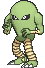
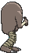

# #106 Hitmonlee (Kicking Pokémon)

| Official Artwork | Shiny Artwork |
|------------------|---------------|
|  |  |

Hitmonlee’s legs freely contract and stretch. Using these springlike legs, it bowls over foes with devastating kicks. After battle, it rubs down its legs and loosens the muscles to overcome fatigue.

---

## Media

### Default Sprites

| Front | Shiny | Back | Shiny |
|-------|-------|------|-------|
|  |  |  |  |

### Cries

Latest (Gen VI+):

<audio controls>
<source src='../../assets/cries/hitmonlee/latest.ogg' type='audio/ogg'>
  Your browser does not support the audio element.
</audio>

Legacy:

<audio controls>
<source src='../../assets/cries/hitmonlee/legacy.ogg' type='audio/ogg'>
  Your browser does not support the audio element.
</audio>

---

## Pokédex Data

| National № | Type(s) | Height | Weight | Abilities | Local № |
|------------|---------|--------|--------|-----------|---------|
| #106 | {: width="48"} | 1.5 m / 4.9 ft | 49.8 kg / 109.8 lbs | 1. Limber 2. Reckless | N/A |

---

## Base Stats
|   | HP | Attack | Defense | Sp. Atk | Sp. Def | Speed |
|---|----|--------|---------|---------|---------|-------|
| **Base** | 50 | 120 | 53 | 35 | 110 | 87 |
| **Min** | 210 | 220 | 99 | 67 | 202 | 161 |
| **Max** | 304 | 372 | 225 | 185 | 350 | 300 |

The ranges shown above are for a level 100 Pokémon. Maximum values are based on a beneficial nature, 252 EVs, 31 IVs; minimum values are based on a hindering nature, 0 EVs, 0 IVs.

---

## Forms & Evolutions

!!! warning "WARNING"

    Information on evolutions may not be 100% accurate; differences between evolution methods across generations are not accounted for.

### Forms

Hitmonlee has no alternate forms.

### Evolution Line

1. [Tyrogue](tyrogue.md/)
    1. Level Up: [Hitmonlee](hitmonlee.md/)

    2. Level Up: [Hitmonchan](hitmonchan.md/)

    3. Level Up: [Hitmontop](hitmontop.md/)

---

## Training

| EV Yield | Catch Rate | Base Friendship | Base Exp. | Growth Rate | Held Items |
|----------|------------|-----------------|-----------|-------------|------------|
| 2 Atk | 45 | 50 | 159 | Medium | N/A |

---

## Breeding

| Egg Groups | Egg Cycles | Gender | Dimorphic | Color | Shape |
|------------|------------|--------|-----------|-------|-------|
| 1. Humanshape | 25 | 100.0% Male 0.0% Female | False | Brown | Humanoid |

---

## Moves

!!! warning "WARNING"

    Specific move information may be incorrect. However, the general movepool should be accurate; this includes changes made in Sacred Gold and Storm Silver.

### Level Up Moves

| Lv. | Move | Type | Cat. | Power | Acc. | PP |
| --- | --- | --- | --- | --- | --- | --- |
| 1 | Close Combat | {: width="48"} | {: width="36"} | 120 | 100 | 5 |
| 1 | Double Kick | {: width="48"} | {: width="36"} | 30 | 100 | 30 |
| 1 | Mega Kick | {: width="48"} | {: width="36"} | 120 | 75 | 5 |
| 1 | Revenge | {: width="48"} | {: width="36"} | 60 | 100 | 10 |
| 1 | Reversal | {: width="48"} | {: width="36"} | — | 100 | 15 |
| 5 | Meditate | {: width="48"} | {: width="36"} | — | — | 40 |
| 9 | Rolling Kick | {: width="48"} | {: width="36"} | 60 | 85 | 15 |
| 13 | Jump Kick | {: width="48"} | {: width="36"} | 100 | 95 | 10 |
| 17 | Brick Break | {: width="48"} | {: width="36"} | 75 | 100 | 15 |
| 20 | Rolling Kick | {: width="48"} | {: width="36"} | 60 | 85 | 15 |
| 21 | Focus Energy | {: width="48"} | {: width="36"} | — | — | 30 |
| 25 | Feint | {: width="48"} | {: width="36"} | 30 | 100 | 10 |
| 29 | High Jump Kick | {: width="48"} | {: width="36"} | 130 | 90 | 10 |
| 33 | Mind Reader | {: width="48"} | {: width="36"} | — | — | 5 |
| 37 | Foresight | {: width="48"} | {: width="36"} | — | — | 40 |
| 41 | Wide Guard | {: width="48"} | {: width="36"} | — | — | 10 |
| 45 | Blaze Kick | {: width="48"} | {: width="36"} | 85 | 90 | 10 |
| 49 | Endure | {: width="48"} | {: width="36"} | — | — | 10 |
| 53 | Mega Kick | {: width="48"} | {: width="36"} | 120 | 75 | 5 |
| 57 | Close Combat | {: width="48"} | {: width="36"} | 120 | 100 | 5 |
| 61 | Reversal | {: width="48"} | {: width="36"} | — | 100 | 15 |
| 65 | Bounce | {: width="48"} | {: width="36"} | 85 | 85 | 5 |

### TM Moves

| TM | Move | Type | Cat. | Power | Acc. | PP |
| --- | --- | --- | --- | --- | --- | --- |
| HM04 | Strength | {: width="48"} | {: width="36"} | 100 | 100 | 10 |
| HM06 | Rock Smash | {: width="48"} | {: width="36"} | 65 | 100 | 15 |
| TM06 | Toxic | {: width="48"} | {: width="36"} | — | 90 | 10 |
| TM08 | Bulk Up | {: width="48"} | {: width="36"} | — | — | 20 |
| TM10 | Hidden Power | {: width="48"} | {: width="36"} | 60 | 100 | 15 |
| TM100 | Confide | {: width="48"} | {: width="36"} | — | — | 20 |
| TM11 | Sunny Day | {: width="48"} | {: width="36"} | — | — | 5 |
| TM17 | Protect | {: width="48"} | {: width="36"} | — | — | 10 |
| TM18 | Rain Dance | {: width="48"} | {: width="36"} | — | — | 5 |
| TM21 | Frustration | {: width="48"} | {: width="36"} | — | 100 | 20 |
| TM26 | Earthquake | {: width="48"} | {: width="36"} | 100 | 100 | 10 |
| TM27 | Return | {: width="48"} | {: width="36"} | — | 100 | 20 |
| TM31 | Brick Break | {: width="48"} | {: width="36"} | 75 | 100 | 15 |
| TM32 | Double Team | {: width="48"} | {: width="36"} | — | — | 15 |
| TM39 | Rock Tomb | {: width="48"} | {: width="36"} | 60 | 95 | 15 |
| TM42 | Facade | {: width="48"} | {: width="36"} | 70 | 100 | 20 |
| TM44 | Rest | {: width="48"} | {: width="36"} | — | — | 5 |
| TM45 | Attract | {: width="48"} | {: width="36"} | — | 100 | 15 |
| TM46 | Thief | {: width="48"} | {: width="36"} | 60 | 100 | 25 |
| TM47 | Low Sweep | {: width="48"} | {: width="36"} | 65 | 100 | 20 |
| TM48 | Round | {: width="48"} | {: width="36"} | 60 | 100 | 15 |
| TM52 | Focus Blast | {: width="48"} | {: width="36"} | 120 | 70 | 5 |
| TM56 | Fling | {: width="48"} | {: width="36"} | — | 100 | 10 |
| TM67 | Retaliate | {: width="48"} | {: width="36"} | 70 | 100 | 5 |
| TM71 | Stone Edge | {: width="48"} | {: width="36"} | 100 | 80 | 5 |
| TM78 | Bulldoze | {: width="48"} | {: width="36"} | 60 | 100 | 20 |
| TM80 | Rock Slide | {: width="48"} | {: width="36"} | 75 | 90 | 10 |
| TM84 | Poison Jab | {: width="48"} | {: width="36"} | 80 | 100 | 20 |
| TM87 | Swagger | {: width="48"} | {: width="36"} | — | 85 | 15 |
| TM88 | Sleep Talk | {: width="48"} | {: width="36"} | — | — | 10 |
| TM90 | Substitute | {: width="48"} | {: width="36"} | — | — | 10 |
| TM94 | Secret Power | {: width="48"} | {: width="36"} | 70 | 100 | 20 |
| TM98 | Power Up Punch | {: width="48"} | {: width="36"} | 40 | 100 | 20 |

### Egg Moves

Hitmonlee cannot learn any moves by breeding.
### Tutor Moves

| Move | Type | Cat. | Power | Acc. | PP |
| --- | --- | --- | --- | --- | --- |
| Bounce | {: width="48"} | {: width="36"} | 85 | 85 | 5 |
| Covet | {: width="48"} | {: width="36"} | 60 | 100 | 25 |
| Focus Punch | {: width="48"} | {: width="36"} | 150 | 100 | 20 |
| Helping Hand | {: width="48"} | {: width="36"} | — | — | 20 |
| Knock Off | {: width="48"} | {: width="36"} | 65 | 100 | 20 |
| Low Kick | {: width="48"} | {: width="36"} | — | 100 | 20 |
| Role Play | {: width="48"} | {: width="36"} | — | — | 10 |
| Snore | {: width="48"} | {: width="36"} | 50 | 100 | 15 |
| Superpower | {: width="48"} | {: width="36"} | 120 | 100 | 5 |

