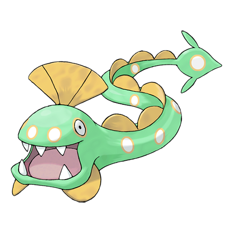

# #367 Huntail (Deep Sea Pokémon)

| Official Artwork | Shiny Artwork |
|------------------|---------------|
|  |  |

**Rising Ruby:** Huntail’s presence went unnoticed by people for a long time because it lives at extreme depths in the sea. This Pokémon’s eyes can see clearly even in the murky dark depths of the ocean.

**Sinking Sapphire:** Huntail’s tail is shaped like a fish. It uses the tail to attract prey, then swallows the prey whole with its large, gaping mouth. This Pokémon swims by wiggling its slender body like a snake.

---

## Media

### Default Sprites

| Front | Shiny | Back | Shiny |
|-------|-------|------|-------|
|  |  |  |  |

### Cries

Latest (Gen VI+):

<audio controls>
<source src='../../assets/cries/huntail/latest.ogg' type='audio/ogg'>
  Your browser does not support the audio element.
</audio>

Legacy:

<audio controls>
<source src='../../assets/cries/huntail/legacy.ogg' type='audio/ogg'>
  Your browser does not support the audio element.
</audio>

---

## Pokédex Data

| National № | Type(s) | Height | Weight | Abilities | Local № |
|------------|---------|--------|--------|-----------|---------|
| #367 | {: width="48"} | 1.7 m / 5.6 ft | 27.0 kg / 59.5 lbs | 1. Swift Swim 2. Water Veil | N/A |

---

## Base Stats
|   | HP | Attack | Defense | Sp. Atk | Sp. Def | Speed |
|---|----|--------|---------|---------|---------|-------|
| **Base** | 55 | 104 | 105 | 94 | 75 | 52 |
| **Min** | 220 | 191 | 193 | 173 | 139 | 98 |
| **Max** | 314 | 337 | 339 | 315 | 273 | 223 |

The ranges shown above are for a level 100 Pokémon. Maximum values are based on a beneficial nature, 252 EVs, 31 IVs; minimum values are based on a hindering nature, 0 EVs, 0 IVs.

---

## Forms & Evolutions

!!! warning "WARNING"

    Information on evolutions may not be 100% accurate; differences between evolution methods across generations are not accounted for.

### Forms

Huntail has no alternate forms.

### Evolution Line

1. [Clamperl](clamperl.md/)
    1. Trade: [Huntail](huntail.md/)

    2. Trade: [Gorebyss](gorebyss.md/)

---

## Training

| EV Yield | Catch Rate | Base Friendship | Base Exp. | Growth Rate | Held Items |
|----------|------------|-----------------|-----------|-------------|------------|
| 1 Atk 1 Def | 60 | 70 | 170 | Slow Then Very Fast | Deep Sea Tooth (5%) |

---

## Breeding

| Egg Groups | Egg Cycles | Gender | Dimorphic | Color | Shape |
|------------|------------|--------|-----------|-------|-------|
| 1. Water1 | 20 | 50.0% Male 50.0% Female | False | Blue | Squiggle |

---

## Moves

!!! warning "WARNING"

    Specific move information may be incorrect. However, the general movepool should be accurate; this includes changes made in Sacred Gold and Storm Silver.

### Level Up Moves

| Lv. | Move | Type | Cat. | Power | Acc. | PP |
| --- | --- | --- | --- | --- | --- | --- |
| 1 | Bite | {: width="48"} | {: width="36"} | 60 | 100 | 25 |
| 1 | Whirlpool | {: width="48"} | {: width="36"} | 35 | 85 | 15 |
| 5 | Screech | {: width="48"} | {: width="36"} | — | 85 | 40 |
| 9 | Scary Face | {: width="48"} | {: width="36"} | — | 100 | 10 |
| 11 | Feint Attack | {: width="48"} | {: width="36"} | 60 | — | 20 |
| 14 | Water Pulse | {: width="48"} | {: width="36"} | 60 | 100 | 20 |
| 16 | Ice Fang | {: width="48"} | {: width="36"} | 65 | 95 | 15 |
| 19 | Brine | {: width="48"} | {: width="36"} | 65 | 100 | 10 |
| 23 | Sucker Punch | {: width="48"} | {: width="36"} | 70 | 100 | 5 |
| 26 | Dive | {: width="48"} | {: width="36"} | 80 | 100 | 10 |
| 29 | Baton Pass | {: width="48"} | {: width="36"} | — | — | 40 |
| 34 | Crunch | {: width="48"} | {: width="36"} | 80 | 100 | 15 |
| 39 | Aqua Tail | {: width="48"} | {: width="36"} | 90 | 90 | 10 |
| 45 | Coil | {: width="48"} | {: width="36"} | — | — | 20 |
| 50 | Hydro Pump | {: width="48"} | {: width="36"} | 110 | 80 | 5 |

### TM Moves

| TM | Move | Type | Cat. | Power | Acc. | PP |
| --- | --- | --- | --- | --- | --- | --- |
| HM03 | Surf | {: width="48"} | {: width="36"} | 90 | 100 | 15 |
| HM05 | Waterfall | {: width="48"} | {: width="36"} | 80 | 100 | 15 |
| HM07 | Dive | {: width="48"} | {: width="36"} | 80 | 100 | 10 |
| TM06 | Toxic | {: width="48"} | {: width="36"} | — | 90 | 10 |
| TM07 | Hail | {: width="48"} | {: width="36"} | — | — | 10 |
| TM10 | Hidden Power | {: width="48"} | {: width="36"} | 60 | 100 | 15 |
| TM100 | Confide | {: width="48"} | {: width="36"} | — | — | 20 |
| TM13 | Ice Beam | {: width="48"} | {: width="36"} | 90 | 100 | 10 |
| TM14 | Blizzard | {: width="48"} | {: width="36"} | 110 | 70 | 5 |
| TM15 | Hyper Beam | {: width="48"} | {: width="36"} | 150 | 90 | 5 |
| TM17 | Protect | {: width="48"} | {: width="36"} | — | — | 10 |
| TM18 | Rain Dance | {: width="48"} | {: width="36"} | — | — | 5 |
| TM21 | Frustration | {: width="48"} | {: width="36"} | — | 100 | 20 |
| TM27 | Return | {: width="48"} | {: width="36"} | — | 100 | 20 |
| TM32 | Double Team | {: width="48"} | {: width="36"} | — | — | 15 |
| TM39 | Rock Tomb | {: width="48"} | {: width="36"} | 60 | 95 | 15 |
| TM42 | Facade | {: width="48"} | {: width="36"} | 70 | 100 | 20 |
| TM44 | Rest | {: width="48"} | {: width="36"} | — | — | 5 |
| TM45 | Attract | {: width="48"} | {: width="36"} | — | 100 | 15 |
| TM48 | Round | {: width="48"} | {: width="36"} | 60 | 100 | 15 |
| TM55 | Scald | {: width="48"} | {: width="36"} | 80 | 100 | 15 |
| TM68 | Giga Impact | {: width="48"} | {: width="36"} | 150 | 90 | 5 |
| TM83 | Infestation | {: width="48"} | {: width="36"} | 20 | 100 | 20 |
| TM87 | Swagger | {: width="48"} | {: width="36"} | — | 85 | 15 |
| TM88 | Sleep Talk | {: width="48"} | {: width="36"} | — | — | 10 |
| TM90 | Substitute | {: width="48"} | {: width="36"} | — | — | 10 |
| TM94 | Secret Power | {: width="48"} | {: width="36"} | 70 | 100 | 20 |

### Egg Moves

Huntail cannot learn any moves by breeding.
### Tutor Moves

| Move | Type | Cat. | Power | Acc. | PP |
| --- | --- | --- | --- | --- | --- |
| Aqua Tail | {: width="48"} | {: width="36"} | 90 | 90 | 10 |
| Bind | {: width="48"} | {: width="36"} | 15 | 85 | 20 |
| Bounce | {: width="48"} | {: width="36"} | 85 | 85 | 5 |
| Icy Wind | {: width="48"} | {: width="36"} | 55 | 95 | 15 |
| Snatch | {: width="48"} | {: width="36"} | — | — | 10 |
| Snore | {: width="48"} | {: width="36"} | 50 | 100 | 15 |
| Super Fang | {: width="48"} | {: width="36"} | — | 90 | 10 |
| Water Pulse | {: width="48"} | {: width="36"} | 60 | 100 | 20 |

