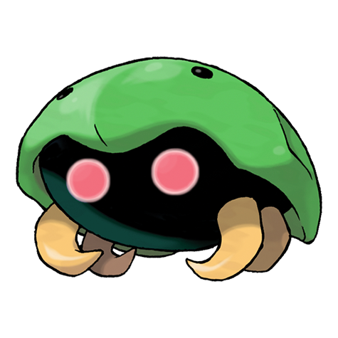
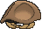

# #140 Kabuto (Shellfish Pokémon)

| Official Artwork | Shiny Artwork |
|------------------|---------------|
|  |  |

Kabuto is a Pokémon that has been regenerated from a fossil. However, in extremely rare cases, living examples have been discovered. The Pokémon has not changed at all for 300 million years.

---

## Media

### Default Sprites

| Front | Shiny | Back | Shiny |
|-------|-------|------|-------|
|  |  |  |  |

### Cries

Latest (Gen VI+):

<audio controls>
<source src='../../assets/cries/kabuto/latest.ogg' type='audio/ogg'>
  Your browser does not support the audio element.
</audio>

Legacy:

<audio controls>
<source src='../../assets/cries/kabuto/legacy.ogg' type='audio/ogg'>
  Your browser does not support the audio element.
</audio>

---

## Pokédex Data

| National № | Type(s) | Height | Weight | Abilities | Local № |
|------------|---------|--------|--------|-----------|---------|
| #140 | {: width="48"} {: width="48"} | 0.5 m / 1.6 ft | 11.5 kg / 25.4 lbs | 1. Swift Swim 2. Battle Armor | N/A |

---

## Base Stats
|   | HP | Attack | Defense | Sp. Atk | Sp. Def | Speed |
|---|----|--------|---------|---------|---------|-------|
| **Base** | 30 | 80 | 90 | 55 | 45 | 55 |
| **Min** | 170 | 148 | 166 | 103 | 85 | 103 |
| **Max** | 264 | 284 | 306 | 229 | 207 | 229 |

The ranges shown above are for a level 100 Pokémon. Maximum values are based on a beneficial nature, 252 EVs, 31 IVs; minimum values are based on a hindering nature, 0 EVs, 0 IVs.

---

## Forms & Evolutions

!!! warning "WARNING"

    Information on evolutions may not be 100% accurate; differences between evolution methods across generations are not accounted for.

### Forms

Kabuto has no alternate forms.

### Evolution Line

1. [Kabuto](kabuto.md/)
    1. Level Up: [Kabutops](kabutops.md/)

---

## Training

| EV Yield | Catch Rate | Base Friendship | Base Exp. | Growth Rate | Held Items |
|----------|------------|-----------------|-----------|-------------|------------|
| 1 Def | 45 | 50 | 71 | Medium | N/A |

---

## Breeding

| Egg Groups | Egg Cycles | Gender | Dimorphic | Color | Shape |
|------------|------------|--------|-----------|-------|-------|
| 1. Water1 2. Water3 | 30 | 87.5% Male 12.5% Female | False | Brown | Armor |

---

## Moves

!!! warning "WARNING"

    Specific move information may be incorrect. However, the general movepool should be accurate; this includes changes made in Sacred Gold and Storm Silver.

### Level Up Moves

| Lv. | Move | Type | Cat. | Power | Acc. | PP |
| --- | --- | --- | --- | --- | --- | --- |
| 1 | Harden | {: width="48"} | {: width="36"} | — | — | 30 |
| 1 | Scratch | {: width="48"} | {: width="36"} | 50 | 100 | 35 |
| 6 | Absorb | {: width="48"} | {: width="36"} | 20 | 100 | 25 |
| 10 | Leer | {: width="48"} | {: width="36"} | — | 100 | 30 |
| 14 | Mud Shot | {: width="48"} | {: width="36"} | 55 | 95 | 15 |
| 18 | Sand Attack | {: width="48"} | {: width="36"} | — | 100 | 15 |
| 22 | Endure | {: width="48"} | {: width="36"} | — | — | 10 |
| 26 | Aqua Jet | {: width="48"} | {: width="36"} | 40 | 100 | 20 |
| 30 | Knock Off | {: width="48"} | {: width="36"} | 65 | 100 | 20 |
| 34 | Mega Drain | {: width="48"} | {: width="36"} | 40 | 100 | 15 |
| 38 | Ancient Power | {: width="48"} | {: width="36"} | 80 | 100 | 10 |
| 42 | Waterfall | {: width="48"} | {: width="36"} | 80 | 100 | 15 |
| 46 | Stone Edge | {: width="48"} | {: width="36"} | 100 | 80 | 5 |
| 50 | Metal Sound | {: width="48"} | {: width="36"} | — | 85 | 40 |
| 54 | Wring Out | {: width="48"} | {: width="36"} | — | 100 | 5 |

### TM Moves

| TM | Move | Type | Cat. | Power | Acc. | PP |
| --- | --- | --- | --- | --- | --- | --- |
| HM03 | Surf | {: width="48"} | {: width="36"} | 90 | 100 | 15 |
| HM05 | Waterfall | {: width="48"} | {: width="36"} | 80 | 100 | 15 |
| HM06 | Rock Smash | {: width="48"} | {: width="36"} | 65 | 100 | 15 |
| TM01 | Hone Claws | {: width="48"} | {: width="36"} | — | — | 15 |
| TM06 | Toxic | {: width="48"} | {: width="36"} | — | 90 | 10 |
| TM07 | Hail | {: width="48"} | {: width="36"} | — | — | 10 |
| TM10 | Hidden Power | {: width="48"} | {: width="36"} | 60 | 100 | 15 |
| TM100 | Confide | {: width="48"} | {: width="36"} | — | — | 20 |
| TM13 | Ice Beam | {: width="48"} | {: width="36"} | 90 | 100 | 10 |
| TM14 | Blizzard | {: width="48"} | {: width="36"} | 110 | 70 | 5 |
| TM17 | Protect | {: width="48"} | {: width="36"} | — | — | 10 |
| TM18 | Rain Dance | {: width="48"} | {: width="36"} | — | — | 5 |
| TM21 | Frustration | {: width="48"} | {: width="36"} | — | 100 | 20 |
| TM23 | Smack Down | {: width="48"} | {: width="36"} | 50 | 100 | 15 |
| TM27 | Return | {: width="48"} | {: width="36"} | — | 100 | 20 |
| TM28 | Dig | {: width="48"} | {: width="36"} | 80 | 100 | 10 |
| TM32 | Double Team | {: width="48"} | {: width="36"} | — | — | 15 |
| TM37 | Sandstorm | {: width="48"} | {: width="36"} | — | — | 10 |
| TM39 | Rock Tomb | {: width="48"} | {: width="36"} | 60 | 95 | 15 |
| TM40 | Aerial Ace | {: width="48"} | {: width="36"} | 60 | — | 20 |
| TM42 | Facade | {: width="48"} | {: width="36"} | 70 | 100 | 20 |
| TM44 | Rest | {: width="48"} | {: width="36"} | — | — | 5 |
| TM45 | Attract | {: width="48"} | {: width="36"} | — | 100 | 15 |
| TM46 | Thief | {: width="48"} | {: width="36"} | 60 | 100 | 25 |
| TM48 | Round | {: width="48"} | {: width="36"} | 60 | 100 | 15 |
| TM55 | Scald | {: width="48"} | {: width="36"} | 80 | 100 | 15 |
| TM69 | Rock Polish | {: width="48"} | {: width="36"} | — | — | 20 |
| TM80 | Rock Slide | {: width="48"} | {: width="36"} | 75 | 90 | 10 |
| TM87 | Swagger | {: width="48"} | {: width="36"} | — | 85 | 15 |
| TM88 | Sleep Talk | {: width="48"} | {: width="36"} | — | — | 10 |
| TM90 | Substitute | {: width="48"} | {: width="36"} | — | — | 10 |
| TM94 | Secret Power | {: width="48"} | {: width="36"} | 70 | 100 | 20 |

### Egg Moves

| Move | Type | Cat. | Power | Acc. | PP |
| --- | --- | --- | --- | --- | --- |
| Aurora Beam | {: width="48"} | {: width="36"} | 65 | 100 | 20 |
| Bubble Beam | {: width="48"} | {: width="36"} | 65 | 100 | 20 |
| Confuse Ray | {: width="48"} | {: width="36"} | — | 100 | 10 |
| Flail | {: width="48"} | {: width="36"} | — | 100 | 15 |
| Foresight | {: width="48"} | {: width="36"} | — | — | 40 |
| Giga Drain | {: width="48"} | {: width="36"} | 75 | 100 | 10 |
| Icy Wind | {: width="48"} | {: width="36"} | 55 | 95 | 15 |
| Knock Off | {: width="48"} | {: width="36"} | 65 | 100 | 20 |
| Mud Shot | {: width="48"} | {: width="36"} | 55 | 95 | 15 |
| Rapid Spin | {: width="48"} | {: width="36"} | 50 | 100 | 40 |
| Screech | {: width="48"} | {: width="36"} | — | 85 | 40 |
| Take Down | {: width="48"} | {: width="36"} | 90 | 85 | 20 |

### Tutor Moves

| Move | Type | Cat. | Power | Acc. | PP |
| --- | --- | --- | --- | --- | --- |
| Earth Power | {: width="48"} | {: width="36"} | 90 | 100 | 10 |
| Giga Drain | {: width="48"} | {: width="36"} | 75 | 100 | 10 |
| Icy Wind | {: width="48"} | {: width="36"} | 55 | 95 | 15 |
| Iron Defense | {: width="48"} | {: width="36"} | — | — | 15 |
| Knock Off | {: width="48"} | {: width="36"} | 65 | 100 | 20 |
| Snore | {: width="48"} | {: width="36"} | 50 | 100 | 15 |
| Stealth Rock | {: width="48"} | {: width="36"} | — | — | 20 |
| Water Pulse | {: width="48"} | {: width="36"} | 60 | 100 | 20 |

