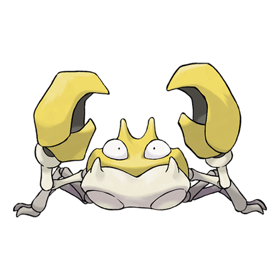
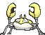
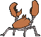
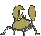

# #098 Krabby (River Crab Pokémon)

| Official Artwork | Shiny Artwork |
|------------------|---------------|
|  |  |

Krabby live on beaches, burrowed inside holes dug into the sand. On sandy beaches with little in the way of food, these Pokémon can be seen squabbling with each other over territory.

---

## Media

### Default Sprites

| Front | Shiny | Back | Shiny |
|-------|-------|------|-------|
|  |  |  |  |

### Cries

Latest (Gen VI+):

<audio controls>
<source src='../../assets/cries/krabby/latest.ogg' type='audio/ogg'>
  Your browser does not support the audio element.
</audio>

Legacy:

<audio controls>
<source src='../../assets/cries/krabby/legacy.ogg' type='audio/ogg'>
  Your browser does not support the audio element.
</audio>

---

## Pokédex Data

| National № | Type(s) | Height | Weight | Abilities | Local № |
|------------|---------|--------|--------|-----------|---------|
| #98 | {: width="48"} | 0.4 m / 1.3 ft | 6.5 kg / 14.3 lbs | 1. Hyper Cutter 2. Shell Armor | N/A |

---

## Base Stats
|   | HP | Attack | Defense | Sp. Atk | Sp. Def | Speed |
|---|----|--------|---------|---------|---------|-------|
| **Base** | 30 | 105 | 90 | 25 | 25 | 50 |
| **Min** | 170 | 193 | 166 | 49 | 49 | 94 |
| **Max** | 264 | 339 | 306 | 163 | 163 | 218 |

The ranges shown above are for a level 100 Pokémon. Maximum values are based on a beneficial nature, 252 EVs, 31 IVs; minimum values are based on a hindering nature, 0 EVs, 0 IVs.

---

## Forms & Evolutions

!!! warning "WARNING"

    Information on evolutions may not be 100% accurate; differences between evolution methods across generations are not accounted for.

### Forms

Krabby has no alternate forms.

### Evolution Line

1. [Krabby](krabby.md/)
    1. Level Up: [Kingler](kingler.md/)

---

## Training

| EV Yield | Catch Rate | Base Friendship | Base Exp. | Growth Rate | Held Items |
|----------|------------|-----------------|-----------|-------------|------------|
| 1 Atk | 225 | 50 | 65 | Medium | N/A |

---

## Breeding

| Egg Groups | Egg Cycles | Gender | Dimorphic | Color | Shape |
|------------|------------|--------|-----------|-------|-------|
| 1. Water3 | 20 | 50.0% Male 50.0% Female | False | Red | Armor |

---

## Moves

!!! warning "WARNING"

    Specific move information may be incorrect. However, the general movepool should be accurate; this includes changes made in Sacred Gold and Storm Silver.

### Level Up Moves

| Lv. | Move | Type | Cat. | Power | Acc. | PP |
| --- | --- | --- | --- | --- | --- | --- |
| 1 | Bubble | {: width="48"} | {: width="36"} | 40 | 100 | 30 |
| 1 | Mud Sport | {: width="48"} | {: width="36"} | — | — | 15 |
| 3 | Vice Grip | {: width="48"} | {: width="36"} | 55 | 100 | 30 |
| 6 | Leer | {: width="48"} | {: width="36"} | — | 100 | 30 |
| 9 | Bubble Beam | {: width="48"} | {: width="36"} | 65 | 100 | 20 |
| 12 | Harden | {: width="48"} | {: width="36"} | — | — | 30 |
| 15 | Mud Shot | {: width="48"} | {: width="36"} | 55 | 95 | 15 |
| 18 | Knock Off | {: width="48"} | {: width="36"} | 65 | 100 | 20 |
| 21 | Crabhammer | {: width="48"} | {: width="36"} | 100 | 90 | 10 |
| 24 | Metal Claw | {: width="48"} | {: width="36"} | 50 | 95 | 35 |
| 27 | Stomp | {: width="48"} | {: width="36"} | 65 | 100 | 20 |
| 30 | X Scissor | {: width="48"} | {: width="36"} | 80 | 100 | 15 |
| 33 | Protect | {: width="48"} | {: width="36"} | — | — | 10 |
| 36 | Slam | {: width="48"} | {: width="36"} | 80 | 75 | 20 |
| 39 | Brine | {: width="48"} | {: width="36"} | 65 | 100 | 10 |
| 42 | Guillotine | {: width="48"} | {: width="36"} | — | 30 | 5 |
| 45 | Flail | {: width="48"} | {: width="36"} | — | 100 | 15 |

### TM Moves

| TM | Move | Type | Cat. | Power | Acc. | PP |
| --- | --- | --- | --- | --- | --- | --- |
| HM01 | Cut | {: width="48"} | {: width="36"} | 70 | 100 | 15 |
| HM03 | Surf | {: width="48"} | {: width="36"} | 90 | 100 | 15 |
| HM04 | Strength | {: width="48"} | {: width="36"} | 100 | 100 | 10 |
| HM05 | Waterfall | {: width="48"} | {: width="36"} | 80 | 100 | 15 |
| HM06 | Rock Smash | {: width="48"} | {: width="36"} | 65 | 100 | 15 |
| HM07 | Dive | {: width="48"} | {: width="36"} | 80 | 100 | 10 |
| TM01 | Hone Claws | {: width="48"} | {: width="36"} | — | — | 15 |
| TM06 | Toxic | {: width="48"} | {: width="36"} | — | 90 | 10 |
| TM07 | Hail | {: width="48"} | {: width="36"} | — | — | 10 |
| TM10 | Hidden Power | {: width="48"} | {: width="36"} | 60 | 100 | 15 |
| TM100 | Confide | {: width="48"} | {: width="36"} | — | — | 20 |
| TM13 | Ice Beam | {: width="48"} | {: width="36"} | 90 | 100 | 10 |
| TM14 | Blizzard | {: width="48"} | {: width="36"} | 110 | 70 | 5 |
| TM17 | Protect | {: width="48"} | {: width="36"} | — | — | 10 |
| TM18 | Rain Dance | {: width="48"} | {: width="36"} | — | — | 5 |
| TM21 | Frustration | {: width="48"} | {: width="36"} | — | 100 | 20 |
| TM27 | Return | {: width="48"} | {: width="36"} | — | 100 | 20 |
| TM28 | Dig | {: width="48"} | {: width="36"} | 80 | 100 | 10 |
| TM31 | Brick Break | {: width="48"} | {: width="36"} | 75 | 100 | 15 |
| TM32 | Double Team | {: width="48"} | {: width="36"} | — | — | 15 |
| TM39 | Rock Tomb | {: width="48"} | {: width="36"} | 60 | 95 | 15 |
| TM42 | Facade | {: width="48"} | {: width="36"} | 70 | 100 | 20 |
| TM44 | Rest | {: width="48"} | {: width="36"} | — | — | 5 |
| TM45 | Attract | {: width="48"} | {: width="36"} | — | 100 | 15 |
| TM46 | Thief | {: width="48"} | {: width="36"} | 60 | 100 | 25 |
| TM48 | Round | {: width="48"} | {: width="36"} | 60 | 100 | 15 |
| TM54 | False Swipe | {: width="48"} | {: width="36"} | 40 | 100 | 40 |
| TM55 | Scald | {: width="48"} | {: width="36"} | 80 | 100 | 15 |
| TM56 | Fling | {: width="48"} | {: width="36"} | — | 100 | 10 |
| TM75 | Swords Dance | {: width="48"} | {: width="36"} | — | — | 20 |
| TM80 | Rock Slide | {: width="48"} | {: width="36"} | 75 | 90 | 10 |
| TM81 | X Scissor | {: width="48"} | {: width="36"} | 80 | 100 | 15 |
| TM87 | Swagger | {: width="48"} | {: width="36"} | — | 85 | 15 |
| TM88 | Sleep Talk | {: width="48"} | {: width="36"} | — | — | 10 |
| TM90 | Substitute | {: width="48"} | {: width="36"} | — | — | 10 |
| TM94 | Secret Power | {: width="48"} | {: width="36"} | 70 | 100 | 20 |

### Egg Moves

| Move | Type | Cat. | Power | Acc. | PP |
| --- | --- | --- | --- | --- | --- |
| Agility | {: width="48"} | {: width="36"} | — | — | 30 |
| Ally Switch | {: width="48"} | {: width="36"} | — | — | 15 |
| Amnesia | {: width="48"} | {: width="36"} | — | — | 20 |
| Ancient Power | {: width="48"} | {: width="36"} | 80 | 100 | 10 |
| Bide | {: width="48"} | {: width="36"} | — | — | 10 |
| Chip Away | {: width="48"} | {: width="36"} | 70 | 100 | 20 |
| Endure | {: width="48"} | {: width="36"} | — | — | 10 |
| Flail | {: width="48"} | {: width="36"} | — | 100 | 15 |
| Haze | {: width="48"} | {: width="36"} | — | — | 30 |
| Knock Off | {: width="48"} | {: width="36"} | 65 | 100 | 20 |
| Slam | {: width="48"} | {: width="36"} | 80 | 75 | 20 |
| Tickle | {: width="48"} | {: width="36"} | — | 100 | 20 |

### Tutor Moves

| Move | Type | Cat. | Power | Acc. | PP |
| --- | --- | --- | --- | --- | --- |
| Icy Wind | {: width="48"} | {: width="36"} | 55 | 95 | 15 |
| Iron Defense | {: width="48"} | {: width="36"} | — | — | 15 |
| Knock Off | {: width="48"} | {: width="36"} | 65 | 100 | 20 |
| Snore | {: width="48"} | {: width="36"} | 50 | 100 | 15 |
| Superpower | {: width="48"} | {: width="36"} | 120 | 100 | 5 |
| Water Pulse | {: width="48"} | {: width="36"} | 60 | 100 | 20 |

