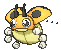
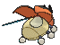
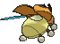
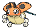
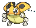
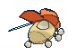
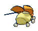

# #165 Ledyba (Five Star Pokémon)

| Official Artwork | Shiny Artwork |
|------------------|---------------|
|  |  |

Ledyba secretes an aromatic fluid from where its legs join its body. This fluid is used for communicating with others. This Pokémon conveys its feelings to others by altering the fluid’s scent.

---

## Media

### Default Sprites

| Front | Shiny | Back | Shiny |
|-------|-------|------|-------|
|  |  |  |  |

### Female Sprites

| Front | Shiny | Back | Shiny |
|-------|-------|------|-------|
|  |  |  |  |

### Cries

Latest (Gen VI+):

<audio controls>
<source src='../../assets/cries/ledyba/latest.ogg' type='audio/ogg'>
  Your browser does not support the audio element.
</audio>

Legacy:

<audio controls>
<source src='../../assets/cries/ledyba/legacy.ogg' type='audio/ogg'>
  Your browser does not support the audio element.
</audio>

---

## Pokédex Data

| National № | Type(s) | Height | Weight | Abilities | Local № |
|------------|---------|--------|--------|-----------|---------|
| #165 | {: width="48"} {: width="48"} | 1.0 m / 3.3 ft | 10.8 kg / 23.8 lbs | 1. Swarm 2. Early Bird | N/A |

---

## Base Stats
|   | HP | Attack | Defense | Sp. Atk | Sp. Def | Speed |
|---|----|--------|---------|---------|---------|-------|
| **Base** | 40 | 50 | 30 | 20 | 80 | 55 |
| **Min** | 190 | 94 | 58 | 40 | 148 | 103 |
| **Max** | 284 | 218 | 174 | 152 | 284 | 229 |

The ranges shown above are for a level 100 Pokémon. Maximum values are based on a beneficial nature, 252 EVs, 31 IVs; minimum values are based on a hindering nature, 0 EVs, 0 IVs.

---

## Forms & Evolutions

!!! warning "WARNING"

    Information on evolutions may not be 100% accurate; differences between evolution methods across generations are not accounted for.

### Forms

Ledyba has no alternate forms.

### Evolution Line

1. [Ledyba](ledyba.md/)
    1. Level Up: [Ledian](ledian.md/)

---

## Training

| EV Yield | Catch Rate | Base Friendship | Base Exp. | Growth Rate | Held Items |
|----------|------------|-----------------|-----------|-------------|------------|
| 1 Sp.-Def | 255 | 70 | 53 | Fast | N/A |

---

## Breeding

| Egg Groups | Egg Cycles | Gender | Dimorphic | Color | Shape |
|------------|------------|--------|-----------|-------|-------|
| 1. Bug | 15 | 50.0% Male 50.0% Female | True | Red | Wings |

---

## Moves

!!! warning "WARNING"

    Specific move information may be incorrect. However, the general movepool should be accurate; this includes changes made in Sacred Gold and Storm Silver.

### Level Up Moves

| Lv. | Move | Type | Cat. | Power | Acc. | PP |
| --- | --- | --- | --- | --- | --- | --- |
| 1 | Supersonic | {: width="48"} | {: width="36"} | — | 55 | 20 |
| 1 | Tackle | {: width="48"} | {: width="36"} | 40 | 100 | 35 |
| 6 | Comet Punch | {: width="48"} | {: width="36"} | 18 | 85 | 15 |
| 8 | Bug Bite | {: width="48"} | {: width="36"} | 60 | 100 | 20 |
| 10 | Light Screen | {: width="48"} | {: width="36"} | — | — | 30 |
| 10 | Reflect | {: width="48"} | {: width="36"} | — | — | 20 |
| 12 | Aerial Ace | {: width="48"} | {: width="36"} | 60 | — | 20 |
| 14 | Safeguard | {: width="48"} | {: width="36"} | — | — | 25 |
| 16 | Mach Punch | {: width="48"} | {: width="36"} | 40 | 100 | 30 |
| 18 | Swift | {: width="48"} | {: width="36"} | 60 | — | 20 |
| 20 | Drain Punch | {: width="48"} | {: width="36"} | 75 | 100 | 10 |
| 22 | Acrobatics | {: width="48"} | {: width="36"} | 55 | 100 | 15 |
| 24 | Baton Pass | {: width="48"} | {: width="36"} | — | — | 40 |
| 26 | U Turn | {: width="48"} | {: width="36"} | 70 | 100 | 20 |
| 28 | Agility | {: width="48"} | {: width="36"} | — | — | 30 |
| 30 | Silver Wind | {: width="48"} | {: width="36"} | 60 | 100 | 5 |
| 32 | Double Edge | {: width="48"} | {: width="36"} | 120 | 100 | 15 |
| 34 | Focus Punch | {: width="48"} | {: width="36"} | 150 | 100 | 20 |
| 36 | Bug Buzz | {: width="48"} | {: width="36"} | 90 | 100 | 10 |
| 38 | Meteor Mash | {: width="48"} | {: width="36"} | 90 | 90 | 10 |

### TM Moves

| TM | Move | Type | Cat. | Power | Acc. | PP |
| --- | --- | --- | --- | --- | --- | --- |
| TM06 | Toxic | {: width="48"} | {: width="36"} | — | 90 | 10 |
| TM10 | Hidden Power | {: width="48"} | {: width="36"} | 60 | 100 | 15 |
| TM100 | Confide | {: width="48"} | {: width="36"} | — | — | 20 |
| TM11 | Sunny Day | {: width="48"} | {: width="36"} | — | — | 5 |
| TM16 | Light Screen | {: width="48"} | {: width="36"} | — | — | 30 |
| TM17 | Protect | {: width="48"} | {: width="36"} | — | — | 10 |
| TM19 | Roost | {: width="48"} | {: width="36"} | — | — | 5 |
| TM20 | Safeguard | {: width="48"} | {: width="36"} | — | — | 25 |
| TM21 | Frustration | {: width="48"} | {: width="36"} | — | 100 | 20 |
| TM22 | Solar Beam | {: width="48"} | {: width="36"} | 120 | 100 | 10 |
| TM27 | Return | {: width="48"} | {: width="36"} | — | 100 | 20 |
| TM28 | Dig | {: width="48"} | {: width="36"} | 80 | 100 | 10 |
| TM31 | Brick Break | {: width="48"} | {: width="36"} | 75 | 100 | 15 |
| TM32 | Double Team | {: width="48"} | {: width="36"} | — | — | 15 |
| TM33 | Reflect | {: width="48"} | {: width="36"} | — | — | 20 |
| TM40 | Aerial Ace | {: width="48"} | {: width="36"} | 60 | — | 20 |
| TM42 | Facade | {: width="48"} | {: width="36"} | 70 | 100 | 20 |
| TM44 | Rest | {: width="48"} | {: width="36"} | — | — | 5 |
| TM45 | Attract | {: width="48"} | {: width="36"} | — | 100 | 15 |
| TM46 | Thief | {: width="48"} | {: width="36"} | 60 | 100 | 25 |
| TM48 | Round | {: width="48"} | {: width="36"} | 60 | 100 | 15 |
| TM56 | Fling | {: width="48"} | {: width="36"} | — | 100 | 10 |
| TM62 | Acrobatics | {: width="48"} | {: width="36"} | 55 | 100 | 15 |
| TM70 | Flash | {: width="48"} | {: width="36"} | — | 100 | 20 |
| TM75 | Swords Dance | {: width="48"} | {: width="36"} | — | — | 20 |
| TM76 | Struggle Bug | {: width="48"} | {: width="36"} | 50 | 100 | 20 |
| TM83 | Infestation | {: width="48"} | {: width="36"} | 20 | 100 | 20 |
| TM87 | Swagger | {: width="48"} | {: width="36"} | — | 85 | 15 |
| TM88 | Sleep Talk | {: width="48"} | {: width="36"} | — | — | 10 |
| TM89 | U Turn | {: width="48"} | {: width="36"} | 70 | 100 | 20 |
| TM90 | Substitute | {: width="48"} | {: width="36"} | — | — | 10 |
| TM94 | Secret Power | {: width="48"} | {: width="36"} | 70 | 100 | 20 |
| TM98 | Power Up Punch | {: width="48"} | {: width="36"} | 40 | 100 | 20 |

### Egg Moves

| Move | Type | Cat. | Power | Acc. | PP |
| --- | --- | --- | --- | --- | --- |
| Bide | {: width="48"} | {: width="36"} | — | — | 10 |
| Bug Bite | {: width="48"} | {: width="36"} | 60 | 100 | 20 |
| Bug Buzz | {: width="48"} | {: width="36"} | 90 | 100 | 10 |
| Dizzy Punch | {: width="48"} | {: width="36"} | 70 | 100 | 10 |
| Drain Punch | {: width="48"} | {: width="36"} | 75 | 100 | 10 |
| Encore | {: width="48"} | {: width="36"} | — | 100 | 5 |
| Focus Punch | {: width="48"} | {: width="36"} | 150 | 100 | 20 |
| Knock Off | {: width="48"} | {: width="36"} | 65 | 100 | 20 |
| Psybeam | {: width="48"} | {: width="36"} | 65 | 100 | 20 |
| Screech | {: width="48"} | {: width="36"} | — | 85 | 40 |
| Silver Wind | {: width="48"} | {: width="36"} | 60 | 100 | 5 |
| Tailwind | {: width="48"} | {: width="36"} | — | — | 15 |

### Tutor Moves

| Move | Type | Cat. | Power | Acc. | PP |
| --- | --- | --- | --- | --- | --- |
| Bug Bite | {: width="48"} | {: width="36"} | 60 | 100 | 20 |
| Drain Punch | {: width="48"} | {: width="36"} | 75 | 100 | 10 |
| Focus Punch | {: width="48"} | {: width="36"} | 150 | 100 | 20 |
| Giga Drain | {: width="48"} | {: width="36"} | 75 | 100 | 10 |
| Ice Punch | {: width="48"} | {: width="36"} | 75 | 100 | 15 |
| Knock Off | {: width="48"} | {: width="36"} | 65 | 100 | 20 |
| Snore | {: width="48"} | {: width="36"} | 50 | 100 | 15 |
| Tailwind | {: width="48"} | {: width="36"} | — | — | 15 |
| Thunder Punch | {: width="48"} | {: width="36"} | 75 | 100 | 15 |
| Uproar | {: width="48"} | {: width="36"} | 90 | 100 | 10 |

