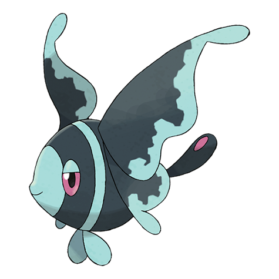
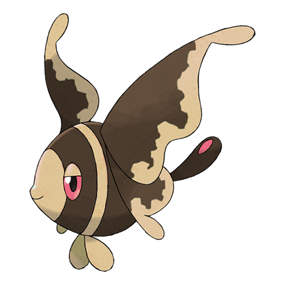
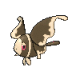
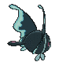
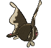
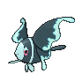
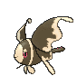

# #457 Lumineon (Neon Pokémon)

| Official Artwork | Shiny Artwork |
|------------------|---------------|
|  |  |

**Rising Ruby:** It lives on the deep-sea floor. It attracts prey by flashing the patterns on its four tail fins.

**Sinking Sapphire:** To avoid detection by predators, it crawls along the seafloor using the two fins on its chest.

---

## Media

### Default Sprites

| Front | Shiny | Back | Shiny |
|-------|-------|------|-------|
|  |  |  |  |

### Female Sprites

| Front | Shiny | Back | Shiny |
|-------|-------|------|-------|
|  |  | N/A | N/A |

### Cries

Latest (Gen VI+):

<audio controls>
<source src='../../assets/cries/lumineon/latest.ogg' type='audio/ogg'>
  Your browser does not support the audio element.
</audio>

Legacy:

<audio controls>
<source src='../../assets/cries/lumineon/legacy.ogg' type='audio/ogg'>
  Your browser does not support the audio element.
</audio>

---

## Pokédex Data

| National № | Type(s) | Height | Weight | Abilities | Local № |
|------------|---------|--------|--------|-----------|---------|
| #457 | {: width="48"} | 1.2 m / 3.9 ft | 24.0 kg / 52.9 lbs | 1. Swift Swim 2. Storm Drain | #135 |

---

## Base Stats
|   | HP | Attack | Defense | Sp. Atk | Sp. Def | Speed |
|---|----|--------|---------|---------|---------|-------|
| **Base** | 75 | 80 | 85 | 80 | 90 | 95 |
| **Min** | 260 | 148 | 157 | 148 | 166 | 175 |
| **Max** | 354 | 284 | 295 | 284 | 306 | 317 |

The ranges shown above are for a level 100 Pokémon. Maximum values are based on a beneficial nature, 252 EVs, 31 IVs; minimum values are based on a hindering nature, 0 EVs, 0 IVs.

---

## Forms & Evolutions

!!! warning "WARNING"

    Information on evolutions may not be 100% accurate; differences between evolution methods across generations are not accounted for.

### Forms

Lumineon has no alternate forms.

### Evolution Line

1. [Finneon](finneon.md/)
    1. Level Up: [Lumineon](lumineon.md/)

---

## Training

| EV Yield | Catch Rate | Base Friendship | Base Exp. | Growth Rate | Held Items |
|----------|------------|-----------------|-----------|-------------|------------|
| 2 Spd | 75 | 70 | 161 | Slow Then Very Fas |

---

## Breeding

| Egg Groups | Egg Cycles | Gender | Dimorphic | Color | Shape |
|------------|------------|--------|-----------|-------|-------|
| 1. Water2 | 20 | 50.0% Male 50.0% Female | True | Blue | Fish |

---

## Moves

!!! warning "WARNING"

    Specific move information may be incorrect. However, the general movepool should be accurate; this includes changes made in Sacred Gold and Storm Silver.

### Level Up Moves

| Lv. | Move | Type | Cat. | Power | Acc. | PP |
| --- | --- | --- | --- | --- | --- | --- |
| 1 | Air Cutter | {: width="48"} | {: width="36"} | 60 | 95 | 25 |
| 1 | Ominous Wind | {: width="48"} | {: width="36"} | 60 | 100 | 5 |
| 1 | Pound | {: width="48"} | {: width="36"} | 50 | 100 | 35 |
| 1 | Psybeam | {: width="48"} | {: width="36"} | 65 | 100 | 20 |
| 1 | Signal Beam | {: width="48"} | {: width="36"} | 75 | 100 | 15 |
| 1 | Soak | {: width="48"} | {: width="36"} | — | 100 | 20 |
| 6 | Water Gun | {: width="48"} | {: width="36"} | 40 | 100 | 25 |
| 9 | Attract | {: width="48"} | {: width="36"} | — | 100 | 15 |
| 12 | Rain Dance | {: width="48"} | {: width="36"} | — | — | 5 |
| 15 | Water Pulse | {: width="48"} | {: width="36"} | 60 | 100 | 20 |
| 18 | Gust | {: width="48"} | {: width="36"} | 40 | 100 | 35 |
| 21 | Sweet Kiss | {: width="48"} | {: width="36"} | — | 75 | 10 |
| 24 | Silver Wind | {: width="48"} | {: width="36"} | 60 | 100 | 5 |
| 27 | Aurora Beam | {: width="48"} | {: width="36"} | 65 | 100 | 20 |
| 30 | Captivate | {: width="48"} | {: width="36"} | — | 100 | 20 |
| 34 | Safeguard | {: width="48"} | {: width="36"} | — | — | 25 |
| 38 | Aqua Ring | {: width="48"} | {: width="36"} | — | — | 20 |
| 42 | Whirlpool | {: width="48"} | {: width="36"} | 35 | 85 | 15 |
| 46 | U Turn | {: width="48"} | {: width="36"} | 70 | 100 | 20 |
| 50 | Bounce | {: width="48"} | {: width="36"} | 85 | 85 | 5 |
| 54 | Soak | {: width="48"} | {: width="36"} | — | 100 | 20 |

### TM Moves

| TM | Move | Type | Cat. | Power | Acc. | PP |
| --- | --- | --- | --- | --- | --- | --- |
| HM03 | Surf | {: width="48"} | {: width="36"} | 90 | 100 | 15 |
| HM05 | Waterfall | {: width="48"} | {: width="36"} | 80 | 100 | 15 |
| HM07 | Dive | {: width="48"} | {: width="36"} | 80 | 100 | 10 |
| TM06 | Toxic | {: width="48"} | {: width="36"} | — | 90 | 10 |
| TM07 | Hail | {: width="48"} | {: width="36"} | — | — | 10 |
| TM10 | Hidden Power | {: width="48"} | {: width="36"} | 60 | 100 | 15 |
| TM100 | Confide | {: width="48"} | {: width="36"} | — | — | 20 |
| TM13 | Ice Beam | {: width="48"} | {: width="36"} | 90 | 100 | 10 |
| TM14 | Blizzard | {: width="48"} | {: width="36"} | 110 | 70 | 5 |
| TM15 | Hyper Beam | {: width="48"} | {: width="36"} | 150 | 90 | 5 |
| TM17 | Protect | {: width="48"} | {: width="36"} | — | — | 10 |
| TM18 | Rain Dance | {: width="48"} | {: width="36"} | — | — | 5 |
| TM20 | Safeguard | {: width="48"} | {: width="36"} | — | — | 25 |
| TM21 | Frustration | {: width="48"} | {: width="36"} | — | 100 | 20 |
| TM27 | Return | {: width="48"} | {: width="36"} | — | 100 | 20 |
| TM32 | Double Team | {: width="48"} | {: width="36"} | — | — | 15 |
| TM42 | Facade | {: width="48"} | {: width="36"} | 70 | 100 | 20 |
| TM44 | Rest | {: width="48"} | {: width="36"} | — | — | 5 |
| TM45 | Attract | {: width="48"} | {: width="36"} | — | 100 | 15 |
| TM48 | Round | {: width="48"} | {: width="36"} | 60 | 100 | 15 |
| TM55 | Scald | {: width="48"} | {: width="36"} | 80 | 100 | 15 |
| TM66 | Payback | {: width="48"} | {: width="36"} | 50 | 100 | 10 |
| TM68 | Giga Impact | {: width="48"} | {: width="36"} | 150 | 90 | 5 |
| TM70 | Flash | {: width="48"} | {: width="36"} | — | 100 | 20 |
| TM77 | Psych Up | {: width="48"} | {: width="36"} | — | — | 10 |
| TM87 | Swagger | {: width="48"} | {: width="36"} | — | 85 | 15 |
| TM88 | Sleep Talk | {: width="48"} | {: width="36"} | — | — | 10 |
| TM89 | U Turn | {: width="48"} | {: width="36"} | 70 | 100 | 20 |
| TM90 | Substitute | {: width="48"} | {: width="36"} | — | — | 10 |
| TM94 | Secret Power | {: width="48"} | {: width="36"} | 70 | 100 | 20 |

### Egg Moves

Lumineon cannot learn any moves by breeding.
### Tutor Moves

| Move | Type | Cat. | Power | Acc. | PP |
| --- | --- | --- | --- | --- | --- |
| Aqua Tail | {: width="48"} | {: width="36"} | 90 | 90 | 10 |
| Bounce | {: width="48"} | {: width="36"} | 85 | 85 | 5 |
| Icy Wind | {: width="48"} | {: width="36"} | 55 | 95 | 15 |
| Signal Beam | {: width="48"} | {: width="36"} | 75 | 100 | 15 |
| Snore | {: width="48"} | {: width="36"} | 50 | 100 | 15 |
| Tailwind | {: width="48"} | {: width="36"} | — | — | 15 |
| Water Pulse | {: width="48"} | {: width="36"} | 60 | 100 | 20 |

