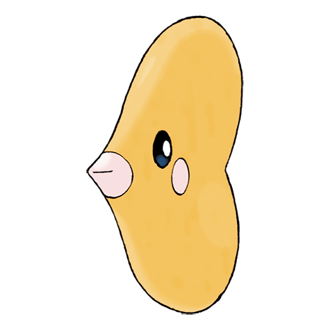
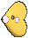

# #370 Luvdisc (Rendezvous Pokémon)

| Official Artwork | Shiny Artwork |
|------------------|---------------|
|  |  |

**Rising Ruby:** Luvdisc live in shallow seas in the tropics. This heart-shaped Pokémon earned its name by swimming after loving couples it spotted in the ocean’s waves.

**Sinking Sapphire:** Luvdisc’s heart-shaped body is a symbol of love and romance. It is said that any couple meeting this Pokémon is promised a loving relationship that never ends.

---

## Media

### Default Sprites

| Front | Shiny | Back | Shiny |
|-------|-------|------|-------|
|  |  |  |  |

### Cries

Latest (Gen VI+):

<audio controls>
<source src='../../assets/cries/luvdisc/latest.ogg' type='audio/ogg'>
  Your browser does not support the audio element.
</audio>

Legacy:

<audio controls>
<source src='../../assets/cries/luvdisc/legacy.ogg' type='audio/ogg'>
  Your browser does not support the audio element.
</audio>

---

## Pokédex Data

| National № | Type(s) | Height | Weight | Abilities | Local № |
|------------|---------|--------|--------|-----------|---------|
| #370 | {: width="48"} {: width="48"} | 0.6 m / 2.0 ft | 8.7 kg / 19.2 lbs | 1. Swift Swim 2. Cute Charm | N/A |

---

## Base Stats
|   | HP | Attack | Defense | Sp. Atk | Sp. Def | Speed |
|---|----|--------|---------|---------|---------|-------|
| **Base** | 45 | 30 | 55 | 100 | 90 | 145 |
| **Min** | 200 | 58 | 103 | 184 | 166 | 265 |
| **Max** | 294 | 174 | 229 | 328 | 306 | 427 |

The ranges shown above are for a level 100 Pokémon. Maximum values are based on a beneficial nature, 252 EVs, 31 IVs; minimum values are based on a hindering nature, 0 EVs, 0 IVs.

---

## Forms & Evolutions

!!! warning "WARNING"

    Information on evolutions may not be 100% accurate; differences between evolution methods across generations are not accounted for.

### Forms

Luvdisc has no alternate forms.

### Evolution Line

1. [Luvdisc](luvdisc.md/)

---

## Training

| EV Yield | Catch Rate | Base Friendship | Base Exp. | Growth Rate | Held Items |
|----------|------------|-----------------|-----------|-------------|------------|
| 2 Spd | 225 | 70 | 116 | Fast | Heart Scale (100%) |

---

## Breeding

| Egg Groups | Egg Cycles | Gender | Dimorphic | Color | Shape |
|------------|------------|--------|-----------|-------|-------|
| 1. Water2 | 20 | 25.0% Male 75.0% Female | False | Pink | Fish |

---

## Moves

!!! warning "WARNING"

    Specific move information may be incorrect. However, the general movepool should be accurate; this includes changes made in Sacred Gold and Storm Silver.

### Level Up Moves

| Lv. | Move | Type | Cat. | Power | Acc. | PP |
| --- | --- | --- | --- | --- | --- | --- |
| 1 | Charm | {: width="48"} | {: width="36"} | — | 100 | 20 |
| 1 | Misty Terrain | {: width="48"} | {: width="36"} | — | — | 10 |
| 1 | Tackle | {: width="48"} | {: width="36"} | 40 | 100 | 35 |
| 4 | Sweet Kiss | {: width="48"} | {: width="36"} | — | 75 | 10 |
| 7 | Water Gun | {: width="48"} | {: width="36"} | 40 | 100 | 25 |
| 10 | Draining Kiss | {: width="48"} | {: width="36"} | 75 | 100 | 10 |
| 13 | Attract | {: width="48"} | {: width="36"} | — | 100 | 15 |
| 16 | Water Pulse | {: width="48"} | {: width="36"} | 60 | 100 | 20 |
| 19 | Agility | {: width="48"} | {: width="36"} | — | — | 30 |
| 22 | Scald | {: width="48"} | {: width="36"} | 80 | 100 | 15 |
| 25 | Aqua Ring | {: width="48"} | {: width="36"} | — | — | 20 |
| 28 | Moonblast | {: width="48"} | {: width="36"} | 95 | 100 | 15 |
| 31 | Captivate | {: width="48"} | {: width="36"} | — | 100 | 20 |
| 34 | Take Down | {: width="48"} | {: width="36"} | 90 | 85 | 20 |
| 37 | Lucky Chant | {: width="48"} | {: width="36"} | — | — | 30 |
| 40 | Hydro Pump | {: width="48"} | {: width="36"} | 110 | 80 | 5 |
| 43 | Flail | {: width="48"} | {: width="36"} | — | 100 | 15 |
| 46 | Safeguard | {: width="48"} | {: width="36"} | — | — | 25 |
| 49 | Heal Pulse | {: width="48"} | {: width="36"} | — | — | 10 |
| 52 | Light Of Ruin | {: width="48"} | {: width="36"} | 140 | 90 | 5 |

### TM Moves

| TM | Move | Type | Cat. | Power | Acc. | PP |
| --- | --- | --- | --- | --- | --- | --- |
| HM03 | Surf | {: width="48"} | {: width="36"} | 90 | 100 | 15 |
| HM05 | Waterfall | {: width="48"} | {: width="36"} | 80 | 100 | 15 |
| HM07 | Dive | {: width="48"} | {: width="36"} | 80 | 100 | 10 |
| TM06 | Toxic | {: width="48"} | {: width="36"} | — | 90 | 10 |
| TM07 | Hail | {: width="48"} | {: width="36"} | — | — | 10 |
| TM10 | Hidden Power | {: width="48"} | {: width="36"} | 60 | 100 | 15 |
| TM100 | Confide | {: width="48"} | {: width="36"} | — | — | 20 |
| TM13 | Ice Beam | {: width="48"} | {: width="36"} | 90 | 100 | 10 |
| TM14 | Blizzard | {: width="48"} | {: width="36"} | 110 | 70 | 5 |
| TM17 | Protect | {: width="48"} | {: width="36"} | — | — | 10 |
| TM18 | Rain Dance | {: width="48"} | {: width="36"} | — | — | 5 |
| TM20 | Safeguard | {: width="48"} | {: width="36"} | — | — | 25 |
| TM21 | Frustration | {: width="48"} | {: width="36"} | — | 100 | 20 |
| TM27 | Return | {: width="48"} | {: width="36"} | — | 100 | 20 |
| TM32 | Double Team | {: width="48"} | {: width="36"} | — | — | 15 |
| TM42 | Facade | {: width="48"} | {: width="36"} | 70 | 100 | 20 |
| TM44 | Rest | {: width="48"} | {: width="36"} | — | — | 5 |
| TM45 | Attract | {: width="48"} | {: width="36"} | — | 100 | 15 |
| TM48 | Round | {: width="48"} | {: width="36"} | 60 | 100 | 15 |
| TM55 | Scald | {: width="48"} | {: width="36"} | 80 | 100 | 15 |
| TM77 | Psych Up | {: width="48"} | {: width="36"} | — | — | 10 |
| TM87 | Swagger | {: width="48"} | {: width="36"} | — | 85 | 15 |
| TM88 | Sleep Talk | {: width="48"} | {: width="36"} | — | — | 10 |
| TM90 | Substitute | {: width="48"} | {: width="36"} | — | — | 10 |
| TM94 | Secret Power | {: width="48"} | {: width="36"} | 70 | 100 | 20 |
| TM99 | Dazzling Gleam | {: width="48"} | {: width="36"} | 80 | 100 | 10 |

### Egg Moves

| Move | Type | Cat. | Power | Acc. | PP |
| --- | --- | --- | --- | --- | --- |
| Aqua Jet | {: width="48"} | {: width="36"} | 40 | 100 | 20 |
| Aqua Ring | {: width="48"} | {: width="36"} | — | — | 20 |
| Brine | {: width="48"} | {: width="36"} | 65 | 100 | 10 |
| Captivate | {: width="48"} | {: width="36"} | — | 100 | 20 |
| Entrainment | {: width="48"} | {: width="36"} | — | 100 | 15 |
| Heal Pulse | {: width="48"} | {: width="36"} | — | — | 10 |
| Mud Sport | {: width="48"} | {: width="36"} | — | — | 15 |
| Splash | {: width="48"} | {: width="36"} | — | — | 40 |
| Supersonic | {: width="48"} | {: width="36"} | — | 55 | 20 |
| Water Sport | {: width="48"} | {: width="36"} | — | — | 15 |

### Tutor Moves

| Move | Type | Cat. | Power | Acc. | PP |
| --- | --- | --- | --- | --- | --- |
| Bounce | {: width="48"} | {: width="36"} | 85 | 85 | 5 |
| Icy Wind | {: width="48"} | {: width="36"} | 55 | 95 | 15 |
| Snore | {: width="48"} | {: width="36"} | 50 | 100 | 15 |
| Water Pulse | {: width="48"} | {: width="36"} | 60 | 100 | 20 |

