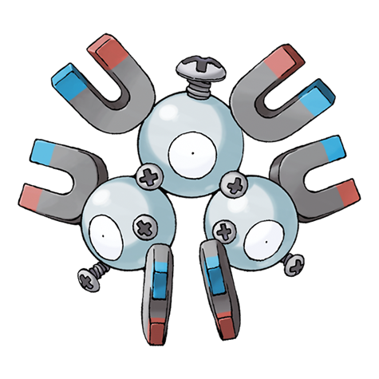
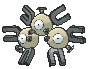
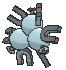
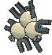

# #082 Magneton (Magnet Pokémon)

| Official Artwork | Shiny Artwork |
|------------------|---------------|
|  |  |

**Rising Ruby:** Magneton emits a powerful magnetic force that is fatal to mechanical devices. As a result, large cities sound sirens to warn citizens of large-scale outbreaks of this Pokémon.

**Sinking Sapphire:** Magneton emits a powerful magnetic force that is fatal to electronics and precision instruments. Because of this, it is said that some towns warn people to keep this Pokémon inside a Poké Ball.

---

## Media

### Default Sprites

| Front | Shiny | Back | Shiny |
|-------|-------|------|-------|
|  |  |  |  |

### Cries

Latest (Gen VI+):

<audio controls>
<source src='../../assets/cries/magneton/latest.ogg' type='audio/ogg'>
  Your browser does not support the audio element.
</audio>

Legacy:

<audio controls>
<source src='../../assets/cries/magneton/legacy.ogg' type='audio/ogg'>
  Your browser does not support the audio element.
</audio>

---

## Pokédex Data

| National № | Type(s) | Height | Weight | Abilities | Local № |
|------------|---------|--------|--------|-----------|---------|
| #82 | {: width="48"} {: width="48"} | 1.0 m / 3.3 ft | 60.0 kg / 132.3 lbs | 1. Magnet Pull 2. Sturdy | N/A |

---

## Base Stats
|   | HP | Attack | Defense | Sp. Atk | Sp. Def | Speed |
|---|----|--------|---------|---------|---------|-------|
| **Base** | 50 | 60 | 95 | 120 | 70 | 70 |
| **Min** | 210 | 112 | 175 | 220 | 130 | 130 |
| **Max** | 304 | 240 | 317 | 372 | 262 | 262 |

The ranges shown above are for a level 100 Pokémon. Maximum values are based on a beneficial nature, 252 EVs, 31 IVs; minimum values are based on a hindering nature, 0 EVs, 0 IVs.

---

## Forms & Evolutions

!!! warning "WARNING"

    Information on evolutions may not be 100% accurate; differences between evolution methods across generations are not accounted for.

### Forms

Magneton has no alternate forms.

### Evolution Line

1. [Magnemite](magnemite.md/)
    1. Level Up: [Magneton](magneton.md/)
        1. Use Item: [Magnezone](magnezone.md/)

---

## Training

| EV Yield | Catch Rate | Base Friendship | Base Exp. | Growth Rate | Held Items |
|----------|------------|-----------------|-----------|-------------|------------|
| 2 Sp.-Atk | 60 | 50 | 163 | Medium | Metal Coat (5%) |

---

## Breeding

| Egg Groups | Egg Cycles | Gender | Dimorphic | Color | Shape |
|------------|------------|--------|-----------|-------|-------|
| 1. Mineral | 20 | Genderless | False | Gray | Heads |

---

## Moves

!!! warning "WARNING"

    Specific move information may be incorrect. However, the general movepool should be accurate; this includes changes made in Sacred Gold and Storm Silver.

### Level Up Moves

| Lv. | Move | Type | Cat. | Power | Acc. | PP |
| --- | --- | --- | --- | --- | --- | --- |
| 1 | Electric Terrain | {: width="48"} | {: width="36"} | — | — | 10 |
| 1 | Tackle | {: width="48"} | {: width="36"} | 40 | 100 | 35 |
| 1 | Zap Cannon | {: width="48"} | {: width="36"} | 120 | 50 | 5 |
| 5 | Supersonic | {: width="48"} | {: width="36"} | — | 55 | 20 |
| 7 | Thunder Shock | {: width="48"} | {: width="36"} | 40 | 100 | 30 |
| 11 | Sonic Boom | {: width="48"} | {: width="36"} | — | 90 | 20 |
| 15 | Thunder Wave | {: width="48"} | {: width="36"} | — | 90 | 20 |
| 17 | Magnet Bomb | {: width="48"} | {: width="36"} | 60 | — | 20 |
| 19 | Spark | {: width="48"} | {: width="36"} | 65 | 100 | 20 |
| 23 | Mirror Shot | {: width="48"} | {: width="36"} | 65 | 85 | 10 |
| 25 | Metal Sound | {: width="48"} | {: width="36"} | — | 85 | 40 |
| 29 | Electro Ball | {: width="48"} | {: width="36"} | — | 100 | 10 |
| 30 | Tri Attack | {: width="48"} | {: width="36"} | 80 | 100 | 10 |
| 33 | Flash Cannon | {: width="48"} | {: width="36"} | 80 | 100 | 10 |
| 39 | Screech | {: width="48"} | {: width="36"} | — | 85 | 40 |
| 43 | Discharge | {: width="48"} | {: width="36"} | 80 | 100 | 15 |
| 49 | Lock On | {: width="48"} | {: width="36"} | — | — | 5 |
| 53 | Magnet Rise | {: width="48"} | {: width="36"} | — | — | 10 |
| 59 | Gyro Ball | {: width="48"} | {: width="36"} | — | 100 | 5 |
| 63 | Zap Cannon | {: width="48"} | {: width="36"} | 120 | 50 | 5 |

### TM Moves

| TM | Move | Type | Cat. | Power | Acc. | PP |
| --- | --- | --- | --- | --- | --- | --- |
| TM06 | Toxic | {: width="48"} | {: width="36"} | — | 90 | 10 |
| TM10 | Hidden Power | {: width="48"} | {: width="36"} | 60 | 100 | 15 |
| TM100 | Confide | {: width="48"} | {: width="36"} | — | — | 20 |
| TM11 | Sunny Day | {: width="48"} | {: width="36"} | — | — | 5 |
| TM15 | Hyper Beam | {: width="48"} | {: width="36"} | 150 | 90 | 5 |
| TM16 | Light Screen | {: width="48"} | {: width="36"} | — | — | 30 |
| TM17 | Protect | {: width="48"} | {: width="36"} | — | — | 10 |
| TM18 | Rain Dance | {: width="48"} | {: width="36"} | — | — | 5 |
| TM21 | Frustration | {: width="48"} | {: width="36"} | — | 100 | 20 |
| TM24 | Thunderbolt | {: width="48"} | {: width="36"} | 90 | 100 | 15 |
| TM25 | Thunder | {: width="48"} | {: width="36"} | 110 | 70 | 10 |
| TM27 | Return | {: width="48"} | {: width="36"} | — | 100 | 20 |
| TM32 | Double Team | {: width="48"} | {: width="36"} | — | — | 15 |
| TM33 | Reflect | {: width="48"} | {: width="36"} | — | — | 20 |
| TM42 | Facade | {: width="48"} | {: width="36"} | 70 | 100 | 20 |
| TM44 | Rest | {: width="48"} | {: width="36"} | — | — | 5 |
| TM48 | Round | {: width="48"} | {: width="36"} | 60 | 100 | 15 |
| TM57 | Charge Beam | {: width="48"} | {: width="36"} | 50 | 90 | 10 |
| TM64 | Explosion | {: width="48"} | {: width="36"} | 250 | 100 | 5 |
| TM68 | Giga Impact | {: width="48"} | {: width="36"} | 150 | 90 | 5 |
| TM70 | Flash | {: width="48"} | {: width="36"} | — | 100 | 20 |
| TM72 | Volt Switch | {: width="48"} | {: width="36"} | 70 | 100 | 20 |
| TM73 | Thunder Wave | {: width="48"} | {: width="36"} | — | 90 | 20 |
| TM74 | Gyro Ball | {: width="48"} | {: width="36"} | — | 100 | 5 |
| TM77 | Psych Up | {: width="48"} | {: width="36"} | — | — | 10 |
| TM87 | Swagger | {: width="48"} | {: width="36"} | — | 85 | 15 |
| TM88 | Sleep Talk | {: width="48"} | {: width="36"} | — | — | 10 |
| TM90 | Substitute | {: width="48"} | {: width="36"} | — | — | 10 |
| TM91 | Flash Cannon | {: width="48"} | {: width="36"} | 80 | 100 | 10 |
| TM93 | Wild Charge | {: width="48"} | {: width="36"} | 90 | 100 | 15 |
| TM94 | Secret Power | {: width="48"} | {: width="36"} | 70 | 100 | 20 |

### Egg Moves

Magneton cannot learn any moves by breeding.
### Tutor Moves

| Move | Type | Cat. | Power | Acc. | PP |
| --- | --- | --- | --- | --- | --- |
| Electroweb | {: width="48"} | {: width="36"} | 55 | 95 | 15 |
| Gravity | {: width="48"} | {: width="36"} | — | — | 5 |
| Iron Defense | {: width="48"} | {: width="36"} | — | — | 15 |
| Magic Coat | {: width="48"} | {: width="36"} | — | — | 15 |
| Magnet Rise | {: width="48"} | {: width="36"} | — | — | 10 |
| Recycle | {: width="48"} | {: width="36"} | — | — | 10 |
| Shock Wave | {: width="48"} | {: width="36"} | 60 | — | 20 |
| Signal Beam | {: width="48"} | {: width="36"} | 75 | 100 | 15 |
| Snore | {: width="48"} | {: width="36"} | 50 | 100 | 15 |

