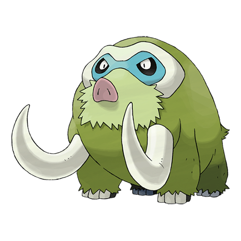
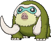
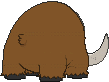
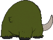
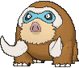
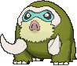

# #473 Mamoswine (Twin Tusk Pokémon)

| Official Artwork | Shiny Artwork |
|------------------|---------------|
|  |  |

**Rising Ruby:** A frozen Mamoswine was dug from ice dating back 10,000 years. This Pokémon has been around a long, long, long time.

**Sinking Sapphire:** Its impressive tusks are made of ice. The population thinned when it turned warm after the ice age.

---

## Media

### Default Sprites

| Front | Shiny | Back | Shiny |
|-------|-------|------|-------|
|  |  |  |  |

### Female Sprites

| Front | Shiny | Back | Shiny |
|-------|-------|------|-------|
|  |  | N/A | N/A |

### Cries

Latest (Gen VI+):

<audio controls>
<source src='../../assets/cries/mamoswine/latest.ogg' type='audio/ogg'>
  Your browser does not support the audio element.
</audio>

Legacy:

<audio controls>
<source src='../../assets/cries/mamoswine/legacy.ogg' type='audio/ogg'>
  Your browser does not support the audio element.
</audio>

---

## Pokédex Data

| National № | Type(s) | Height | Weight | Abilities | Local № |
|------------|---------|--------|--------|-----------|---------|
| #473 | {: width="48"} {: width="48"} | 2.5 m / 8.2 ft | 291.0 kg / 641.5 lbs | 1. Oblivious 2. Snow Cloak | N/A |

---

## Base Stats
|   | HP | Attack | Defense | Sp. Atk | Sp. Def | Speed |
|---|----|--------|---------|---------|---------|-------|
| **Base** | 110 | 130 | 80 | 70 | 60 | 80 |
| **Min** | 330 | 238 | 148 | 130 | 112 | 148 |
| **Max** | 424 | 394 | 284 | 262 | 240 | 284 |

The ranges shown above are for a level 100 Pokémon. Maximum values are based on a beneficial nature, 252 EVs, 31 IVs; minimum values are based on a hindering nature, 0 EVs, 0 IVs.

---

## Forms & Evolutions

!!! warning "WARNING"

    Information on evolutions may not be 100% accurate; differences between evolution methods across generations are not accounted for.

### Forms

Mamoswine has no alternate forms.

### Evolution Line

1. [Swinub](swinub.md/)
    1. Level Up: [Piloswine](piloswine.md/)
        1. Level Up: [Mamoswine](mamoswine.md/)

---

## Training

| EV Yield | Catch Rate | Base Friendship | Base Exp. | Growth Rate | Held Items |
|----------|------------|-----------------|-----------|-------------|------------|
| 3 Atk | 50 | 50 | 265 | Slow | N/A |

---

## Breeding

| Egg Groups | Egg Cycles | Gender | Dimorphic | Color | Shape |
|------------|------------|--------|-----------|-------|-------|
| 1. Ground | 20 | 50.0% Male 50.0% Female | True | Brown | Quadruped |

---

## Moves

!!! warning "WARNING"

    Specific move information may be incorrect. However, the general movepool should be accurate; this includes changes made in Sacred Gold and Storm Silver.

### Level Up Moves

| Lv. | Move | Type | Cat. | Power | Acc. | PP |
| --- | --- | --- | --- | --- | --- | --- |
| 1 | Ancient Power | {: width="48"} | {: width="36"} | 80 | 100 | 10 |
| 1 | Odor Sleuth | {: width="48"} | {: width="36"} | — | — | 40 |
| 1 | Peck | {: width="48"} | {: width="36"} | 35 | 100 | 35 |
| 1 | Scary Face | {: width="48"} | {: width="36"} | — | 100 | 10 |
| 4 | Mud Sport | {: width="48"} | {: width="36"} | — | — | 15 |
| 7 | Powder Snow | {: width="48"} | {: width="36"} | 40 | 100 | 25 |
| 10 | Mud Slap | {: width="48"} | {: width="36"} | 20 | 100 | 10 |
| 13 | Endure | {: width="48"} | {: width="36"} | — | — | 10 |
| 16 | Mud Bomb | {: width="48"} | {: width="36"} | 65 | 85 | 10 |
| 19 | Hail | {: width="48"} | {: width="36"} | — | — | 10 |
| 22 | Ice Fang | {: width="48"} | {: width="36"} | 65 | 95 | 15 |
| 25 | Take Down | {: width="48"} | {: width="36"} | 90 | 85 | 20 |
| 28 | Avalanche | {: width="48"} | {: width="36"} | 60 | 100 | 10 |
| 31 | Body Slam | {: width="48"} | {: width="36"} | 85 | 100 | 15 |
| 33 | Double Hit | {: width="48"} | {: width="36"} | 35 | 90 | 10 |
| 35 | Mist | {: width="48"} | {: width="36"} | — | — | 30 |
| 39 | Earthquake | {: width="48"} | {: width="36"} | 100 | 100 | 10 |
| 43 | Thrash | {: width="48"} | {: width="36"} | 120 | 100 | 10 |
| 47 | Freeze Dry | {: width="48"} | {: width="36"} | 70 | 100 | 20 |
| 51 | Icicle Crash | {: width="48"} | {: width="36"} | 85 | 90 | 10 |
| 55 | Superpower | {: width="48"} | {: width="36"} | 120 | 100 | 5 |
| 59 | Blizzard | {: width="48"} | {: width="36"} | 110 | 70 | 5 |
| 63 | Scary Face | {: width="48"} | {: width="36"} | — | 100 | 10 |

### TM Moves

| TM | Move | Type | Cat. | Power | Acc. | PP |
| --- | --- | --- | --- | --- | --- | --- |
| HM04 | Strength | {: width="48"} | {: width="36"} | 100 | 100 | 10 |
| HM06 | Rock Smash | {: width="48"} | {: width="36"} | 65 | 100 | 15 |
| TM05 | Roar | {: width="48"} | {: width="36"} | — | — | 20 |
| TM06 | Toxic | {: width="48"} | {: width="36"} | — | 90 | 10 |
| TM07 | Hail | {: width="48"} | {: width="36"} | — | — | 10 |
| TM10 | Hidden Power | {: width="48"} | {: width="36"} | 60 | 100 | 15 |
| TM100 | Confide | {: width="48"} | {: width="36"} | — | — | 20 |
| TM13 | Ice Beam | {: width="48"} | {: width="36"} | 90 | 100 | 10 |
| TM14 | Blizzard | {: width="48"} | {: width="36"} | 110 | 70 | 5 |
| TM15 | Hyper Beam | {: width="48"} | {: width="36"} | 150 | 90 | 5 |
| TM16 | Light Screen | {: width="48"} | {: width="36"} | — | — | 30 |
| TM17 | Protect | {: width="48"} | {: width="36"} | — | — | 10 |
| TM18 | Rain Dance | {: width="48"} | {: width="36"} | — | — | 5 |
| TM21 | Frustration | {: width="48"} | {: width="36"} | — | 100 | 20 |
| TM26 | Earthquake | {: width="48"} | {: width="36"} | 100 | 100 | 10 |
| TM27 | Return | {: width="48"} | {: width="36"} | — | 100 | 20 |
| TM28 | Dig | {: width="48"} | {: width="36"} | 80 | 100 | 10 |
| TM32 | Double Team | {: width="48"} | {: width="36"} | — | — | 15 |
| TM33 | Reflect | {: width="48"} | {: width="36"} | — | — | 20 |
| TM37 | Sandstorm | {: width="48"} | {: width="36"} | — | — | 10 |
| TM39 | Rock Tomb | {: width="48"} | {: width="36"} | 60 | 95 | 15 |
| TM42 | Facade | {: width="48"} | {: width="36"} | 70 | 100 | 20 |
| TM44 | Rest | {: width="48"} | {: width="36"} | — | — | 5 |
| TM45 | Attract | {: width="48"} | {: width="36"} | — | 100 | 15 |
| TM48 | Round | {: width="48"} | {: width="36"} | 60 | 100 | 15 |
| TM68 | Giga Impact | {: width="48"} | {: width="36"} | 150 | 90 | 5 |
| TM71 | Stone Edge | {: width="48"} | {: width="36"} | 100 | 80 | 5 |
| TM78 | Bulldoze | {: width="48"} | {: width="36"} | 60 | 100 | 20 |
| TM80 | Rock Slide | {: width="48"} | {: width="36"} | 75 | 90 | 10 |
| TM87 | Swagger | {: width="48"} | {: width="36"} | — | 85 | 15 |
| TM88 | Sleep Talk | {: width="48"} | {: width="36"} | — | — | 10 |
| TM90 | Substitute | {: width="48"} | {: width="36"} | — | — | 10 |
| TM94 | Secret Power | {: width="48"} | {: width="36"} | 70 | 100 | 20 |

### Egg Moves

Mamoswine cannot learn any moves by breeding.
### Tutor Moves

| Move | Type | Cat. | Power | Acc. | PP |
| --- | --- | --- | --- | --- | --- |
| Block | {: width="48"} | {: width="36"} | — | — | 5 |
| Earth Power | {: width="48"} | {: width="36"} | 90 | 100 | 10 |
| Endeavor | {: width="48"} | {: width="36"} | — | 100 | 5 |
| Icy Wind | {: width="48"} | {: width="36"} | 55 | 95 | 15 |
| Iron Head | {: width="48"} | {: width="36"} | 80 | 100 | 15 |
| Knock Off | {: width="48"} | {: width="36"} | 65 | 100 | 20 |
| Snore | {: width="48"} | {: width="36"} | 50 | 100 | 15 |
| Stealth Rock | {: width="48"} | {: width="36"} | — | — | 20 |
| Superpower | {: width="48"} | {: width="36"} | 120 | 100 | 5 |

