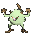
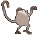
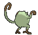

# #056 Mankey (Pig Monkey Pokémon)

| Official Artwork | Shiny Artwork |
|------------------|---------------|
|  |  |

When Mankey starts shaking and its nasal breathing turns rough, it’s a sure sign that it is becoming angry. However, because it goes into a towering rage almost instantly, it is impossible for anyone to flee its wrath.

---

## Media

### Default Sprites

| Front | Shiny | Back | Shiny |
|-------|-------|------|-------|
|  |  |  |  |

### Cries

Latest (Gen VI+):

<audio controls>
<source src='../../assets/cries/mankey/latest.ogg' type='audio/ogg'>
  Your browser does not support the audio element.
</audio>

Legacy:

<audio controls>
<source src='../../assets/cries/mankey/legacy.ogg' type='audio/ogg'>
  Your browser does not support the audio element.
</audio>

---

## Pokédex Data

| National № | Type(s) | Height | Weight | Abilities | Local № |
|------------|---------|--------|--------|-----------|---------|
| #56 | {: width="48"} | 0.5 m / 1.6 ft | 28.0 kg / 61.7 lbs | 1. Vital Spirit 2. Anger Point | N/A |

---

## Base Stats
|   | HP | Attack | Defense | Sp. Atk | Sp. Def | Speed |
|---|----|--------|---------|---------|---------|-------|
| **Base** | 40 | 80 | 35 | 35 | 45 | 70 |
| **Min** | 190 | 148 | 67 | 67 | 85 | 130 |
| **Max** | 284 | 284 | 185 | 185 | 207 | 262 |

The ranges shown above are for a level 100 Pokémon. Maximum values are based on a beneficial nature, 252 EVs, 31 IVs; minimum values are based on a hindering nature, 0 EVs, 0 IVs.

---

## Forms & Evolutions

!!! warning "WARNING"

    Information on evolutions may not be 100% accurate; differences between evolution methods across generations are not accounted for.

### Forms

Mankey has no alternate forms.

### Evolution Line

1. [Mankey](mankey.md/)
    1. Level Up: [Primeape](primeape.md/)

---

## Training

| EV Yield | Catch Rate | Base Friendship | Base Exp. | Growth Rate | Held Items |
|----------|------------|-----------------|-----------|-------------|------------|
| 1 Atk | 190 | 70 | 61 | Mediu |

---

## Breeding

| Egg Groups | Egg Cycles | Gender | Dimorphic | Color | Shape |
|------------|------------|--------|-----------|-------|-------|
| 1. Ground | 20 | 50.0% Male 50.0% Female | False | Brown | Upright |

---

## Moves

!!! warning "WARNING"

    Specific move information may be incorrect. However, the general movepool should be accurate; this includes changes made in Sacred Gold and Storm Silver.

### Level Up Moves

| Lv. | Move | Type | Cat. | Power | Acc. | PP |
| --- | --- | --- | --- | --- | --- | --- |
| 1 | Focus Energy | {: width="48"} | {: width="36"} | — | — | 30 |
| 1 | Leer | {: width="48"} | {: width="36"} | — | 100 | 30 |
| 1 | Low Kick | {: width="48"} | {: width="36"} | — | 100 | 20 |
| 1 | Scratch | {: width="48"} | {: width="36"} | 50 | 100 | 35 |
| 5 | Fury Swipes | {: width="48"} | {: width="36"} | 18 | 80 | 15 |
| 8 | Karate Chop | {: width="48"} | {: width="36"} | 50 | 100 | 25 |
| 11 | Seismic Toss | {: width="48"} | {: width="36"} | — | 100 | 20 |
| 14 | Screech | {: width="48"} | {: width="36"} | — | 85 | 40 |
| 17 | Assurance | {: width="48"} | {: width="36"} | 60 | 100 | 10 |
| 20 | Swagger | {: width="48"} | {: width="36"} | — | 85 | 15 |
| 23 | Night Slash | {: width="48"} | {: width="36"} | 70 | 100 | 15 |
| 26 | Low Sweep | {: width="48"} | {: width="36"} | 65 | 100 | 20 |
| 29 | Covet | {: width="48"} | {: width="36"} | 60 | 100 | 25 |
| 32 | Cross Chop | {: width="48"} | {: width="36"} | 100 | 80 | 5 |
| 35 | Thrash | {: width="48"} | {: width="36"} | 120 | 100 | 10 |
| 38 | Acrobatics | {: width="48"} | {: width="36"} | 55 | 100 | 15 |
| 41 | Dual Chop | {: width="48"} | {: width="36"} | 40 | 90 | 15 |
| 44 | Close Combat | {: width="48"} | {: width="36"} | 120 | 100 | 5 |
| 47 | Punishment | {: width="48"} | {: width="36"} | — | 100 | 5 |
| 50 | Gunk Shot | {: width="48"} | {: width="36"} | 120 | 80 | 5 |
| 53 | Final Gambit | {: width="48"} | {: width="36"} | — | 100 | 5 |

### TM Moves

| TM | Move | Type | Cat. | Power | Acc. | PP |
| --- | --- | --- | --- | --- | --- | --- |
| HM04 | Strength | {: width="48"} | {: width="36"} | 100 | 100 | 10 |
| HM06 | Rock Smash | {: width="48"} | {: width="36"} | 65 | 100 | 15 |
| TM01 | Hone Claws | {: width="48"} | {: width="36"} | — | — | 15 |
| TM06 | Toxic | {: width="48"} | {: width="36"} | — | 90 | 10 |
| TM08 | Bulk Up | {: width="48"} | {: width="36"} | — | — | 20 |
| TM10 | Hidden Power | {: width="48"} | {: width="36"} | 60 | 100 | 15 |
| TM100 | Confide | {: width="48"} | {: width="36"} | — | — | 20 |
| TM11 | Sunny Day | {: width="48"} | {: width="36"} | — | — | 5 |
| TM12 | Taunt | {: width="48"} | {: width="36"} | — | 100 | 20 |
| TM17 | Protect | {: width="48"} | {: width="36"} | — | — | 10 |
| TM18 | Rain Dance | {: width="48"} | {: width="36"} | — | — | 5 |
| TM21 | Frustration | {: width="48"} | {: width="36"} | — | 100 | 20 |
| TM23 | Smack Down | {: width="48"} | {: width="36"} | 50 | 100 | 15 |
| TM24 | Thunderbolt | {: width="48"} | {: width="36"} | 90 | 100 | 15 |
| TM25 | Thunder | {: width="48"} | {: width="36"} | 110 | 70 | 10 |
| TM26 | Earthquake | {: width="48"} | {: width="36"} | 100 | 100 | 10 |
| TM27 | Return | {: width="48"} | {: width="36"} | — | 100 | 20 |
| TM28 | Dig | {: width="48"} | {: width="36"} | 80 | 100 | 10 |
| TM31 | Brick Break | {: width="48"} | {: width="36"} | 75 | 100 | 15 |
| TM32 | Double Team | {: width="48"} | {: width="36"} | — | — | 15 |
| TM39 | Rock Tomb | {: width="48"} | {: width="36"} | 60 | 95 | 15 |
| TM40 | Aerial Ace | {: width="48"} | {: width="36"} | 60 | — | 20 |
| TM42 | Facade | {: width="48"} | {: width="36"} | 70 | 100 | 20 |
| TM44 | Rest | {: width="48"} | {: width="36"} | — | — | 5 |
| TM45 | Attract | {: width="48"} | {: width="36"} | — | 100 | 15 |
| TM46 | Thief | {: width="48"} | {: width="36"} | 60 | 100 | 25 |
| TM47 | Low Sweep | {: width="48"} | {: width="36"} | 65 | 100 | 20 |
| TM48 | Round | {: width="48"} | {: width="36"} | 60 | 100 | 15 |
| TM50 | Overheat | {: width="48"} | {: width="36"} | 130 | 90 | 5 |
| TM52 | Focus Blast | {: width="48"} | {: width="36"} | 120 | 70 | 5 |
| TM56 | Fling | {: width="48"} | {: width="36"} | — | 100 | 10 |
| TM62 | Acrobatics | {: width="48"} | {: width="36"} | 55 | 100 | 15 |
| TM66 | Payback | {: width="48"} | {: width="36"} | 50 | 100 | 10 |
| TM67 | Retaliate | {: width="48"} | {: width="36"} | 70 | 100 | 5 |
| TM78 | Bulldoze | {: width="48"} | {: width="36"} | 60 | 100 | 20 |
| TM80 | Rock Slide | {: width="48"} | {: width="36"} | 75 | 90 | 10 |
| TM84 | Poison Jab | {: width="48"} | {: width="36"} | 80 | 100 | 20 |
| TM87 | Swagger | {: width="48"} | {: width="36"} | — | 85 | 15 |
| TM88 | Sleep Talk | {: width="48"} | {: width="36"} | — | — | 10 |
| TM89 | U Turn | {: width="48"} | {: width="36"} | 70 | 100 | 20 |
| TM90 | Substitute | {: width="48"} | {: width="36"} | — | — | 10 |
| TM94 | Secret Power | {: width="48"} | {: width="36"} | 70 | 100 | 20 |
| TM98 | Power Up Punch | {: width="48"} | {: width="36"} | 40 | 100 | 20 |

### Egg Moves

| Move | Type | Cat. | Power | Acc. | PP |
| --- | --- | --- | --- | --- | --- |
| Beat Up | {: width="48"} | {: width="36"} | — | 100 | 10 |
| Close Combat | {: width="48"} | {: width="36"} | 120 | 100 | 5 |
| Counter | {: width="48"} | {: width="36"} | — | 100 | 20 |
| Encore | {: width="48"} | {: width="36"} | — | 100 | 5 |
| Focus Punch | {: width="48"} | {: width="36"} | 150 | 100 | 20 |
| Foresight | {: width="48"} | {: width="36"} | — | — | 40 |
| Meditate | {: width="48"} | {: width="36"} | — | — | 40 |
| Night Slash | {: width="48"} | {: width="36"} | 70 | 100 | 15 |
| Revenge | {: width="48"} | {: width="36"} | 60 | 100 | 10 |
| Reversal | {: width="48"} | {: width="36"} | — | 100 | 15 |
| Sleep Talk | {: width="48"} | {: width="36"} | — | — | 10 |
| Smelling Salts | {: width="48"} | {: width="36"} | 70 | 100 | 10 |

### Tutor Moves

| Move | Type | Cat. | Power | Acc. | PP |
| --- | --- | --- | --- | --- | --- |
| Covet | {: width="48"} | {: width="36"} | 60 | 100 | 25 |
| Dual Chop | {: width="48"} | {: width="36"} | 40 | 90 | 15 |
| Endeavor | {: width="48"} | {: width="36"} | — | 100 | 5 |
| Fire Punch | {: width="48"} | {: width="36"} | 75 | 100 | 15 |
| Focus Punch | {: width="48"} | {: width="36"} | 150 | 100 | 20 |
| Gunk Shot | {: width="48"} | {: width="36"} | 120 | 80 | 5 |
| Helping Hand | {: width="48"} | {: width="36"} | — | — | 20 |
| Ice Punch | {: width="48"} | {: width="36"} | 75 | 100 | 15 |
| Iron Tail | {: width="48"} | {: width="36"} | 100 | 75 | 15 |
| Low Kick | {: width="48"} | {: width="36"} | — | 100 | 20 |
| Outrage | {: width="48"} | {: width="36"} | 120 | 100 | 10 |
| Role Play | {: width="48"} | {: width="36"} | — | — | 10 |
| Seed Bomb | {: width="48"} | {: width="36"} | 80 | 100 | 15 |
| Snore | {: width="48"} | {: width="36"} | 50 | 100 | 15 |
| Spite | {: width="48"} | {: width="36"} | — | 100 | 10 |
| Thunder Punch | {: width="48"} | {: width="36"} | 75 | 100 | 15 |
| Uproar | {: width="48"} | {: width="36"} | 90 | 100 | 10 |

