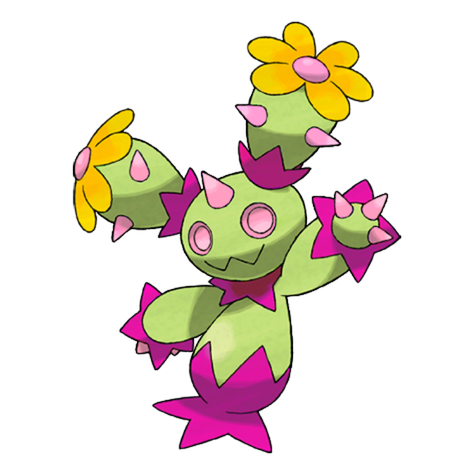
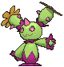
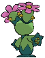
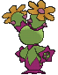

# #556 Maractus (Cactus Pokémon)

| Official Artwork | Shiny Artwork |
|------------------|---------------|
|  |  |

**Rising Ruby:** It uses an up-tempo song and dance to drive away the bird Pokémon that prey on its flower seeds.

**Sinking Sapphire:** Arid regions are their habitat. They move rhythmically, making a sound similar to maracas.

---

## Media

### Default Sprites

| Front | Shiny | Back | Shiny |
|-------|-------|------|-------|
|  |  |  |  |

### Cries

Latest (Gen VI+):

<audio controls>
<source src='../../assets/cries/maractus/latest.ogg' type='audio/ogg'>
  Your browser does not support the audio element.
</audio>

Legacy:

<audio controls>
<source src='../../assets/cries/maractus/legacy.ogg' type='audio/ogg'>
  Your browser does not support the audio element.
</audio>

---

## Pokédex Data

| National № | Type(s) | Height | Weight | Abilities | Local № |
|------------|---------|--------|--------|-----------|---------|
| #556 | {: width="48"} | 1.0 m / 3.3 ft | 28.0 kg / 61.7 lbs | 1. Water Absorb 2. Chlorophyll | N/A |

---

## Base Stats
|   | HP | Attack | Defense | Sp. Atk | Sp. Def | Speed |
|---|----|--------|---------|---------|---------|-------|
| **Base** | 75 | 86 | 67 | 106 | 67 | 60 |
| **Min** | 260 | 159 | 125 | 195 | 125 | 112 |
| **Max** | 354 | 298 | 256 | 342 | 256 | 240 |

The ranges shown above are for a level 100 Pokémon. Maximum values are based on a beneficial nature, 252 EVs, 31 IVs; minimum values are based on a hindering nature, 0 EVs, 0 IVs.

---

## Forms & Evolutions

!!! warning "WARNING"

    Information on evolutions may not be 100% accurate; differences between evolution methods across generations are not accounted for.

### Forms

Maractus has no alternate forms.

### Evolution Line

1. [Maractus](maractus.md/)

---

## Training

| EV Yield | Catch Rate | Base Friendship | Base Exp. | Growth Rate | Held Items |
|----------|------------|-----------------|-----------|-------------|------------|
| 2 Sp.-Atk | 255 | 50 | 161 | Medium | Miracle Seed (5%) Plume Fossil (50%) |

---

## Breeding

| Egg Groups | Egg Cycles | Gender | Dimorphic | Color | Shape |
|------------|------------|--------|-----------|-------|-------|
| 1. Plant | 20 | 50.0% Male 50.0% Female | False | Green | Blob |

---

## Moves

!!! warning "WARNING"

    Specific move information may be incorrect. However, the general movepool should be accurate; this includes changes made in Sacred Gold and Storm Silver.

### Level Up Moves

| Lv. | Move | Type | Cat. | Power | Acc. | PP |
| --- | --- | --- | --- | --- | --- | --- |
| 1 | Absorb | {: width="48"} | {: width="36"} | 20 | 100 | 25 |
| 1 | After You | {: width="48"} | {: width="36"} | — | — | 15 |
| 1 | Cotton Guard | {: width="48"} | {: width="36"} | — | — | 10 |
| 1 | Peck | {: width="48"} | {: width="36"} | 35 | 100 | 35 |
| 1 | Spiky Shield | {: width="48"} | {: width="36"} | — | — | 10 |
| 3 | Sweet Scent | {: width="48"} | {: width="36"} | — | 100 | 20 |
| 6 | Growth | {: width="48"} | {: width="36"} | — | — | 20 |
| 9 | Pin Missile | {: width="48"} | {: width="36"} | 25 | 95 | 20 |
| 12 | Mega Drain | {: width="48"} | {: width="36"} | 40 | 100 | 15 |
| 15 | Synthesis | {: width="48"} | {: width="36"} | — | — | 5 |
| 18 | Cotton Spore | {: width="48"} | {: width="36"} | — | 100 | 40 |
| 21 | Needle Arm | {: width="48"} | {: width="36"} | 80 | 100 | 15 |
| 24 | Giga Drain | {: width="48"} | {: width="36"} | 75 | 100 | 10 |
| 27 | Acupressure | {: width="48"} | {: width="36"} | — | — | 30 |
| 30 | Grass Whistle | {: width="48"} | {: width="36"} | — | 55 | 15 |
| 33 | Ingrain | {: width="48"} | {: width="36"} | — | — | 20 |
| 36 | Petal Dance | {: width="48"} | {: width="36"} | 120 | 100 | 10 |
| 39 | Bounce | {: width="48"} | {: width="36"} | 85 | 85 | 5 |
| 42 | Sucker Punch | {: width="48"} | {: width="36"} | 70 | 100 | 5 |
| 45 | Sunny Day | {: width="48"} | {: width="36"} | — | — | 5 |
| 48 | Petal Blizzard | {: width="48"} | {: width="36"} | 90 | 100 | 15 |
| 51 | Solar Beam | {: width="48"} | {: width="36"} | 120 | 100 | 10 |
| 54 | Cotton Guard | {: width="48"} | {: width="36"} | — | — | 10 |
| 57 | After You | {: width="48"} | {: width="36"} | — | — | 15 |

### TM Moves

| TM | Move | Type | Cat. | Power | Acc. | PP |
| --- | --- | --- | --- | --- | --- | --- |
| TM06 | Toxic | {: width="48"} | {: width="36"} | — | 90 | 10 |
| TM10 | Hidden Power | {: width="48"} | {: width="36"} | 60 | 100 | 15 |
| TM100 | Confide | {: width="48"} | {: width="36"} | — | — | 20 |
| TM11 | Sunny Day | {: width="48"} | {: width="36"} | — | — | 5 |
| TM17 | Protect | {: width="48"} | {: width="36"} | — | — | 10 |
| TM20 | Safeguard | {: width="48"} | {: width="36"} | — | — | 25 |
| TM21 | Frustration | {: width="48"} | {: width="36"} | — | 100 | 20 |
| TM22 | Solar Beam | {: width="48"} | {: width="36"} | 120 | 100 | 10 |
| TM27 | Return | {: width="48"} | {: width="36"} | — | 100 | 20 |
| TM32 | Double Team | {: width="48"} | {: width="36"} | — | — | 15 |
| TM40 | Aerial Ace | {: width="48"} | {: width="36"} | 60 | — | 20 |
| TM42 | Facade | {: width="48"} | {: width="36"} | 70 | 100 | 20 |
| TM44 | Rest | {: width="48"} | {: width="36"} | — | — | 5 |
| TM45 | Attract | {: width="48"} | {: width="36"} | — | 100 | 15 |
| TM48 | Round | {: width="48"} | {: width="36"} | 60 | 100 | 15 |
| TM53 | Energy Ball | {: width="48"} | {: width="36"} | 90 | 100 | 10 |
| TM84 | Poison Jab | {: width="48"} | {: width="36"} | 80 | 100 | 20 |
| TM86 | Grass Knot | {: width="48"} | {: width="36"} | — | 100 | 20 |
| TM87 | Swagger | {: width="48"} | {: width="36"} | — | 85 | 15 |
| TM88 | Sleep Talk | {: width="48"} | {: width="36"} | — | — | 10 |
| TM90 | Substitute | {: width="48"} | {: width="36"} | — | — | 10 |
| TM94 | Secret Power | {: width="48"} | {: width="36"} | 70 | 100 | 20 |
| TM96 | Nature Power | {: width="48"} | {: width="36"} | — | — | 20 |

### Egg Moves

| Move | Type | Cat. | Power | Acc. | PP |
| --- | --- | --- | --- | --- | --- |
| Bounce | {: width="48"} | {: width="36"} | 85 | 85 | 5 |
| Bullet Seed | {: width="48"} | {: width="36"} | 25 | 100 | 30 |
| Grass Whistle | {: width="48"} | {: width="36"} | — | 55 | 15 |
| Grassy Terrain | {: width="48"} | {: width="36"} | — | — | 10 |
| Leech Seed | {: width="48"} | {: width="36"} | — | 90 | 10 |
| Seed Bomb | {: width="48"} | {: width="36"} | 80 | 100 | 15 |
| Spikes | {: width="48"} | {: width="36"} | — | — | 20 |
| Wood Hammer | {: width="48"} | {: width="36"} | 120 | 100 | 15 |
| Worry Seed | {: width="48"} | {: width="36"} | — | 100 | 10 |

### Tutor Moves

| Move | Type | Cat. | Power | Acc. | PP |
| --- | --- | --- | --- | --- | --- |
| After You | {: width="48"} | {: width="36"} | — | — | 15 |
| Bounce | {: width="48"} | {: width="36"} | 85 | 85 | 5 |
| Drain Punch | {: width="48"} | {: width="36"} | 75 | 100 | 10 |
| Endeavor | {: width="48"} | {: width="36"} | — | 100 | 5 |
| Giga Drain | {: width="48"} | {: width="36"} | 75 | 100 | 10 |
| Helping Hand | {: width="48"} | {: width="36"} | — | — | 20 |
| Hyper Voice | {: width="48"} | {: width="36"} | 90 | 100 | 10 |
| Knock Off | {: width="48"} | {: width="36"} | 65 | 100 | 20 |
| Seed Bomb | {: width="48"} | {: width="36"} | 80 | 100 | 15 |
| Snore | {: width="48"} | {: width="36"} | 50 | 100 | 15 |
| Synthesis | {: width="48"} | {: width="36"} | — | — | 5 |
| Uproar | {: width="48"} | {: width="36"} | 90 | 100 | 10 |
| Worry Seed | {: width="48"} | {: width="36"} | — | 100 | 10 |

