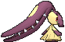
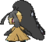
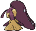

# #303 Mawile (Deceiver Pokémon)

| Official Artwork | Shiny Artwork |
|------------------|---------------|
|  |  |

**Rising Ruby:** Mawile’s huge jaws are actually steel horns that have been transformed. Its docile-looking face serves to lull its foe into letting down its guard. When the foe least expects it, Mawile chomps it with its gaping jaws.

**Sinking Sapphire:** Don’t be taken in by this Pokémon’s cute face—it’s very dangerous. Mawile fools the foe into letting down its guard, then chomps down with its massive jaws. The steel jaws are really horns that have been transformed.

---

## Media

### Default Sprites

| Front | Shiny | Back | Shiny |
|-------|-------|------|-------|
|  |  |  |  |

### Cries

Latest (Gen VI+):

<audio controls>
<source src='../../assets/cries/mawile/latest.ogg' type='audio/ogg'>
  Your browser does not support the audio element.
</audio>

Legacy:

<audio controls>
<source src='../../assets/cries/mawile/legacy.ogg' type='audio/ogg'>
  Your browser does not support the audio element.
</audio>

---

## Pokédex Data

| National № | Type(s) | Height | Weight | Abilities | Local № |
|------------|---------|--------|--------|-----------|---------|
| #303 | {: width="48"} {: width="48"} | 0.6 m / 2.0 ft | 11.5 kg / 25.4 lbs | 1. Hyper Cutter 2. Intimidate | N/A |

---

## Base Stats
|   | HP | Attack | Defense | Sp. Atk | Sp. Def | Speed |
|---|----|--------|---------|---------|---------|-------|
| **Base** | 55 | 110 | 130 | 60 | 100 | 55 |
| **Min** | 220 | 202 | 238 | 112 | 184 | 103 |
| **Max** | 314 | 350 | 394 | 240 | 328 | 229 |

The ranges shown above are for a level 100 Pokémon. Maximum values are based on a beneficial nature, 252 EVs, 31 IVs; minimum values are based on a hindering nature, 0 EVs, 0 IVs.

---

## Forms & Evolutions

!!! warning "WARNING"

    Information on evolutions may not be 100% accurate; differences between evolution methods across generations are not accounted for.

### Forms

1. [Mawile](mawile.md/)

2. [Mawile Mega](mawile-mega.md/)

### Evolution Line

1. [Mawile](mawile.md/)

---

## Training

| EV Yield | Catch Rate | Base Friendship | Base Exp. | Growth Rate | Held Items |
|----------|------------|-----------------|-----------|-------------|------------|
| 1 Atk 1 Def | 45 | 50 | 133 | Fast | Iron Ball (5%) |

---

## Breeding

| Egg Groups | Egg Cycles | Gender | Dimorphic | Color | Shape |
|------------|------------|--------|-----------|-------|-------|
| 1. Ground 2. Fairy | 20 | 50.0% Male 50.0% Female | False | Black | Humanoid |

---

## Moves

!!! warning "WARNING"

    Specific move information may be incorrect. However, the general movepool should be accurate; this includes changes made in Sacred Gold and Storm Silver.

### Level Up Moves

| Lv. | Move | Type | Cat. | Power | Acc. | PP |
| --- | --- | --- | --- | --- | --- | --- |
| 1 | Astonish | {: width="48"} | {: width="36"} | 30 | 100 | 15 |
| 1 | Fairy Wind | {: width="48"} | {: width="36"} | 50 | 100 | 25 |
| 1 | Growl | {: width="48"} | {: width="36"} | — | 100 | 40 |
| 1 | Taunt | {: width="48"} | {: width="36"} | — | 100 | 20 |
| 6 | Fake Tears | {: width="48"} | {: width="36"} | — | 100 | 20 |
| 9 | Sweet Scent | {: width="48"} | {: width="36"} | — | 100 | 20 |
| 12 | Bite | {: width="48"} | {: width="36"} | 60 | 100 | 25 |
| 15 | Fire Fang | {: width="48"} | {: width="36"} | 65 | 95 | 15 |
| 15 | Ice Fang | {: width="48"} | {: width="36"} | 65 | 95 | 15 |
| 15 | Poison Fang | {: width="48"} | {: width="36"} | 50 | 100 | 15 |
| 15 | Thunder Fang | {: width="48"} | {: width="36"} | 65 | 95 | 15 |
| 18 | Vice Grip | {: width="48"} | {: width="36"} | 55 | 100 | 30 |
| 21 | Crunch | {: width="48"} | {: width="36"} | 80 | 100 | 15 |
| 24 | Play Rough | {: width="48"} | {: width="36"} | 90 | 90 | 10 |
| 27 | Baton Pass | {: width="48"} | {: width="36"} | — | — | 40 |
| 30 | Iron Defense | {: width="48"} | {: width="36"} | — | — | 15 |
| 33 | Iron Head | {: width="48"} | {: width="36"} | 80 | 100 | 15 |
| 37 | Sucker Punch | {: width="48"} | {: width="36"} | 70 | 100 | 5 |
| 41 | Spit Up | {: width="48"} | {: width="36"} | — | 100 | 10 |
| 41 | Stockpile | {: width="48"} | {: width="36"} | — | — | 20 |
| 41 | Swallow | {: width="48"} | {: width="36"} | — | — | 10 |
| 45 | Super Fang | {: width="48"} | {: width="36"} | — | 90 | 10 |
| 49 | Metal Burst | {: width="48"} | {: width="36"} | — | 100 | 10 |

### TM Moves

| TM | Move | Type | Cat. | Power | Acc. | PP |
| --- | --- | --- | --- | --- | --- | --- |
| HM04 | Strength | {: width="48"} | {: width="36"} | 100 | 100 | 10 |
| HM06 | Rock Smash | {: width="48"} | {: width="36"} | 65 | 100 | 15 |
| TM06 | Toxic | {: width="48"} | {: width="36"} | — | 90 | 10 |
| TM10 | Hidden Power | {: width="48"} | {: width="36"} | 60 | 100 | 15 |
| TM100 | Confide | {: width="48"} | {: width="36"} | — | — | 20 |
| TM11 | Sunny Day | {: width="48"} | {: width="36"} | — | — | 5 |
| TM12 | Taunt | {: width="48"} | {: width="36"} | — | 100 | 20 |
| TM13 | Ice Beam | {: width="48"} | {: width="36"} | 90 | 100 | 10 |
| TM15 | Hyper Beam | {: width="48"} | {: width="36"} | 150 | 90 | 5 |
| TM17 | Protect | {: width="48"} | {: width="36"} | — | — | 10 |
| TM18 | Rain Dance | {: width="48"} | {: width="36"} | — | — | 5 |
| TM21 | Frustration | {: width="48"} | {: width="36"} | — | 100 | 20 |
| TM22 | Solar Beam | {: width="48"} | {: width="36"} | 120 | 100 | 10 |
| TM27 | Return | {: width="48"} | {: width="36"} | — | 100 | 20 |
| TM30 | Shadow Ball | {: width="48"} | {: width="36"} | 80 | 100 | 15 |
| TM31 | Brick Break | {: width="48"} | {: width="36"} | 75 | 100 | 15 |
| TM32 | Double Team | {: width="48"} | {: width="36"} | — | — | 15 |
| TM35 | Flamethrower | {: width="48"} | {: width="36"} | 90 | 100 | 15 |
| TM36 | Sludge Bomb | {: width="48"} | {: width="36"} | 90 | 100 | 10 |
| TM37 | Sandstorm | {: width="48"} | {: width="36"} | — | — | 10 |
| TM38 | Fire Blast | {: width="48"} | {: width="36"} | 110 | 85 | 5 |
| TM39 | Rock Tomb | {: width="48"} | {: width="36"} | 60 | 95 | 15 |
| TM41 | Torment | {: width="48"} | {: width="36"} | — | 100 | 15 |
| TM42 | Facade | {: width="48"} | {: width="36"} | 70 | 100 | 20 |
| TM44 | Rest | {: width="48"} | {: width="36"} | — | — | 5 |
| TM45 | Attract | {: width="48"} | {: width="36"} | — | 100 | 15 |
| TM48 | Round | {: width="48"} | {: width="36"} | 60 | 100 | 15 |
| TM52 | Focus Blast | {: width="48"} | {: width="36"} | 120 | 70 | 5 |
| TM54 | False Swipe | {: width="48"} | {: width="36"} | 40 | 100 | 40 |
| TM56 | Fling | {: width="48"} | {: width="36"} | — | 100 | 10 |
| TM57 | Charge Beam | {: width="48"} | {: width="36"} | 50 | 90 | 10 |
| TM59 | Incinerate | {: width="48"} | {: width="36"} | 60 | 100 | 15 |
| TM63 | Embargo | {: width="48"} | {: width="36"} | — | 100 | 15 |
| TM66 | Payback | {: width="48"} | {: width="36"} | 50 | 100 | 10 |
| TM68 | Giga Impact | {: width="48"} | {: width="36"} | 150 | 90 | 5 |
| TM71 | Stone Edge | {: width="48"} | {: width="36"} | 100 | 80 | 5 |
| TM75 | Swords Dance | {: width="48"} | {: width="36"} | — | — | 20 |
| TM77 | Psych Up | {: width="48"} | {: width="36"} | — | — | 10 |
| TM80 | Rock Slide | {: width="48"} | {: width="36"} | 75 | 90 | 10 |
| TM86 | Grass Knot | {: width="48"} | {: width="36"} | — | 100 | 20 |
| TM87 | Swagger | {: width="48"} | {: width="36"} | — | 85 | 15 |
| TM88 | Sleep Talk | {: width="48"} | {: width="36"} | — | — | 10 |
| TM90 | Substitute | {: width="48"} | {: width="36"} | — | — | 10 |
| TM91 | Flash Cannon | {: width="48"} | {: width="36"} | 80 | 100 | 10 |
| TM94 | Secret Power | {: width="48"} | {: width="36"} | 70 | 100 | 20 |
| TM97 | Dark Pulse | {: width="48"} | {: width="36"} | 80 | 100 | 15 |
| TM98 | Power Up Punch | {: width="48"} | {: width="36"} | 40 | 100 | 20 |

### Egg Moves

| Move | Type | Cat. | Power | Acc. | PP |
| --- | --- | --- | --- | --- | --- |
| Ancient Power | {: width="48"} | {: width="36"} | 80 | 100 | 10 |
| Captivate | {: width="48"} | {: width="36"} | — | 100 | 20 |
| Fire Fang | {: width="48"} | {: width="36"} | 65 | 95 | 15 |
| Guard Swap | {: width="48"} | {: width="36"} | — | — | 10 |
| Ice Fang | {: width="48"} | {: width="36"} | 65 | 95 | 15 |
| Metal Burst | {: width="48"} | {: width="36"} | — | 100 | 10 |
| Misty Terrain | {: width="48"} | {: width="36"} | — | — | 10 |
| Poison Fang | {: width="48"} | {: width="36"} | 50 | 100 | 15 |
| Punishment | {: width="48"} | {: width="36"} | — | 100 | 5 |
| Seismic Toss | {: width="48"} | {: width="36"} | — | 100 | 20 |
| Slam | {: width="48"} | {: width="36"} | 80 | 75 | 20 |
| Sucker Punch | {: width="48"} | {: width="36"} | 70 | 100 | 5 |
| Thunder Fang | {: width="48"} | {: width="36"} | 65 | 95 | 15 |
| Tickle | {: width="48"} | {: width="36"} | — | 100 | 20 |

### Tutor Moves

| Move | Type | Cat. | Power | Acc. | PP |
| --- | --- | --- | --- | --- | --- |
| Focus Punch | {: width="48"} | {: width="36"} | 150 | 100 | 20 |
| Foul Play | {: width="48"} | {: width="36"} | 95 | 100 | 15 |
| Ice Punch | {: width="48"} | {: width="36"} | 75 | 100 | 15 |
| Icy Wind | {: width="48"} | {: width="36"} | 55 | 95 | 15 |
| Iron Defense | {: width="48"} | {: width="36"} | — | — | 15 |
| Iron Head | {: width="48"} | {: width="36"} | 80 | 100 | 15 |
| Knock Off | {: width="48"} | {: width="36"} | 65 | 100 | 20 |
| Last Resort | {: width="48"} | {: width="36"} | 140 | 100 | 5 |
| Magnet Rise | {: width="48"} | {: width="36"} | — | — | 10 |
| Pain Split | {: width="48"} | {: width="36"} | — | — | 20 |
| Snatch | {: width="48"} | {: width="36"} | — | — | 10 |
| Snore | {: width="48"} | {: width="36"} | 50 | 100 | 15 |
| Stealth Rock | {: width="48"} | {: width="36"} | — | — | 20 |
| Super Fang | {: width="48"} | {: width="36"} | — | 90 | 10 |
| Thunder Punch | {: width="48"} | {: width="36"} | 75 | 100 | 15 |

