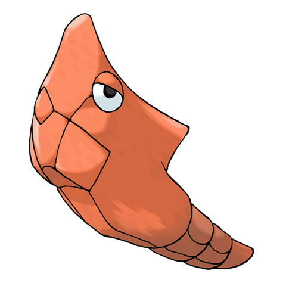

# #011 Metapod (Cocoon Pokémon)

| Official Artwork | Shiny Artwork |
|------------------|---------------|
|  |  |

The shell covering this Pokémon’s body is as hard as an iron slab. Metapod does not move very much. It stays still because it is preparing its soft innards for evolution inside the hard shell.

---

## Media

### Default Sprites

| Front | Shiny | Back | Shiny |
|-------|-------|------|-------|
|  |  |  |  |

### Cries

Latest (Gen VI+):

<audio controls>
<source src='../../assets/cries/metapod/latest.ogg' type='audio/ogg'>
  Your browser does not support the audio element.
</audio>

Legacy:

<audio controls>
<source src='../../assets/cries/metapod/legacy.ogg' type='audio/ogg'>
  Your browser does not support the audio element.
</audio>

---

## Pokédex Data

| National № | Type(s) | Height | Weight | Abilities | Local № |
|------------|---------|--------|--------|-----------|---------|
| #11 | {: width="48"} | 0.7 m / 2.3 ft | 9.9 kg / 21.8 lbs | 1. Shed Skin | N/A |

---

## Base Stats
|   | HP | Attack | Defense | Sp. Atk | Sp. Def | Speed |
|---|----|--------|---------|---------|---------|-------|
| **Base** | 50 | 20 | 55 | 25 | 25 | 30 |
| **Min** | 210 | 40 | 103 | 49 | 49 | 58 |
| **Max** | 304 | 152 | 229 | 163 | 163 | 174 |

The ranges shown above are for a level 100 Pokémon. Maximum values are based on a beneficial nature, 252 EVs, 31 IVs; minimum values are based on a hindering nature, 0 EVs, 0 IVs.

---

## Forms & Evolutions

!!! warning "WARNING"

    Information on evolutions may not be 100% accurate; differences between evolution methods across generations are not accounted for.

### Forms

Metapod has no alternate forms.

### Evolution Line

1. [Caterpie](caterpie.md/)
    1. Level Up: [Metapod](metapod.md/)
        1. Level Up: [Butterfree](butterfree.md/)

---

## Training

| EV Yield | Catch Rate | Base Friendship | Base Exp. | Growth Rate | Held Items |
|----------|------------|-----------------|-----------|-------------|------------|
| 2 Def | 120 | 50 | 72 | Medium | N/A |

---

## Breeding

| Egg Groups | Egg Cycles | Gender | Dimorphic | Color | Shape |
|------------|------------|--------|-----------|-------|-------|
| 1. Bug | 15 | 50.0% Male 50.0% Female | False | Green | Squiggle |

---

## Moves

!!! warning "WARNING"

    Specific move information may be incorrect. However, the general movepool should be accurate; this includes changes made in Sacred Gold and Storm Silver.

### Level Up Moves

| Lv. | Move | Type | Cat. | Power | Acc. | PP |
| --- | --- | --- | --- | --- | --- | --- |
| 1 | Harden | {: width="48"} | {: width="36"} | — | — | 30 |
| 7 | Harden | {: width="48"} | {: width="36"} | — | — | 30 |
| 9 | Iron Defense | {: width="48"} | {: width="36"} | — | — | 15 |

### TM Moves

Metapod cannot learn any TM moves.
### Egg Moves

Metapod cannot learn any moves by breeding.
### Tutor Moves

| Move | Type | Cat. | Power | Acc. | PP |
| --- | --- | --- | --- | --- | --- |
| Bug Bite | {: width="48"} | {: width="36"} | 60 | 100 | 20 |
| Electroweb | {: width="48"} | {: width="36"} | 55 | 95 | 15 |
| Iron Defense | {: width="48"} | {: width="36"} | — | — | 15 |

