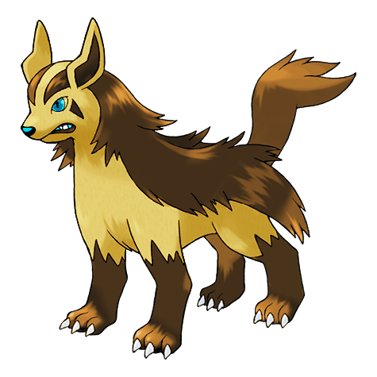

# #262 Mightyena (Bite Pokémon)

| Official Artwork | Shiny Artwork |
|------------------|---------------|
|  |  |

**Rising Ruby:** Mightyena gives obvious signals when it is preparing to attack. It starts to growl deeply and then flattens its body. This Pokémon will bite savagely with its sharply pointed fangs.

**Sinking Sapphire:** Mightyena travel and act as a pack in the wild. The memory of its life in the wild compels the Pokémon to obey only those Trainers that it recognizes to possess superior skill.

---

## Media

### Default Sprites

| Front | Shiny | Back | Shiny |
|-------|-------|------|-------|
|  |  |  |  |

### Cries

Latest (Gen VI+):

<audio controls>
<source src='../../assets/cries/mightyena/latest.ogg' type='audio/ogg'>
  Your browser does not support the audio element.
</audio>

Legacy:

<audio controls>
<source src='../../assets/cries/mightyena/legacy.ogg' type='audio/ogg'>
  Your browser does not support the audio element.
</audio>

---

## Pokédex Data

| National № | Type(s) | Height | Weight | Abilities | Local № |
|------------|---------|--------|--------|-----------|---------|
| #262 | {: width="48"} | 1.0 m / 3.3 ft | 37.0 kg / 81.6 lbs | 1. Intimidate 2. Quick Feet | N/A |

---

## Base Stats
|   | HP | Attack | Defense | Sp. Atk | Sp. Def | Speed |
|---|----|--------|---------|---------|---------|-------|
| **Base** | 70 | 110 | 70 | 60 | 60 | 80 |
| **Min** | 250 | 202 | 130 | 112 | 112 | 148 |
| **Max** | 344 | 350 | 262 | 240 | 240 | 284 |

The ranges shown above are for a level 100 Pokémon. Maximum values are based on a beneficial nature, 252 EVs, 31 IVs; minimum values are based on a hindering nature, 0 EVs, 0 IVs.

---

## Forms & Evolutions

!!! warning "WARNING"

    Information on evolutions may not be 100% accurate; differences between evolution methods across generations are not accounted for.

### Forms

Mightyena has no alternate forms.

### Evolution Line

1. [Poochyena](poochyena.md/)
    1. Level Up: [Mightyena](mightyena.md/)

---

## Training

| EV Yield | Catch Rate | Base Friendship | Base Exp. | Growth Rate | Held Items |
|----------|------------|-----------------|-----------|-------------|------------|
| 2 Atk | 127 | 70 | 147 | Mediu |

---

## Breeding

| Egg Groups | Egg Cycles | Gender | Dimorphic | Color | Shape |
|------------|------------|--------|-----------|-------|-------|
| 1. Ground | 15 | 50.0% Male 50.0% Female | False | Gray | Quadruped |

---

## Moves

!!! warning "WARNING"

    Specific move information may be incorrect. However, the general movepool should be accurate; this includes changes made in Sacred Gold and Storm Silver.

### Level Up Moves

| Lv. | Move | Type | Cat. | Power | Acc. | PP |
| --- | --- | --- | --- | --- | --- | --- |
| 1 | Fire Fang | {: width="48"} | {: width="36"} | 65 | 95 | 15 |
| 1 | Ice Fang | {: width="48"} | {: width="36"} | 65 | 95 | 15 |
| 1 | Poison Fang | {: width="48"} | {: width="36"} | 50 | 100 | 15 |
| 1 | Sucker Punch | {: width="48"} | {: width="36"} | 70 | 100 | 5 |
| 1 | Super Fang | {: width="48"} | {: width="36"} | — | 90 | 10 |
| 1 | Tackle | {: width="48"} | {: width="36"} | 40 | 100 | 35 |
| 1 | Thunder Fang | {: width="48"} | {: width="36"} | 65 | 95 | 15 |
| 4 | Howl | {: width="48"} | {: width="36"} | — | — | 40 |
| 7 | Sand Attack | {: width="48"} | {: width="36"} | — | 100 | 15 |
| 10 | Bite | {: width="48"} | {: width="36"} | 60 | 100 | 25 |
| 13 | Odor Sleuth | {: width="48"} | {: width="36"} | — | — | 40 |
| 16 | Assurance | {: width="48"} | {: width="36"} | 60 | 100 | 10 |
| 20 | Roar | {: width="48"} | {: width="36"} | — | — | 20 |
| 24 | Crunch | {: width="48"} | {: width="36"} | 80 | 100 | 15 |
| 28 | Swagger | {: width="48"} | {: width="36"} | — | 85 | 15 |
| 32 | Scary Face | {: width="48"} | {: width="36"} | — | 100 | 10 |
| 36 | Take Down | {: width="48"} | {: width="36"} | 90 | 85 | 20 |
| 40 | Taunt | {: width="48"} | {: width="36"} | — | 100 | 20 |
| 44 | Play Rough | {: width="48"} | {: width="36"} | 90 | 90 | 10 |
| 48 | Embargo | {: width="48"} | {: width="36"} | — | 100 | 15 |
| 52 | Sucker Punch | {: width="48"} | {: width="36"} | 70 | 100 | 5 |

### TM Moves

| TM | Move | Type | Cat. | Power | Acc. | PP |
| --- | --- | --- | --- | --- | --- | --- |
| HM04 | Strength | {: width="48"} | {: width="36"} | 100 | 100 | 10 |
| HM06 | Rock Smash | {: width="48"} | {: width="36"} | 65 | 100 | 15 |
| TM05 | Roar | {: width="48"} | {: width="36"} | — | — | 20 |
| TM06 | Toxic | {: width="48"} | {: width="36"} | — | 90 | 10 |
| TM10 | Hidden Power | {: width="48"} | {: width="36"} | 60 | 100 | 15 |
| TM100 | Confide | {: width="48"} | {: width="36"} | — | — | 20 |
| TM11 | Sunny Day | {: width="48"} | {: width="36"} | — | — | 5 |
| TM12 | Taunt | {: width="48"} | {: width="36"} | — | 100 | 20 |
| TM15 | Hyper Beam | {: width="48"} | {: width="36"} | 150 | 90 | 5 |
| TM17 | Protect | {: width="48"} | {: width="36"} | — | — | 10 |
| TM18 | Rain Dance | {: width="48"} | {: width="36"} | — | — | 5 |
| TM21 | Frustration | {: width="48"} | {: width="36"} | — | 100 | 20 |
| TM27 | Return | {: width="48"} | {: width="36"} | — | 100 | 20 |
| TM28 | Dig | {: width="48"} | {: width="36"} | 80 | 100 | 10 |
| TM30 | Shadow Ball | {: width="48"} | {: width="36"} | 80 | 100 | 15 |
| TM32 | Double Team | {: width="48"} | {: width="36"} | — | — | 15 |
| TM41 | Torment | {: width="48"} | {: width="36"} | — | 100 | 15 |
| TM42 | Facade | {: width="48"} | {: width="36"} | 70 | 100 | 20 |
| TM44 | Rest | {: width="48"} | {: width="36"} | — | — | 5 |
| TM45 | Attract | {: width="48"} | {: width="36"} | — | 100 | 15 |
| TM46 | Thief | {: width="48"} | {: width="36"} | 60 | 100 | 25 |
| TM48 | Round | {: width="48"} | {: width="36"} | 60 | 100 | 15 |
| TM59 | Incinerate | {: width="48"} | {: width="36"} | 60 | 100 | 15 |
| TM63 | Embargo | {: width="48"} | {: width="36"} | — | 100 | 15 |
| TM66 | Payback | {: width="48"} | {: width="36"} | 50 | 100 | 10 |
| TM67 | Retaliate | {: width="48"} | {: width="36"} | 70 | 100 | 5 |
| TM68 | Giga Impact | {: width="48"} | {: width="36"} | 150 | 90 | 5 |
| TM87 | Swagger | {: width="48"} | {: width="36"} | — | 85 | 15 |
| TM88 | Sleep Talk | {: width="48"} | {: width="36"} | — | — | 10 |
| TM90 | Substitute | {: width="48"} | {: width="36"} | — | — | 10 |
| TM94 | Secret Power | {: width="48"} | {: width="36"} | 70 | 100 | 20 |
| TM95 | Snarl | {: width="48"} | {: width="36"} | 55 | 95 | 15 |
| TM97 | Dark Pulse | {: width="48"} | {: width="36"} | 80 | 100 | 15 |

### Egg Moves

Mightyena cannot learn any moves by breeding.
### Tutor Moves

| Move | Type | Cat. | Power | Acc. | PP |
| --- | --- | --- | --- | --- | --- |
| Covet | {: width="48"} | {: width="36"} | 60 | 100 | 25 |
| Foul Play | {: width="48"} | {: width="36"} | 95 | 100 | 15 |
| Hyper Voice | {: width="48"} | {: width="36"} | 90 | 100 | 10 |
| Iron Tail | {: width="48"} | {: width="36"} | 100 | 75 | 15 |
| Snatch | {: width="48"} | {: width="36"} | — | — | 10 |
| Snore | {: width="48"} | {: width="36"} | 50 | 100 | 15 |
| Spite | {: width="48"} | {: width="36"} | — | 100 | 10 |
| Super Fang | {: width="48"} | {: width="36"} | — | 90 | 10 |
| Uproar | {: width="48"} | {: width="36"} | 90 | 100 | 10 |

