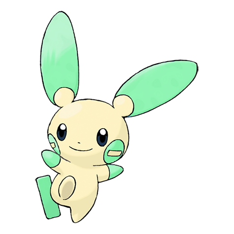
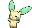
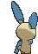
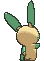

# #312 Minun (Cheering Pokémon)

| Official Artwork | Shiny Artwork |
|------------------|---------------|
|  |  |

**Rising Ruby:** Minun is more concerned about cheering on its partners than its own safety. It shorts out the electricity in its body to create brilliant showers of sparks to cheer on its teammates.

**Sinking Sapphire:** Minun loves to cheer on its partner in battle. It gives off sparks from its body while it is doing so. If its partner is in trouble, this Pokémon gives off increasing amounts of sparks.

---

## Media

### Default Sprites

| Front | Shiny | Back | Shiny |
|-------|-------|------|-------|
|  |  |  |  |

### Cries

Latest (Gen VI+):

<audio controls>
<source src='../../assets/cries/minun/latest.ogg' type='audio/ogg'>
  Your browser does not support the audio element.
</audio>

Legacy:

<audio controls>
<source src='../../assets/cries/minun/legacy.ogg' type='audio/ogg'>
  Your browser does not support the audio element.
</audio>

---

## Pokédex Data

| National № | Type(s) | Height | Weight | Abilities | Local № |
|------------|---------|--------|--------|-----------|---------|
| #312 | {: width="48"} | 0.4 m / 1.3 ft | 4.2 kg / 9.3 lbs | 1. Minus 2. Victory Star | N/A |

---

## Base Stats
|   | HP | Attack | Defense | Sp. Atk | Sp. Def | Speed |
|---|----|--------|---------|---------|---------|-------|
| **Base** | 70 | 50 | 60 | 85 | 95 | 105 |
| **Min** | 250 | 94 | 112 | 157 | 175 | 193 |
| **Max** | 344 | 218 | 240 | 295 | 317 | 339 |

The ranges shown above are for a level 100 Pokémon. Maximum values are based on a beneficial nature, 252 EVs, 31 IVs; minimum values are based on a hindering nature, 0 EVs, 0 IVs.

---

## Forms & Evolutions

!!! warning "WARNING"

    Information on evolutions may not be 100% accurate; differences between evolution methods across generations are not accounted for.

### Forms

Minun has no alternate forms.

### Evolution Line

1. [Minun](minun.md/)

---

## Training

| EV Yield | Catch Rate | Base Friendship | Base Exp. | Growth Rate | Held Items |
|----------|------------|-----------------|-----------|-------------|------------|
| 1 Spd | 200 | 70 | 142 | Medium | Cell Battery (5%) |

---

## Breeding

| Egg Groups | Egg Cycles | Gender | Dimorphic | Color | Shape |
|------------|------------|--------|-----------|-------|-------|
| 1. Fairy | 20 | 50.0% Male 50.0% Female | False | Yellow | Upright |

---

## Moves

!!! warning "WARNING"

    Specific move information may be incorrect. However, the general movepool should be accurate; this includes changes made in Sacred Gold and Storm Silver.

### Level Up Moves

| Lv. | Move | Type | Cat. | Power | Acc. | PP |
| --- | --- | --- | --- | --- | --- | --- |
| 1 | Growl | {: width="48"} | {: width="36"} | — | 100 | 40 |
| 1 | Nuzzle | {: width="48"} | {: width="36"} | 20 | 100 | 20 |
| 1 | Play Nice | {: width="48"} | {: width="36"} | — | — | 20 |
| 1 | Quick Attack | {: width="48"} | {: width="36"} | 40 | 100 | 30 |
| 1 | Thunder Wave | {: width="48"} | {: width="36"} | — | 90 | 20 |
| 4 | Helping Hand | {: width="48"} | {: width="36"} | — | — | 20 |
| 7 | Spark | {: width="48"} | {: width="36"} | 65 | 100 | 20 |
| 10 | Encore | {: width="48"} | {: width="36"} | — | 100 | 5 |
| 13 | Switcheroo | {: width="48"} | {: width="36"} | — | 100 | 10 |
| 16 | Swift | {: width="48"} | {: width="36"} | 60 | — | 20 |
| 19 | Electro Ball | {: width="48"} | {: width="36"} | — | 100 | 10 |
| 22 | Copycat | {: width="48"} | {: width="36"} | — | — | 20 |
| 25 | Fake Tears | {: width="48"} | {: width="36"} | — | 100 | 20 |
| 28 | Charge | {: width="48"} | {: width="36"} | — | — | 20 |
| 31 | Discharge | {: width="48"} | {: width="36"} | 80 | 100 | 15 |
| 34 | Baton Pass | {: width="48"} | {: width="36"} | — | — | 40 |
| 37 | Agility | {: width="48"} | {: width="36"} | — | — | 30 |
| 40 | Trump Card | {: width="48"} | {: width="36"} | — | — | 5 |
| 43 | Thunder | {: width="48"} | {: width="36"} | 110 | 70 | 10 |
| 46 | Nasty Plot | {: width="48"} | {: width="36"} | — | — | 20 |
| 49 | Entrainment | {: width="48"} | {: width="36"} | — | 100 | 15 |

### TM Moves

| TM | Move | Type | Cat. | Power | Acc. | PP |
| --- | --- | --- | --- | --- | --- | --- |
| TM06 | Toxic | {: width="48"} | {: width="36"} | — | 90 | 10 |
| TM10 | Hidden Power | {: width="48"} | {: width="36"} | 60 | 100 | 15 |
| TM100 | Confide | {: width="48"} | {: width="36"} | — | — | 20 |
| TM16 | Light Screen | {: width="48"} | {: width="36"} | — | — | 30 |
| TM17 | Protect | {: width="48"} | {: width="36"} | — | — | 10 |
| TM18 | Rain Dance | {: width="48"} | {: width="36"} | — | — | 5 |
| TM21 | Frustration | {: width="48"} | {: width="36"} | — | 100 | 20 |
| TM24 | Thunderbolt | {: width="48"} | {: width="36"} | 90 | 100 | 15 |
| TM25 | Thunder | {: width="48"} | {: width="36"} | 110 | 70 | 10 |
| TM27 | Return | {: width="48"} | {: width="36"} | — | 100 | 20 |
| TM32 | Double Team | {: width="48"} | {: width="36"} | — | — | 15 |
| TM42 | Facade | {: width="48"} | {: width="36"} | 70 | 100 | 20 |
| TM44 | Rest | {: width="48"} | {: width="36"} | — | — | 5 |
| TM45 | Attract | {: width="48"} | {: width="36"} | — | 100 | 15 |
| TM48 | Round | {: width="48"} | {: width="36"} | 60 | 100 | 15 |
| TM49 | Echoed Voice | {: width="48"} | {: width="36"} | 40 | 100 | 15 |
| TM56 | Fling | {: width="48"} | {: width="36"} | — | 100 | 10 |
| TM57 | Charge Beam | {: width="48"} | {: width="36"} | 50 | 90 | 10 |
| TM70 | Flash | {: width="48"} | {: width="36"} | — | 100 | 20 |
| TM72 | Volt Switch | {: width="48"} | {: width="36"} | 70 | 100 | 20 |
| TM73 | Thunder Wave | {: width="48"} | {: width="36"} | — | 90 | 20 |
| TM86 | Grass Knot | {: width="48"} | {: width="36"} | — | 100 | 20 |
| TM87 | Swagger | {: width="48"} | {: width="36"} | — | 85 | 15 |
| TM88 | Sleep Talk | {: width="48"} | {: width="36"} | — | — | 10 |
| TM90 | Substitute | {: width="48"} | {: width="36"} | — | — | 10 |
| TM93 | Wild Charge | {: width="48"} | {: width="36"} | 90 | 100 | 15 |
| TM94 | Secret Power | {: width="48"} | {: width="36"} | 70 | 100 | 20 |

### Egg Moves

| Move | Type | Cat. | Power | Acc. | PP |
| --- | --- | --- | --- | --- | --- |
| Charm | {: width="48"} | {: width="36"} | — | 100 | 20 |
| Discharge | {: width="48"} | {: width="36"} | 80 | 100 | 15 |
| Fake Tears | {: width="48"} | {: width="36"} | — | 100 | 20 |
| Lucky Chant | {: width="48"} | {: width="36"} | — | — | 30 |
| Sing | {: width="48"} | {: width="36"} | — | 55 | 15 |
| Sweet Kiss | {: width="48"} | {: width="36"} | — | 75 | 10 |
| Wish | {: width="48"} | {: width="36"} | — | — | 10 |

### Tutor Moves

| Move | Type | Cat. | Power | Acc. | PP |
| --- | --- | --- | --- | --- | --- |
| Electroweb | {: width="48"} | {: width="36"} | 55 | 95 | 15 |
| Helping Hand | {: width="48"} | {: width="36"} | — | — | 20 |
| Iron Tail | {: width="48"} | {: width="36"} | 100 | 75 | 15 |
| Last Resort | {: width="48"} | {: width="36"} | 140 | 100 | 5 |
| Magnet Rise | {: width="48"} | {: width="36"} | — | — | 10 |
| Shock Wave | {: width="48"} | {: width="36"} | 60 | — | 20 |
| Signal Beam | {: width="48"} | {: width="36"} | 75 | 100 | 15 |
| Snore | {: width="48"} | {: width="36"} | 50 | 100 | 15 |
| Thunder Punch | {: width="48"} | {: width="36"} | 75 | 100 | 15 |
| Uproar | {: width="48"} | {: width="36"} | 90 | 100 | 10 |

