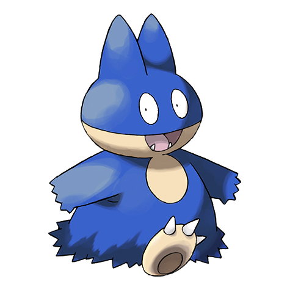
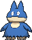
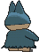

# #446 Munchlax (Big Eater Pokémon)

| Official Artwork | Shiny Artwork |
|------------------|---------------|
|  |  |

**Rising Ruby:** It hides food under its long body hair. However, it forgets it has hidden the food.

**Sinking Sapphire:** It conceals food under the long fur on its body. It carts around this food stash and swallows it without chewing.

---

## Media

### Default Sprites

| Front | Shiny | Back | Shiny |
|-------|-------|------|-------|
|  |  |  |  |

### Cries

Latest (Gen VI+):

<audio controls>
<source src='../../assets/cries/munchlax/latest.ogg' type='audio/ogg'>
  Your browser does not support the audio element.
</audio>

Legacy:

<audio controls>
<source src='../../assets/cries/munchlax/legacy.ogg' type='audio/ogg'>
  Your browser does not support the audio element.
</audio>

---

## Pokédex Data

| National № | Type(s) | Height | Weight | Abilities | Local № |
|------------|---------|--------|--------|-----------|---------|
| #446 | {: width="48"} | 0.6 m / 2.0 ft | 105.0 kg / 231.5 lbs | 1. Pickup 2. Thick Fat | #112 |

---

## Base Stats
|   | HP | Attack | Defense | Sp. Atk | Sp. Def | Speed |
|---|----|--------|---------|---------|---------|-------|
| **Base** | 135 | 85 | 40 | 40 | 85 | 5 |
| **Min** | 380 | 157 | 76 | 76 | 157 | 13 |
| **Max** | 474 | 295 | 196 | 196 | 295 | 119 |

The ranges shown above are for a level 100 Pokémon. Maximum values are based on a beneficial nature, 252 EVs, 31 IVs; minimum values are based on a hindering nature, 0 EVs, 0 IVs.

---

## Forms & Evolutions

!!! warning "WARNING"

    Information on evolutions may not be 100% accurate; differences between evolution methods across generations are not accounted for.

### Forms

Munchlax has no alternate forms.

### Evolution Line

1. [Munchlax](munchlax.md/)
    1. Level Up: [Snorlax](snorlax.md/)

---

## Training

| EV Yield | Catch Rate | Base Friendship | Base Exp. | Growth Rate | Held Items |
|----------|------------|-----------------|-----------|-------------|------------|
| 1 HP | 50 | 50 | 78 | Slow | Leftovers (100%) |

---

## Breeding

| Egg Groups | Egg Cycles | Gender | Dimorphic | Color | Shape |
|------------|------------|--------|-----------|-------|-------|
| 1. No-Eggs | 40 | 87.5% Male 12.5% Female | False | Black | Humanoid |

---

## Moves

!!! warning "WARNING"

    Specific move information may be incorrect. However, the general movepool should be accurate; this includes changes made in Sacred Gold and Storm Silver.

### Level Up Moves

| Lv. | Move | Type | Cat. | Power | Acc. | PP |
| --- | --- | --- | --- | --- | --- | --- |
| 1 | Defense Curl | {: width="48"} | {: width="36"} | — | — | 40 |
| 1 | Last Resort | {: width="48"} | {: width="36"} | 140 | 100 | 5 |
| 1 | Metronome | {: width="48"} | {: width="36"} | — | — | 10 |
| 1 | Odor Sleuth | {: width="48"} | {: width="36"} | — | — | 40 |
| 1 | Recycle | {: width="48"} | {: width="36"} | — | — | 10 |
| 1 | Tackle | {: width="48"} | {: width="36"} | 40 | 100 | 35 |
| 4 | Amnesia | {: width="48"} | {: width="36"} | — | — | 20 |
| 8 | Lick | {: width="48"} | {: width="36"} | 30 | 100 | 30 |
| 12 | Chip Away | {: width="48"} | {: width="36"} | 70 | 100 | 20 |
| 16 | Screech | {: width="48"} | {: width="36"} | — | 85 | 40 |
| 20 | Body Slam | {: width="48"} | {: width="36"} | 85 | 100 | 15 |
| 24 | Stockpile | {: width="48"} | {: width="36"} | — | — | 20 |
| 24 | Swallow | {: width="48"} | {: width="36"} | — | — | 10 |
| 28 | Rollout | {: width="48"} | {: width="36"} | 30 | 90 | 20 |
| 32 | Fling | {: width="48"} | {: width="36"} | — | 100 | 10 |
| 36 | Belly Drum | {: width="48"} | {: width="36"} | — | — | 10 |
| 40 | Natural Gift | {: width="48"} | {: width="36"} | — | 100 | 15 |
| 44 | Zen Headbutt | {: width="48"} | {: width="36"} | 80 | 90 | 15 |
| 48 | Snatch | {: width="48"} | {: width="36"} | — | — | 10 |
| 52 | Seed Bomb | {: width="48"} | {: width="36"} | 80 | 100 | 15 |
| 56 | Double Edge | {: width="48"} | {: width="36"} | 120 | 100 | 15 |
| 60 | Last Resort | {: width="48"} | {: width="36"} | 140 | 100 | 5 |

### TM Moves

| TM | Move | Type | Cat. | Power | Acc. | PP |
| --- | --- | --- | --- | --- | --- | --- |
| HM03 | Surf | {: width="48"} | {: width="36"} | 90 | 100 | 15 |
| HM04 | Strength | {: width="48"} | {: width="36"} | 100 | 100 | 10 |
| HM06 | Rock Smash | {: width="48"} | {: width="36"} | 65 | 100 | 15 |
| TM06 | Toxic | {: width="48"} | {: width="36"} | — | 90 | 10 |
| TM10 | Hidden Power | {: width="48"} | {: width="36"} | 60 | 100 | 15 |
| TM100 | Confide | {: width="48"} | {: width="36"} | — | — | 20 |
| TM11 | Sunny Day | {: width="48"} | {: width="36"} | — | — | 5 |
| TM13 | Ice Beam | {: width="48"} | {: width="36"} | 90 | 100 | 10 |
| TM14 | Blizzard | {: width="48"} | {: width="36"} | 110 | 70 | 5 |
| TM17 | Protect | {: width="48"} | {: width="36"} | — | — | 10 |
| TM18 | Rain Dance | {: width="48"} | {: width="36"} | — | — | 5 |
| TM21 | Frustration | {: width="48"} | {: width="36"} | — | 100 | 20 |
| TM22 | Solar Beam | {: width="48"} | {: width="36"} | 120 | 100 | 10 |
| TM24 | Thunderbolt | {: width="48"} | {: width="36"} | 90 | 100 | 15 |
| TM25 | Thunder | {: width="48"} | {: width="36"} | 110 | 70 | 10 |
| TM26 | Earthquake | {: width="48"} | {: width="36"} | 100 | 100 | 10 |
| TM27 | Return | {: width="48"} | {: width="36"} | — | 100 | 20 |
| TM29 | Psychic | {: width="48"} | {: width="36"} | 90 | 100 | 10 |
| TM30 | Shadow Ball | {: width="48"} | {: width="36"} | 80 | 100 | 15 |
| TM31 | Brick Break | {: width="48"} | {: width="36"} | 75 | 100 | 15 |
| TM32 | Double Team | {: width="48"} | {: width="36"} | — | — | 15 |
| TM35 | Flamethrower | {: width="48"} | {: width="36"} | 90 | 100 | 15 |
| TM37 | Sandstorm | {: width="48"} | {: width="36"} | — | — | 10 |
| TM38 | Fire Blast | {: width="48"} | {: width="36"} | 110 | 85 | 5 |
| TM39 | Rock Tomb | {: width="48"} | {: width="36"} | 60 | 95 | 15 |
| TM42 | Facade | {: width="48"} | {: width="36"} | 70 | 100 | 20 |
| TM44 | Rest | {: width="48"} | {: width="36"} | — | — | 5 |
| TM45 | Attract | {: width="48"} | {: width="36"} | — | 100 | 15 |
| TM48 | Round | {: width="48"} | {: width="36"} | 60 | 100 | 15 |
| TM56 | Fling | {: width="48"} | {: width="36"} | — | 100 | 10 |
| TM59 | Incinerate | {: width="48"} | {: width="36"} | 60 | 100 | 15 |
| TM67 | Retaliate | {: width="48"} | {: width="36"} | 70 | 100 | 5 |
| TM78 | Bulldoze | {: width="48"} | {: width="36"} | 60 | 100 | 20 |
| TM80 | Rock Slide | {: width="48"} | {: width="36"} | 75 | 90 | 10 |
| TM87 | Swagger | {: width="48"} | {: width="36"} | — | 85 | 15 |
| TM88 | Sleep Talk | {: width="48"} | {: width="36"} | — | — | 10 |
| TM90 | Substitute | {: width="48"} | {: width="36"} | — | — | 10 |
| TM94 | Secret Power | {: width="48"} | {: width="36"} | 70 | 100 | 20 |
| TM98 | Power Up Punch | {: width="48"} | {: width="36"} | 40 | 100 | 20 |

### Egg Moves

| Move | Type | Cat. | Power | Acc. | PP |
| --- | --- | --- | --- | --- | --- |
| After You | {: width="48"} | {: width="36"} | — | — | 15 |
| Belch | {: width="48"} | {: width="36"} | 120 | 90 | 10 |
| Charm | {: width="48"} | {: width="36"} | — | 100 | 20 |
| Counter | {: width="48"} | {: width="36"} | — | 100 | 20 |
| Curse | {: width="48"} | {: width="36"} | — | — | 10 |
| Double Edge | {: width="48"} | {: width="36"} | 120 | 100 | 15 |
| Lick | {: width="48"} | {: width="36"} | 30 | 100 | 30 |
| Natural Gift | {: width="48"} | {: width="36"} | — | 100 | 15 |
| Pursuit | {: width="48"} | {: width="36"} | 40 | 100 | 20 |
| Self Destruct | {: width="48"} | {: width="36"} | 200 | 100 | 5 |
| Whirlwind | {: width="48"} | {: width="36"} | — | — | 20 |
| Zen Headbutt | {: width="48"} | {: width="36"} | 80 | 90 | 15 |

### Tutor Moves

| Move | Type | Cat. | Power | Acc. | PP |
| --- | --- | --- | --- | --- | --- |
| After You | {: width="48"} | {: width="36"} | — | — | 15 |
| Covet | {: width="48"} | {: width="36"} | 60 | 100 | 25 |
| Fire Punch | {: width="48"} | {: width="36"} | 75 | 100 | 15 |
| Focus Punch | {: width="48"} | {: width="36"} | 150 | 100 | 20 |
| Gunk Shot | {: width="48"} | {: width="36"} | 120 | 80 | 5 |
| Hyper Voice | {: width="48"} | {: width="36"} | 90 | 100 | 10 |
| Ice Punch | {: width="48"} | {: width="36"} | 75 | 100 | 15 |
| Icy Wind | {: width="48"} | {: width="36"} | 55 | 95 | 15 |
| Last Resort | {: width="48"} | {: width="36"} | 140 | 100 | 5 |
| Recycle | {: width="48"} | {: width="36"} | — | — | 10 |
| Seed Bomb | {: width="48"} | {: width="36"} | 80 | 100 | 15 |
| Shock Wave | {: width="48"} | {: width="36"} | 60 | — | 20 |
| Snatch | {: width="48"} | {: width="36"} | — | — | 10 |
| Snore | {: width="48"} | {: width="36"} | 50 | 100 | 15 |
| Superpower | {: width="48"} | {: width="36"} | 120 | 100 | 5 |
| Thunder Punch | {: width="48"} | {: width="36"} | 75 | 100 | 15 |
| Uproar | {: width="48"} | {: width="36"} | 90 | 100 | 10 |
| Water Pulse | {: width="48"} | {: width="36"} | 60 | 100 | 20 |
| Zen Headbutt | {: width="48"} | {: width="36"} | 80 | 90 | 15 |

