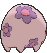
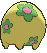

# #517 Munna (Dream Eater Pokémon)

| Official Artwork | Shiny Artwork |
|------------------|---------------|
|  |  |

**Rising Ruby:** This Pokémon appears before people and Pokémon who are having nightmares and eats those dreams.

**Sinking Sapphire:** It eats the dreams of people and Pokémon. When it eats a pleasant dream, it expels pink-colored mist.

---

## Media

### Default Sprites

| Front | Shiny | Back | Shiny |
|-------|-------|------|-------|
|  |  |  |  |

### Cries

Latest (Gen VI+):

<audio controls>
<source src='../../assets/cries/munna/latest.ogg' type='audio/ogg'>
  Your browser does not support the audio element.
</audio>

Legacy:

<audio controls>
<source src='../../assets/cries/munna/legacy.ogg' type='audio/ogg'>
  Your browser does not support the audio element.
</audio>

---

## Pokédex Data

| National № | Type(s) | Height | Weight | Abilities | Local № |
|------------|---------|--------|--------|-----------|---------|
| #517 | {: width="48"} | 0.6 m / 2.0 ft | 23.3 kg / 51.4 lbs | 1. Forewarn 2. Synchronize | N/A |

---

## Base Stats
|   | HP | Attack | Defense | Sp. Atk | Sp. Def | Speed |
|---|----|--------|---------|---------|---------|-------|
| **Base** | 76 | 25 | 45 | 67 | 55 | 24 |
| **Min** | 262 | 49 | 85 | 125 | 103 | 47 |
| **Max** | 356 | 163 | 207 | 256 | 229 | 161 |

The ranges shown above are for a level 100 Pokémon. Maximum values are based on a beneficial nature, 252 EVs, 31 IVs; minimum values are based on a hindering nature, 0 EVs, 0 IVs.

---

## Forms & Evolutions

!!! warning "WARNING"

    Information on evolutions may not be 100% accurate; differences between evolution methods across generations are not accounted for.

### Forms

Munna has no alternate forms.

### Evolution Line

1. [Munna](munna.md/)
    1. Use Item: [Musharna](musharna.md/)

---

## Training

| EV Yield | Catch Rate | Base Friendship | Base Exp. | Growth Rate | Held Items |
|----------|------------|-----------------|-----------|-------------|------------|
| 1 HP | 190 | 50 | 58 | Fast | N/A |

---

## Breeding

| Egg Groups | Egg Cycles | Gender | Dimorphic | Color | Shape |
|------------|------------|--------|-----------|-------|-------|
| 1. Ground | 10 | 50.0% Male 50.0% Female | False | Pink | Quadruped |

---

## Moves

!!! warning "WARNING"

    Specific move information may be incorrect. However, the general movepool should be accurate; this includes changes made in Sacred Gold and Storm Silver.

### Level Up Moves

| Lv. | Move | Type | Cat. | Power | Acc. | PP |
| --- | --- | --- | --- | --- | --- | --- |
| 1 | Defense Curl | {: width="48"} | {: width="36"} | — | — | 40 |
| 1 | Psywave | {: width="48"} | {: width="36"} | — | 100 | 15 |
| 5 | Lucky Chant | {: width="48"} | {: width="36"} | — | — | 30 |
| 7 | Yawn | {: width="48"} | {: width="36"} | — | — | 10 |
| 11 | Psybeam | {: width="48"} | {: width="36"} | 65 | 100 | 20 |
| 13 | Imprison | {: width="48"} | {: width="36"} | — | — | 10 |
| 17 | Moonlight | {: width="48"} | {: width="36"} | — | — | 5 |
| 19 | Hypnosis | {: width="48"} | {: width="36"} | — | 60 | 20 |
| 23 | Zen Headbutt | {: width="48"} | {: width="36"} | 80 | 90 | 15 |
| 25 | Synchronoise | {: width="48"} | {: width="36"} | 120 | 100 | 10 |
| 29 | Nightmare | {: width="48"} | {: width="36"} | — | 100 | 15 |
| 31 | Psychic | {: width="48"} | {: width="36"} | 90 | 100 | 10 |
| 35 | Calm Mind | {: width="48"} | {: width="36"} | — | — | 20 |
| 37 | Future Sight | {: width="48"} | {: width="36"} | 120 | 100 | 10 |
| 41 | Dream Eater | {: width="48"} | {: width="36"} | 100 | 100 | 15 |
| 43 | Telekinesis | {: width="48"} | {: width="36"} | — | — | 15 |
| 47 | Stored Power | {: width="48"} | {: width="36"} | 20 | 100 | 10 |

### TM Moves

| TM | Move | Type | Cat. | Power | Acc. | PP |
| --- | --- | --- | --- | --- | --- | --- |
| TM03 | Psyshock | {: width="48"} | {: width="36"} | 80 | 100 | 10 |
| TM04 | Calm Mind | {: width="48"} | {: width="36"} | — | — | 20 |
| TM06 | Toxic | {: width="48"} | {: width="36"} | — | 90 | 10 |
| TM10 | Hidden Power | {: width="48"} | {: width="36"} | 60 | 100 | 15 |
| TM100 | Confide | {: width="48"} | {: width="36"} | — | — | 20 |
| TM16 | Light Screen | {: width="48"} | {: width="36"} | — | — | 30 |
| TM17 | Protect | {: width="48"} | {: width="36"} | — | — | 10 |
| TM18 | Rain Dance | {: width="48"} | {: width="36"} | — | — | 5 |
| TM20 | Safeguard | {: width="48"} | {: width="36"} | — | — | 25 |
| TM21 | Frustration | {: width="48"} | {: width="36"} | — | 100 | 20 |
| TM27 | Return | {: width="48"} | {: width="36"} | — | 100 | 20 |
| TM29 | Psychic | {: width="48"} | {: width="36"} | 90 | 100 | 10 |
| TM30 | Shadow Ball | {: width="48"} | {: width="36"} | 80 | 100 | 15 |
| TM32 | Double Team | {: width="48"} | {: width="36"} | — | — | 15 |
| TM33 | Reflect | {: width="48"} | {: width="36"} | — | — | 20 |
| TM39 | Rock Tomb | {: width="48"} | {: width="36"} | 60 | 95 | 15 |
| TM41 | Torment | {: width="48"} | {: width="36"} | — | 100 | 15 |
| TM42 | Facade | {: width="48"} | {: width="36"} | 70 | 100 | 20 |
| TM44 | Rest | {: width="48"} | {: width="36"} | — | — | 5 |
| TM45 | Attract | {: width="48"} | {: width="36"} | — | 100 | 15 |
| TM48 | Round | {: width="48"} | {: width="36"} | 60 | 100 | 15 |
| TM53 | Energy Ball | {: width="48"} | {: width="36"} | 90 | 100 | 10 |
| TM57 | Charge Beam | {: width="48"} | {: width="36"} | 50 | 90 | 10 |
| TM70 | Flash | {: width="48"} | {: width="36"} | — | 100 | 20 |
| TM73 | Thunder Wave | {: width="48"} | {: width="36"} | — | 90 | 20 |
| TM74 | Gyro Ball | {: width="48"} | {: width="36"} | — | 100 | 5 |
| TM77 | Psych Up | {: width="48"} | {: width="36"} | — | — | 10 |
| TM80 | Rock Slide | {: width="48"} | {: width="36"} | 75 | 90 | 10 |
| TM85 | Dream Eater | {: width="48"} | {: width="36"} | 100 | 100 | 15 |
| TM87 | Swagger | {: width="48"} | {: width="36"} | — | 85 | 15 |
| TM88 | Sleep Talk | {: width="48"} | {: width="36"} | — | — | 10 |
| TM90 | Substitute | {: width="48"} | {: width="36"} | — | — | 10 |
| TM92 | Trick Room | {: width="48"} | {: width="36"} | — | — | 5 |
| TM94 | Secret Power | {: width="48"} | {: width="36"} | 70 | 100 | 20 |
| TM99 | Dazzling Gleam | {: width="48"} | {: width="36"} | 80 | 100 | 10 |

### Egg Moves

| Move | Type | Cat. | Power | Acc. | PP |
| --- | --- | --- | --- | --- | --- |
| Barrier | {: width="48"} | {: width="36"} | — | — | 20 |
| Baton Pass | {: width="48"} | {: width="36"} | — | — | 40 |
| Curse | {: width="48"} | {: width="36"} | — | — | 10 |
| Healing Wish | {: width="48"} | {: width="36"} | — | — | 10 |
| Helping Hand | {: width="48"} | {: width="36"} | — | — | 20 |
| Magic Coat | {: width="48"} | {: width="36"} | — | — | 15 |
| Secret Power | {: width="48"} | {: width="36"} | 70 | 100 | 20 |
| Sleep Talk | {: width="48"} | {: width="36"} | — | — | 10 |
| Sonic Boom | {: width="48"} | {: width="36"} | — | 90 | 20 |
| Swift | {: width="48"} | {: width="36"} | 60 | — | 20 |

### Tutor Moves

| Move | Type | Cat. | Power | Acc. | PP |
| --- | --- | --- | --- | --- | --- |
| After You | {: width="48"} | {: width="36"} | — | — | 15 |
| Gravity | {: width="48"} | {: width="36"} | — | — | 5 |
| Heal Bell | {: width="48"} | {: width="36"} | — | — | 5 |
| Helping Hand | {: width="48"} | {: width="36"} | — | — | 20 |
| Magic Coat | {: width="48"} | {: width="36"} | — | — | 15 |
| Pain Split | {: width="48"} | {: width="36"} | — | — | 20 |
| Shock Wave | {: width="48"} | {: width="36"} | 60 | — | 20 |
| Signal Beam | {: width="48"} | {: width="36"} | 75 | 100 | 15 |
| Skill Swap | {: width="48"} | {: width="36"} | — | — | 10 |
| Snore | {: width="48"} | {: width="36"} | 50 | 100 | 15 |
| Trick | {: width="48"} | {: width="36"} | — | 100 | 10 |
| Wonder Room | {: width="48"} | {: width="36"} | — | — | 10 |
| Worry Seed | {: width="48"} | {: width="36"} | — | 100 | 10 |
| Zen Headbutt | {: width="48"} | {: width="36"} | 80 | 90 | 15 |

