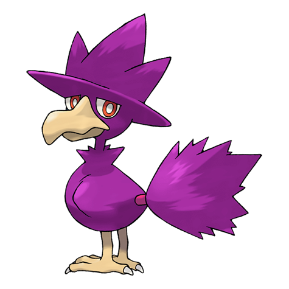
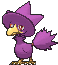
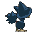
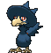
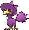
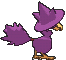

# #198 Murkrow (Darkness Pokémon)

| Official Artwork | Shiny Artwork |
|------------------|---------------|
|  |  |

Murkrow was feared and loathed as the alleged bearer of ill fortune. This Pokémon shows strong interest in anything that sparkles or glitters. It will even try to steal rings from women.

---

## Media

### Default Sprites

| Front | Shiny | Back | Shiny |
|-------|-------|------|-------|
|  |  |  | N/A |

### Female Sprites

| Front | Shiny | Back | Shiny |
|-------|-------|------|-------|
|  |  | N/A |  |

### Cries

Latest (Gen VI+):

<audio controls>
<source src='../../assets/cries/murkrow/latest.ogg' type='audio/ogg'>
  Your browser does not support the audio element.
</audio>

Legacy:

<audio controls>
<source src='../../assets/cries/murkrow/legacy.ogg' type='audio/ogg'>
  Your browser does not support the audio element.
</audio>

---

## Pokédex Data

| National № | Type(s) | Height | Weight | Abilities | Local № |
|------------|---------|--------|--------|-----------|---------|
| #198 | {: width="48"} {: width="48"} | 0.5 m / 1.6 ft | 2.1 kg / 4.6 lbs | 1. Insomnia 2. Super Luck | #74 |

---

## Base Stats
|   | HP | Attack | Defense | Sp. Atk | Sp. Def | Speed |
|---|----|--------|---------|---------|---------|-------|
| **Base** | 60 | 85 | 42 | 85 | 42 | 91 |
| **Min** | 230 | 157 | 80 | 157 | 80 | 168 |
| **Max** | 324 | 295 | 201 | 295 | 201 | 309 |

The ranges shown above are for a level 100 Pokémon. Maximum values are based on a beneficial nature, 252 EVs, 31 IVs; minimum values are based on a hindering nature, 0 EVs, 0 IVs.

---

## Forms & Evolutions

!!! warning "WARNING"

    Information on evolutions may not be 100% accurate; differences between evolution methods across generations are not accounted for.

### Forms

Murkrow has no alternate forms.

### Evolution Line

1. [Murkrow](murkrow.md/)
    1. Use Item: [Honchkrow](honchkrow.md/)

---

## Training

| EV Yield | Catch Rate | Base Friendship | Base Exp. | Growth Rate | Held Items |
|----------|------------|-----------------|-----------|-------------|------------|
| 1 Spd | 30 | 35 | 81 | Medium Slow | N/A |

---

## Breeding

| Egg Groups | Egg Cycles | Gender | Dimorphic | Color | Shape |
|------------|------------|--------|-----------|-------|-------|
| 1. Flying | 20 | 50.0% Male 50.0% Female | True | Black | Wings |

---

## Moves

!!! warning "WARNING"

    Specific move information may be incorrect. However, the general movepool should be accurate; this includes changes made in Sacred Gold and Storm Silver.

### Level Up Moves

| Lv. | Move | Type | Cat. | Power | Acc. | PP |
| --- | --- | --- | --- | --- | --- | --- |
| 1 | Astonish | {: width="48"} | {: width="36"} | 30 | 100 | 15 |
| 1 | Peck | {: width="48"} | {: width="36"} | 35 | 100 | 35 |
| 6 | Pursuit | {: width="48"} | {: width="36"} | 40 | 100 | 20 |
| 10 | Haze | {: width="48"} | {: width="36"} | — | — | 30 |
| 14 | Wing Attack | {: width="48"} | {: width="36"} | 60 | 100 | 35 |
| 18 | Night Shade | {: width="48"} | {: width="36"} | — | 100 | 15 |
| 22 | Assurance | {: width="48"} | {: width="36"} | 60 | 100 | 10 |
| 26 | Feint Attack | {: width="48"} | {: width="36"} | 60 | — | 20 |
| 30 | Drill Peck | {: width="48"} | {: width="36"} | 80 | 100 | 20 |
| 34 | Taunt | {: width="48"} | {: width="36"} | — | 100 | 20 |
| 38 | Mean Look | {: width="48"} | {: width="36"} | — | — | 5 |
| 42 | Foul Play | {: width="48"} | {: width="36"} | 95 | 100 | 15 |
| 46 | Tailwind | {: width="48"} | {: width="36"} | — | — | 15 |
| 50 | Sucker Punch | {: width="48"} | {: width="36"} | 70 | 100 | 5 |
| 54 | Brave Bird | {: width="48"} | {: width="36"} | 120 | 100 | 15 |
| 58 | Torment | {: width="48"} | {: width="36"} | — | 100 | 15 |
| 62 | Quash | {: width="48"} | {: width="36"} | — | 100 | 15 |

### TM Moves

| TM | Move | Type | Cat. | Power | Acc. | PP |
| --- | --- | --- | --- | --- | --- | --- |
| HM02 | Fly | {: width="48"} | {: width="36"} | 100 | 100 | 10 |
| TM04 | Calm Mind | {: width="48"} | {: width="36"} | — | — | 20 |
| TM06 | Toxic | {: width="48"} | {: width="36"} | — | 90 | 10 |
| TM10 | Hidden Power | {: width="48"} | {: width="36"} | 60 | 100 | 15 |
| TM100 | Confide | {: width="48"} | {: width="36"} | — | — | 20 |
| TM11 | Sunny Day | {: width="48"} | {: width="36"} | — | — | 5 |
| TM12 | Taunt | {: width="48"} | {: width="36"} | — | 100 | 20 |
| TM17 | Protect | {: width="48"} | {: width="36"} | — | — | 10 |
| TM18 | Rain Dance | {: width="48"} | {: width="36"} | — | — | 5 |
| TM19 | Roost | {: width="48"} | {: width="36"} | — | — | 5 |
| TM21 | Frustration | {: width="48"} | {: width="36"} | — | 100 | 20 |
| TM27 | Return | {: width="48"} | {: width="36"} | — | 100 | 20 |
| TM29 | Psychic | {: width="48"} | {: width="36"} | 90 | 100 | 10 |
| TM30 | Shadow Ball | {: width="48"} | {: width="36"} | 80 | 100 | 15 |
| TM32 | Double Team | {: width="48"} | {: width="36"} | — | — | 15 |
| TM40 | Aerial Ace | {: width="48"} | {: width="36"} | 60 | — | 20 |
| TM41 | Torment | {: width="48"} | {: width="36"} | — | 100 | 15 |
| TM42 | Facade | {: width="48"} | {: width="36"} | 70 | 100 | 20 |
| TM44 | Rest | {: width="48"} | {: width="36"} | — | — | 5 |
| TM45 | Attract | {: width="48"} | {: width="36"} | — | 100 | 15 |
| TM46 | Thief | {: width="48"} | {: width="36"} | 60 | 100 | 25 |
| TM48 | Round | {: width="48"} | {: width="36"} | 60 | 100 | 15 |
| TM51 | Steel Wing | {: width="48"} | {: width="36"} | 70 | 90 | 25 |
| TM60 | Quash | {: width="48"} | {: width="36"} | — | 100 | 15 |
| TM63 | Embargo | {: width="48"} | {: width="36"} | — | 100 | 15 |
| TM66 | Payback | {: width="48"} | {: width="36"} | 50 | 100 | 10 |
| TM67 | Retaliate | {: width="48"} | {: width="36"} | 70 | 100 | 5 |
| TM73 | Thunder Wave | {: width="48"} | {: width="36"} | — | 90 | 20 |
| TM77 | Psych Up | {: width="48"} | {: width="36"} | — | — | 10 |
| TM85 | Dream Eater | {: width="48"} | {: width="36"} | 100 | 100 | 15 |
| TM87 | Swagger | {: width="48"} | {: width="36"} | — | 85 | 15 |
| TM88 | Sleep Talk | {: width="48"} | {: width="36"} | — | — | 10 |
| TM90 | Substitute | {: width="48"} | {: width="36"} | — | — | 10 |
| TM94 | Secret Power | {: width="48"} | {: width="36"} | 70 | 100 | 20 |
| TM95 | Snarl | {: width="48"} | {: width="36"} | 55 | 95 | 15 |
| TM97 | Dark Pulse | {: width="48"} | {: width="36"} | 80 | 100 | 15 |

### Egg Moves

| Move | Type | Cat. | Power | Acc. | PP |
| --- | --- | --- | --- | --- | --- |
| Assurance | {: width="48"} | {: width="36"} | 60 | 100 | 10 |
| Brave Bird | {: width="48"} | {: width="36"} | 120 | 100 | 15 |
| Confuse Ray | {: width="48"} | {: width="36"} | — | 100 | 10 |
| Drill Peck | {: width="48"} | {: width="36"} | 80 | 100 | 20 |
| Feather Dance | {: width="48"} | {: width="36"} | — | 100 | 15 |
| Feint Attack | {: width="48"} | {: width="36"} | 60 | — | 20 |
| Flatter | {: width="48"} | {: width="36"} | — | 100 | 15 |
| Mirror Move | {: width="48"} | {: width="36"} | — | — | 20 |
| Perish Song | {: width="48"} | {: width="36"} | — | — | 5 |
| Psycho Shift | {: width="48"} | {: width="36"} | — | 100 | 10 |
| Roost | {: width="48"} | {: width="36"} | — | — | 5 |
| Screech | {: width="48"} | {: width="36"} | — | 85 | 40 |
| Sky Attack | {: width="48"} | {: width="36"} | 140 | 90 | 5 |
| Whirlwind | {: width="48"} | {: width="36"} | — | — | 20 |
| Wing Attack | {: width="48"} | {: width="36"} | 60 | 100 | 35 |

### Tutor Moves

| Move | Type | Cat. | Power | Acc. | PP |
| --- | --- | --- | --- | --- | --- |
| Foul Play | {: width="48"} | {: width="36"} | 95 | 100 | 15 |
| Heat Wave | {: width="48"} | {: width="36"} | 95 | 90 | 10 |
| Icy Wind | {: width="48"} | {: width="36"} | 55 | 95 | 15 |
| Sky Attack | {: width="48"} | {: width="36"} | 140 | 90 | 5 |
| Snatch | {: width="48"} | {: width="36"} | — | — | 10 |
| Snore | {: width="48"} | {: width="36"} | 50 | 100 | 15 |
| Spite | {: width="48"} | {: width="36"} | — | 100 | 10 |
| Tailwind | {: width="48"} | {: width="36"} | — | — | 15 |
| Uproar | {: width="48"} | {: width="36"} | 90 | 100 | 10 |

