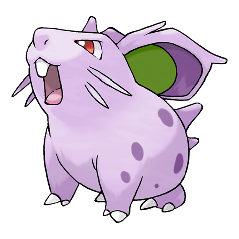
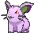
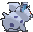
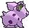

# #029 Nidoran F (Poison Pin Pokémon)

| Official Artwork | Shiny Artwork |
|------------------|---------------|
|  |  |

Nidoran♀ has barbs that secrete a powerful poison. They are thought to have developed as protection for this small-bodied Pokémon. When enraged, it releases a horrible toxin from its horn.

---

## Media

### Default Sprites

| Front | Shiny | Back | Shiny |
|-------|-------|------|-------|
|  |  |  |  |

### Cries

Latest (Gen VI+):

<audio controls>
<source src='../../assets/cries/nidoran-f/latest.ogg' type='audio/ogg'>
  Your browser does not support the audio element.
</audio>

Legacy:

<audio controls>
<source src='../../assets/cries/nidoran-f/legacy.ogg' type='audio/ogg'>
  Your browser does not support the audio element.
</audio>

---

## Pokédex Data

| National № | Type(s) | Height | Weight | Abilities | Local № |
|------------|---------|--------|--------|-----------|---------|
| #29 | {: width="48"} | 0.4 m / 1.3 ft | 7.0 kg / 15.4 lbs | 1. Poison Point 2. Rivalry | N/A |

---

## Base Stats
|   | HP | Attack | Defense | Sp. Atk | Sp. Def | Speed |
|---|----|--------|---------|---------|---------|-------|
| **Base** | 55 | 47 | 52 | 40 | 40 | 41 |
| **Min** | 220 | 89 | 98 | 76 | 76 | 78 |
| **Max** | 314 | 212 | 223 | 196 | 196 | 199 |

The ranges shown above are for a level 100 Pokémon. Maximum values are based on a beneficial nature, 252 EVs, 31 IVs; minimum values are based on a hindering nature, 0 EVs, 0 IVs.

---

## Forms & Evolutions

!!! warning "WARNING"

    Information on evolutions may not be 100% accurate; differences between evolution methods across generations are not accounted for.

### Forms

Nidoran F has no alternate forms.

### Evolution Line

1. [Nidoran F](nidoran-f.md/)
    1. Level Up: [Nidorina](nidorina.md/)
        1. Use Item: [Nidoqueen](nidoqueen.md/)

---

## Training

| EV Yield | Catch Rate | Base Friendship | Base Exp. | Growth Rate | Held Items |
|----------|------------|-----------------|-----------|-------------|------------|
| 1 HP | 235 | 50 | 55 | Medium Slow | N/A |

---

## Breeding

| Egg Groups | Egg Cycles | Gender | Dimorphic | Color | Shape |
|------------|------------|--------|-----------|-------|-------|
| 1. Monster 2. Ground | 20 | 0.0% Male 100.0% Female | False | Blue | Quadruped |

---

## Moves

!!! warning "WARNING"

    Specific move information may be incorrect. However, the general movepool should be accurate; this includes changes made in Sacred Gold and Storm Silver.

### Level Up Moves

| Lv. | Move | Type | Cat. | Power | Acc. | PP |
| --- | --- | --- | --- | --- | --- | --- |
| 1 | Growl | {: width="48"} | {: width="36"} | — | 100 | 40 |
| 1 | Poison Sting | {: width="48"} | {: width="36"} | 15 | 100 | 35 |
| 1 | Scratch | {: width="48"} | {: width="36"} | 50 | 100 | 35 |
| 6 | Tail Whip | {: width="48"} | {: width="36"} | — | 100 | 30 |
| 9 | Double Kick | {: width="48"} | {: width="36"} | 30 | 100 | 30 |
| 12 | Poison Fang | {: width="48"} | {: width="36"} | 50 | 100 | 15 |
| 15 | Fury Swipes | {: width="48"} | {: width="36"} | 18 | 80 | 15 |
| 18 | Bite | {: width="48"} | {: width="36"} | 60 | 100 | 25 |
| 21 | Poison Jab | {: width="48"} | {: width="36"} | 80 | 100 | 20 |
| 24 | Helping Hand | {: width="48"} | {: width="36"} | — | — | 20 |
| 27 | Crunch | {: width="48"} | {: width="36"} | 80 | 100 | 15 |
| 30 | Toxic Spikes | {: width="48"} | {: width="36"} | — | — | 20 |
| 33 | Flatter | {: width="48"} | {: width="36"} | — | 100 | 15 |
| 36 | Captivate | {: width="48"} | {: width="36"} | — | 100 | 20 |
| 39 | Skull Bash | {: width="48"} | {: width="36"} | 130 | 100 | 10 |
| 42 | Super Fang | {: width="48"} | {: width="36"} | — | 90 | 10 |

### TM Moves

| TM | Move | Type | Cat. | Power | Acc. | PP |
| --- | --- | --- | --- | --- | --- | --- |
| HM01 | Cut | {: width="48"} | {: width="36"} | 70 | 100 | 15 |
| HM04 | Strength | {: width="48"} | {: width="36"} | 100 | 100 | 10 |
| HM06 | Rock Smash | {: width="48"} | {: width="36"} | 65 | 100 | 15 |
| TM01 | Hone Claws | {: width="48"} | {: width="36"} | — | — | 15 |
| TM06 | Toxic | {: width="48"} | {: width="36"} | — | 90 | 10 |
| TM09 | Venoshock | {: width="48"} | {: width="36"} | 65 | 100 | 10 |
| TM10 | Hidden Power | {: width="48"} | {: width="36"} | 60 | 100 | 15 |
| TM100 | Confide | {: width="48"} | {: width="36"} | — | — | 20 |
| TM11 | Sunny Day | {: width="48"} | {: width="36"} | — | — | 5 |
| TM13 | Ice Beam | {: width="48"} | {: width="36"} | 90 | 100 | 10 |
| TM14 | Blizzard | {: width="48"} | {: width="36"} | 110 | 70 | 5 |
| TM17 | Protect | {: width="48"} | {: width="36"} | — | — | 10 |
| TM18 | Rain Dance | {: width="48"} | {: width="36"} | — | — | 5 |
| TM21 | Frustration | {: width="48"} | {: width="36"} | — | 100 | 20 |
| TM24 | Thunderbolt | {: width="48"} | {: width="36"} | 90 | 100 | 15 |
| TM25 | Thunder | {: width="48"} | {: width="36"} | 110 | 70 | 10 |
| TM27 | Return | {: width="48"} | {: width="36"} | — | 100 | 20 |
| TM28 | Dig | {: width="48"} | {: width="36"} | 80 | 100 | 10 |
| TM32 | Double Team | {: width="48"} | {: width="36"} | — | — | 15 |
| TM36 | Sludge Bomb | {: width="48"} | {: width="36"} | 90 | 100 | 10 |
| TM40 | Aerial Ace | {: width="48"} | {: width="36"} | 60 | — | 20 |
| TM42 | Facade | {: width="48"} | {: width="36"} | 70 | 100 | 20 |
| TM44 | Rest | {: width="48"} | {: width="36"} | — | — | 5 |
| TM45 | Attract | {: width="48"} | {: width="36"} | — | 100 | 15 |
| TM46 | Thief | {: width="48"} | {: width="36"} | 60 | 100 | 25 |
| TM48 | Round | {: width="48"} | {: width="36"} | 60 | 100 | 15 |
| TM49 | Echoed Voice | {: width="48"} | {: width="36"} | 40 | 100 | 15 |
| TM65 | Shadow Claw | {: width="48"} | {: width="36"} | 70 | 100 | 15 |
| TM84 | Poison Jab | {: width="48"} | {: width="36"} | 80 | 100 | 20 |
| TM87 | Swagger | {: width="48"} | {: width="36"} | — | 85 | 15 |
| TM88 | Sleep Talk | {: width="48"} | {: width="36"} | — | — | 10 |
| TM90 | Substitute | {: width="48"} | {: width="36"} | — | — | 10 |
| TM94 | Secret Power | {: width="48"} | {: width="36"} | 70 | 100 | 20 |

### Egg Moves

| Move | Type | Cat. | Power | Acc. | PP |
| --- | --- | --- | --- | --- | --- |
| Beat Up | {: width="48"} | {: width="36"} | — | 100 | 10 |
| Charm | {: width="48"} | {: width="36"} | — | 100 | 20 |
| Chip Away | {: width="48"} | {: width="36"} | 70 | 100 | 20 |
| Counter | {: width="48"} | {: width="36"} | — | 100 | 20 |
| Disable | {: width="48"} | {: width="36"} | — | 100 | 20 |
| Endure | {: width="48"} | {: width="36"} | — | — | 10 |
| Focus Energy | {: width="48"} | {: width="36"} | — | — | 30 |
| Iron Tail | {: width="48"} | {: width="36"} | 100 | 75 | 15 |
| Poison Tail | {: width="48"} | {: width="36"} | 50 | 100 | 25 |
| Pursuit | {: width="48"} | {: width="36"} | 40 | 100 | 20 |
| Skull Bash | {: width="48"} | {: width="36"} | 130 | 100 | 10 |
| Supersonic | {: width="48"} | {: width="36"} | — | 55 | 20 |
| Take Down | {: width="48"} | {: width="36"} | 90 | 85 | 20 |
| Venom Drench | {: width="48"} | {: width="36"} | — | 100 | 20 |

### Tutor Moves

| Move | Type | Cat. | Power | Acc. | PP |
| --- | --- | --- | --- | --- | --- |
| Helping Hand | {: width="48"} | {: width="36"} | — | — | 20 |
| Iron Tail | {: width="48"} | {: width="36"} | 100 | 75 | 15 |
| Shock Wave | {: width="48"} | {: width="36"} | 60 | — | 20 |
| Snore | {: width="48"} | {: width="36"} | 50 | 100 | 15 |
| Super Fang | {: width="48"} | {: width="36"} | — | 90 | 10 |
| Water Pulse | {: width="48"} | {: width="36"} | 60 | 100 | 20 |

