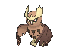

# #164 Noctowl (Owl Pokémon)

| Official Artwork | Shiny Artwork |
|------------------|---------------|
|  |  |

Noctowl never fails at catching prey in darkness. This Pokémon owes its success to its superior vision that allows it to see in minimal light, and to its soft, supple wings that make no sound in flight.

---

## Media

### Default Sprites

| Front | Shiny | Back | Shiny |
|-------|-------|------|-------|
|  |  |  |  |

### Cries

Latest (Gen VI+):

<audio controls>
<source src='../../assets/cries/noctowl/latest.ogg' type='audio/ogg'>
  Your browser does not support the audio element.
</audio>

Legacy:

<audio controls>
<source src='../../assets/cries/noctowl/legacy.ogg' type='audio/ogg'>
  Your browser does not support the audio element.
</audio>

---

## Pokédex Data

| National № | Type(s) | Height | Weight | Abilities | Local № |
|------------|---------|--------|--------|-----------|---------|
| #164 | {: width="48"} {: width="48"} | 1.6 m / 5.2 ft | 40.8 kg / 89.9 lbs | 1. Insomnia 2. Analytic | #107 |

---

## Base Stats
|   | HP | Attack | Defense | Sp. Atk | Sp. Def | Speed |
|---|----|--------|---------|---------|---------|-------|
| **Base** | 100 | 30 | 60 | 90 | 110 | 75 |
| **Min** | 310 | 58 | 112 | 166 | 202 | 139 |
| **Max** | 404 | 174 | 240 | 306 | 350 | 273 |

The ranges shown above are for a level 100 Pokémon. Maximum values are based on a beneficial nature, 252 EVs, 31 IVs; minimum values are based on a hindering nature, 0 EVs, 0 IVs.

---

## Forms & Evolutions

!!! warning "WARNING"

    Information on evolutions may not be 100% accurate; differences between evolution methods across generations are not accounted for.

### Forms

Noctowl has no alternate forms.

### Evolution Line

1. [Hoothoot](hoothoot.md/)
    1. Level Up: [Noctowl](noctowl.md/)

---

## Training

| EV Yield | Catch Rate | Base Friendship | Base Exp. | Growth Rate | Held Items |
|----------|------------|-----------------|-----------|-------------|------------|
| 2 HP 2 Sp.-Def | 90 | 50 | 158 | Medium | N/A |

---

## Breeding

| Egg Groups | Egg Cycles | Gender | Dimorphic | Color | Shape |
|------------|------------|--------|-----------|-------|-------|
| 1. Flying | 15 | 50.0% Male 50.0% Female | False | Brown | Wings |

---

## Moves

!!! warning "WARNING"

    Specific move information may be incorrect. However, the general movepool should be accurate; this includes changes made in Sacred Gold and Storm Silver.

### Level Up Moves

| Lv. | Move | Type | Cat. | Power | Acc. | PP |
| --- | --- | --- | --- | --- | --- | --- |
| 1 | Dream Eater | {: width="48"} | {: width="36"} | 100 | 100 | 15 |
| 1 | Foresight | {: width="48"} | {: width="36"} | — | — | 40 |
| 1 | Growl | {: width="48"} | {: width="36"} | — | 100 | 40 |
| 1 | Heat Wave | {: width="48"} | {: width="36"} | 95 | 90 | 10 |
| 1 | Hurricane | {: width="48"} | {: width="36"} | 110 | 70 | 10 |
| 1 | Hyper Voice | {: width="48"} | {: width="36"} | 90 | 100 | 10 |
| 1 | Hypnosis | {: width="48"} | {: width="36"} | — | 60 | 20 |
| 1 | Sky Attack | {: width="48"} | {: width="36"} | 140 | 90 | 5 |
| 1 | Tackle | {: width="48"} | {: width="36"} | 40 | 100 | 35 |
| 6 | Echoed Voice | {: width="48"} | {: width="36"} | 40 | 100 | 15 |
| 9 | Peck | {: width="48"} | {: width="36"} | 35 | 100 | 35 |
| 12 | Uproar | {: width="48"} | {: width="36"} | 90 | 100 | 10 |
| 15 | Air Cutter | {: width="48"} | {: width="36"} | 60 | 95 | 25 |
| 18 | Confusion | {: width="48"} | {: width="36"} | 50 | 100 | 25 |
| 22 | Reflect | {: width="48"} | {: width="36"} | — | — | 20 |
| 26 | Extrasensory | {: width="48"} | {: width="36"} | 80 | 100 | 20 |
| 30 | Take Down | {: width="48"} | {: width="36"} | 90 | 85 | 20 |
| 34 | Air Slash | {: width="48"} | {: width="36"} | 75 | 95 | 15 |
| 38 | Synchronoise | {: width="48"} | {: width="36"} | 120 | 100 | 10 |
| 42 | Zen Headbutt | {: width="48"} | {: width="36"} | 80 | 90 | 15 |
| 46 | Psycho Shift | {: width="48"} | {: width="36"} | — | 100 | 10 |
| 50 | Psychic | {: width="48"} | {: width="36"} | 90 | 100 | 10 |
| 54 | Roost | {: width="48"} | {: width="36"} | — | — | 5 |
| 58 | Dream Eater | {: width="48"} | {: width="36"} | 100 | 100 | 15 |
| 62 | Hurricane | {: width="48"} | {: width="36"} | 110 | 70 | 10 |

### TM Moves

| TM | Move | Type | Cat. | Power | Acc. | PP |
| --- | --- | --- | --- | --- | --- | --- |
| HM02 | Fly | {: width="48"} | {: width="36"} | 100 | 100 | 10 |
| TM06 | Toxic | {: width="48"} | {: width="36"} | — | 90 | 10 |
| TM10 | Hidden Power | {: width="48"} | {: width="36"} | 60 | 100 | 15 |
| TM100 | Confide | {: width="48"} | {: width="36"} | — | — | 20 |
| TM11 | Sunny Day | {: width="48"} | {: width="36"} | — | — | 5 |
| TM15 | Hyper Beam | {: width="48"} | {: width="36"} | 150 | 90 | 5 |
| TM17 | Protect | {: width="48"} | {: width="36"} | — | — | 10 |
| TM18 | Rain Dance | {: width="48"} | {: width="36"} | — | — | 5 |
| TM19 | Roost | {: width="48"} | {: width="36"} | — | — | 5 |
| TM21 | Frustration | {: width="48"} | {: width="36"} | — | 100 | 20 |
| TM27 | Return | {: width="48"} | {: width="36"} | — | 100 | 20 |
| TM29 | Psychic | {: width="48"} | {: width="36"} | 90 | 100 | 10 |
| TM30 | Shadow Ball | {: width="48"} | {: width="36"} | 80 | 100 | 15 |
| TM32 | Double Team | {: width="48"} | {: width="36"} | — | — | 15 |
| TM33 | Reflect | {: width="48"} | {: width="36"} | — | — | 20 |
| TM40 | Aerial Ace | {: width="48"} | {: width="36"} | 60 | — | 20 |
| TM42 | Facade | {: width="48"} | {: width="36"} | 70 | 100 | 20 |
| TM44 | Rest | {: width="48"} | {: width="36"} | — | — | 5 |
| TM45 | Attract | {: width="48"} | {: width="36"} | — | 100 | 15 |
| TM46 | Thief | {: width="48"} | {: width="36"} | 60 | 100 | 25 |
| TM48 | Round | {: width="48"} | {: width="36"} | 60 | 100 | 15 |
| TM49 | Echoed Voice | {: width="48"} | {: width="36"} | 40 | 100 | 15 |
| TM51 | Steel Wing | {: width="48"} | {: width="36"} | 70 | 90 | 25 |
| TM68 | Giga Impact | {: width="48"} | {: width="36"} | 150 | 90 | 5 |
| TM77 | Psych Up | {: width="48"} | {: width="36"} | — | — | 10 |
| TM85 | Dream Eater | {: width="48"} | {: width="36"} | 100 | 100 | 15 |
| TM87 | Swagger | {: width="48"} | {: width="36"} | — | 85 | 15 |
| TM88 | Sleep Talk | {: width="48"} | {: width="36"} | — | — | 10 |
| TM90 | Substitute | {: width="48"} | {: width="36"} | — | — | 10 |
| TM94 | Secret Power | {: width="48"} | {: width="36"} | 70 | 100 | 20 |

### Egg Moves

Noctowl cannot learn any moves by breeding.
### Tutor Moves

| Move | Type | Cat. | Power | Acc. | PP |
| --- | --- | --- | --- | --- | --- |
| Heat Wave | {: width="48"} | {: width="36"} | 95 | 90 | 10 |
| Hyper Voice | {: width="48"} | {: width="36"} | 90 | 100 | 10 |
| Magic Coat | {: width="48"} | {: width="36"} | — | — | 15 |
| Recycle | {: width="48"} | {: width="36"} | — | — | 10 |
| Sky Attack | {: width="48"} | {: width="36"} | 140 | 90 | 5 |
| Snore | {: width="48"} | {: width="36"} | 50 | 100 | 15 |
| Tailwind | {: width="48"} | {: width="36"} | — | — | 15 |
| Uproar | {: width="48"} | {: width="36"} | 90 | 100 | 10 |
| Zen Headbutt | {: width="48"} | {: width="36"} | 80 | 90 | 15 |

