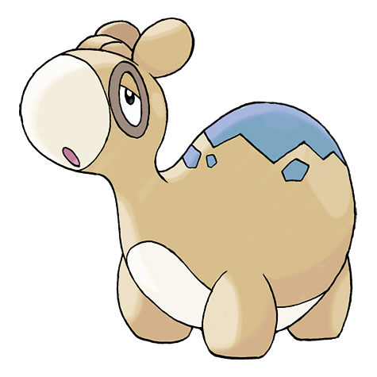

# #322 Numel (Numb Pokémon)

| Official Artwork | Shiny Artwork |
|------------------|---------------|
|  |  |

**Rising Ruby:** Numel is extremely dull witted—it doesn’t notice being hit. However, it can’t stand hunger for even a second. This Pokémon’s body is a seething cauldron of boiling magma.

**Sinking Sapphire:** Numel stores magma of almost 2,200 degrees Fahrenheit within its body. If it gets wet, the magma cools and hardens. In that event, the Pokémon’s body grows heavy and its movements become sluggish.

---

## Media

### Default Sprites

| Front | Shiny | Back | Shiny |
|-------|-------|------|-------|
|  |  |  |  |

### Female Sprites

| Front | Shiny | Back | Shiny |
|-------|-------|------|-------|
|  |  | N/A | N/A |

### Cries

Latest (Gen VI+):

<audio controls>
<source src='../../assets/cries/numel/latest.ogg' type='audio/ogg'>
  Your browser does not support the audio element.
</audio>

Legacy:

<audio controls>
<source src='../../assets/cries/numel/legacy.ogg' type='audio/ogg'>
  Your browser does not support the audio element.
</audio>

---

## Pokédex Data

| National № | Type(s) | Height | Weight | Abilities | Local № |
|------------|---------|--------|--------|-----------|---------|
| #322 | {: width="48"} {: width="48"} | 0.7 m / 2.3 ft | 24.0 kg / 52.9 lbs | 1. Oblivious 2. Simple | N/A |

---

## Base Stats
|   | HP | Attack | Defense | Sp. Atk | Sp. Def | Speed |
|---|----|--------|---------|---------|---------|-------|
| **Base** | 60 | 60 | 40 | 65 | 45 | 35 |
| **Min** | 230 | 112 | 76 | 121 | 85 | 67 |
| **Max** | 324 | 240 | 196 | 251 | 207 | 185 |

The ranges shown above are for a level 100 Pokémon. Maximum values are based on a beneficial nature, 252 EVs, 31 IVs; minimum values are based on a hindering nature, 0 EVs, 0 IVs.

---

## Forms & Evolutions

!!! warning "WARNING"

    Information on evolutions may not be 100% accurate; differences between evolution methods across generations are not accounted for.

### Forms

Numel has no alternate forms.

### Evolution Line

1. [Numel](numel.md/)
    1. Level Up: [Camerupt](camerupt.md/)

---

## Training

| EV Yield | Catch Rate | Base Friendship | Base Exp. | Growth Rate | Held Items |
|----------|------------|-----------------|-----------|-------------|------------|
| 1 Sp.-Atk | 255 | 70 | 61 | Mediu |

---

## Breeding

| Egg Groups | Egg Cycles | Gender | Dimorphic | Color | Shape |
|------------|------------|--------|-----------|-------|-------|
| 1. Ground | 20 | 50.0% Male 50.0% Female | True | Yellow | Quadruped |

---

## Moves

!!! warning "WARNING"

    Specific move information may be incorrect. However, the general movepool should be accurate; this includes changes made in Sacred Gold and Storm Silver.

### Level Up Moves

| Lv. | Move | Type | Cat. | Power | Acc. | PP |
| --- | --- | --- | --- | --- | --- | --- |
| 1 | Growl | {: width="48"} | {: width="36"} | — | 100 | 40 |
| 1 | Tackle | {: width="48"} | {: width="36"} | 40 | 100 | 35 |
| 5 | Ember | {: width="48"} | {: width="36"} | 40 | 100 | 25 |
| 8 | Focus Energy | {: width="48"} | {: width="36"} | — | — | 30 |
| 12 | Magnitude | {: width="48"} | {: width="36"} | — | 100 | 30 |
| 15 | Flame Burst | {: width="48"} | {: width="36"} | 70 | 100 | 15 |
| 19 | Amnesia | {: width="48"} | {: width="36"} | — | — | 20 |
| 22 | Lava Plume | {: width="48"} | {: width="36"} | 80 | 100 | 15 |
| 26 | Earth Power | {: width="48"} | {: width="36"} | 90 | 100 | 10 |
| 29 | Curse | {: width="48"} | {: width="36"} | — | — | 10 |
| 31 | Take Down | {: width="48"} | {: width="36"} | 90 | 85 | 20 |
| 36 | Yawn | {: width="48"} | {: width="36"} | — | — | 10 |
| 40 | Earthquake | {: width="48"} | {: width="36"} | 100 | 100 | 10 |
| 43 | Flamethrower | {: width="48"} | {: width="36"} | 90 | 100 | 15 |
| 47 | Double Edge | {: width="48"} | {: width="36"} | 120 | 100 | 15 |

### TM Moves

| TM | Move | Type | Cat. | Power | Acc. | PP |
| --- | --- | --- | --- | --- | --- | --- |
| HM04 | Strength | {: width="48"} | {: width="36"} | 100 | 100 | 10 |
| HM06 | Rock Smash | {: width="48"} | {: width="36"} | 65 | 100 | 15 |
| TM06 | Toxic | {: width="48"} | {: width="36"} | — | 90 | 10 |
| TM10 | Hidden Power | {: width="48"} | {: width="36"} | 60 | 100 | 15 |
| TM100 | Confide | {: width="48"} | {: width="36"} | — | — | 20 |
| TM11 | Sunny Day | {: width="48"} | {: width="36"} | — | — | 5 |
| TM17 | Protect | {: width="48"} | {: width="36"} | — | — | 10 |
| TM21 | Frustration | {: width="48"} | {: width="36"} | — | 100 | 20 |
| TM26 | Earthquake | {: width="48"} | {: width="36"} | 100 | 100 | 10 |
| TM27 | Return | {: width="48"} | {: width="36"} | — | 100 | 20 |
| TM28 | Dig | {: width="48"} | {: width="36"} | 80 | 100 | 10 |
| TM32 | Double Team | {: width="48"} | {: width="36"} | — | — | 15 |
| TM35 | Flamethrower | {: width="48"} | {: width="36"} | 90 | 100 | 15 |
| TM37 | Sandstorm | {: width="48"} | {: width="36"} | — | — | 10 |
| TM38 | Fire Blast | {: width="48"} | {: width="36"} | 110 | 85 | 5 |
| TM39 | Rock Tomb | {: width="48"} | {: width="36"} | 60 | 95 | 15 |
| TM42 | Facade | {: width="48"} | {: width="36"} | 70 | 100 | 20 |
| TM43 | Flame Charge | {: width="48"} | {: width="36"} | 50 | 100 | 20 |
| TM44 | Rest | {: width="48"} | {: width="36"} | — | — | 5 |
| TM45 | Attract | {: width="48"} | {: width="36"} | — | 100 | 15 |
| TM48 | Round | {: width="48"} | {: width="36"} | 60 | 100 | 15 |
| TM49 | Echoed Voice | {: width="48"} | {: width="36"} | 40 | 100 | 15 |
| TM50 | Overheat | {: width="48"} | {: width="36"} | 130 | 90 | 5 |
| TM59 | Incinerate | {: width="48"} | {: width="36"} | 60 | 100 | 15 |
| TM61 | Will O Wisp | {: width="48"} | {: width="36"} | — | 85 | 15 |
| TM78 | Bulldoze | {: width="48"} | {: width="36"} | 60 | 100 | 20 |
| TM80 | Rock Slide | {: width="48"} | {: width="36"} | 75 | 90 | 10 |
| TM87 | Swagger | {: width="48"} | {: width="36"} | — | 85 | 15 |
| TM88 | Sleep Talk | {: width="48"} | {: width="36"} | — | — | 10 |
| TM90 | Substitute | {: width="48"} | {: width="36"} | — | — | 10 |
| TM94 | Secret Power | {: width="48"} | {: width="36"} | 70 | 100 | 20 |
| TM96 | Nature Power | {: width="48"} | {: width="36"} | — | — | 20 |

### Egg Moves

| Move | Type | Cat. | Power | Acc. | PP |
| --- | --- | --- | --- | --- | --- |
| Ancient Power | {: width="48"} | {: width="36"} | 80 | 100 | 10 |
| Body Slam | {: width="48"} | {: width="36"} | 85 | 100 | 15 |
| Defense Curl | {: width="48"} | {: width="36"} | — | — | 40 |
| Endure | {: width="48"} | {: width="36"} | — | — | 10 |
| Growth | {: width="48"} | {: width="36"} | — | — | 20 |
| Heat Wave | {: width="48"} | {: width="36"} | 95 | 90 | 10 |
| Howl | {: width="48"} | {: width="36"} | — | — | 40 |
| Iron Head | {: width="48"} | {: width="36"} | 80 | 100 | 15 |
| Mud Bomb | {: width="48"} | {: width="36"} | 65 | 85 | 10 |
| Rollout | {: width="48"} | {: width="36"} | 30 | 90 | 20 |
| Scary Face | {: width="48"} | {: width="36"} | — | 100 | 10 |
| Spit Up | {: width="48"} | {: width="36"} | — | 100 | 10 |
| Stockpile | {: width="48"} | {: width="36"} | — | — | 20 |
| Stomp | {: width="48"} | {: width="36"} | 65 | 100 | 20 |
| Swallow | {: width="48"} | {: width="36"} | — | — | 10 |
| Yawn | {: width="48"} | {: width="36"} | — | — | 10 |

### Tutor Moves

| Move | Type | Cat. | Power | Acc. | PP |
| --- | --- | --- | --- | --- | --- |
| After You | {: width="48"} | {: width="36"} | — | — | 15 |
| Earth Power | {: width="48"} | {: width="36"} | 90 | 100 | 10 |
| Heat Wave | {: width="48"} | {: width="36"} | 95 | 90 | 10 |
| Iron Head | {: width="48"} | {: width="36"} | 80 | 100 | 15 |
| Snore | {: width="48"} | {: width="36"} | 50 | 100 | 15 |
| Stealth Rock | {: width="48"} | {: width="36"} | — | — | 20 |

