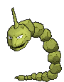
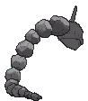
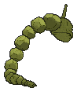

# #095 Onix (Rock Snake Pokémon)

| Official Artwork | Shiny Artwork |
|------------------|---------------|
|  |  |

Onix has a magnet in its brain. It acts as a compass so that this Pokémon does not lose direction while it is tunneling. As it grows older, its body becomes increasingly rounder and smoother.

---

## Media

### Default Sprites

| Front | Shiny | Back | Shiny |
|-------|-------|------|-------|
|  |  |  |  |

### Cries

Latest (Gen VI+):

<audio controls>
<source src='../../assets/cries/onix/latest.ogg' type='audio/ogg'>
  Your browser does not support the audio element.
</audio>

Legacy:

<audio controls>
<source src='../../assets/cries/onix/legacy.ogg' type='audio/ogg'>
  Your browser does not support the audio element.
</audio>

---

## Pokédex Data

| National № | Type(s) | Height | Weight | Abilities | Local № |
|------------|---------|--------|--------|-----------|---------|
| #95 | {: width="48"} {: width="48"} | 8.8 m / 28.9 ft | 210.0 kg / 463.0 lbs | 1. Rock Head 2. Sturdy | #34 |

---

## Base Stats
|   | HP | Attack | Defense | Sp. Atk | Sp. Def | Speed |
|---|----|--------|---------|---------|---------|-------|
| **Base** | 65 | 75 | 160 | 30 | 45 | 100 |
| **Min** | 240 | 139 | 292 | 58 | 85 | 184 |
| **Max** | 334 | 273 | 460 | 174 | 207 | 328 |

The ranges shown above are for a level 100 Pokémon. Maximum values are based on a beneficial nature, 252 EVs, 31 IVs; minimum values are based on a hindering nature, 0 EVs, 0 IVs.

---

## Forms & Evolutions

!!! warning "WARNING"

    Information on evolutions may not be 100% accurate; differences between evolution methods across generations are not accounted for.

### Forms

Onix has no alternate forms.

### Evolution Line

1. [Onix](onix.md/)
    1. Trade: [Steelix](steelix.md/)

---

## Training

| EV Yield | Catch Rate | Base Friendship | Base Exp. | Growth Rate | Held Items |
|----------|------------|-----------------|-----------|-------------|------------|
| 1 Def | 45 | 50 | 77 | Mediu |

---

## Breeding

| Egg Groups | Egg Cycles | Gender | Dimorphic | Color | Shape |
|------------|------------|--------|-----------|-------|-------|
| 1. Mineral | 25 | 50.0% Male 50.0% Female | False | Gray | Squiggle |

---

## Moves

!!! warning "WARNING"

    Specific move information may be incorrect. However, the general movepool should be accurate; this includes changes made in Sacred Gold and Storm Silver.

### Level Up Moves

| Lv. | Move | Type | Cat. | Power | Acc. | PP |
| --- | --- | --- | --- | --- | --- | --- |
| 1 | Bind | {: width="48"} | {: width="36"} | 15 | 85 | 20 |
| 1 | Harden | {: width="48"} | {: width="36"} | — | — | 30 |
| 1 | Mud Sport | {: width="48"} | {: width="36"} | — | — | 15 |
| 1 | Tackle | {: width="48"} | {: width="36"} | 40 | 100 | 35 |
| 4 | Curse | {: width="48"} | {: width="36"} | — | — | 10 |
| 7 | Rock Throw | {: width="48"} | {: width="36"} | 50 | 90 | 15 |
| 10 | Rock Tomb | {: width="48"} | {: width="36"} | 60 | 95 | 15 |
| 13 | Rage | {: width="48"} | {: width="36"} | 20 | 100 | 20 |
| 16 | Smack Down | {: width="48"} | {: width="36"} | 50 | 100 | 15 |
| 19 | Rock Polish | {: width="48"} | {: width="36"} | — | — | 20 |
| 20 | Dig | {: width="48"} | {: width="36"} | 80 | 100 | 10 |
| 22 | Rock Slide | {: width="48"} | {: width="36"} | 75 | 90 | 10 |
| 25 | Gyro Ball | {: width="48"} | {: width="36"} | — | 100 | 5 |
| 28 | Slam | {: width="48"} | {: width="36"} | 80 | 75 | 20 |
| 31 | Dragon Breath | {: width="48"} | {: width="36"} | 60 | 100 | 20 |
| 34 | Screech | {: width="48"} | {: width="36"} | — | 85 | 40 |
| 37 | Sand Tomb | {: width="48"} | {: width="36"} | 35 | 85 | 15 |
| 40 | Iron Tail | {: width="48"} | {: width="36"} | 100 | 75 | 15 |
| 43 | Stealth Rock | {: width="48"} | {: width="36"} | — | — | 20 |
| 46 | Stone Edge | {: width="48"} | {: width="36"} | 100 | 80 | 5 |
| 49 | Double Edge | {: width="48"} | {: width="36"} | 120 | 100 | 15 |
| 52 | Sandstorm | {: width="48"} | {: width="36"} | — | — | 10 |

### TM Moves

| TM | Move | Type | Cat. | Power | Acc. | PP |
| --- | --- | --- | --- | --- | --- | --- |
| HM04 | Strength | {: width="48"} | {: width="36"} | 100 | 100 | 10 |
| HM06 | Rock Smash | {: width="48"} | {: width="36"} | 65 | 100 | 15 |
| TM05 | Roar | {: width="48"} | {: width="36"} | — | — | 20 |
| TM06 | Toxic | {: width="48"} | {: width="36"} | — | 90 | 10 |
| TM10 | Hidden Power | {: width="48"} | {: width="36"} | 60 | 100 | 15 |
| TM100 | Confide | {: width="48"} | {: width="36"} | — | — | 20 |
| TM11 | Sunny Day | {: width="48"} | {: width="36"} | — | — | 5 |
| TM12 | Taunt | {: width="48"} | {: width="36"} | — | 100 | 20 |
| TM17 | Protect | {: width="48"} | {: width="36"} | — | — | 10 |
| TM21 | Frustration | {: width="48"} | {: width="36"} | — | 100 | 20 |
| TM23 | Smack Down | {: width="48"} | {: width="36"} | 50 | 100 | 15 |
| TM26 | Earthquake | {: width="48"} | {: width="36"} | 100 | 100 | 10 |
| TM27 | Return | {: width="48"} | {: width="36"} | — | 100 | 20 |
| TM28 | Dig | {: width="48"} | {: width="36"} | 80 | 100 | 10 |
| TM32 | Double Team | {: width="48"} | {: width="36"} | — | — | 15 |
| TM37 | Sandstorm | {: width="48"} | {: width="36"} | — | — | 10 |
| TM39 | Rock Tomb | {: width="48"} | {: width="36"} | 60 | 95 | 15 |
| TM41 | Torment | {: width="48"} | {: width="36"} | — | 100 | 15 |
| TM42 | Facade | {: width="48"} | {: width="36"} | 70 | 100 | 20 |
| TM44 | Rest | {: width="48"} | {: width="36"} | — | — | 5 |
| TM45 | Attract | {: width="48"} | {: width="36"} | — | 100 | 15 |
| TM48 | Round | {: width="48"} | {: width="36"} | 60 | 100 | 15 |
| TM64 | Explosion | {: width="48"} | {: width="36"} | 250 | 100 | 5 |
| TM66 | Payback | {: width="48"} | {: width="36"} | 50 | 100 | 10 |
| TM69 | Rock Polish | {: width="48"} | {: width="36"} | — | — | 20 |
| TM71 | Stone Edge | {: width="48"} | {: width="36"} | 100 | 80 | 5 |
| TM74 | Gyro Ball | {: width="48"} | {: width="36"} | — | 100 | 5 |
| TM77 | Psych Up | {: width="48"} | {: width="36"} | — | — | 10 |
| TM78 | Bulldoze | {: width="48"} | {: width="36"} | 60 | 100 | 20 |
| TM80 | Rock Slide | {: width="48"} | {: width="36"} | 75 | 90 | 10 |
| TM82 | Dragon Tail | {: width="48"} | {: width="36"} | 60 | 90 | 10 |
| TM87 | Swagger | {: width="48"} | {: width="36"} | — | 85 | 15 |
| TM88 | Sleep Talk | {: width="48"} | {: width="36"} | — | — | 10 |
| TM90 | Substitute | {: width="48"} | {: width="36"} | — | — | 10 |
| TM91 | Flash Cannon | {: width="48"} | {: width="36"} | 80 | 100 | 10 |
| TM94 | Secret Power | {: width="48"} | {: width="36"} | 70 | 100 | 20 |
| TM96 | Nature Power | {: width="48"} | {: width="36"} | — | — | 20 |

### Egg Moves

| Move | Type | Cat. | Power | Acc. | PP |
| --- | --- | --- | --- | --- | --- |
| Block | {: width="48"} | {: width="36"} | — | — | 5 |
| Defense Curl | {: width="48"} | {: width="36"} | — | — | 40 |
| Flail | {: width="48"} | {: width="36"} | — | 100 | 15 |
| Heavy Slam | {: width="48"} | {: width="36"} | — | 100 | 10 |
| Rock Blast | {: width="48"} | {: width="36"} | 25 | 90 | 10 |
| Rock Climb | {: width="48"} | {: width="36"} | 90 | 85 | 20 |
| Rollout | {: width="48"} | {: width="36"} | 30 | 90 | 20 |
| Rototiller | {: width="48"} | {: width="36"} | — | — | 10 |
| Stealth Rock | {: width="48"} | {: width="36"} | — | — | 20 |

### Tutor Moves

| Move | Type | Cat. | Power | Acc. | PP |
| --- | --- | --- | --- | --- | --- |
| Bind | {: width="48"} | {: width="36"} | 15 | 85 | 20 |
| Block | {: width="48"} | {: width="36"} | — | — | 5 |
| Dragon Pulse | {: width="48"} | {: width="36"} | 85 | 100 | 10 |
| Earth Power | {: width="48"} | {: width="36"} | 90 | 100 | 10 |
| Iron Head | {: width="48"} | {: width="36"} | 80 | 100 | 15 |
| Iron Tail | {: width="48"} | {: width="36"} | 100 | 75 | 15 |
| Snore | {: width="48"} | {: width="36"} | 50 | 100 | 15 |
| Stealth Rock | {: width="48"} | {: width="36"} | — | — | 20 |

