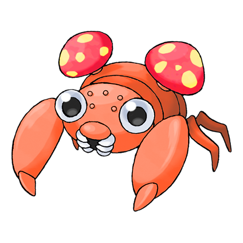
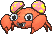
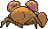
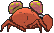

# #046 Paras (Mushroom Pokémon)

| Official Artwork | Shiny Artwork |
|------------------|---------------|
|  |  |

Paras has parasitic mushrooms growing on its back called tochukaso. They grow large by drawing nutrients from this Bug Pokémon host. They are highly valued as a medicine for extending life.

---

## Media

### Default Sprites

| Front | Shiny | Back | Shiny |
|-------|-------|------|-------|
|  |  |  |  |

### Cries

Latest (Gen VI+):

<audio controls>
<source src='../../assets/cries/paras/latest.ogg' type='audio/ogg'>
  Your browser does not support the audio element.
</audio>

Legacy:

<audio controls>
<source src='../../assets/cries/paras/legacy.ogg' type='audio/ogg'>
  Your browser does not support the audio element.
</audio>

---

## Pokédex Data

| National № | Type(s) | Height | Weight | Abilities | Local № |
|------------|---------|--------|--------|-----------|---------|
| #46 | {: width="48"} {: width="48"} | 0.3 m / 1.0 ft | 5.4 kg / 11.9 lbs | 1. Effect Spore 2. Dry Skin | N/A |

---

## Base Stats
|   | HP | Attack | Defense | Sp. Atk | Sp. Def | Speed |
|---|----|--------|---------|---------|---------|-------|
| **Base** | 35 | 80 | 55 | 45 | 55 | 25 |
| **Min** | 180 | 148 | 103 | 85 | 103 | 49 |
| **Max** | 274 | 284 | 229 | 207 | 229 | 163 |

The ranges shown above are for a level 100 Pokémon. Maximum values are based on a beneficial nature, 252 EVs, 31 IVs; minimum values are based on a hindering nature, 0 EVs, 0 IVs.

---

## Forms & Evolutions

!!! warning "WARNING"

    Information on evolutions may not be 100% accurate; differences between evolution methods across generations are not accounted for.

### Forms

Paras has no alternate forms.

### Evolution Line

1. [Paras](paras.md/)
    1. Level Up: [Parasect](parasect.md/)

---

## Training

| EV Yield | Catch Rate | Base Friendship | Base Exp. | Growth Rate | Held Items |
|----------|------------|-----------------|-----------|-------------|------------|
| 1 Atk | 190 | 70 | 57 | Medium | Tiny Mushroom (50%) Big Mushroom (5%) |

---

## Breeding

| Egg Groups | Egg Cycles | Gender | Dimorphic | Color | Shape |
|------------|------------|--------|-----------|-------|-------|
| 1. Bug 2. Plant | 20 | 50.0% Male 50.0% Female | False | Red | Armor |

---

## Moves

!!! warning "WARNING"

    Specific move information may be incorrect. However, the general movepool should be accurate; this includes changes made in Sacred Gold and Storm Silver.

### Level Up Moves

| Lv. | Move | Type | Cat. | Power | Acc. | PP |
| --- | --- | --- | --- | --- | --- | --- |
| 1 | Bug Bite | {: width="48"} | {: width="36"} | 60 | 100 | 20 |
| 1 | Scratch | {: width="48"} | {: width="36"} | 50 | 100 | 35 |
| 3 | Stun Spore | {: width="48"} | {: width="36"} | — | 75 | 30 |
| 6 | Poison Powder | {: width="48"} | {: width="36"} | — | 75 | 35 |
| 9 | Leech Life | {: width="48"} | {: width="36"} | 80 | 100 | 10 |
| 12 | Bullet Seed | {: width="48"} | {: width="36"} | 25 | 100 | 30 |
| 15 | Fury Cutter | {: width="48"} | {: width="36"} | 40 | 95 | 20 |
| 18 | Cross Poison | {: width="48"} | {: width="36"} | 70 | 100 | 20 |
| 21 | Spore | {: width="48"} | {: width="36"} | — | 100 | 15 |
| 24 | Slash | {: width="48"} | {: width="36"} | 70 | 100 | 20 |
| 27 | Growth | {: width="48"} | {: width="36"} | — | — | 20 |
| 30 | X Scissor | {: width="48"} | {: width="36"} | 80 | 100 | 15 |
| 33 | Giga Drain | {: width="48"} | {: width="36"} | 75 | 100 | 10 |
| 36 | Aromatherapy | {: width="48"} | {: width="36"} | — | — | 5 |
| 39 | Rage Powder | {: width="48"} | {: width="36"} | — | — | 20 |
| 42 | Seed Bomb | {: width="48"} | {: width="36"} | 80 | 100 | 15 |

### TM Moves

| TM | Move | Type | Cat. | Power | Acc. | PP |
| --- | --- | --- | --- | --- | --- | --- |
| HM01 | Cut | {: width="48"} | {: width="36"} | 70 | 100 | 15 |
| HM06 | Rock Smash | {: width="48"} | {: width="36"} | 65 | 100 | 15 |
| TM01 | Hone Claws | {: width="48"} | {: width="36"} | — | — | 15 |
| TM06 | Toxic | {: width="48"} | {: width="36"} | — | 90 | 10 |
| TM09 | Venoshock | {: width="48"} | {: width="36"} | 65 | 100 | 10 |
| TM10 | Hidden Power | {: width="48"} | {: width="36"} | 60 | 100 | 15 |
| TM100 | Confide | {: width="48"} | {: width="36"} | — | — | 20 |
| TM11 | Sunny Day | {: width="48"} | {: width="36"} | — | — | 5 |
| TM16 | Light Screen | {: width="48"} | {: width="36"} | — | — | 30 |
| TM17 | Protect | {: width="48"} | {: width="36"} | — | — | 10 |
| TM21 | Frustration | {: width="48"} | {: width="36"} | — | 100 | 20 |
| TM22 | Solar Beam | {: width="48"} | {: width="36"} | 120 | 100 | 10 |
| TM27 | Return | {: width="48"} | {: width="36"} | — | 100 | 20 |
| TM28 | Dig | {: width="48"} | {: width="36"} | 80 | 100 | 10 |
| TM31 | Brick Break | {: width="48"} | {: width="36"} | 75 | 100 | 15 |
| TM32 | Double Team | {: width="48"} | {: width="36"} | — | — | 15 |
| TM36 | Sludge Bomb | {: width="48"} | {: width="36"} | 90 | 100 | 10 |
| TM40 | Aerial Ace | {: width="48"} | {: width="36"} | 60 | — | 20 |
| TM42 | Facade | {: width="48"} | {: width="36"} | 70 | 100 | 20 |
| TM44 | Rest | {: width="48"} | {: width="36"} | — | — | 5 |
| TM45 | Attract | {: width="48"} | {: width="36"} | — | 100 | 15 |
| TM46 | Thief | {: width="48"} | {: width="36"} | 60 | 100 | 25 |
| TM48 | Round | {: width="48"} | {: width="36"} | 60 | 100 | 15 |
| TM53 | Energy Ball | {: width="48"} | {: width="36"} | 90 | 100 | 10 |
| TM54 | False Swipe | {: width="48"} | {: width="36"} | 40 | 100 | 40 |
| TM70 | Flash | {: width="48"} | {: width="36"} | — | 100 | 20 |
| TM75 | Swords Dance | {: width="48"} | {: width="36"} | — | — | 20 |
| TM76 | Struggle Bug | {: width="48"} | {: width="36"} | 50 | 100 | 20 |
| TM81 | X Scissor | {: width="48"} | {: width="36"} | 80 | 100 | 15 |
| TM86 | Grass Knot | {: width="48"} | {: width="36"} | — | 100 | 20 |
| TM87 | Swagger | {: width="48"} | {: width="36"} | — | 85 | 15 |
| TM88 | Sleep Talk | {: width="48"} | {: width="36"} | — | — | 10 |
| TM90 | Substitute | {: width="48"} | {: width="36"} | — | — | 10 |
| TM94 | Secret Power | {: width="48"} | {: width="36"} | 70 | 100 | 20 |
| TM96 | Nature Power | {: width="48"} | {: width="36"} | — | — | 20 |

### Egg Moves

| Move | Type | Cat. | Power | Acc. | PP |
| --- | --- | --- | --- | --- | --- |
| Agility | {: width="48"} | {: width="36"} | — | — | 30 |
| Bug Bite | {: width="48"} | {: width="36"} | 60 | 100 | 20 |
| Counter | {: width="48"} | {: width="36"} | — | 100 | 20 |
| Cross Poison | {: width="48"} | {: width="36"} | 70 | 100 | 20 |
| Endure | {: width="48"} | {: width="36"} | — | — | 10 |
| Fell Stinger | {: width="48"} | {: width="36"} | 50 | 100 | 25 |
| Flail | {: width="48"} | {: width="36"} | — | 100 | 15 |
| Leech Seed | {: width="48"} | {: width="36"} | — | 90 | 10 |
| Metal Claw | {: width="48"} | {: width="36"} | 50 | 95 | 35 |
| Natural Gift | {: width="48"} | {: width="36"} | — | 100 | 15 |
| Psybeam | {: width="48"} | {: width="36"} | 65 | 100 | 20 |
| Pursuit | {: width="48"} | {: width="36"} | 40 | 100 | 20 |
| Rototiller | {: width="48"} | {: width="36"} | — | — | 10 |
| Screech | {: width="48"} | {: width="36"} | — | 85 | 40 |
| Sweet Scent | {: width="48"} | {: width="36"} | — | 100 | 20 |
| Wide Guard | {: width="48"} | {: width="36"} | — | — | 10 |

### Tutor Moves

| Move | Type | Cat. | Power | Acc. | PP |
| --- | --- | --- | --- | --- | --- |
| After You | {: width="48"} | {: width="36"} | — | — | 15 |
| Bug Bite | {: width="48"} | {: width="36"} | 60 | 100 | 20 |
| Giga Drain | {: width="48"} | {: width="36"} | 75 | 100 | 10 |
| Knock Off | {: width="48"} | {: width="36"} | 65 | 100 | 20 |
| Seed Bomb | {: width="48"} | {: width="36"} | 80 | 100 | 15 |
| Snore | {: width="48"} | {: width="36"} | 50 | 100 | 15 |
| Synthesis | {: width="48"} | {: width="36"} | — | — | 5 |
| Worry Seed | {: width="48"} | {: width="36"} | — | 100 | 10 |

