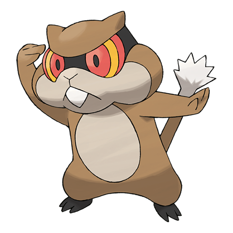
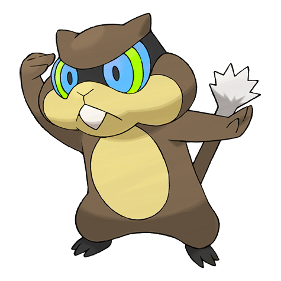
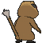
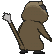

# #504 Patrat (Scout Pokémon)

| Official Artwork | Shiny Artwork |
|------------------|---------------|
|  |  |

**Rising Ruby:** Using food stored in cheek pouches, they can keep watch for days. They use their tails to communicate with others.

**Sinking Sapphire:** Extremely cautious, one of them will always be on the lookout, but it won’t notice a foe coming from behind.

---

## Media

### Default Sprites

| Front | Shiny | Back | Shiny |
|-------|-------|------|-------|
|  |  |  |  |

### Cries

Latest (Gen VI+):

<audio controls>
<source src='../../assets/cries/patrat/latest.ogg' type='audio/ogg'>
  Your browser does not support the audio element.
</audio>

Legacy:

<audio controls>
<source src='../../assets/cries/patrat/legacy.ogg' type='audio/ogg'>
  Your browser does not support the audio element.
</audio>

---

## Pokédex Data

| National № | Type(s) | Height | Weight | Abilities | Local № |
|------------|---------|--------|--------|-----------|---------|
| #504 | {: width="48"} | 0.5 m / 1.6 ft | 11.6 kg / 25.6 lbs | 1. Run Away 2. Keen Eye | N/A |

---

## Base Stats
|   | HP | Attack | Defense | Sp. Atk | Sp. Def | Speed |
|---|----|--------|---------|---------|---------|-------|
| **Base** | 45 | 55 | 39 | 35 | 39 | 42 |
| **Min** | 200 | 103 | 74 | 67 | 74 | 80 |
| **Max** | 294 | 229 | 194 | 185 | 194 | 201 |

The ranges shown above are for a level 100 Pokémon. Maximum values are based on a beneficial nature, 252 EVs, 31 IVs; minimum values are based on a hindering nature, 0 EVs, 0 IVs.

---

## Forms & Evolutions

!!! warning "WARNING"

    Information on evolutions may not be 100% accurate; differences between evolution methods across generations are not accounted for.

### Forms

Patrat has no alternate forms.

### Evolution Line

1. [Patrat](patrat.md/)
    1. Level Up: [Watchog](watchog.md/)

---

## Training

| EV Yield | Catch Rate | Base Friendship | Base Exp. | Growth Rate | Held Items |
|----------|------------|-----------------|-----------|-------------|------------|
| 1 Atk | 255 | 70 | 51 | Medium | N/A |

---

## Breeding

| Egg Groups | Egg Cycles | Gender | Dimorphic | Color | Shape |
|------------|------------|--------|-----------|-------|-------|
| 1. Ground | 15 | 50.0% Male 50.0% Female | False | Brown | Quadruped |

---

## Moves

!!! warning "WARNING"

    Specific move information may be incorrect. However, the general movepool should be accurate; this includes changes made in Sacred Gold and Storm Silver.

### Level Up Moves

| Lv. | Move | Type | Cat. | Power | Acc. | PP |
| --- | --- | --- | --- | --- | --- | --- |
| 1 | Tackle | {: width="48"} | {: width="36"} | 40 | 100 | 35 |
| 3 | Leer | {: width="48"} | {: width="36"} | — | 100 | 30 |
| 6 | Bite | {: width="48"} | {: width="36"} | 60 | 100 | 25 |
| 8 | Hypnosis | {: width="48"} | {: width="36"} | — | 60 | 20 |
| 11 | Hyper Fang | {: width="48"} | {: width="36"} | 80 | 90 | 15 |
| 13 | Sand Attack | {: width="48"} | {: width="36"} | — | 100 | 15 |
| 16 | Crunch | {: width="48"} | {: width="36"} | 80 | 100 | 15 |
| 18 | Detect | {: width="48"} | {: width="36"} | — | — | 5 |
| 21 | Super Fang | {: width="48"} | {: width="36"} | — | 90 | 10 |
| 23 | After You | {: width="48"} | {: width="36"} | — | — | 15 |
| 24 | Seed Bomb | {: width="48"} | {: width="36"} | 80 | 100 | 15 |
| 26 | Work Up | {: width="48"} | {: width="36"} | — | — | 30 |
| 28 | Bide | {: width="48"} | {: width="36"} | — | — | 10 |
| 31 | Mean Look | {: width="48"} | {: width="36"} | — | — | 5 |
| 33 | Baton Pass | {: width="48"} | {: width="36"} | — | — | 40 |
| 36 | Zen Headbutt | {: width="48"} | {: width="36"} | 80 | 90 | 15 |
| 38 | Slam | {: width="48"} | {: width="36"} | 80 | 75 | 20 |

### TM Moves

| TM | Move | Type | Cat. | Power | Acc. | PP |
| --- | --- | --- | --- | --- | --- | --- |
| HM01 | Cut | {: width="48"} | {: width="36"} | 70 | 100 | 15 |
| TM06 | Toxic | {: width="48"} | {: width="36"} | — | 90 | 10 |
| TM10 | Hidden Power | {: width="48"} | {: width="36"} | 60 | 100 | 15 |
| TM100 | Confide | {: width="48"} | {: width="36"} | — | — | 20 |
| TM11 | Sunny Day | {: width="48"} | {: width="36"} | — | — | 5 |
| TM17 | Protect | {: width="48"} | {: width="36"} | — | — | 10 |
| TM18 | Rain Dance | {: width="48"} | {: width="36"} | — | — | 5 |
| TM21 | Frustration | {: width="48"} | {: width="36"} | — | 100 | 20 |
| TM24 | Thunderbolt | {: width="48"} | {: width="36"} | 90 | 100 | 15 |
| TM27 | Return | {: width="48"} | {: width="36"} | — | 100 | 20 |
| TM28 | Dig | {: width="48"} | {: width="36"} | 80 | 100 | 10 |
| TM30 | Shadow Ball | {: width="48"} | {: width="36"} | 80 | 100 | 15 |
| TM32 | Double Team | {: width="48"} | {: width="36"} | — | — | 15 |
| TM42 | Facade | {: width="48"} | {: width="36"} | 70 | 100 | 20 |
| TM44 | Rest | {: width="48"} | {: width="36"} | — | — | 5 |
| TM45 | Attract | {: width="48"} | {: width="36"} | — | 100 | 15 |
| TM48 | Round | {: width="48"} | {: width="36"} | 60 | 100 | 15 |
| TM56 | Fling | {: width="48"} | {: width="36"} | — | 100 | 10 |
| TM67 | Retaliate | {: width="48"} | {: width="36"} | 70 | 100 | 5 |
| TM75 | Swords Dance | {: width="48"} | {: width="36"} | — | — | 20 |
| TM86 | Grass Knot | {: width="48"} | {: width="36"} | — | 100 | 20 |
| TM87 | Swagger | {: width="48"} | {: width="36"} | — | 85 | 15 |
| TM88 | Sleep Talk | {: width="48"} | {: width="36"} | — | — | 10 |
| TM90 | Substitute | {: width="48"} | {: width="36"} | — | — | 10 |
| TM94 | Secret Power | {: width="48"} | {: width="36"} | 70 | 100 | 20 |

### Egg Moves

| Move | Type | Cat. | Power | Acc. | PP |
| --- | --- | --- | --- | --- | --- |
| Assurance | {: width="48"} | {: width="36"} | 60 | 100 | 10 |
| Flail | {: width="48"} | {: width="36"} | — | 100 | 15 |
| Foresight | {: width="48"} | {: width="36"} | — | — | 40 |
| Iron Tail | {: width="48"} | {: width="36"} | 100 | 75 | 15 |
| Pursuit | {: width="48"} | {: width="36"} | 40 | 100 | 20 |
| Revenge | {: width="48"} | {: width="36"} | 60 | 100 | 10 |
| Screech | {: width="48"} | {: width="36"} | — | 85 | 40 |

### Tutor Moves

| Move | Type | Cat. | Power | Acc. | PP |
| --- | --- | --- | --- | --- | --- |
| After You | {: width="48"} | {: width="36"} | — | — | 15 |
| Aqua Tail | {: width="48"} | {: width="36"} | 90 | 90 | 10 |
| Covet | {: width="48"} | {: width="36"} | 60 | 100 | 25 |
| Endeavor | {: width="48"} | {: width="36"} | — | 100 | 5 |
| Gunk Shot | {: width="48"} | {: width="36"} | 120 | 80 | 5 |
| Helping Hand | {: width="48"} | {: width="36"} | — | — | 20 |
| Iron Tail | {: width="48"} | {: width="36"} | 100 | 75 | 15 |
| Last Resort | {: width="48"} | {: width="36"} | 140 | 100 | 5 |
| Low Kick | {: width="48"} | {: width="36"} | — | 100 | 20 |
| Seed Bomb | {: width="48"} | {: width="36"} | 80 | 100 | 15 |
| Shock Wave | {: width="48"} | {: width="36"} | 60 | — | 20 |
| Snore | {: width="48"} | {: width="36"} | 50 | 100 | 15 |
| Super Fang | {: width="48"} | {: width="36"} | — | 90 | 10 |
| Zen Headbutt | {: width="48"} | {: width="36"} | 80 | 90 | 15 |

