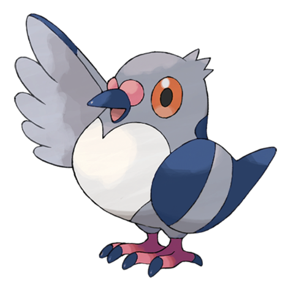
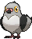
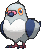
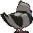
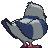

# #519 Pidove (Tiny Pigeon Pokémon)

| Official Artwork | Shiny Artwork |
|------------------|---------------|
|  |  |

**Rising Ruby:** This very forgetful Pokémon will wait for a new order from its Trainer even though it already has one.

**Sinking Sapphire:** These Pokémon live in cities. They are accustomed to people. Flocks often gather in parks and plazas.

---

## Media

### Default Sprites

| Front | Shiny | Back | Shiny |
|-------|-------|------|-------|
|  |  |  |  |

### Cries

Latest (Gen VI+):

<audio controls>
<source src='../../assets/cries/pidove/latest.ogg' type='audio/ogg'>
  Your browser does not support the audio element.
</audio>

Legacy:

<audio controls>
<source src='../../assets/cries/pidove/legacy.ogg' type='audio/ogg'>
  Your browser does not support the audio element.
</audio>

---

## Pokédex Data

| National № | Type(s) | Height | Weight | Abilities | Local № |
|------------|---------|--------|--------|-----------|---------|
| #519 | {: width="48"} {: width="48"} | 0.3 m / 1.0 ft | 2.1 kg / 4.6 lbs | 1. Big Pecks 2. Super Luck | N/A |

---

## Base Stats
|   | HP | Attack | Defense | Sp. Atk | Sp. Def | Speed |
|---|----|--------|---------|---------|---------|-------|
| **Base** | 50 | 55 | 50 | 36 | 30 | 43 |
| **Min** | 210 | 103 | 94 | 69 | 58 | 81 |
| **Max** | 304 | 229 | 218 | 188 | 174 | 203 |

The ranges shown above are for a level 100 Pokémon. Maximum values are based on a beneficial nature, 252 EVs, 31 IVs; minimum values are based on a hindering nature, 0 EVs, 0 IVs.

---

## Forms & Evolutions

!!! warning "WARNING"

    Information on evolutions may not be 100% accurate; differences between evolution methods across generations are not accounted for.

### Forms

Pidove has no alternate forms.

### Evolution Line

1. [Pidove](pidove.md/)
    1. Level Up: [Tranquill](tranquill.md/)
        1. Level Up: [Unfezant](unfezant.md/)

---

## Training

| EV Yield | Catch Rate | Base Friendship | Base Exp. | Growth Rate | Held Items |
|----------|------------|-----------------|-----------|-------------|------------|
| 1 Atk | 255 | 50 | 53 | Medium Slow | N/A |

---

## Breeding

| Egg Groups | Egg Cycles | Gender | Dimorphic | Color | Shape |
|------------|------------|--------|-----------|-------|-------|
| 1. Flying | 15 | 50.0% Male 50.0% Female | False | Gray | Wings |

---

## Moves

!!! warning "WARNING"

    Specific move information may be incorrect. However, the general movepool should be accurate; this includes changes made in Sacred Gold and Storm Silver.

### Level Up Moves

| Lv. | Move | Type | Cat. | Power | Acc. | PP |
| --- | --- | --- | --- | --- | --- | --- |
| 1 | Gust | {: width="48"} | {: width="36"} | 40 | 100 | 35 |
| 1 | Hypnosis | {: width="48"} | {: width="36"} | — | 60 | 20 |
| 3 | Growl | {: width="48"} | {: width="36"} | — | 100 | 40 |
| 7 | Quick Attack | {: width="48"} | {: width="36"} | 40 | 100 | 30 |
| 9 | Leer | {: width="48"} | {: width="36"} | — | 100 | 30 |
| 11 | Pluck | {: width="48"} | {: width="36"} | 60 | 100 | 20 |
| 13 | Roost | {: width="48"} | {: width="36"} | — | — | 5 |
| 17 | Air Cutter | {: width="48"} | {: width="36"} | 60 | 95 | 25 |
| 19 | Facade | {: width="48"} | {: width="36"} | 70 | 100 | 20 |
| 21 | Detect | {: width="48"} | {: width="36"} | — | — | 5 |
| 23 | Taunt | {: width="48"} | {: width="36"} | — | 100 | 20 |
| 27 | Air Slash | {: width="48"} | {: width="36"} | 75 | 95 | 15 |
| 29 | Night Slash | {: width="48"} | {: width="36"} | 70 | 100 | 15 |
| 33 | Razor Wind | {: width="48"} | {: width="36"} | 80 | 100 | 10 |
| 35 | Feather Dance | {: width="48"} | {: width="36"} | — | 100 | 15 |
| 37 | Brave Bird | {: width="48"} | {: width="36"} | 120 | 100 | 15 |
| 39 | Swagger | {: width="48"} | {: width="36"} | — | 85 | 15 |
| 43 | Tailwind | {: width="48"} | {: width="36"} | — | — | 15 |
| 45 | Sky Attack | {: width="48"} | {: width="36"} | 140 | 90 | 5 |

### TM Moves

| TM | Move | Type | Cat. | Power | Acc. | PP |
| --- | --- | --- | --- | --- | --- | --- |
| HM02 | Fly | {: width="48"} | {: width="36"} | 100 | 100 | 10 |
| TM06 | Toxic | {: width="48"} | {: width="36"} | — | 90 | 10 |
| TM10 | Hidden Power | {: width="48"} | {: width="36"} | 60 | 100 | 15 |
| TM100 | Confide | {: width="48"} | {: width="36"} | — | — | 20 |
| TM11 | Sunny Day | {: width="48"} | {: width="36"} | — | — | 5 |
| TM12 | Taunt | {: width="48"} | {: width="36"} | — | 100 | 20 |
| TM17 | Protect | {: width="48"} | {: width="36"} | — | — | 10 |
| TM18 | Rain Dance | {: width="48"} | {: width="36"} | — | — | 5 |
| TM19 | Roost | {: width="48"} | {: width="36"} | — | — | 5 |
| TM21 | Frustration | {: width="48"} | {: width="36"} | — | 100 | 20 |
| TM27 | Return | {: width="48"} | {: width="36"} | — | 100 | 20 |
| TM32 | Double Team | {: width="48"} | {: width="36"} | — | — | 15 |
| TM40 | Aerial Ace | {: width="48"} | {: width="36"} | 60 | — | 20 |
| TM42 | Facade | {: width="48"} | {: width="36"} | 70 | 100 | 20 |
| TM44 | Rest | {: width="48"} | {: width="36"} | — | — | 5 |
| TM45 | Attract | {: width="48"} | {: width="36"} | — | 100 | 15 |
| TM48 | Round | {: width="48"} | {: width="36"} | 60 | 100 | 15 |
| TM49 | Echoed Voice | {: width="48"} | {: width="36"} | 40 | 100 | 15 |
| TM51 | Steel Wing | {: width="48"} | {: width="36"} | 70 | 90 | 25 |
| TM62 | Acrobatics | {: width="48"} | {: width="36"} | 55 | 100 | 15 |
| TM87 | Swagger | {: width="48"} | {: width="36"} | — | 85 | 15 |
| TM88 | Sleep Talk | {: width="48"} | {: width="36"} | — | — | 10 |
| TM89 | U Turn | {: width="48"} | {: width="36"} | 70 | 100 | 20 |
| TM90 | Substitute | {: width="48"} | {: width="36"} | — | — | 10 |
| TM94 | Secret Power | {: width="48"} | {: width="36"} | 70 | 100 | 20 |

### Egg Moves

| Move | Type | Cat. | Power | Acc. | PP |
| --- | --- | --- | --- | --- | --- |
| Bestow | {: width="48"} | {: width="36"} | — | — | 15 |
| Hypnosis | {: width="48"} | {: width="36"} | — | 60 | 20 |
| Lucky Chant | {: width="48"} | {: width="36"} | — | — | 30 |
| Morning Sun | {: width="48"} | {: width="36"} | — | — | 5 |
| Night Slash | {: width="48"} | {: width="36"} | 70 | 100 | 15 |
| Steel Wing | {: width="48"} | {: width="36"} | 70 | 90 | 25 |
| Uproar | {: width="48"} | {: width="36"} | 90 | 100 | 10 |
| Wish | {: width="48"} | {: width="36"} | — | — | 10 |

### Tutor Moves

| Move | Type | Cat. | Power | Acc. | PP |
| --- | --- | --- | --- | --- | --- |
| Heat Wave | {: width="48"} | {: width="36"} | 95 | 90 | 10 |
| Sky Attack | {: width="48"} | {: width="36"} | 140 | 90 | 5 |
| Snore | {: width="48"} | {: width="36"} | 50 | 100 | 15 |
| Tailwind | {: width="48"} | {: width="36"} | — | — | 15 |
| Uproar | {: width="48"} | {: width="36"} | 90 | 100 | 10 |

