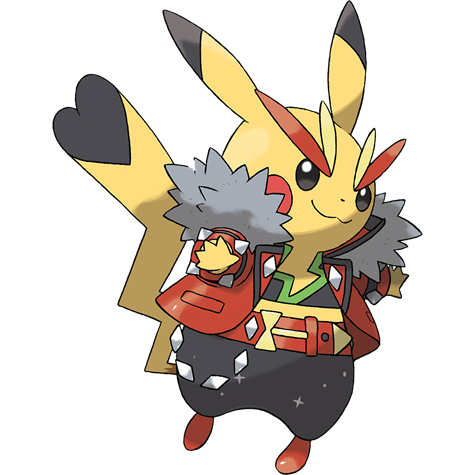
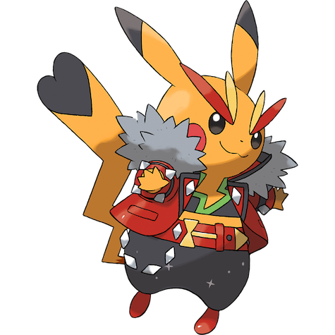
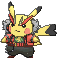
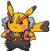
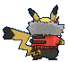
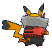

# Pikachu Rock Star (Mouse Pokémon)

| Official Artwork | Shiny Artwork |
|------------------|---------------|
|  |  |

**Rising Ruby:** Whenever Pikachu comes across something new, it blasts it with a jolt of electricity. If you come across a blackened berry, it’s evidence that this Pokémon mistook the intensity of its charge.

**Sinking Sapphire:** This Pokémon has electricity-storing pouches on its cheeks. These appear to become electrically charged during the night while Pikachu sleeps. It occasionally discharges electricity when it is dozy after waking up.

---

## Media

### Default Sprites

| Front | Shiny | Back | Shiny |
|-------|-------|------|-------|
|  |  |  |  |

### Cries

Latest (Gen VI+):

<audio controls>
<source src='../../assets/cries/pikachu-rock-star/latest.ogg' type='audio/ogg'>
  Your browser does not support the audio element.
</audio>

Legacy:

<audio controls>
<source src='../../assets/cries/pikachu-rock-star/legacy.ogg' type='audio/ogg'>
  Your browser does not support the audio element.
</audio>

---

## Pokédex Data

| National № | Type(s) | Height | Weight | Abilities | Local № |
|------------|---------|--------|--------|-----------|---------|
| #10080 | {: width="48"} | 0.4 m / 1.3 ft | 6.0 kg / 13.2 lbs | 1. Static 3. Lightning Rod | #104 |

---

## Base Stats
|   | HP | Attack | Defense | Sp. Atk | Sp. Def | Speed |
|---|----|--------|---------|---------|---------|-------|
| **Base** | 35 | 55 | 40 | 50 | 50 | 90 |
| **Min** | 180 | 103 | 76 | 94 | 94 | 166 |
| **Max** | 274 | 229 | 196 | 218 | 218 | 306 |

The ranges shown above are for a level 100 Pokémon. Maximum values are based on a beneficial nature, 252 EVs, 31 IVs; minimum values are based on a hindering nature, 0 EVs, 0 IVs.

---

## Forms & Evolutions

!!! warning "WARNING"

    Information on evolutions may not be 100% accurate; differences between evolution methods across generations are not accounted for.

### Forms

1. [Pikachu](pikachu.md/)

2. [Pikachu Rock Star](pikachu-rock-star.md/)

3. [Pikachu Belle](pikachu-belle.md/)

4. [Pikachu Pop Star](pikachu-pop-star.md/)

5. [Pikachu Phd](pikachu-phd.md/)

6. [Pikachu Libre](pikachu-libre.md/)

7. [Pikachu Cosplay](pikachu-cosplay.md/)

### Evolution Line

1. [Pichu](pichu.md/)
    1. Level Up: [Pikachu](pikachu.md/)
        1. Use Item: [Raichu](raichu.md/)

---

## Training

| EV Yield | Catch Rate | Base Friendship | Base Exp. | Growth Rate | Held Items |
|----------|------------|-----------------|-----------|-------------|------------|
| 2 Spd | 190 | 50 | 112 | Medium | Light Ball (5%) |

---

## Breeding

| Egg Groups | Egg Cycles | Gender | Dimorphic | Color | Shape |
|------------|------------|--------|-----------|-------|-------|
| 1. Ground 2. Fairy | 10 | 50.0% Male 50.0% Female | True | Yellow | Quadruped |

---

## Moves

!!! warning "WARNING"

    Specific move information may be incorrect. However, the general movepool should be accurate; this includes changes made in Sacred Gold and Storm Silver.

### Level Up Moves

| Lv. | Move | Type | Cat. | Power | Acc. | PP |
| --- | --- | --- | --- | --- | --- | --- |
| 1 | Tail Whip | {: width="48"} | {: width="36"} | — | 100 | 30 |
| 1 | Thunder Shock | {: width="48"} | {: width="36"} | 40 | 100 | 30 |
| 5 | Growl | {: width="48"} | {: width="36"} | — | 100 | 40 |
| 7 | Play Nice | {: width="48"} | {: width="36"} | — | — | 20 |
| 10 | Quick Attack | {: width="48"} | {: width="36"} | 40 | 100 | 30 |
| 13 | Electro Ball | {: width="48"} | {: width="36"} | — | 100 | 10 |
| 18 | Thunder Wave | {: width="48"} | {: width="36"} | — | 90 | 20 |
| 21 | Feint | {: width="48"} | {: width="36"} | 30 | 100 | 10 |
| 23 | Double Team | {: width="48"} | {: width="36"} | — | — | 15 |
| 26 | Spark | {: width="48"} | {: width="36"} | 65 | 100 | 20 |
| 29 | Nuzzle | {: width="48"} | {: width="36"} | 20 | 100 | 20 |
| 34 | Discharge | {: width="48"} | {: width="36"} | 80 | 100 | 15 |
| 37 | Slam | {: width="48"} | {: width="36"} | 80 | 75 | 20 |
| 42 | Thunderbolt | {: width="48"} | {: width="36"} | 90 | 100 | 15 |
| 45 | Agility | {: width="48"} | {: width="36"} | — | — | 30 |
| 50 | Wild Charge | {: width="48"} | {: width="36"} | 90 | 100 | 15 |
| 53 | Light Screen | {: width="48"} | {: width="36"} | — | — | 30 |
| 58 | Thunder | {: width="48"} | {: width="36"} | 110 | 70 | 10 |

### TM Moves

| TM | Move | Type | Cat. | Power | Acc. | PP |
| --- | --- | --- | --- | --- | --- | --- |
| HM04 | Strength | {: width="48"} | {: width="36"} | 100 | 100 | 10 |
| HM06 | Rock Smash | {: width="48"} | {: width="36"} | 65 | 100 | 15 |
| TM06 | Toxic | {: width="48"} | {: width="36"} | — | 90 | 10 |
| TM10 | Hidden Power | {: width="48"} | {: width="36"} | 60 | 100 | 15 |
| TM100 | Confide | {: width="48"} | {: width="36"} | — | — | 20 |
| TM16 | Light Screen | {: width="48"} | {: width="36"} | — | — | 30 |
| TM17 | Protect | {: width="48"} | {: width="36"} | — | — | 10 |
| TM18 | Rain Dance | {: width="48"} | {: width="36"} | — | — | 5 |
| TM21 | Frustration | {: width="48"} | {: width="36"} | — | 100 | 20 |
| TM24 | Thunderbolt | {: width="48"} | {: width="36"} | 90 | 100 | 15 |
| TM25 | Thunder | {: width="48"} | {: width="36"} | 110 | 70 | 10 |
| TM27 | Return | {: width="48"} | {: width="36"} | — | 100 | 20 |
| TM28 | Dig | {: width="48"} | {: width="36"} | 80 | 100 | 10 |
| TM31 | Brick Break | {: width="48"} | {: width="36"} | 75 | 100 | 15 |
| TM32 | Double Team | {: width="48"} | {: width="36"} | — | — | 15 |
| TM42 | Facade | {: width="48"} | {: width="36"} | 70 | 100 | 20 |
| TM44 | Rest | {: width="48"} | {: width="36"} | — | — | 5 |
| TM45 | Attract | {: width="48"} | {: width="36"} | — | 100 | 15 |
| TM48 | Round | {: width="48"} | {: width="36"} | 60 | 100 | 15 |
| TM49 | Echoed Voice | {: width="48"} | {: width="36"} | 40 | 100 | 15 |
| TM56 | Fling | {: width="48"} | {: width="36"} | — | 100 | 10 |
| TM57 | Charge Beam | {: width="48"} | {: width="36"} | 50 | 90 | 10 |
| TM70 | Flash | {: width="48"} | {: width="36"} | — | 100 | 20 |
| TM72 | Volt Switch | {: width="48"} | {: width="36"} | 70 | 100 | 20 |
| TM73 | Thunder Wave | {: width="48"} | {: width="36"} | — | 90 | 20 |
| TM86 | Grass Knot | {: width="48"} | {: width="36"} | — | 100 | 20 |
| TM87 | Swagger | {: width="48"} | {: width="36"} | — | 85 | 15 |
| TM88 | Sleep Talk | {: width="48"} | {: width="36"} | — | — | 10 |
| TM90 | Substitute | {: width="48"} | {: width="36"} | — | — | 10 |
| TM93 | Wild Charge | {: width="48"} | {: width="36"} | 90 | 100 | 15 |
| TM94 | Secret Power | {: width="48"} | {: width="36"} | 70 | 100 | 20 |

### Egg Moves

Pikachu Rock Star cannot learn any moves by breeding.
### Tutor Moves

| Move | Type | Cat. | Power | Acc. | PP |
| --- | --- | --- | --- | --- | --- |
| Covet | {: width="48"} | {: width="36"} | 60 | 100 | 25 |
| Electroweb | {: width="48"} | {: width="36"} | 55 | 95 | 15 |
| Focus Punch | {: width="48"} | {: width="36"} | 150 | 100 | 20 |
| Helping Hand | {: width="48"} | {: width="36"} | — | — | 20 |
| Iron Tail | {: width="48"} | {: width="36"} | 100 | 75 | 15 |
| Knock Off | {: width="48"} | {: width="36"} | 65 | 100 | 20 |
| Magnet Rise | {: width="48"} | {: width="36"} | — | — | 10 |
| Shock Wave | {: width="48"} | {: width="36"} | 60 | — | 20 |
| Signal Beam | {: width="48"} | {: width="36"} | 75 | 100 | 15 |
| Snore | {: width="48"} | {: width="36"} | 50 | 100 | 15 |
| Thunder Punch | {: width="48"} | {: width="36"} | 75 | 100 | 15 |

