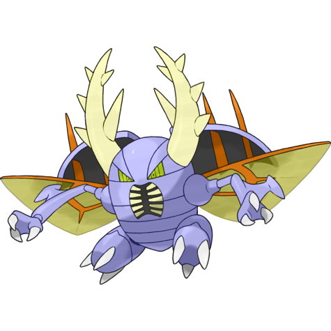
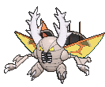
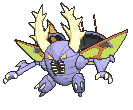
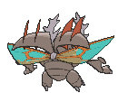
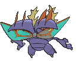

# Pinsir Mega (Stag Beetle Pokémon)

| Official Artwork | Shiny Artwork |
|------------------|---------------|
|  |  |

**Rising Ruby:** Pinsir is astoundingly strong. It can grip a foe weighing twice its weight in its horns and easily lift it. This Pokémon’s movements turn sluggish in cold places.

**Sinking Sapphire:** Pinsir has a pair of massive horns. Protruding from the surface of these horns are thorns. These thorns are driven deeply into the foe’s body when the pincer closes, making it tough for the foe to escape.

---

## Media

### Default Sprites

| Front | Shiny | Back | Shiny |
|-------|-------|------|-------|
|  |  |  |  |

### Cries

Latest (Gen VI+):

<audio controls>
<source src='../../assets/cries/pinsir-mega/latest.ogg' type='audio/ogg'>
  Your browser does not support the audio element.
</audio>

Legacy:

<audio controls>
<source src='../../assets/cries/pinsir-mega/legacy.ogg' type='audio/ogg'>
  Your browser does not support the audio element.
</audio>

---

## Pokédex Data

| National № | Type(s) | Height | Weight | Abilities | Local № |
|------------|---------|--------|--------|-----------|---------|
| #10040 | {: width="48"} {: width="48"} | 1.7 m / 5.6 ft | 59.0 kg / 130.1 lbs | 1. Aerilate | N/A |

---

## Base Stats
|   | HP | Attack | Defense | Sp. Atk | Sp. Def | Speed |
|---|----|--------|---------|---------|---------|-------|
| **Base** | 65 | 155 | 120 | 65 | 90 | 105 |
| **Min** | 240 | 283 | 220 | 121 | 166 | 193 |
| **Max** | 334 | 449 | 372 | 251 | 306 | 339 |

The ranges shown above are for a level 100 Pokémon. Maximum values are based on a beneficial nature, 252 EVs, 31 IVs; minimum values are based on a hindering nature, 0 EVs, 0 IVs.

---

## Forms & Evolutions

!!! warning "WARNING"

    Information on evolutions may not be 100% accurate; differences between evolution methods across generations are not accounted for.

### Forms

1. [Pinsir](pinsir.md/)

2. [Pinsir Mega](pinsir-mega.md/)

### Evolution Line

1. [Pinsir](pinsir.md/)

---

## Training

| EV Yield | Catch Rate | Base Friendship | Base Exp. | Growth Rate | Held Items |
|----------|------------|-----------------|-----------|-------------|------------|
| 2 Atk | 45 | 50 | 210 | Slow | N/A |

---

## Breeding

| Egg Groups | Egg Cycles | Gender | Dimorphic | Color | Shape |
|------------|------------|--------|-----------|-------|-------|
| 1. Bug | 25 | 50.0% Male 50.0% Female | False | Brown | Humanoid |

---

## Moves

!!! warning "WARNING"

    Specific move information may be incorrect. However, the general movepool should be accurate; this includes changes made in Sacred Gold and Storm Silver.

### Level Up Moves

| Lv. | Move | Type | Cat. | Power | Acc. | PP |
| --- | --- | --- | --- | --- | --- | --- |
| 1 | Focus Energy | {: width="48"} | {: width="36"} | — | — | 30 |
| 1 | Vice Grip | {: width="48"} | {: width="36"} | 55 | 100 | 30 |
| 4 | Bind | {: width="48"} | {: width="36"} | 15 | 85 | 20 |
| 8 | Seismic Toss | {: width="48"} | {: width="36"} | — | 100 | 20 |
| 11 | Harden | {: width="48"} | {: width="36"} | — | — | 30 |
| 15 | Revenge | {: width="48"} | {: width="36"} | 60 | 100 | 10 |
| 18 | Vital Throw | {: width="48"} | {: width="36"} | 70 | — | 10 |
| 22 | Double Hit | {: width="48"} | {: width="36"} | 35 | 90 | 10 |
| 26 | Brick Break | {: width="48"} | {: width="36"} | 75 | 100 | 15 |
| 29 | Submission | {: width="48"} | {: width="36"} | 80 | 80 | 20 |
| 33 | X Scissor | {: width="48"} | {: width="36"} | 80 | 100 | 15 |
| 36 | Storm Throw | {: width="48"} | {: width="36"} | 60 | 100 | 10 |
| 40 | Swords Dance | {: width="48"} | {: width="36"} | — | — | 20 |
| 43 | Thrash | {: width="48"} | {: width="36"} | 120 | 100 | 10 |
| 47 | Superpower | {: width="48"} | {: width="36"} | 120 | 100 | 5 |
| 50 | Guillotine | {: width="48"} | {: width="36"} | — | 30 | 5 |

### TM Moves

| TM | Move | Type | Cat. | Power | Acc. | PP |
| --- | --- | --- | --- | --- | --- | --- |
| HM01 | Cut | {: width="48"} | {: width="36"} | 70 | 100 | 15 |
| HM04 | Strength | {: width="48"} | {: width="36"} | 100 | 100 | 10 |
| HM06 | Rock Smash | {: width="48"} | {: width="36"} | 65 | 100 | 15 |
| TM06 | Toxic | {: width="48"} | {: width="36"} | — | 90 | 10 |
| TM08 | Bulk Up | {: width="48"} | {: width="36"} | — | — | 20 |
| TM10 | Hidden Power | {: width="48"} | {: width="36"} | 60 | 100 | 15 |
| TM100 | Confide | {: width="48"} | {: width="36"} | — | — | 20 |
| TM11 | Sunny Day | {: width="48"} | {: width="36"} | — | — | 5 |
| TM15 | Hyper Beam | {: width="48"} | {: width="36"} | 150 | 90 | 5 |
| TM17 | Protect | {: width="48"} | {: width="36"} | — | — | 10 |
| TM18 | Rain Dance | {: width="48"} | {: width="36"} | — | — | 5 |
| TM21 | Frustration | {: width="48"} | {: width="36"} | — | 100 | 20 |
| TM23 | Smack Down | {: width="48"} | {: width="36"} | 50 | 100 | 15 |
| TM26 | Earthquake | {: width="48"} | {: width="36"} | 100 | 100 | 10 |
| TM27 | Return | {: width="48"} | {: width="36"} | — | 100 | 20 |
| TM28 | Dig | {: width="48"} | {: width="36"} | 80 | 100 | 10 |
| TM31 | Brick Break | {: width="48"} | {: width="36"} | 75 | 100 | 15 |
| TM32 | Double Team | {: width="48"} | {: width="36"} | — | — | 15 |
| TM39 | Rock Tomb | {: width="48"} | {: width="36"} | 60 | 95 | 15 |
| TM42 | Facade | {: width="48"} | {: width="36"} | 70 | 100 | 20 |
| TM44 | Rest | {: width="48"} | {: width="36"} | — | — | 5 |
| TM45 | Attract | {: width="48"} | {: width="36"} | — | 100 | 15 |
| TM46 | Thief | {: width="48"} | {: width="36"} | 60 | 100 | 25 |
| TM48 | Round | {: width="48"} | {: width="36"} | 60 | 100 | 15 |
| TM52 | Focus Blast | {: width="48"} | {: width="36"} | 120 | 70 | 5 |
| TM54 | False Swipe | {: width="48"} | {: width="36"} | 40 | 100 | 40 |
| TM56 | Fling | {: width="48"} | {: width="36"} | — | 100 | 10 |
| TM68 | Giga Impact | {: width="48"} | {: width="36"} | 150 | 90 | 5 |
| TM71 | Stone Edge | {: width="48"} | {: width="36"} | 100 | 80 | 5 |
| TM75 | Swords Dance | {: width="48"} | {: width="36"} | — | — | 20 |
| TM76 | Struggle Bug | {: width="48"} | {: width="36"} | 50 | 100 | 20 |
| TM78 | Bulldoze | {: width="48"} | {: width="36"} | 60 | 100 | 20 |
| TM80 | Rock Slide | {: width="48"} | {: width="36"} | 75 | 90 | 10 |
| TM81 | X Scissor | {: width="48"} | {: width="36"} | 80 | 100 | 15 |
| TM87 | Swagger | {: width="48"} | {: width="36"} | — | 85 | 15 |
| TM88 | Sleep Talk | {: width="48"} | {: width="36"} | — | — | 10 |
| TM90 | Substitute | {: width="48"} | {: width="36"} | — | — | 10 |
| TM94 | Secret Power | {: width="48"} | {: width="36"} | 70 | 100 | 20 |

### Egg Moves

| Move | Type | Cat. | Power | Acc. | PP |
| --- | --- | --- | --- | --- | --- |
| Bug Bite | {: width="48"} | {: width="36"} | 60 | 100 | 20 |
| Close Combat | {: width="48"} | {: width="36"} | 120 | 100 | 5 |
| Feint | {: width="48"} | {: width="36"} | 30 | 100 | 10 |
| Feint Attack | {: width="48"} | {: width="36"} | 60 | — | 20 |
| Flail | {: width="48"} | {: width="36"} | — | 100 | 15 |
| Fury Attack | {: width="48"} | {: width="36"} | 15 | 85 | 20 |
| Me First | {: width="48"} | {: width="36"} | — | — | 20 |
| Quick Attack | {: width="48"} | {: width="36"} | 40 | 100 | 30 |
| Superpower | {: width="48"} | {: width="36"} | 120 | 100 | 5 |

### Tutor Moves

| Move | Type | Cat. | Power | Acc. | PP |
| --- | --- | --- | --- | --- | --- |
| Bind | {: width="48"} | {: width="36"} | 15 | 85 | 20 |
| Bug Bite | {: width="48"} | {: width="36"} | 60 | 100 | 20 |
| Focus Punch | {: width="48"} | {: width="36"} | 150 | 100 | 20 |
| Iron Defense | {: width="48"} | {: width="36"} | — | — | 15 |
| Knock Off | {: width="48"} | {: width="36"} | 65 | 100 | 20 |
| Snore | {: width="48"} | {: width="36"} | 50 | 100 | 15 |
| Stealth Rock | {: width="48"} | {: width="36"} | — | — | 20 |
| Superpower | {: width="48"} | {: width="36"} | 120 | 100 | 5 |

