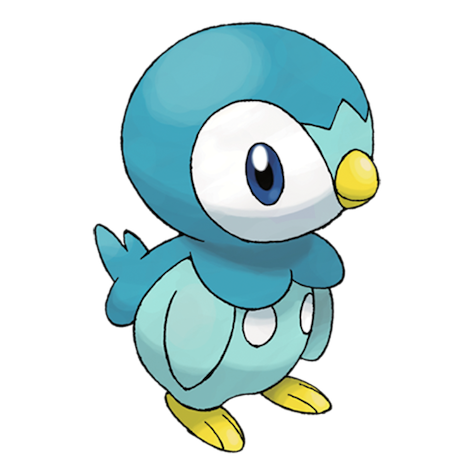
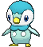
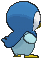
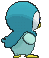

# #393 Piplup (Penguin Pokémon)

| Official Artwork | Shiny Artwork |
|------------------|---------------|
|  |  |

**Rising Ruby:** It doesn’t like to be taken care of. It’s difficult to bond with since it won’t listen to its Trainer.

**Sinking Sapphire:** Because it is very proud, it hates accepting food from people. Its thick down guards it from cold.

---

## Media

### Default Sprites

| Front | Shiny | Back | Shiny |
|-------|-------|------|-------|
|  |  |  |  |

### Cries

Latest (Gen VI+):

<audio controls>
<source src='../../assets/cries/piplup/latest.ogg' type='audio/ogg'>
  Your browser does not support the audio element.
</audio>

Legacy:

<audio controls>
<source src='../../assets/cries/piplup/legacy.ogg' type='audio/ogg'>
  Your browser does not support the audio element.
</audio>

---

## Pokédex Data

| National № | Type(s) | Height | Weight | Abilities | Local № |
|------------|---------|--------|--------|-----------|---------|
| #393 | {: width="48"} | 0.4 m / 1.3 ft | 5.2 kg / 11.5 lbs | 1. Torrent 2. Defiant | #7 |

---

## Base Stats
|   | HP | Attack | Defense | Sp. Atk | Sp. Def | Speed |
|---|----|--------|---------|---------|---------|-------|
| **Base** | 53 | 51 | 53 | 61 | 56 | 40 |
| **Min** | 216 | 96 | 99 | 114 | 105 | 76 |
| **Max** | 310 | 221 | 225 | 243 | 232 | 196 |

The ranges shown above are for a level 100 Pokémon. Maximum values are based on a beneficial nature, 252 EVs, 31 IVs; minimum values are based on a hindering nature, 0 EVs, 0 IVs.

---

## Forms & Evolutions

!!! warning "WARNING"

    Information on evolutions may not be 100% accurate; differences between evolution methods across generations are not accounted for.

### Forms

Piplup has no alternate forms.

### Evolution Line

1. [Piplup](piplup.md/)
    1. Level Up: [Prinplup](prinplup.md/)
        1. Level Up: [Empoleon](empoleon.md/)

---

## Training

| EV Yield | Catch Rate | Base Friendship | Base Exp. | Growth Rate | Held Items |
|----------|------------|-----------------|-----------|-------------|------------|
| 1 Sp.-Atk | 45 | 70 | 63 | Medium Slow | N/A |

---

## Breeding

| Egg Groups | Egg Cycles | Gender | Dimorphic | Color | Shape |
|------------|------------|--------|-----------|-------|-------|
| 1. Water1 2. Ground | 20 | 87.5% Male 12.5% Female | False | Blue | Humanoid |

---

## Moves

!!! warning "WARNING"

    Specific move information may be incorrect. However, the general movepool should be accurate; this includes changes made in Sacred Gold and Storm Silver.

### Level Up Moves

| Lv. | Move | Type | Cat. | Power | Acc. | PP |
| --- | --- | --- | --- | --- | --- | --- |
| 1 | Growl | {: width="48"} | {: width="36"} | — | 100 | 40 |
| 1 | Pound | {: width="48"} | {: width="36"} | 50 | 100 | 35 |
| 5 | Bubble | {: width="48"} | {: width="36"} | 40 | 100 | 30 |
| 8 | Water Sport | {: width="48"} | {: width="36"} | — | — | 15 |
| 11 | Bubble Beam | {: width="48"} | {: width="36"} | 65 | 100 | 20 |
| 14 | Peck | {: width="48"} | {: width="36"} | 35 | 100 | 35 |
| 17 | Icy Wind | {: width="48"} | {: width="36"} | 55 | 95 | 15 |
| 20 | Bide | {: width="48"} | {: width="36"} | — | — | 10 |
| 23 | Yawn | {: width="48"} | {: width="36"} | — | — | 10 |
| 26 | Fury Attack | {: width="48"} | {: width="36"} | 15 | 85 | 20 |
| 29 | Brine | {: width="48"} | {: width="36"} | 65 | 100 | 10 |
| 32 | Drill Peck | {: width="48"} | {: width="36"} | 80 | 100 | 20 |
| 35 | Whirlpool | {: width="48"} | {: width="36"} | 35 | 85 | 15 |
| 38 | Mist | {: width="48"} | {: width="36"} | — | — | 30 |
| 41 | Ice Beam | {: width="48"} | {: width="36"} | 90 | 100 | 10 |
| 44 | Hydro Pump | {: width="48"} | {: width="36"} | 110 | 80 | 5 |

### TM Moves

| TM | Move | Type | Cat. | Power | Acc. | PP |
| --- | --- | --- | --- | --- | --- | --- |
| HM01 | Cut | {: width="48"} | {: width="36"} | 70 | 100 | 15 |
| HM03 | Surf | {: width="48"} | {: width="36"} | 90 | 100 | 15 |
| HM05 | Waterfall | {: width="48"} | {: width="36"} | 80 | 100 | 15 |
| HM07 | Dive | {: width="48"} | {: width="36"} | 80 | 100 | 10 |
| TM06 | Toxic | {: width="48"} | {: width="36"} | — | 90 | 10 |
| TM07 | Hail | {: width="48"} | {: width="36"} | — | — | 10 |
| TM10 | Hidden Power | {: width="48"} | {: width="36"} | 60 | 100 | 15 |
| TM100 | Confide | {: width="48"} | {: width="36"} | — | — | 20 |
| TM13 | Ice Beam | {: width="48"} | {: width="36"} | 90 | 100 | 10 |
| TM14 | Blizzard | {: width="48"} | {: width="36"} | 110 | 70 | 5 |
| TM17 | Protect | {: width="48"} | {: width="36"} | — | — | 10 |
| TM18 | Rain Dance | {: width="48"} | {: width="36"} | — | — | 5 |
| TM21 | Frustration | {: width="48"} | {: width="36"} | — | 100 | 20 |
| TM27 | Return | {: width="48"} | {: width="36"} | — | 100 | 20 |
| TM28 | Dig | {: width="48"} | {: width="36"} | 80 | 100 | 10 |
| TM31 | Brick Break | {: width="48"} | {: width="36"} | 75 | 100 | 15 |
| TM32 | Double Team | {: width="48"} | {: width="36"} | — | — | 15 |
| TM39 | Rock Tomb | {: width="48"} | {: width="36"} | 60 | 95 | 15 |
| TM40 | Aerial Ace | {: width="48"} | {: width="36"} | 60 | — | 20 |
| TM42 | Facade | {: width="48"} | {: width="36"} | 70 | 100 | 20 |
| TM44 | Rest | {: width="48"} | {: width="36"} | — | — | 5 |
| TM45 | Attract | {: width="48"} | {: width="36"} | — | 100 | 15 |
| TM48 | Round | {: width="48"} | {: width="36"} | 60 | 100 | 15 |
| TM49 | Echoed Voice | {: width="48"} | {: width="36"} | 40 | 100 | 15 |
| TM55 | Scald | {: width="48"} | {: width="36"} | 80 | 100 | 15 |
| TM56 | Fling | {: width="48"} | {: width="36"} | — | 100 | 10 |
| TM60 | Quash | {: width="48"} | {: width="36"} | — | 100 | 15 |
| TM86 | Grass Knot | {: width="48"} | {: width="36"} | — | 100 | 20 |
| TM87 | Swagger | {: width="48"} | {: width="36"} | — | 85 | 15 |
| TM88 | Sleep Talk | {: width="48"} | {: width="36"} | — | — | 10 |
| TM90 | Substitute | {: width="48"} | {: width="36"} | — | — | 10 |
| TM94 | Secret Power | {: width="48"} | {: width="36"} | 70 | 100 | 20 |

### Egg Moves

| Move | Type | Cat. | Power | Acc. | PP |
| --- | --- | --- | --- | --- | --- |
| Agility | {: width="48"} | {: width="36"} | — | — | 30 |
| Aqua Ring | {: width="48"} | {: width="36"} | — | — | 20 |
| Bide | {: width="48"} | {: width="36"} | — | — | 10 |
| Double Hit | {: width="48"} | {: width="36"} | 35 | 90 | 10 |
| Feather Dance | {: width="48"} | {: width="36"} | — | 100 | 15 |
| Flail | {: width="48"} | {: width="36"} | — | 100 | 15 |
| Hydro Pump | {: width="48"} | {: width="36"} | 110 | 80 | 5 |
| Icy Wind | {: width="48"} | {: width="36"} | 55 | 95 | 15 |
| Mud Slap | {: width="48"} | {: width="36"} | 20 | 100 | 10 |
| Mud Sport | {: width="48"} | {: width="36"} | — | — | 15 |
| Snore | {: width="48"} | {: width="36"} | 50 | 100 | 15 |
| Supersonic | {: width="48"} | {: width="36"} | — | 55 | 20 |
| Yawn | {: width="48"} | {: width="36"} | — | — | 10 |

### Tutor Moves

| Move | Type | Cat. | Power | Acc. | PP |
| --- | --- | --- | --- | --- | --- |
| Covet | {: width="48"} | {: width="36"} | 60 | 100 | 25 |
| Icy Wind | {: width="48"} | {: width="36"} | 55 | 95 | 15 |
| Signal Beam | {: width="48"} | {: width="36"} | 75 | 100 | 15 |
| Snore | {: width="48"} | {: width="36"} | 50 | 100 | 15 |
| Stealth Rock | {: width="48"} | {: width="36"} | — | — | 20 |
| Water Pledge | {: width="48"} | {: width="36"} | 85 | 100 | 10 |
| Water Pulse | {: width="48"} | {: width="36"} | 60 | 100 | 20 |

