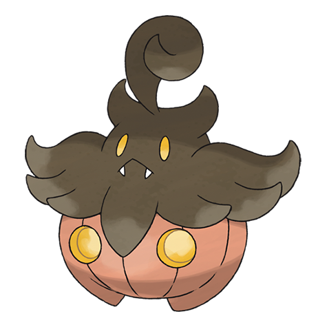
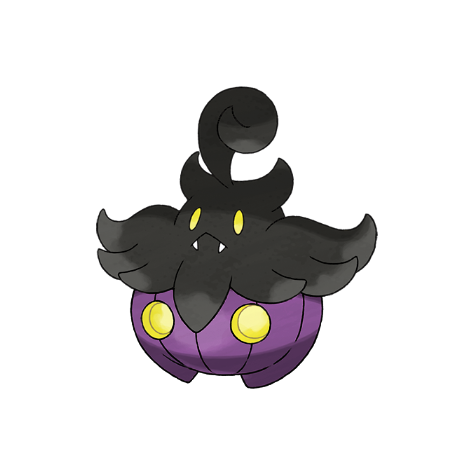
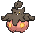
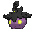
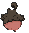
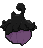

# Pumpkaboo Small (Pumpkin Pokémon)

| Official Artwork | Shiny Artwork |
|------------------|---------------|
|  |  |

**Rising Ruby:** The pumpkin body is inhabited by a spirit trapped in this world. As the sun sets, it becomes restless and active.

**Sinking Sapphire:** It is said to carry wandering spirits to the place where they belong so they can move on.

---

## Media

### Default Sprites

| Front | Shiny | Back | Shiny |
|-------|-------|------|-------|
|  |  |  |  |

### Cries

Latest (Gen VI+):

<audio controls>
<source src='../../assets/cries/pumpkaboo-small/latest.ogg' type='audio/ogg'>
  Your browser does not support the audio element.
</audio>

Legacy:

<audio controls>
<source src='../../assets/cries/pumpkaboo-small/legacy.ogg' type='audio/ogg'>
  Your browser does not support the audio element.
</audio>

---

## Pokédex Data

| National № | Type(s) | Height | Weight | Abilities | Local № |
|------------|---------|--------|--------|-----------|---------|
| #10027 | {: width="48"} {: width="48"} | 0.3 m / 1.0 ft | 3.5 kg / 7.7 lbs | 1. Pickup 2. Frisk | N/A |

---

## Base Stats
|   | HP | Attack | Defense | Sp. Atk | Sp. Def | Speed |
|---|----|--------|---------|---------|---------|-------|
| **Base** | 44 | 66 | 70 | 44 | 55 | 56 |
| **Min** | 198 | 123 | 130 | 83 | 103 | 105 |
| **Max** | 292 | 254 | 262 | 205 | 229 | 232 |

The ranges shown above are for a level 100 Pokémon. Maximum values are based on a beneficial nature, 252 EVs, 31 IVs; minimum values are based on a hindering nature, 0 EVs, 0 IVs.

---

## Forms & Evolutions

!!! warning "WARNING"

    Information on evolutions may not be 100% accurate; differences between evolution methods across generations are not accounted for.

### Forms

1. [Pumpkaboo Average](pumpkaboo-average.md/)

2. [Pumpkaboo Small](pumpkaboo-small.md/)

3. [Pumpkaboo Large](pumpkaboo-large.md/)

4. [Pumpkaboo Super](pumpkaboo-super.md/)

### Evolution Line

1. [Pumpkaboo Average](pumpkaboo-average.md/)
    1. Trade: [Gourgeist Average](gourgeist-average.md/)

    1. Trade: [Gourgeist Large](gourgeist-large.md/)

    1. Trade: [Gourgeist Small](gourgeist-small.md/)

    1. Trade: [Gourgeist Super](gourgeist-super.md/)

1. [Pumpkaboo Large](pumpkaboo-large.md/)
    1. Trade: [Gourgeist Average](gourgeist-average.md/)

    1. Trade: [Gourgeist Large](gourgeist-large.md/)

    1. Trade: [Gourgeist Small](gourgeist-small.md/)

    1. Trade: [Gourgeist Super](gourgeist-super.md/)

1. [Pumpkaboo Small](pumpkaboo-small.md/)
    1. Trade: [Gourgeist Average](gourgeist-average.md/)

    1. Trade: [Gourgeist Large](gourgeist-large.md/)

    1. Trade: [Gourgeist Small](gourgeist-small.md/)

    1. Trade: [Gourgeist Super](gourgeist-super.md/)

1. [Pumpkaboo Super](pumpkaboo-super.md/)
    1. Trade: [Gourgeist Average](gourgeist-average.md/)

    1. Trade: [Gourgeist Large](gourgeist-large.md/)

    1. Trade: [Gourgeist Small](gourgeist-small.md/)

    1. Trade: [Gourgeist Super](gourgeist-super.md/)

---

## Training

| EV Yield | Catch Rate | Base Friendship | Base Exp. | Growth Rate | Held Items |
|----------|------------|-----------------|-----------|-------------|------------|
| 1 Def | 120 | 50 | 67 | Medium | N/A |

---

## Breeding

| Egg Groups | Egg Cycles | Gender | Dimorphic | Color | Shape |
|------------|------------|--------|-----------|-------|-------|
| 1. Indeterminate | 20 | 50.0% Male 50.0% Female | False | Brown | Ball |

---

## Moves

!!! warning "WARNING"

    Specific move information may be incorrect. However, the general movepool should be accurate; this includes changes made in Sacred Gold and Storm Silver.

### Level Up Moves

| Lv. | Move | Type | Cat. | Power | Acc. | PP |
| --- | --- | --- | --- | --- | --- | --- |
| 1 | Astonish | {: width="48"} | {: width="36"} | 30 | 100 | 15 |
| 1 | Confuse Ray | {: width="48"} | {: width="36"} | — | 100 | 10 |
| 1 | Trick | {: width="48"} | {: width="36"} | — | 100 | 10 |
| 4 | Scary Face | {: width="48"} | {: width="36"} | — | 100 | 10 |
| 6 | Trick Or Treat | {: width="48"} | {: width="36"} | — | 100 | 20 |
| 11 | Worry Seed | {: width="48"} | {: width="36"} | — | 100 | 10 |
| 16 | Razor Leaf | {: width="48"} | {: width="36"} | 55 | 95 | 25 |
| 20 | Leech Seed | {: width="48"} | {: width="36"} | — | 90 | 10 |
| 23 | Trick Or Treat | {: width="48"} | {: width="36"} | — | 100 | 20 |
| 26 | Bullet Seed | {: width="48"} | {: width="36"} | 25 | 100 | 30 |
| 30 | Shadow Sneak | {: width="48"} | {: width="36"} | 40 | 100 | 30 |
| 36 | Shadow Ball | {: width="48"} | {: width="36"} | 80 | 100 | 15 |
| 40 | Trick Or Treat | {: width="48"} | {: width="36"} | — | 100 | 20 |
| 42 | Pain Split | {: width="48"} | {: width="36"} | — | — | 20 |
| 48 | Seed Bomb | {: width="48"} | {: width="36"} | 80 | 100 | 15 |

### TM Moves

| TM | Move | Type | Cat. | Power | Acc. | PP |
| --- | --- | --- | --- | --- | --- | --- |
| HM06 | Rock Smash | {: width="48"} | {: width="36"} | 65 | 100 | 15 |
| TM06 | Toxic | {: width="48"} | {: width="36"} | — | 90 | 10 |
| TM10 | Hidden Power | {: width="48"} | {: width="36"} | 60 | 100 | 15 |
| TM100 | Confide | {: width="48"} | {: width="36"} | — | — | 20 |
| TM11 | Sunny Day | {: width="48"} | {: width="36"} | — | — | 5 |
| TM16 | Light Screen | {: width="48"} | {: width="36"} | — | — | 30 |
| TM17 | Protect | {: width="48"} | {: width="36"} | — | — | 10 |
| TM20 | Safeguard | {: width="48"} | {: width="36"} | — | — | 25 |
| TM21 | Frustration | {: width="48"} | {: width="36"} | — | 100 | 20 |
| TM22 | Solar Beam | {: width="48"} | {: width="36"} | 120 | 100 | 10 |
| TM27 | Return | {: width="48"} | {: width="36"} | — | 100 | 20 |
| TM29 | Psychic | {: width="48"} | {: width="36"} | 90 | 100 | 10 |
| TM30 | Shadow Ball | {: width="48"} | {: width="36"} | 80 | 100 | 15 |
| TM32 | Double Team | {: width="48"} | {: width="36"} | — | — | 15 |
| TM35 | Flamethrower | {: width="48"} | {: width="36"} | 90 | 100 | 15 |
| TM36 | Sludge Bomb | {: width="48"} | {: width="36"} | 90 | 100 | 10 |
| TM38 | Fire Blast | {: width="48"} | {: width="36"} | 110 | 85 | 5 |
| TM42 | Facade | {: width="48"} | {: width="36"} | 70 | 100 | 20 |
| TM43 | Flame Charge | {: width="48"} | {: width="36"} | 50 | 100 | 20 |
| TM44 | Rest | {: width="48"} | {: width="36"} | — | — | 5 |
| TM45 | Attract | {: width="48"} | {: width="36"} | — | 100 | 15 |
| TM46 | Thief | {: width="48"} | {: width="36"} | 60 | 100 | 25 |
| TM48 | Round | {: width="48"} | {: width="36"} | 60 | 100 | 15 |
| TM53 | Energy Ball | {: width="48"} | {: width="36"} | 90 | 100 | 10 |
| TM57 | Charge Beam | {: width="48"} | {: width="36"} | 50 | 90 | 10 |
| TM59 | Incinerate | {: width="48"} | {: width="36"} | 60 | 100 | 15 |
| TM61 | Will O Wisp | {: width="48"} | {: width="36"} | — | 85 | 15 |
| TM64 | Explosion | {: width="48"} | {: width="36"} | 250 | 100 | 5 |
| TM70 | Flash | {: width="48"} | {: width="36"} | — | 100 | 20 |
| TM74 | Gyro Ball | {: width="48"} | {: width="36"} | — | 100 | 5 |
| TM80 | Rock Slide | {: width="48"} | {: width="36"} | 75 | 90 | 10 |
| TM85 | Dream Eater | {: width="48"} | {: width="36"} | 100 | 100 | 15 |
| TM86 | Grass Knot | {: width="48"} | {: width="36"} | — | 100 | 20 |
| TM87 | Swagger | {: width="48"} | {: width="36"} | — | 85 | 15 |
| TM88 | Sleep Talk | {: width="48"} | {: width="36"} | — | — | 10 |
| TM90 | Substitute | {: width="48"} | {: width="36"} | — | — | 10 |
| TM92 | Trick Room | {: width="48"} | {: width="36"} | — | — | 5 |
| TM94 | Secret Power | {: width="48"} | {: width="36"} | 70 | 100 | 20 |
| TM96 | Nature Power | {: width="48"} | {: width="36"} | — | — | 20 |
| TM97 | Dark Pulse | {: width="48"} | {: width="36"} | 80 | 100 | 15 |

### Egg Moves

| Move | Type | Cat. | Power | Acc. | PP |
| --- | --- | --- | --- | --- | --- |
| Bestow | {: width="48"} | {: width="36"} | — | — | 15 |
| Destiny Bond | {: width="48"} | {: width="36"} | — | — | 5 |
| Disable | {: width="48"} | {: width="36"} | — | 100 | 20 |

### Tutor Moves

| Move | Type | Cat. | Power | Acc. | PP |
| --- | --- | --- | --- | --- | --- |
| Foul Play | {: width="48"} | {: width="36"} | 95 | 100 | 15 |
| Giga Drain | {: width="48"} | {: width="36"} | 75 | 100 | 10 |
| Magic Coat | {: width="48"} | {: width="36"} | — | — | 15 |
| Pain Split | {: width="48"} | {: width="36"} | — | — | 20 |
| Role Play | {: width="48"} | {: width="36"} | — | — | 10 |
| Seed Bomb | {: width="48"} | {: width="36"} | 80 | 100 | 15 |
| Skill Swap | {: width="48"} | {: width="36"} | — | — | 10 |
| Spite | {: width="48"} | {: width="36"} | — | 100 | 10 |
| Synthesis | {: width="48"} | {: width="36"} | — | — | 5 |
| Trick | {: width="48"} | {: width="36"} | — | 100 | 10 |
| Worry Seed | {: width="48"} | {: width="36"} | — | 100 | 10 |

