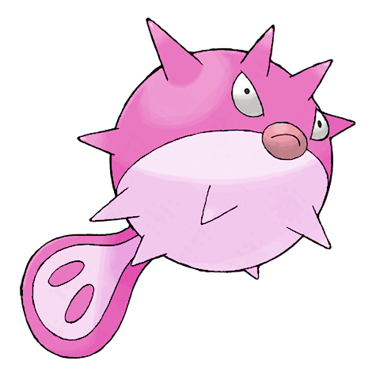

# #211 Qwilfish (Balloon Pokémon)

| Official Artwork | Shiny Artwork |
|------------------|---------------|
|  |  |

Qwilfish sucks in water, inflating itself. This Pokémon uses the pressure of the water it swallowed to shoot toxic quills all at once from all over its body. It finds swimming somewhat challenging.

---

## Media

### Default Sprites

| Front | Shiny | Back | Shiny |
|-------|-------|------|-------|
|  |  |  |  |

### Cries

Latest (Gen VI+):

<audio controls>
<source src='../../assets/cries/qwilfish/latest.ogg' type='audio/ogg'>
  Your browser does not support the audio element.
</audio>

Legacy:

<audio controls>
<source src='../../assets/cries/qwilfish/legacy.ogg' type='audio/ogg'>
  Your browser does not support the audio element.
</audio>

---

## Pokédex Data

| National № | Type(s) | Height | Weight | Abilities | Local № |
|------------|---------|--------|--------|-----------|---------|
| #211 | {: width="48"} {: width="48"} | 0.5 m / 1.6 ft | 3.9 kg / 8.6 lbs | 1. Poison Point 2. Swift Swim | N/A |

---

## Base Stats
|   | HP | Attack | Defense | Sp. Atk | Sp. Def | Speed |
|---|----|--------|---------|---------|---------|-------|
| **Base** | 65 | 100 | 85 | 55 | 55 | 90 |
| **Min** | 240 | 184 | 157 | 103 | 103 | 166 |
| **Max** | 334 | 328 | 295 | 229 | 229 | 306 |

The ranges shown above are for a level 100 Pokémon. Maximum values are based on a beneficial nature, 252 EVs, 31 IVs; minimum values are based on a hindering nature, 0 EVs, 0 IVs.

---

## Forms & Evolutions

!!! warning "WARNING"

    Information on evolutions may not be 100% accurate; differences between evolution methods across generations are not accounted for.

### Forms

Qwilfish has no alternate forms.

### Evolution Line

1. [Qwilfish](qwilfish.md/)

---

## Training

| EV Yield | Catch Rate | Base Friendship | Base Exp. | Growth Rate | Held Items |
|----------|------------|-----------------|-----------|-------------|------------|
| 1 Atk | 45 | 50 | 88 | Medium | Poison Barb (5%) |

---

## Breeding

| Egg Groups | Egg Cycles | Gender | Dimorphic | Color | Shape |
|------------|------------|--------|-----------|-------|-------|
| 1. Water2 | 20 | 50.0% Male 50.0% Female | False | Gray | Fish |

---

## Moves

!!! warning "WARNING"

    Specific move information may be incorrect. However, the general movepool should be accurate; this includes changes made in Sacred Gold and Storm Silver.

### Level Up Moves

| Lv. | Move | Type | Cat. | Power | Acc. | PP |
| --- | --- | --- | --- | --- | --- | --- |
| 1 | Harden | {: width="48"} | {: width="36"} | — | — | 30 |
| 1 | Minimize | {: width="48"} | {: width="36"} | — | — | 10 |
| 1 | Poison Sting | {: width="48"} | {: width="36"} | 15 | 100 | 35 |
| 1 | Spikes | {: width="48"} | {: width="36"} | — | — | 20 |
| 1 | Tackle | {: width="48"} | {: width="36"} | 40 | 100 | 35 |
| 6 | Bubble | {: width="48"} | {: width="36"} | 40 | 100 | 30 |
| 9 | Rollout | {: width="48"} | {: width="36"} | 30 | 90 | 20 |
| 12 | Toxic Spikes | {: width="48"} | {: width="36"} | — | — | 20 |
| 15 | Spit Up | {: width="48"} | {: width="36"} | — | 100 | 10 |
| 15 | Stockpile | {: width="48"} | {: width="36"} | — | — | 20 |
| 18 | Aqua Jet | {: width="48"} | {: width="36"} | 40 | 100 | 20 |
| 21 | Revenge | {: width="48"} | {: width="36"} | 60 | 100 | 10 |
| 24 | Aqua Tail | {: width="48"} | {: width="36"} | 90 | 90 | 10 |
| 27 | Pin Missile | {: width="48"} | {: width="36"} | 25 | 95 | 20 |
| 30 | Poison Jab | {: width="48"} | {: width="36"} | 80 | 100 | 20 |
| 33 | Take Down | {: width="48"} | {: width="36"} | 90 | 85 | 20 |
| 36 | Brine | {: width="48"} | {: width="36"} | 65 | 100 | 10 |
| 39 | Destiny Bond | {: width="48"} | {: width="36"} | — | — | 5 |
| 42 | Hydro Pump | {: width="48"} | {: width="36"} | 110 | 80 | 5 |
| 45 | Fell Stinger | {: width="48"} | {: width="36"} | 50 | 100 | 25 |

### TM Moves

| TM | Move | Type | Cat. | Power | Acc. | PP |
| --- | --- | --- | --- | --- | --- | --- |
| HM03 | Surf | {: width="48"} | {: width="36"} | 90 | 100 | 15 |
| HM05 | Waterfall | {: width="48"} | {: width="36"} | 80 | 100 | 15 |
| HM07 | Dive | {: width="48"} | {: width="36"} | 80 | 100 | 10 |
| TM06 | Toxic | {: width="48"} | {: width="36"} | — | 90 | 10 |
| TM07 | Hail | {: width="48"} | {: width="36"} | — | — | 10 |
| TM09 | Venoshock | {: width="48"} | {: width="36"} | 65 | 100 | 10 |
| TM10 | Hidden Power | {: width="48"} | {: width="36"} | 60 | 100 | 15 |
| TM100 | Confide | {: width="48"} | {: width="36"} | — | — | 20 |
| TM12 | Taunt | {: width="48"} | {: width="36"} | — | 100 | 20 |
| TM13 | Ice Beam | {: width="48"} | {: width="36"} | 90 | 100 | 10 |
| TM14 | Blizzard | {: width="48"} | {: width="36"} | 110 | 70 | 5 |
| TM17 | Protect | {: width="48"} | {: width="36"} | — | — | 10 |
| TM18 | Rain Dance | {: width="48"} | {: width="36"} | — | — | 5 |
| TM21 | Frustration | {: width="48"} | {: width="36"} | — | 100 | 20 |
| TM27 | Return | {: width="48"} | {: width="36"} | — | 100 | 20 |
| TM30 | Shadow Ball | {: width="48"} | {: width="36"} | 80 | 100 | 15 |
| TM32 | Double Team | {: width="48"} | {: width="36"} | — | — | 15 |
| TM34 | Sludge Wave | {: width="48"} | {: width="36"} | 95 | 100 | 10 |
| TM36 | Sludge Bomb | {: width="48"} | {: width="36"} | 90 | 100 | 10 |
| TM42 | Facade | {: width="48"} | {: width="36"} | 70 | 100 | 20 |
| TM44 | Rest | {: width="48"} | {: width="36"} | — | — | 5 |
| TM45 | Attract | {: width="48"} | {: width="36"} | — | 100 | 15 |
| TM48 | Round | {: width="48"} | {: width="36"} | 60 | 100 | 15 |
| TM55 | Scald | {: width="48"} | {: width="36"} | 80 | 100 | 15 |
| TM64 | Explosion | {: width="48"} | {: width="36"} | 250 | 100 | 5 |
| TM66 | Payback | {: width="48"} | {: width="36"} | 50 | 100 | 10 |
| TM73 | Thunder Wave | {: width="48"} | {: width="36"} | — | 90 | 20 |
| TM74 | Gyro Ball | {: width="48"} | {: width="36"} | — | 100 | 5 |
| TM84 | Poison Jab | {: width="48"} | {: width="36"} | 80 | 100 | 20 |
| TM87 | Swagger | {: width="48"} | {: width="36"} | — | 85 | 15 |
| TM88 | Sleep Talk | {: width="48"} | {: width="36"} | — | — | 10 |
| TM90 | Substitute | {: width="48"} | {: width="36"} | — | — | 10 |
| TM94 | Secret Power | {: width="48"} | {: width="36"} | 70 | 100 | 20 |

### Egg Moves

| Move | Type | Cat. | Power | Acc. | PP |
| --- | --- | --- | --- | --- | --- |
| Acid Spray | {: width="48"} | {: width="36"} | 40 | 100 | 20 |
| Aqua Jet | {: width="48"} | {: width="36"} | 40 | 100 | 20 |
| Astonish | {: width="48"} | {: width="36"} | 30 | 100 | 15 |
| Brine | {: width="48"} | {: width="36"} | 65 | 100 | 10 |
| Bubble Beam | {: width="48"} | {: width="36"} | 65 | 100 | 20 |
| Flail | {: width="48"} | {: width="36"} | — | 100 | 15 |
| Haze | {: width="48"} | {: width="36"} | — | — | 30 |
| Signal Beam | {: width="48"} | {: width="36"} | 75 | 100 | 15 |
| Supersonic | {: width="48"} | {: width="36"} | — | 55 | 20 |
| Water Pulse | {: width="48"} | {: width="36"} | 60 | 100 | 20 |

### Tutor Moves

| Move | Type | Cat. | Power | Acc. | PP |
| --- | --- | --- | --- | --- | --- |
| Aqua Tail | {: width="48"} | {: width="36"} | 90 | 90 | 10 |
| Bounce | {: width="48"} | {: width="36"} | 85 | 85 | 5 |
| Icy Wind | {: width="48"} | {: width="36"} | 55 | 95 | 15 |
| Pain Split | {: width="48"} | {: width="36"} | — | — | 20 |
| Shock Wave | {: width="48"} | {: width="36"} | 60 | — | 20 |
| Signal Beam | {: width="48"} | {: width="36"} | 75 | 100 | 15 |
| Snore | {: width="48"} | {: width="36"} | 50 | 100 | 15 |
| Water Pulse | {: width="48"} | {: width="36"} | 60 | 100 | 20 |

