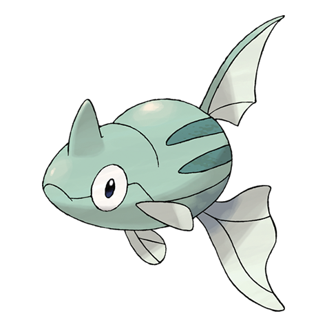
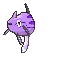
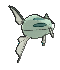
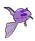

# #223 Remoraid (Jet Pokémon)

| Official Artwork | Shiny Artwork |
|------------------|---------------|
|  |  |

Remoraid sucks in water, then expels it at high velocity using its abdominal muscles to shoot down flying prey. When evolution draws near, this Pokémon travels downstream from rivers.

---

## Media

### Default Sprites

| Front | Shiny | Back | Shiny |
|-------|-------|------|-------|
|  |  |  |  |

### Cries

Latest (Gen VI+):

<audio controls>
<source src='../../assets/cries/remoraid/latest.ogg' type='audio/ogg'>
  Your browser does not support the audio element.
</audio>

Legacy:

<audio controls>
<source src='../../assets/cries/remoraid/legacy.ogg' type='audio/ogg'>
  Your browser does not support the audio element.
</audio>

---

## Pokédex Data

| National № | Type(s) | Height | Weight | Abilities | Local № |
|------------|---------|--------|--------|-----------|---------|
| #223 | {: width="48"} | 0.6 m / 2.0 ft | 12.0 kg / 26.5 lbs | 1. Hustle 2. Sniper | #132 |

---

## Base Stats
|   | HP | Attack | Defense | Sp. Atk | Sp. Def | Speed |
|---|----|--------|---------|---------|---------|-------|
| **Base** | 35 | 65 | 35 | 65 | 35 | 65 |
| **Min** | 180 | 121 | 67 | 121 | 67 | 121 |
| **Max** | 274 | 251 | 185 | 251 | 185 | 251 |

The ranges shown above are for a level 100 Pokémon. Maximum values are based on a beneficial nature, 252 EVs, 31 IVs; minimum values are based on a hindering nature, 0 EVs, 0 IVs.

---

## Forms & Evolutions

!!! warning "WARNING"

    Information on evolutions may not be 100% accurate; differences between evolution methods across generations are not accounted for.

### Forms

Remoraid has no alternate forms.

### Evolution Line

1. [Remoraid](remoraid.md/)
    1. Level Up: [Octillery](octillery.md/)

---

## Training

| EV Yield | Catch Rate | Base Friendship | Base Exp. | Growth Rate | Held Items |
|----------|------------|-----------------|-----------|-------------|------------|
| 1 Sp.-Atk | 190 | 50 | 60 | Medium | N/A |

---

## Breeding

| Egg Groups | Egg Cycles | Gender | Dimorphic | Color | Shape |
|------------|------------|--------|-----------|-------|-------|
| 1. Water1 2. Water2 | 20 | 50.0% Male 50.0% Female | False | Gray | Fish |

---

## Moves

!!! warning "WARNING"

    Specific move information may be incorrect. However, the general movepool should be accurate; this includes changes made in Sacred Gold and Storm Silver.

### Level Up Moves

| Lv. | Move | Type | Cat. | Power | Acc. | PP |
| --- | --- | --- | --- | --- | --- | --- |
| 1 | Water Gun | {: width="48"} | {: width="36"} | 40 | 100 | 25 |
| 6 | Lock On | {: width="48"} | {: width="36"} | — | — | 5 |
| 10 | Psybeam | {: width="48"} | {: width="36"} | 65 | 100 | 20 |
| 14 | Aurora Beam | {: width="48"} | {: width="36"} | 65 | 100 | 20 |
| 18 | Bubble Beam | {: width="48"} | {: width="36"} | 65 | 100 | 20 |
| 22 | Focus Energy | {: width="48"} | {: width="36"} | — | — | 30 |
| 26 | Water Pulse | {: width="48"} | {: width="36"} | 60 | 100 | 20 |
| 30 | Signal Beam | {: width="48"} | {: width="36"} | 75 | 100 | 15 |
| 34 | Ice Beam | {: width="48"} | {: width="36"} | 90 | 100 | 10 |
| 38 | Bullet Seed | {: width="48"} | {: width="36"} | 25 | 100 | 30 |
| 42 | Hydro Pump | {: width="48"} | {: width="36"} | 110 | 80 | 5 |
| 46 | Hyper Beam | {: width="48"} | {: width="36"} | 150 | 90 | 5 |
| 50 | Soak | {: width="48"} | {: width="36"} | — | 100 | 20 |

### TM Moves

| TM | Move | Type | Cat. | Power | Acc. | PP |
| --- | --- | --- | --- | --- | --- | --- |
| HM03 | Surf | {: width="48"} | {: width="36"} | 90 | 100 | 15 |
| HM05 | Waterfall | {: width="48"} | {: width="36"} | 80 | 100 | 15 |
| HM07 | Dive | {: width="48"} | {: width="36"} | 80 | 100 | 10 |
| TM06 | Toxic | {: width="48"} | {: width="36"} | — | 90 | 10 |
| TM10 | Hidden Power | {: width="48"} | {: width="36"} | 60 | 100 | 15 |
| TM100 | Confide | {: width="48"} | {: width="36"} | — | — | 20 |
| TM11 | Sunny Day | {: width="48"} | {: width="36"} | — | — | 5 |
| TM13 | Ice Beam | {: width="48"} | {: width="36"} | 90 | 100 | 10 |
| TM14 | Blizzard | {: width="48"} | {: width="36"} | 110 | 70 | 5 |
| TM15 | Hyper Beam | {: width="48"} | {: width="36"} | 150 | 90 | 5 |
| TM17 | Protect | {: width="48"} | {: width="36"} | — | — | 10 |
| TM18 | Rain Dance | {: width="48"} | {: width="36"} | — | — | 5 |
| TM21 | Frustration | {: width="48"} | {: width="36"} | — | 100 | 20 |
| TM23 | Smack Down | {: width="48"} | {: width="36"} | 50 | 100 | 15 |
| TM27 | Return | {: width="48"} | {: width="36"} | — | 100 | 20 |
| TM29 | Psychic | {: width="48"} | {: width="36"} | 90 | 100 | 10 |
| TM32 | Double Team | {: width="48"} | {: width="36"} | — | — | 15 |
| TM35 | Flamethrower | {: width="48"} | {: width="36"} | 90 | 100 | 15 |
| TM38 | Fire Blast | {: width="48"} | {: width="36"} | 110 | 85 | 5 |
| TM42 | Facade | {: width="48"} | {: width="36"} | 70 | 100 | 20 |
| TM44 | Rest | {: width="48"} | {: width="36"} | — | — | 5 |
| TM45 | Attract | {: width="48"} | {: width="36"} | — | 100 | 15 |
| TM46 | Thief | {: width="48"} | {: width="36"} | 60 | 100 | 25 |
| TM48 | Round | {: width="48"} | {: width="36"} | 60 | 100 | 15 |
| TM55 | Scald | {: width="48"} | {: width="36"} | 80 | 100 | 15 |
| TM57 | Charge Beam | {: width="48"} | {: width="36"} | 50 | 90 | 10 |
| TM59 | Incinerate | {: width="48"} | {: width="36"} | 60 | 100 | 15 |
| TM73 | Thunder Wave | {: width="48"} | {: width="36"} | — | 90 | 20 |
| TM87 | Swagger | {: width="48"} | {: width="36"} | — | 85 | 15 |
| TM88 | Sleep Talk | {: width="48"} | {: width="36"} | — | — | 10 |
| TM90 | Substitute | {: width="48"} | {: width="36"} | — | — | 10 |
| TM94 | Secret Power | {: width="48"} | {: width="36"} | 70 | 100 | 20 |

### Egg Moves

| Move | Type | Cat. | Power | Acc. | PP |
| --- | --- | --- | --- | --- | --- |
| Acid Spray | {: width="48"} | {: width="36"} | 40 | 100 | 20 |
| Aurora Beam | {: width="48"} | {: width="36"} | 65 | 100 | 20 |
| Entrainment | {: width="48"} | {: width="36"} | — | 100 | 15 |
| Flail | {: width="48"} | {: width="36"} | — | 100 | 15 |
| Haze | {: width="48"} | {: width="36"} | — | — | 30 |
| Mud Shot | {: width="48"} | {: width="36"} | 55 | 95 | 15 |
| Octazooka | {: width="48"} | {: width="36"} | 65 | 85 | 10 |
| Rock Blast | {: width="48"} | {: width="36"} | 25 | 90 | 10 |
| Screech | {: width="48"} | {: width="36"} | — | 85 | 40 |
| Snore | {: width="48"} | {: width="36"} | 50 | 100 | 15 |
| Supersonic | {: width="48"} | {: width="36"} | — | 55 | 20 |
| Swift | {: width="48"} | {: width="36"} | 60 | — | 20 |
| Water Pulse | {: width="48"} | {: width="36"} | 60 | 100 | 20 |
| Water Spout | {: width="48"} | {: width="36"} | 150 | 100 | 5 |

### Tutor Moves

| Move | Type | Cat. | Power | Acc. | PP |
| --- | --- | --- | --- | --- | --- |
| Bounce | {: width="48"} | {: width="36"} | 85 | 85 | 5 |
| Gunk Shot | {: width="48"} | {: width="36"} | 120 | 80 | 5 |
| Icy Wind | {: width="48"} | {: width="36"} | 55 | 95 | 15 |
| Seed Bomb | {: width="48"} | {: width="36"} | 80 | 100 | 15 |
| Signal Beam | {: width="48"} | {: width="36"} | 75 | 100 | 15 |
| Snore | {: width="48"} | {: width="36"} | 50 | 100 | 15 |
| Water Pulse | {: width="48"} | {: width="36"} | 60 | 100 | 20 |

