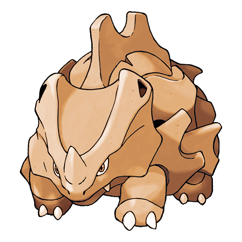
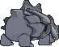
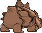
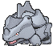
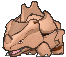
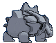
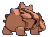

# #111 Rhyhorn (Spikes Pokémon)

| Official Artwork | Shiny Artwork |
|------------------|---------------|
|  |  |

**Rising Ruby:** Rhyhorn runs in a straight line, smashing everything in its path. It is not bothered even if it rushes headlong into a block of steel. This Pokémon may feel some pain from the collision the next day, however.

**Sinking Sapphire:** Rhyhorn’s brain is very small. It is so dense, while on a run it forgets why it started running in the first place. It apparently remembers sometimes if it demolishes something.

---

## Media

### Default Sprites

| Front | Shiny | Back | Shiny |
|-------|-------|------|-------|
|  |  |  |  |

### Female Sprites

| Front | Shiny | Back | Shiny |
|-------|-------|------|-------|
|  |  |  |  |

### Cries

Latest (Gen VI+):

<audio controls>
<source src='../../assets/cries/rhyhorn/latest.ogg' type='audio/ogg'>
  Your browser does not support the audio element.
</audio>

Legacy:

<audio controls>
<source src='../../assets/cries/rhyhorn/legacy.ogg' type='audio/ogg'>
  Your browser does not support the audio element.
</audio>

---

## Pokédex Data

| National № | Type(s) | Height | Weight | Abilities | Local № |
|------------|---------|--------|--------|-----------|---------|
| #111 | {: width="48"} {: width="48"} | 1.0 m / 3.3 ft | 115.0 kg / 253.5 lbs | 1. Lightning Rod 2. Rock Head | N/A |

---

## Base Stats
|   | HP | Attack | Defense | Sp. Atk | Sp. Def | Speed |
|---|----|--------|---------|---------|---------|-------|
| **Base** | 80 | 85 | 95 | 30 | 30 | 25 |
| **Min** | 270 | 157 | 175 | 58 | 58 | 49 |
| **Max** | 364 | 295 | 317 | 174 | 174 | 163 |

The ranges shown above are for a level 100 Pokémon. Maximum values are based on a beneficial nature, 252 EVs, 31 IVs; minimum values are based on a hindering nature, 0 EVs, 0 IVs.

---

## Forms & Evolutions

!!! warning "WARNING"

    Information on evolutions may not be 100% accurate; differences between evolution methods across generations are not accounted for.

### Forms

Rhyhorn has no alternate forms.

### Evolution Line

1. [Rhyhorn](rhyhorn.md/)
    1. Level Up: [Rhydon](rhydon.md/)
        1. Trade: [Rhyperior](rhyperior.md/)

---

## Training

| EV Yield | Catch Rate | Base Friendship | Base Exp. | Growth Rate | Held Items |
|----------|------------|-----------------|-----------|-------------|------------|
| 1 Def | 120 | 50 | 69 | Slow | N/A |

---

## Breeding

| Egg Groups | Egg Cycles | Gender | Dimorphic | Color | Shape |
|------------|------------|--------|-----------|-------|-------|
| 1. Monster 2. Ground | 20 | 50.0% Male 50.0% Female | True | Gray | Quadruped |

---

## Moves

!!! warning "WARNING"

    Specific move information may be incorrect. However, the general movepool should be accurate; this includes changes made in Sacred Gold and Storm Silver.

### Level Up Moves

| Lv. | Move | Type | Cat. | Power | Acc. | PP |
| --- | --- | --- | --- | --- | --- | --- |
| 1 | Fury Attack | {: width="48"} | {: width="36"} | 15 | 85 | 20 |
| 1 | Horn Attack | {: width="48"} | {: width="36"} | 65 | 100 | 25 |
| 1 | Tail Whip | {: width="48"} | {: width="36"} | — | 100 | 30 |
| 5 | Scary Face | {: width="48"} | {: width="36"} | — | 100 | 10 |
| 9 | Smack Down | {: width="48"} | {: width="36"} | 50 | 100 | 15 |
| 13 | Bulldoze | {: width="48"} | {: width="36"} | 60 | 100 | 20 |
| 17 | Stomp | {: width="48"} | {: width="36"} | 65 | 100 | 20 |
| 21 | Magnitude | {: width="48"} | {: width="36"} | — | 100 | 30 |
| 25 | Chip Away | {: width="48"} | {: width="36"} | 70 | 100 | 20 |
| 29 | Rock Blast | {: width="48"} | {: width="36"} | 25 | 90 | 10 |
| 33 | Drill Run | {: width="48"} | {: width="36"} | 80 | 95 | 10 |
| 37 | Take Down | {: width="48"} | {: width="36"} | 90 | 85 | 20 |
| 41 | Stone Edge | {: width="48"} | {: width="36"} | 100 | 80 | 5 |
| 45 | Earthquake | {: width="48"} | {: width="36"} | 100 | 100 | 10 |
| 49 | Megahorn | {: width="48"} | {: width="36"} | 120 | 85 | 10 |
| 53 | Horn Drill | {: width="48"} | {: width="36"} | — | 30 | 5 |

### TM Moves

| TM | Move | Type | Cat. | Power | Acc. | PP |
| --- | --- | --- | --- | --- | --- | --- |
| HM04 | Strength | {: width="48"} | {: width="36"} | 100 | 100 | 10 |
| HM06 | Rock Smash | {: width="48"} | {: width="36"} | 65 | 100 | 15 |
| TM05 | Roar | {: width="48"} | {: width="36"} | — | — | 20 |
| TM06 | Toxic | {: width="48"} | {: width="36"} | — | 90 | 10 |
| TM10 | Hidden Power | {: width="48"} | {: width="36"} | 60 | 100 | 15 |
| TM100 | Confide | {: width="48"} | {: width="36"} | — | — | 20 |
| TM11 | Sunny Day | {: width="48"} | {: width="36"} | — | — | 5 |
| TM13 | Ice Beam | {: width="48"} | {: width="36"} | 90 | 100 | 10 |
| TM14 | Blizzard | {: width="48"} | {: width="36"} | 110 | 70 | 5 |
| TM17 | Protect | {: width="48"} | {: width="36"} | — | — | 10 |
| TM18 | Rain Dance | {: width="48"} | {: width="36"} | — | — | 5 |
| TM21 | Frustration | {: width="48"} | {: width="36"} | — | 100 | 20 |
| TM23 | Smack Down | {: width="48"} | {: width="36"} | 50 | 100 | 15 |
| TM24 | Thunderbolt | {: width="48"} | {: width="36"} | 90 | 100 | 15 |
| TM25 | Thunder | {: width="48"} | {: width="36"} | 110 | 70 | 10 |
| TM26 | Earthquake | {: width="48"} | {: width="36"} | 100 | 100 | 10 |
| TM27 | Return | {: width="48"} | {: width="36"} | — | 100 | 20 |
| TM28 | Dig | {: width="48"} | {: width="36"} | 80 | 100 | 10 |
| TM32 | Double Team | {: width="48"} | {: width="36"} | — | — | 15 |
| TM35 | Flamethrower | {: width="48"} | {: width="36"} | 90 | 100 | 15 |
| TM37 | Sandstorm | {: width="48"} | {: width="36"} | — | — | 10 |
| TM38 | Fire Blast | {: width="48"} | {: width="36"} | 110 | 85 | 5 |
| TM39 | Rock Tomb | {: width="48"} | {: width="36"} | 60 | 95 | 15 |
| TM42 | Facade | {: width="48"} | {: width="36"} | 70 | 100 | 20 |
| TM44 | Rest | {: width="48"} | {: width="36"} | — | — | 5 |
| TM45 | Attract | {: width="48"} | {: width="36"} | — | 100 | 15 |
| TM46 | Thief | {: width="48"} | {: width="36"} | 60 | 100 | 25 |
| TM48 | Round | {: width="48"} | {: width="36"} | 60 | 100 | 15 |
| TM59 | Incinerate | {: width="48"} | {: width="36"} | 60 | 100 | 15 |
| TM66 | Payback | {: width="48"} | {: width="36"} | 50 | 100 | 10 |
| TM69 | Rock Polish | {: width="48"} | {: width="36"} | — | — | 20 |
| TM71 | Stone Edge | {: width="48"} | {: width="36"} | 100 | 80 | 5 |
| TM75 | Swords Dance | {: width="48"} | {: width="36"} | — | — | 20 |
| TM78 | Bulldoze | {: width="48"} | {: width="36"} | 60 | 100 | 20 |
| TM80 | Rock Slide | {: width="48"} | {: width="36"} | 75 | 90 | 10 |
| TM84 | Poison Jab | {: width="48"} | {: width="36"} | 80 | 100 | 20 |
| TM87 | Swagger | {: width="48"} | {: width="36"} | — | 85 | 15 |
| TM88 | Sleep Talk | {: width="48"} | {: width="36"} | — | — | 10 |
| TM90 | Substitute | {: width="48"} | {: width="36"} | — | — | 10 |
| TM94 | Secret Power | {: width="48"} | {: width="36"} | 70 | 100 | 20 |

### Egg Moves

| Move | Type | Cat. | Power | Acc. | PP |
| --- | --- | --- | --- | --- | --- |
| Counter | {: width="48"} | {: width="36"} | — | 100 | 20 |
| Crunch | {: width="48"} | {: width="36"} | 80 | 100 | 15 |
| Crush Claw | {: width="48"} | {: width="36"} | 75 | 95 | 10 |
| Curse | {: width="48"} | {: width="36"} | — | — | 10 |
| Dragon Rush | {: width="48"} | {: width="36"} | 100 | 75 | 10 |
| Fire Fang | {: width="48"} | {: width="36"} | 65 | 95 | 15 |
| Guard Split | {: width="48"} | {: width="36"} | — | — | 10 |
| Ice Fang | {: width="48"} | {: width="36"} | 65 | 95 | 15 |
| Iron Tail | {: width="48"} | {: width="36"} | 100 | 75 | 15 |
| Magnitude | {: width="48"} | {: width="36"} | — | 100 | 30 |
| Metal Burst | {: width="48"} | {: width="36"} | — | 100 | 10 |
| Reversal | {: width="48"} | {: width="36"} | — | 100 | 15 |
| Rock Climb | {: width="48"} | {: width="36"} | 90 | 85 | 20 |
| Rototiller | {: width="48"} | {: width="36"} | — | — | 10 |
| Skull Bash | {: width="48"} | {: width="36"} | 130 | 100 | 10 |
| Thunder Fang | {: width="48"} | {: width="36"} | 65 | 95 | 15 |

### Tutor Moves

| Move | Type | Cat. | Power | Acc. | PP |
| --- | --- | --- | --- | --- | --- |
| Aqua Tail | {: width="48"} | {: width="36"} | 90 | 90 | 10 |
| Dragon Pulse | {: width="48"} | {: width="36"} | 85 | 100 | 10 |
| Drill Run | {: width="48"} | {: width="36"} | 80 | 95 | 10 |
| Earth Power | {: width="48"} | {: width="36"} | 90 | 100 | 10 |
| Endeavor | {: width="48"} | {: width="36"} | — | 100 | 5 |
| Icy Wind | {: width="48"} | {: width="36"} | 55 | 95 | 15 |
| Iron Tail | {: width="48"} | {: width="36"} | 100 | 75 | 15 |
| Shock Wave | {: width="48"} | {: width="36"} | 60 | — | 20 |
| Snore | {: width="48"} | {: width="36"} | 50 | 100 | 15 |
| Spite | {: width="48"} | {: width="36"} | — | 100 | 10 |
| Stealth Rock | {: width="48"} | {: width="36"} | — | — | 20 |
| Superpower | {: width="48"} | {: width="36"} | 120 | 100 | 5 |
| Uproar | {: width="48"} | {: width="36"} | 90 | 100 | 10 |

