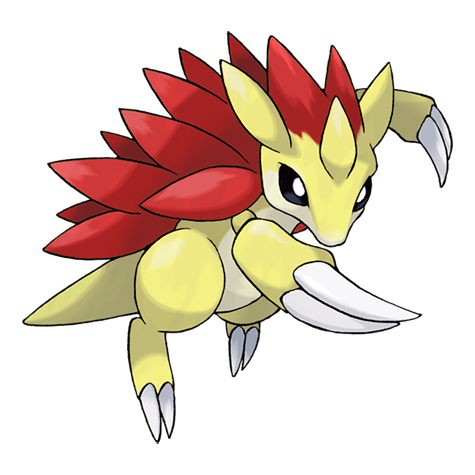
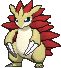
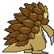
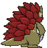

# #028 Sandslash (Mouse Pokémon)

| Official Artwork | Shiny Artwork |
|------------------|---------------|
|  |  |

**Rising Ruby:** Sandslash’s body is covered by tough spikes, which are hardened sections of its hide. Once a year, the old spikes fall out, to be replaced with new spikes that grow out from beneath the old ones.

**Sinking Sapphire:** Sandslash can roll up its body as if it were a ball covered with large spikes. In battle, this Pokémon will try to make the foe flinch by jabbing it with its spines. It then leaps at the stunned foe to tear wildly with its sharp claws.

---

## Media

### Default Sprites

| Front | Shiny | Back | Shiny |
|-------|-------|------|-------|
|  |  |  |  |

### Cries

Latest (Gen VI+):

<audio controls>
<source src='../../assets/cries/sandslash/latest.ogg' type='audio/ogg'>
  Your browser does not support the audio element.
</audio>

Legacy:

<audio controls>
<source src='../../assets/cries/sandslash/legacy.ogg' type='audio/ogg'>
  Your browser does not support the audio element.
</audio>

---

## Pokédex Data

| National № | Type(s) | Height | Weight | Abilities | Local № |
|------------|---------|--------|--------|-----------|---------|
| #28 | {: width="48"} | 1.0 m / 3.3 ft | 29.5 kg / 65.0 lbs | 1. Sand Veil 2. Sand Rush | N/A |

---

## Base Stats
|   | HP | Attack | Defense | Sp. Atk | Sp. Def | Speed |
|---|----|--------|---------|---------|---------|-------|
| **Base** | 75 | 100 | 110 | 45 | 55 | 65 |
| **Min** | 260 | 184 | 202 | 85 | 103 | 121 |
| **Max** | 354 | 328 | 350 | 207 | 229 | 251 |

The ranges shown above are for a level 100 Pokémon. Maximum values are based on a beneficial nature, 252 EVs, 31 IVs; minimum values are based on a hindering nature, 0 EVs, 0 IVs.

---

## Forms & Evolutions

!!! warning "WARNING"

    Information on evolutions may not be 100% accurate; differences between evolution methods across generations are not accounted for.

### Forms

Sandslash has no alternate forms.

### Evolution Line

1. [Sandshrew](sandshrew.md/)
    1. Use Item: [Sandslash](sandslash.md/)

---

## Training

| EV Yield | Catch Rate | Base Friendship | Base Exp. | Growth Rate | Held Items |
|----------|------------|-----------------|-----------|-------------|------------|
| 2 Def | 90 | 50 | 158 | Medium | Grip Claw (5%) Dome Fossil (50%) |

---

## Breeding

| Egg Groups | Egg Cycles | Gender | Dimorphic | Color | Shape |
|------------|------------|--------|-----------|-------|-------|
| 1. Ground | 20 | 50.0% Male 50.0% Female | False | Yellow | Upright |

---

## Moves

!!! warning "WARNING"

    Specific move information may be incorrect. However, the general movepool should be accurate; this includes changes made in Sacred Gold and Storm Silver.

### Level Up Moves

| Lv. | Move | Type | Cat. | Power | Acc. | PP |
| --- | --- | --- | --- | --- | --- | --- |
| 1 | Defense Curl | {: width="48"} | {: width="36"} | — | — | 40 |
| 1 | Sandstorm | {: width="48"} | {: width="36"} | — | — | 10 |
| 1 | Scratch | {: width="48"} | {: width="36"} | 50 | 100 | 35 |
| 3 | Sand Attack | {: width="48"} | {: width="36"} | — | 100 | 15 |
| 5 | Poison Sting | {: width="48"} | {: width="36"} | 15 | 100 | 35 |
| 7 | Rollout | {: width="48"} | {: width="36"} | 30 | 90 | 20 |
| 9 | Rapid Spin | {: width="48"} | {: width="36"} | 50 | 100 | 40 |
| 11 | Fury Cutter | {: width="48"} | {: width="36"} | 40 | 95 | 20 |
| 13 | Magnitude | {: width="48"} | {: width="36"} | — | 100 | 30 |
| 15 | Swift | {: width="48"} | {: width="36"} | 60 | — | 20 |
| 17 | Metal Claw | {: width="48"} | {: width="36"} | 50 | 95 | 35 |
| 19 | Fury Swipes | {: width="48"} | {: width="36"} | 18 | 80 | 15 |
| 22 | Crush Claw | {: width="48"} | {: width="36"} | 75 | 95 | 10 |
| 23 | Sand Tomb | {: width="48"} | {: width="36"} | 35 | 85 | 15 |
| 27 | Slash | {: width="48"} | {: width="36"} | 70 | 100 | 20 |
| 31 | Night Slash | {: width="48"} | {: width="36"} | 70 | 100 | 15 |
| 35 | Dig | {: width="48"} | {: width="36"} | 80 | 100 | 10 |
| 39 | Gyro Ball | {: width="48"} | {: width="36"} | — | 100 | 5 |
| 43 | Super Fang | {: width="48"} | {: width="36"} | — | 90 | 10 |
| 47 | Earthquake | {: width="48"} | {: width="36"} | 100 | 100 | 10 |
| 51 | Iron Tail | {: width="48"} | {: width="36"} | 100 | 75 | 15 |
| 55 | Swords Dance | {: width="48"} | {: width="36"} | — | — | 20 |
| 59 | Sandstorm | {: width="48"} | {: width="36"} | — | — | 10 |

### TM Moves

| TM | Move | Type | Cat. | Power | Acc. | PP |
| --- | --- | --- | --- | --- | --- | --- |
| HM01 | Cut | {: width="48"} | {: width="36"} | 70 | 100 | 15 |
| HM04 | Strength | {: width="48"} | {: width="36"} | 100 | 100 | 10 |
| HM06 | Rock Smash | {: width="48"} | {: width="36"} | 65 | 100 | 15 |
| TM01 | Hone Claws | {: width="48"} | {: width="36"} | — | — | 15 |
| TM06 | Toxic | {: width="48"} | {: width="36"} | — | 90 | 10 |
| TM10 | Hidden Power | {: width="48"} | {: width="36"} | 60 | 100 | 15 |
| TM100 | Confide | {: width="48"} | {: width="36"} | — | — | 20 |
| TM11 | Sunny Day | {: width="48"} | {: width="36"} | — | — | 5 |
| TM15 | Hyper Beam | {: width="48"} | {: width="36"} | 150 | 90 | 5 |
| TM17 | Protect | {: width="48"} | {: width="36"} | — | — | 10 |
| TM20 | Safeguard | {: width="48"} | {: width="36"} | — | — | 25 |
| TM21 | Frustration | {: width="48"} | {: width="36"} | — | 100 | 20 |
| TM26 | Earthquake | {: width="48"} | {: width="36"} | 100 | 100 | 10 |
| TM27 | Return | {: width="48"} | {: width="36"} | — | 100 | 20 |
| TM28 | Dig | {: width="48"} | {: width="36"} | 80 | 100 | 10 |
| TM31 | Brick Break | {: width="48"} | {: width="36"} | 75 | 100 | 15 |
| TM32 | Double Team | {: width="48"} | {: width="36"} | — | — | 15 |
| TM37 | Sandstorm | {: width="48"} | {: width="36"} | — | — | 10 |
| TM39 | Rock Tomb | {: width="48"} | {: width="36"} | 60 | 95 | 15 |
| TM40 | Aerial Ace | {: width="48"} | {: width="36"} | 60 | — | 20 |
| TM42 | Facade | {: width="48"} | {: width="36"} | 70 | 100 | 20 |
| TM44 | Rest | {: width="48"} | {: width="36"} | — | — | 5 |
| TM45 | Attract | {: width="48"} | {: width="36"} | — | 100 | 15 |
| TM46 | Thief | {: width="48"} | {: width="36"} | 60 | 100 | 25 |
| TM48 | Round | {: width="48"} | {: width="36"} | 60 | 100 | 15 |
| TM52 | Focus Blast | {: width="48"} | {: width="36"} | 120 | 70 | 5 |
| TM56 | Fling | {: width="48"} | {: width="36"} | — | 100 | 10 |
| TM65 | Shadow Claw | {: width="48"} | {: width="36"} | 70 | 100 | 15 |
| TM68 | Giga Impact | {: width="48"} | {: width="36"} | 150 | 90 | 5 |
| TM71 | Stone Edge | {: width="48"} | {: width="36"} | 100 | 80 | 5 |
| TM74 | Gyro Ball | {: width="48"} | {: width="36"} | — | 100 | 5 |
| TM75 | Swords Dance | {: width="48"} | {: width="36"} | — | — | 20 |
| TM78 | Bulldoze | {: width="48"} | {: width="36"} | 60 | 100 | 20 |
| TM80 | Rock Slide | {: width="48"} | {: width="36"} | 75 | 90 | 10 |
| TM81 | X Scissor | {: width="48"} | {: width="36"} | 80 | 100 | 15 |
| TM84 | Poison Jab | {: width="48"} | {: width="36"} | 80 | 100 | 20 |
| TM87 | Swagger | {: width="48"} | {: width="36"} | — | 85 | 15 |
| TM88 | Sleep Talk | {: width="48"} | {: width="36"} | — | — | 10 |
| TM90 | Substitute | {: width="48"} | {: width="36"} | — | — | 10 |
| TM94 | Secret Power | {: width="48"} | {: width="36"} | 70 | 100 | 20 |

### Egg Moves

Sandslash cannot learn any moves by breeding.
### Tutor Moves

| Move | Type | Cat. | Power | Acc. | PP |
| --- | --- | --- | --- | --- | --- |
| Covet | {: width="48"} | {: width="36"} | 60 | 100 | 25 |
| Earth Power | {: width="48"} | {: width="36"} | 90 | 100 | 10 |
| Focus Punch | {: width="48"} | {: width="36"} | 150 | 100 | 20 |
| Iron Tail | {: width="48"} | {: width="36"} | 100 | 75 | 15 |
| Knock Off | {: width="48"} | {: width="36"} | 65 | 100 | 20 |
| Snore | {: width="48"} | {: width="36"} | 50 | 100 | 15 |
| Stealth Rock | {: width="48"} | {: width="36"} | — | — | 20 |
| Super Fang | {: width="48"} | {: width="36"} | — | 90 | 10 |

